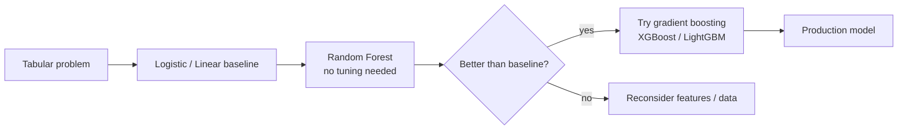

# Ensemble 1 — Voting, Bagging, Random Forest

## Lectures covered
- Introduction to Ensemble Learning
- Majority Voting, Average and Weighted Average
- Bagging
- Random Forest

---

## In one sentence
**Ensembles** combine many imperfect models so their *errors cancel out* — and **Random Forest** is the easiest, most robust ensemble: train a hundred different decision trees on slightly different slices of the data, then have them vote.

## Real-world analogy
Asking one expert is risky — they have blind spots. Asking 100 experts and taking the majority vote almost always beats any single expert, *if* the experts are diverse (they make different kinds of mistakes). That's the entire idea of ensembles. Random Forest deliberately *makes* the trees diverse by:
- Giving each tree a different random sample of rows (**bootstrap**), and
- Letting each tree only consider a random subset of features at each split.

The trees disagree on edge cases but mostly agree on clear ones — average them and you get a smoother, more accurate prediction than any single tree.

## The intuition (plain English)
A single decision tree is high-variance: change a few rows and you get a different tree. **Bagging** (Bootstrap AGGregating) tames this by:
1. Drawing N bootstrap samples (sample with replacement) from training data.
2. Fitting one tree per sample.
3. Predicting by majority vote (classification) or averaging (regression).

**Random Forest** = bagging + an extra trick: at every split, only allow each tree to see a *random subset* of features. This forces trees to be different from each other → ensemble averages out more error.

The result: a model that needs almost no tuning, handles non-linear data, mixed types, missing values, gives feature importance for free, and is hard to overfit.

## Mini worked example — predicting customer churn

```
Single decision tree (max_depth=10):
  train accuracy 99%, test accuracy 76%, big gap → overfit

Random Forest (n_estimators=100, max_depth=None, max_features="sqrt"):
  train accuracy 95%, test accuracy 87%, small gap → generalizes well
```

How a single prediction works:

```
new customer features → tree_1 says: churn (probability 0.7)
                       → tree_2 says: not churn (0.3)
                       → tree_3 says: churn (0.6)
                       ...
                       → tree_100 says: churn (0.55)
Average: 0.62 → predict CHURN
```

Each tree saw a different bootstrap of the training data and a different random feature subset at each node, so they make different mistakes. Averaging cancels most of those mistakes.

## At-a-glance — bagging vs Random Forest

```
                     bootstrap samples (with replacement)
                          │
training data ─►┌──────┐  ┌──────┐  ┌──────┐  …
                │  S₁  │  │  S₂  │  │  S₃  │
                └─►Tree└─►└──Tree└─►└──Tree└─►  ← each tree fits its own sample
                  T₁         T₂        T₃           AND uses only sqrt(p) random
                                                    features per split (Random Forest)
                          │
new sample ─►   ┌─────────┴─────────┐
                T₁(x), T₂(x), …, T_N(x)
                          │
                Average / Majority Vote
                          │
                     final prediction
```



## Why this matters
- **The default "second model" for every tabular problem.** After a logistic-regression baseline, try Random Forest before reaching for gradient boosting.
- **Almost no tuning needed.** Default `n_estimators=100, max_features="sqrt"` works astonishingly well.
- **Free feature importance + parallel training** — fast on multi-core machines.
- **Hard to overfit catastrophically** thanks to averaging — safer than a single tree in production.
- **Foundation of XGBoost/LightGBM mental model** — those use sequential boosting instead of parallel bagging, but the "many trees" concept is shared.

---

## 1. Why ensembles work

A single model has bias + variance + irreducible noise. Combine multiple **diverse** models and:
- Errors partially cancel out
- Variance drops
- Often a small bias-variance trade for net win

Ensembles dominate Kaggle leaderboards and most production tabular ML.

---

## 2. Voting / Averaging — the simplest ensemble

Train multiple different models. Combine their predictions.

### Hard voting (classification)
Each model votes a class; majority wins.

### Soft voting (classification)
Average the predicted probabilities; pick highest.

### Averaging (regression)
Average their predicted numbers.

### Weighted variants
Give better-performing models higher weight.

```python
from sklearn.ensemble import VotingClassifier
from sklearn.linear_model import LogisticRegression
from sklearn.tree import DecisionTreeClassifier
from sklearn.svm import SVC

vote = VotingClassifier(
    estimators=[
        ("lr", LogisticRegression()),
        ("dt", DecisionTreeClassifier()),
        ("svc", SVC(probability=True)),
    ],
    voting="soft",     # uses .predict_proba
)
vote.fit(X_train, y_train)
```

The diversity matters — combining 5 logistic regressions gives almost the same as one. Combine *different families*.

---

## 3. Bagging — Bootstrap AGGregating

The recipe:
1. Draw N **bootstrap samples** (sample with replacement) from the training set
2. Train one base model on each sample
3. Average / vote their predictions

Bootstrap sampling means each model sees a slightly different dataset → models become diverse.

```python
from sklearn.ensemble import BaggingClassifier
from sklearn.tree import DecisionTreeClassifier

bag = BaggingClassifier(
    estimator=DecisionTreeClassifier(max_depth=None),
    n_estimators=100,
    bootstrap=True,
    n_jobs=-1,
    random_state=42,
)
bag.fit(X_train, y_train)
```

### Why bagging works
Reduces **variance** without increasing bias. Especially helpful for high-variance models (deep trees).

### Out-of-Bag (OOB) evaluation
About 37% of training samples are not in any given bootstrap. Use them as a "free" validation set.

```python
BaggingClassifier(..., oob_score=True)
print(bag.oob_score_)
```

---

## 4. Random Forest — bagging + feature randomness

Random Forest = Bagging + at each split, a random subset of features is considered.

The two layers of randomness (bootstrap rows + random feature subsets) decorrelate the trees → more variance reduction → better accuracy.

```python
from sklearn.ensemble import RandomForestClassifier, RandomForestRegressor

rf = RandomForestClassifier(
    n_estimators=300,
    max_depth=None,         # let trees grow
    min_samples_leaf=1,
    max_features="sqrt",    # √(n_features) per split
    n_jobs=-1,
    random_state=42,
    class_weight="balanced",
)
rf.fit(X_train, y_train)
```

### Key hyperparameters
| Param | What |
|---|---|
| `n_estimators` | # of trees — more = better, slower (diminishing returns) |
| `max_depth` | tree depth — None = unlimited |
| `max_features` | features per split — `"sqrt"` (classification), `1.0` (regression) |
| `min_samples_leaf` | min rows per leaf |
| `class_weight` | for imbalance |
| `n_jobs=-1` | use all CPU cores |
| `oob_score` | use OOB instead of validation set |

### Strengths
- Robust out-of-the-box; minimal tuning needed
- Handles non-linearity, interactions, mixed types
- Feature importance for free
- Parallel training (fast on multi-core)
- Hard to overfit massively

### Weaknesses
- Memory: stores all trees
- Slower than logistic regression at predict time
- Less accurate than gradient boosting on most tabular problems
- Less interpretable than a single tree

---

## 5. Feature importance

```python
import pandas as pd
fi = pd.Series(rf.feature_importances_, index=X.columns).sort_values(ascending=False)
print(fi.head(10))
```

For a more honest version (handles correlated features):
```python
from sklearn.inspection import permutation_importance
result = permutation_importance(rf, X_test, y_test, n_repeats=10, random_state=42)
imp = pd.Series(result.importances_mean, index=X.columns).sort_values(ascending=False)
```

---

## 6. Random Forest as a baseline

For any tabular problem:
1. Logistic Regression / Linear Regression (linear baseline)
2. Random Forest (non-linear baseline, no tuning)
3. XGBoost / LightGBM (top performance)

If RF's score is ≥ logistic's, you have non-linear signal — proceed to gradient boosting.

---

## 7. Real example — credit risk

```python
from sklearn.ensemble import RandomForestClassifier
from sklearn.metrics import classification_report, roc_auc_score

rf = RandomForestClassifier(
    n_estimators=500,
    max_depth=None,
    min_samples_leaf=20,
    class_weight="balanced",
    n_jobs=-1,
    random_state=42,
)
rf.fit(X_train, y_train)

y_pred = rf.predict(X_test)
y_prob = rf.predict_proba(X_test)[:, 1]

print(classification_report(y_test, y_pred))
print("AUC:", roc_auc_score(y_test, y_prob))
```

---

## 8. ExtraTrees — even more random

```python
from sklearn.ensemble import ExtraTreesClassifier
ExtraTreesClassifier(n_estimators=300, n_jobs=-1)
```

Like Random Forest, but split thresholds are also chosen randomly (not optimally). Slightly faster, sometimes slightly better — try both.

---

## 9. Bagging vs Boosting (preview)

| | Bagging / RF | Boosting (next file) |
|---|---|---|
| Trees trained | in parallel | sequentially |
| Each tree fits | bootstrap of data | residuals of previous |
| Goal | reduce variance | reduce bias |
| Speed | fast (parallel) | slower (sequential) |
| Often more accurate? | rarely | usually (XGBoost wins most Kaggle) |

---

## 10. Common pitfalls

| Mistake | Effect | Fix |
|---|---|---|
| `n_estimators=10` | high variance ensemble | use 100–500 |
| Forgetting `n_jobs=-1` | training slow | parallelize |
| Trusting `feature_importances_` blindly | biased toward high-cardinality features | use `permutation_importance` |
| RF with deep trees on tiny data | overfit | use `min_samples_leaf` |
| Reading per-feature impacts as "causal" | trees give associations only | for causal, use causal inference methods |

## Self-check

- [ ] Why do ensembles often beat single models?
- [ ] Difference between hard and soft voting?
- [ ] What does bagging do to bias and variance?
- [ ] What's bootstrap sampling?
- [ ] What does Random Forest do that plain bagging-of-trees doesn't?
- [ ] Walk through `oob_score` — why is it useful?
- [ ] Why is `max_features="sqrt"` a sensible default?
- [ ] When should you reach for ExtraTrees over Random Forest?

---

## Glossary

| Term | Plain meaning |
|------|---------------|
| **Ensemble** | A model that combines predictions from several base models |
| **Voting** | Combining predictions by majority (hard) or averaging probabilities (soft) |
| **Hard voting** | Each model picks a class; the most-voted class wins |
| **Soft voting** | Each model outputs probabilities; average them and pick the highest |
| **Weighted voting** | Some models count more than others |
| **Bagging (Bootstrap AGGregating)** | Train many models on bootstrap samples, then average/vote |
| **Bootstrap sample** | Random sample of size n with replacement (some rows repeat, ~37% are missed) |
| **Out-of-Bag (OOB) sample** | The ~37% of rows missed by a bootstrap — free validation set |
| **OOB score** | Performance computed on OOB samples without a separate validation set |
| **Random Forest** | Bagging + each tree uses a random feature subset per split |
| **`n_estimators`** | Number of trees — more = better but slower |
| **`max_depth`** | How deep each tree can grow — None = unlimited |
| **`max_features`** | How many features each split considers — `"sqrt"` for classification, `1.0` for regression |
| **`min_samples_leaf`** | Minimum rows per leaf — bigger = more conservative |
| **`n_jobs=-1`** | Use all CPU cores in parallel — RF supports this trivially |
| **`oob_score=True`** | Tell sklearn to compute OOB performance |
| **Feature importance** | How much each feature reduces impurity across all trees |
| **Permutation importance** | Honest alternative — shuffle a feature and measure performance drop |
| **ExtraTrees** | Like Random Forest, but split thresholds chosen randomly — slightly faster |
| **Boosting** | Different ensemble idea: trees trained sequentially, each correcting the previous (next file) |
| **Variance reduction** | Why bagging helps — averaging independent models reduces total variance |
| **Bias** | Systematic error — bagging doesn't reduce this much; boosting does |
| **`class_weight="balanced"`** | Reweight classes to handle imbalance |
| **`VotingClassifier`** | sklearn class for hard/soft voting across different model families |
| **Decorrelation** | Random feature subsets make trees less correlated → more variance reduction |

## Further reading
- Previous: [../02-classification/07-roc-auc.md](../02-classification/07-roc-auc.md)
- Next: [02-boosting-adaboost-gbm-xgb.md](02-boosting-adaboost-gbm-xgb.md) — the sequential ensemble cousin
- Cross-validation: [03-cross-validation-tuning.md](03-cross-validation-tuning.md)
- Decision tree fundamentals: [../02-classification/05-decision-tree.md](../02-classification/05-decision-tree.md)
- Credit-risk project: [../06-projects/02-credit-risk-classification.md](../06-projects/02-credit-risk-classification.md)
