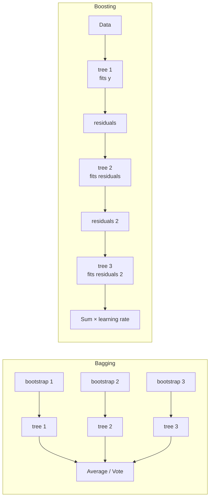

# Ensemble 2 — Boosting: AdaBoost, Gradient Boosting, XGBoost

## Lectures covered
- Boosting: AdaBoost
- Gradient Boosting
- XGBoost

---

## In one sentence
**Boosting** trains a sequence of small models where each new one specifically targets the mistakes of the previous — and **XGBoost / LightGBM** are the engineered, hyper-tuned versions that win most tabular ML competitions.

## Real-world analogy
Imagine you're studying for an exam with practice tests. After your first test you note which questions you got wrong, then *focus your next study session on those topics*. After the next test, again you note remaining weak spots and double-down. By the fifth round, you've slowly chipped away every weakness. That iterative, error-focused study is **boosting**. Each "study session" is a small decision tree, and what's left to learn — your **residuals** — is what each new tree specifically targets.

## The intuition (plain English)
1. Train a small (shallow) tree. It gets some predictions right, some wrong.
2. Compute the **residuals** — what's still left to predict.
3. Train a second small tree to predict the residuals.
4. Add (a fraction of) tree #2's predictions to tree #1's. Compute new residuals.
5. Repeat for hundreds or thousands of trees.
6. Final prediction = sum of all the trees' contributions, scaled by the **learning rate**.

Bagging (Random Forest) reduces *variance* by averaging diverse trees. Boosting reduces *bias* by sequentially adding trees that fix what the ensemble still gets wrong. Boosting usually wins on accuracy; Random Forest is faster and easier.

## Mini worked example — predicting house prices

Three houses; ground-truth prices: 200, 300, 500.

```
step 0: ensemble prediction = mean(y) = 333 for all houses
        residuals = (200−333, 300−333, 500−333) = (−133, −33, 167)

step 1: train tree #1 on residuals → predicts (−100, −20, 130)
        update prediction = 333 + 0.5 × (−100, −20, 130) = (283, 323, 398)
                            (0.5 is the learning rate η)
        new residuals = (200−283, 300−323, 500−398) = (−83, −23, 102)

step 2: train tree #2 on the new residuals → predicts (−60, −15, 80)
        update prediction = 283+0.5·(−60), 323+0.5·(−15), 398+0.5·80
                          = (253, 315, 438)
        new residuals = (−53, −15, 62)

... repeat for 100s of rounds, each tree shrinking what's left to predict.
```

Each tree only fixes a slice of the error — the **learning rate** (0.5 above; usually 0.01–0.1 in practice) controls how much each tree contributes. Smaller learning rate + more trees = smoother, more accurate model.

## At-a-glance — bagging vs boosting



```
boosting prediction = η·tree₁(x) + η·tree₂(x) + … + η·tree_T(x)

learning rate η small → each tree contributes a little; need many trees
learning rate η large → each tree contributes a lot; faster but unstable
```

## Why this matters
- **Wins on tabular data more often than any other algorithm.** XGBoost / LightGBM dominate Kaggle leaderboards.
- **Built-in regularization** (L1/L2 on leaf weights, tree depth, subsampling) makes them resistant to overfitting *if* tuned.
- **Early stopping** is built in — train 2,000 trees but auto-stop when validation stops improving.
- **Native handling of missing values, GPU support, sparsity** make XGBoost industrial-strength.
- **Credit-risk and healthcare-premium projects** both use XGBoost as their final tuned model.

---

## 1. The boosting idea

Train models **sequentially**, each one focusing on the **mistakes of the previous**. The final prediction is a weighted sum (or vote) of all models.

```
Model 1 → fits data, errors on hard cases
Model 2 → focuses on Model 1's errors
Model 3 → focuses on M1+M2's residuals
...
```

This reduces **bias** (each model corrects the previous) — opposite emphasis to bagging (which reduces variance).

---

## 2. AdaBoost (Adaptive Boosting)

Original boosting algorithm (1995, Freund & Schapire).

### How it works
1. Start with equal weights on all training examples
2. Train a weak learner (often a "decision stump" — depth-1 tree)
3. Up-weight misclassified examples
4. Train next learner on this re-weighted data
5. Repeat for N rounds
6. Final prediction = weighted vote of all weak learners

```python
from sklearn.ensemble import AdaBoostClassifier
from sklearn.tree import DecisionTreeClassifier

ada = AdaBoostClassifier(
    estimator=DecisionTreeClassifier(max_depth=1),   # stump
    n_estimators=200,
    learning_rate=1.0,
    random_state=42,
)
ada.fit(X_train, y_train)
```

### Strengths
- Simple, low-tuning
- Interpretable when stumps used

### Weaknesses
- Sensitive to noisy data (keeps boosting on outliers)
- Beat by Gradient Boosting / XGBoost in most modern benchmarks

---

## 3. Gradient Boosting — the modern workhorse

Generalizes AdaBoost: instead of reweighting, fit each new model to the **negative gradient of the loss** of the current ensemble.

For squared-error regression, the negative gradient *is* the residual:
$$y - \hat{y}$$

So the next tree fits the residuals — what's left to predict.

For classification, it fits the gradient of log loss.

### Update rule
$$F_{t+1}(x) = F_t(x) + \eta \cdot h_t(x)$$
- $F_t$: ensemble at step t
- $h_t$: new model fit to gradient
- $\eta$: learning rate (shrinkage)

### sklearn — basic GBM
```python
from sklearn.ensemble import GradientBoostingClassifier, GradientBoostingRegressor

gbm = GradientBoostingClassifier(
    n_estimators=300,
    learning_rate=0.05,
    max_depth=3,
    random_state=42,
)
gbm.fit(X_train, y_train)
```

### Key hyperparameters
| Param | Meaning | Typical range |
|---|---|---|
| `n_estimators` | # of trees | 100–1000 |
| `learning_rate` | shrinkage | 0.01–0.1 |
| `max_depth` | tree depth | 3–7 |
| `subsample` | fraction of rows per tree | 0.7–1.0 |
| `min_samples_leaf` | regularization | 5–50 |

> **Lower learning rate + more trees** beats higher learning rate + fewer trees, *if* you have time. Classic GBM tradeoff.

---

## 4. XGBoost — eXtreme Gradient Boosting

XGBoost is GBM with engineering polish + algorithmic improvements:
- Regularization (L1 + L2 on leaf weights)
- Histogram-based splits (much faster)
- Early stopping
- Native handling of missing values
- GPU support
- Sparse-aware (skips zero entries)

### Install
```bash
pip install xgboost
```

### Basic shape
```python
import xgboost as xgb
from sklearn.metrics import roc_auc_score

xgb_clf = xgb.XGBClassifier(
    n_estimators=1000,
    learning_rate=0.05,
    max_depth=6,
    subsample=0.8,
    colsample_bytree=0.8,
    objective="binary:logistic",
    eval_metric="auc",
    early_stopping_rounds=50,
    n_jobs=-1,
    random_state=42,
)

xgb_clf.fit(
    X_train, y_train,
    eval_set=[(X_val, y_val)],
    verbose=False,
)

y_prob = xgb_clf.predict_proba(X_test)[:, 1]
print("AUC:", roc_auc_score(y_test, y_prob))
```

### Key XGBoost-specific params
| Param | What |
|---|---|
| `subsample` | row sampling per tree |
| `colsample_bytree` | feature sampling per tree |
| `reg_alpha`, `reg_lambda` | L1, L2 on leaf weights |
| `gamma` | minimum loss reduction to split |
| `scale_pos_weight` | for imbalanced data: ~ #neg / #pos |
| `early_stopping_rounds` | stop if validation doesn't improve |

---

## 5. LightGBM — XGBoost's faster cousin

```bash
pip install lightgbm
```
```python
import lightgbm as lgb
clf = lgb.LGBMClassifier(n_estimators=500, learning_rate=0.05, num_leaves=31)
```

- Often faster than XGBoost
- Slightly different splitting strategy (leaf-wise vs level-wise)
- Default of choice for tabular Kaggle competitions in the late 2020s

---

## 6. CatBoost — handles categories natively

```bash
pip install catboost
```
```python
from catboost import CatBoostClassifier
clf = CatBoostClassifier(iterations=500, learning_rate=0.05, depth=6, verbose=False)
clf.fit(X_train, y_train, cat_features=cat_col_indices)
```

- Native categorical encoding
- Often best out-of-the-box on data with many categorical features

---

## 7. Picking between RF / XGBoost / LightGBM / CatBoost

| Situation | Pick |
|---|---|
| First model, want minimal tuning | Random Forest |
| Want best accuracy, willing to tune | XGBoost or LightGBM |
| Many categorical features | CatBoost |
| Need real-time inference | LightGBM (smaller models) |
| Want explainability via SHAP | any (all support SHAP) |
| Multi-GPU training on huge data | XGBoost (mature) |

For 90% of tabular ML jobs, **start with LightGBM, fall back to XGBoost or CatBoost.**

---

## 8. Early stopping — don't ship overfit ensembles

```python
xgb_clf.fit(
    X_train, y_train,
    eval_set=[(X_val, y_val)],
    early_stopping_rounds=50,        # stop if no improvement on val for 50 rounds
)
```

Early stopping prevents you from training too many trees and overfitting. Always use it.

---

## 9. Feature importance + SHAP

### Built-in importance
```python
import xgboost as xgb
xgb.plot_importance(xgb_clf, max_num_features=15)
```

### SHAP for honest, per-prediction explanations
```bash
pip install shap
```
```python
import shap
explainer = shap.TreeExplainer(xgb_clf)
shap_values = explainer.shap_values(X_test)
shap.summary_plot(shap_values, X_test)
```

SHAP is the modern standard for explaining tree-ensemble predictions to stakeholders.

---

## 10. Real workflow — credit risk with XGBoost

```python
import xgboost as xgb
from sklearn.metrics import roc_auc_score, classification_report

ratio = (y_train == 0).sum() / (y_train == 1).sum()    # for imbalance

xgb_clf = xgb.XGBClassifier(
    n_estimators=2000,
    learning_rate=0.03,
    max_depth=5,
    subsample=0.8,
    colsample_bytree=0.8,
    scale_pos_weight=ratio,
    eval_metric="auc",
    early_stopping_rounds=100,
    random_state=42,
    n_jobs=-1,
)
xgb_clf.fit(X_train, y_train, eval_set=[(X_val, y_val)], verbose=False)

print("AUC:", roc_auc_score(y_test, xgb_clf.predict_proba(X_test)[:, 1]))
print(classification_report(y_test, xgb_clf.predict(X_test)))
```

This is essentially the credit-risk project skeleton (Module 6 project 2).

---

## 11. Common pitfalls

| Mistake | Effect | Fix |
|---|---|---|
| `learning_rate=0.5` + `n_estimators=50` | underfit, too few trees | drop LR, raise n_estimators |
| No early stopping | overfit on validation | always use early_stopping_rounds |
| Using accuracy for tuning on imbalanced | useless | use AUC / F1 / log loss |
| `max_depth=20` | severe overfit | keep depth 4–8 for boosting |
| Ignoring `scale_pos_weight` on imbalanced | poor minority recall | always set it |
| Tuning n_estimators manually | wastes effort | use early stopping |

## Self-check

- [ ] Difference between boosting and bagging?
- [ ] Why does each new tree in GBM fit the residuals?
- [ ] What's `learning_rate`'s role in boosting?
- [ ] What does early stopping do?
- [ ] Why does XGBoost beat plain GBM in practice?
- [ ] When use LightGBM vs CatBoost?
- [ ] Compute `scale_pos_weight` for a 95/5 imbalanced binary problem.
- [ ] What's SHAP and why use it on top of feature importance?

---

## Glossary

| Term | Plain meaning |
|------|---------------|
| **Boosting** | Train models sequentially; each new one targets the previous models' mistakes |
| **Weak learner** | A model only slightly better than random — boosting combines many of them |
| **Decision stump** | Depth-1 tree (one yes/no question) — classic AdaBoost building block |
| **AdaBoost (Adaptive Boosting)** | Original boosting: reweight misclassified samples each round |
| **Gradient Boosting (GBM)** | Generalization: each new tree fits the *gradient of the loss* (residuals for MSE) |
| **Residual** | `y − ŷ` — what the current ensemble still gets wrong |
| **XGBoost (eXtreme Gradient Boosting)** | Engineered GBM with regularization, fast histogram splits, early stopping |
| **LightGBM** | Microsoft's faster GBM alternative; uses leaf-wise tree growth |
| **CatBoost** | Yandex's GBM that handles categorical features natively |
| **Learning rate (η, `learning_rate`)** | Shrinkage applied to each tree's contribution. Small + many trees = best |
| **`n_estimators` / `num_boost_round`** | Number of trees |
| **`max_depth`** | Tree depth — keep small (3–7) for boosting |
| **`subsample`** | Fraction of rows sampled per tree (stochastic boosting) |
| **`colsample_bytree`** | Fraction of features sampled per tree |
| **`reg_alpha`, `reg_lambda`** | XGBoost L1 / L2 regularization on leaf weights |
| **`gamma` (XGBoost)** | Minimum loss reduction required to make a split — bigger = more conservative |
| **`scale_pos_weight`** | XGBoost class-imbalance knob — usually `n_neg / n_pos` |
| **Early stopping** | Stop training when validation score plateaus — prevents overfit |
| **`early_stopping_rounds`** | How many rounds of no improvement before stopping |
| **Histogram-based splitting** | Fast split-finding by binning feature values — used by LightGBM and modern XGBoost |
| **Leaf-wise vs level-wise tree growth** | LightGBM grows the highest-loss leaf first; XGBoost grows level by level |
| **SHAP (SHapley Additive exPlanations)** | Modern method to explain each prediction by attributing it to each feature |
| **TreeExplainer** | SHAP variant optimized for tree ensembles — fast and exact |
| **Feature importance (gain / weight / cover)** | XGBoost's per-feature importance metrics |
| **`eval_metric`** | Metric XGBoost tracks during training (`auc`, `logloss`, `rmse`) |
| **`eval_set`** | Validation data XGBoost watches for early stopping |
| **GPU training** | XGBoost / LightGBM can train on GPU for big datasets |

## Further reading
- Previous: [01-bagging-random-forest.md](01-bagging-random-forest.md)
- Next: [03-cross-validation-tuning.md](03-cross-validation-tuning.md)
- Credit-risk project (XGBoost end-to-end): [../06-projects/02-credit-risk-classification.md](../06-projects/02-credit-risk-classification.md)
- Healthcare-premium project: [../06-projects/01-healthcare-premium-regression.md](../06-projects/01-healthcare-premium-regression.md)
- Gradient descent foundation: [../01-foundations/03-gradient-descent-cost.md](../01-foundations/03-gradient-descent-cost.md)
