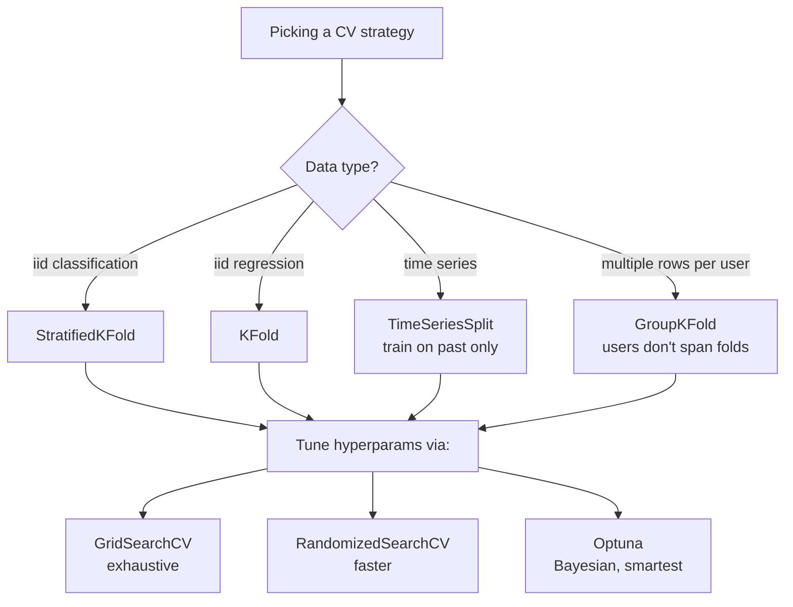

# Ensemble 3 — Cross Validation & Hyperparameter Tuning

## Lectures covered
- K-Fold Cross Validation
- Stratified K-Fold Cross Validation
- Hyperparameter Tuning

---

## In one sentence
**Cross-validation** averages your model's performance across multiple train/validation splits so a single lucky split can't fool you, and **hyperparameter tuning** systematically tries different model settings to find the best one.

## Real-world analogy
Suppose you want to know "is this restaurant good?" You could go once and judge — but one bad chef night gives you a misleading verdict. So you visit five times, on different days, and average. That's cross-validation. Now suppose you also want to know "should I order spicy or mild, large or small?" You try every combo across those five visits and pick the one with the best average. That's hyperparameter tuning.

## The intuition (plain English)
1. A single train/test split is high-variance — your one number depends on which rows happened to be in the test set.
2. **k-fold cross-validation** rotates the held-out chunk across k splits and averages → much more stable estimate.
3. **Stratified k-fold** keeps the class proportions consistent across folds — essential for classification.
4. **Hyperparameters** (max_depth, learning_rate, alpha, …) aren't learned from data — you set them. CV is how you compare different settings honestly.
5. Strategies, fastest to slowest: random search > grid search; Bayesian optimization (Optuna) for the last 1–2%.

## Mini worked example — choosing `max_depth` for a Random Forest

```
Data: 1,000 rows, 5-fold CV.

For each candidate max_depth, fit 5 models (each on 800 rows), score on the held-out 200.

max_depth=3   fold scores: [0.81, 0.79, 0.83, 0.80, 0.78]   mean=0.80, std=0.018
max_depth=5   fold scores: [0.86, 0.84, 0.87, 0.85, 0.85]   mean=0.85, std=0.010
max_depth=10  fold scores: [0.87, 0.83, 0.88, 0.84, 0.85]   mean=0.85, std=0.019
max_depth=20  fold scores: [0.84, 0.80, 0.85, 0.81, 0.82]   mean=0.82, std=0.019
```

`max_depth=5` is tied for the best mean (0.85) and has lower std — pick it. This is more honest than "max_depth=10 won my single split".

## At-a-glance — split strategies

```
plain k-fold (k=5):
fold 1:  [TEST]  TRAIN  TRAIN  TRAIN  TRAIN
fold 2:  TRAIN  [TEST]  TRAIN  TRAIN  TRAIN
fold 3:  TRAIN  TRAIN  [TEST]  TRAIN  TRAIN
fold 4:  TRAIN  TRAIN  TRAIN  [TEST]  TRAIN
fold 5:  TRAIN  TRAIN  TRAIN  TRAIN  [TEST]
        score = mean of 5 test scores
```



## Why this matters
- **A single train/test split is unreliable** — your "85% accuracy" might be 78% or 91% on a different split.
- **Tuning without CV silently overfits to the validation set** — your final number lies.
- **Stratified folds for imbalanced classification** prevent fold-to-fold class swings that wreck your average.
- **Time-series and grouped data have leakage traps** plain k-fold doesn't catch.
- **Pipelines + GridSearchCV** let you tune preprocessing and model together — the safest workflow.

---

## 1. Why cross-validation

A single train/test split has variance — your one test number could be lucky/unlucky. Cross-validation averages over multiple splits → **more stable, more honest** performance estimate.

---

## 2. K-Fold

Split the data into k equal parts (folds). For each fold:
- Hold it out as validation
- Train on the other k−1
- Score on the held-out fold

Average the k scores.

```
Fold 1 — used for validation, rest for training
Fold 2 — used for validation, rest for training
...
Fold k — used for validation, rest for training
```

```python
from sklearn.model_selection import KFold, cross_val_score

kf = KFold(n_splits=5, shuffle=True, random_state=42)
scores = cross_val_score(model, X, y, cv=kf, scoring="r2")
print(scores.mean(), "±", scores.std())
```

Common k:
- **5** — default, good balance
- **10** — when data is plentiful
- **3** — when each fit is expensive

---

## 3. Stratified K-Fold (for classification)

Plain k-fold can produce folds with skewed class distributions. **Stratified** ensures each fold has the same class proportions.

```python
from sklearn.model_selection import StratifiedKFold
skf = StratifiedKFold(n_splits=5, shuffle=True, random_state=42)
cross_val_score(model, X, y, cv=skf, scoring="f1")
```

For classification, **always** stratify. `cross_val_score` does this automatically when you pass an integer `cv=5` and the estimator is a classifier — but explicit is clearer.

---

## 4. Time-aware CV (when data has order)

For time-series, plain k-fold leaks the future into training. Use **TimeSeriesSplit**:

```python
from sklearn.model_selection import TimeSeriesSplit
tscv = TimeSeriesSplit(n_splits=5)
```

Each fold trains on data up to time t, validates on t+1.

---

## 5. Group K-Fold (when rows aren't independent)

If you have multiple samples per user/customer, plain k-fold may put the same user in train *and* validation → leakage.

```python
from sklearn.model_selection import GroupKFold
gkf = GroupKFold(n_splits=5)
gkf.split(X, y, groups=user_ids)
```

---

## 6. Putting it together

```python
from sklearn.model_selection import cross_validate
from sklearn.metrics import make_scorer, f1_score

results = cross_validate(
    pipeline, X, y,
    cv=StratifiedKFold(5, shuffle=True, random_state=42),
    scoring={"f1": make_scorer(f1_score), "auc": "roc_auc"},
    return_train_score=True,
    n_jobs=-1,
)

print("train F1:", results["train_f1"].mean())
print("test  F1:", results["test_f1"].mean())
print("train AUC:", results["train_auc"].mean())
print("test  AUC:", results["test_auc"].mean())
```

Train vs test gap → tells you if you're overfitting.

---

## 7. Hyperparameter tuning approaches

### Grid Search — exhaustive
Try every combination of given values.

```python
from sklearn.model_selection import GridSearchCV

param_grid = {
    "max_depth": [3, 5, 7, None],
    "min_samples_leaf": [1, 5, 20],
    "n_estimators": [100, 300, 500],
}
gs = GridSearchCV(rf, param_grid, cv=5, scoring="f1", n_jobs=-1)
gs.fit(X_train, y_train)
print(gs.best_params_, gs.best_score_)
```

Pros: thorough.
Cons: explodes — 4 × 3 × 3 = 36 fits × 5 folds = 180 models.

### Random Search — sample at random
Faster; usually finds nearly-optimal configs much sooner than grid search.

```python
from sklearn.model_selection import RandomizedSearchCV
from scipy.stats import randint, uniform

param_dist = {
    "max_depth": randint(3, 15),
    "min_samples_leaf": randint(1, 50),
    "learning_rate": uniform(0.01, 0.2),
}
rs = RandomizedSearchCV(model, param_dist, n_iter=50, cv=5, scoring="f1", random_state=42, n_jobs=-1)
rs.fit(X_train, y_train)
```

### Bayesian / Smart Optimizers — Optuna
The modern Kaggle / production default. Builds a model of the loss surface to pick promising configs.

```bash
pip install optuna
```
```python
import optuna

def objective(trial):
    params = {
        "max_depth": trial.suggest_int("max_depth", 3, 12),
        "learning_rate": trial.suggest_float("learning_rate", 0.01, 0.3, log=True),
        "n_estimators": trial.suggest_int("n_estimators", 100, 1000),
        "subsample": trial.suggest_float("subsample", 0.6, 1.0),
    }
    model = xgb.XGBClassifier(**params, random_state=42)
    score = cross_val_score(model, X_train, y_train, cv=5, scoring="roc_auc").mean()
    return score

study = optuna.create_study(direction="maximize")
study.optimize(objective, n_trials=50)
print(study.best_params)
```

Optuna typically finds great configs in 50–100 trials where grid search would take 10,000+.

---

## 8. Nested cross-validation — when you need a clean number

If you tune hyperparameters with CV, your "best CV score" is biased upward (selected the best, which favors lucky folds). Nested CV gives an honest estimate.

```python
from sklearn.model_selection import cross_val_score, GridSearchCV

inner = GridSearchCV(model, param_grid, cv=3)
outer_scores = cross_val_score(inner, X, y, cv=5, scoring="f1")
print(outer_scores.mean())   # honest estimate of tuned model's performance
```

Slow but the gold standard for paper-quality numbers.

---

## 9. Pipeline + GridSearchCV (the right way)

Always wrap preprocessing in a pipeline, then tune the whole thing:

```python
from sklearn.pipeline import Pipeline
from sklearn.preprocessing import StandardScaler

pipe = Pipeline([
    ("scale", StandardScaler()),
    ("clf",   LogisticRegression()),
])

param_grid = {
    "clf__C": [0.01, 0.1, 1, 10, 100],
    "clf__penalty": ["l1", "l2"],
    "clf__solver": ["liblinear"],
}

gs = GridSearchCV(pipe, param_grid, cv=5, scoring="f1", n_jobs=-1)
gs.fit(X_train, y_train)
```

Note the `clf__C` syntax — `<step>__<param>` lets you tune any step.

---

## 10. Tuning strategy that actually works

1. **Coarse random search** over a wide space (50 trials)
2. **Fine grid search** around the best random config
3. **Optuna** if you have time/budget for 100+ trials and want the last 1–2%

Don't grid-search 5 hyperparameters with 5 values each on day one — that's 3,125 fits.

---

## 11. Common pitfalls

| Mistake | Effect | Fix |
|---|---|---|
| K-fold without shuffle on ordered data | leakage / weird folds | `shuffle=True` |
| Tuning with the test set | inflated final number | hold out test, tune on val/CV |
| Reporting tuned CV score as "test" | optimistic | use nested CV or held-out test |
| Comparing models with different CV setups | apples to oranges | same CV splitter for all |
| Overlooked group structure | leakage | use GroupKFold |
| Tuning n_estimators by grid | wasteful | use early stopping |

## Self-check

- [ ] Why is k-fold better than a single train/test split?
- [ ] When use stratified k-fold vs plain k-fold?
- [ ] Why is plain k-fold wrong for time-series?
- [ ] What is GroupKFold for?
- [ ] Difference between grid search and random search?
- [ ] When use Optuna over RandomizedSearchCV?
- [ ] What's nested CV and when do you need it?
- [ ] Walk through tuning a pipeline `[StandardScaler, LogisticRegression]`.

---

## Glossary

| Term | Plain meaning |
|------|---------------|
| **Cross-validation (CV)** | Average performance across multiple train/val splits — more stable than one split |
| **Fold** | One of the equal-size chunks the data is split into |
| **k-fold CV** | Split into k chunks; rotate which one is held out; average k scores |
| **Stratified k-fold** | k-fold that preserves class proportions in each fold (for classification) |
| **TimeSeriesSplit** | CV that always trains on the past and tests on the future |
| **GroupKFold** | CV that keeps related rows (same user/customer) on the same side of the split |
| **`shuffle=True`** | Randomize row order before splitting — crucial when data has ordering |
| **`random_state`** | Seed for reproducibility — always set it |
| **Train/val/test split** | Three-way split: train fits, val tunes, test reports final number |
| **Held-out / hold-out** | Data set aside that the model never sees during tuning |
| **Hyperparameter** | A model knob you set before training (max_depth, learning_rate, alpha, C) |
| **Hyperparameter tuning** | Searching for the best hyperparameters via CV |
| **Grid search** | Try every combo on a fixed grid — exhaustive but explodes combinatorially |
| **Random search** | Sample combos at random — usually finds near-optimal much faster than grid |
| **Bayesian optimization** | Smart search that models the loss surface to pick promising configs |
| **Optuna** | Modern Bayesian-style hyperparameter library — Kaggle/production default |
| **`GridSearchCV`** | sklearn class for grid search with built-in CV |
| **`RandomizedSearchCV`** | sklearn class for random search with built-in CV |
| **Nested CV** | Inner CV picks hyperparams; outer CV reports honest performance |
| **Cross-validate score** | Mean ± std across folds — always report both |
| **`cross_val_score`** | sklearn function returning per-fold scores |
| **`cross_validate`** | Like `cross_val_score` but returns multiple metrics + train scores |
| **Pipeline** | Wraps preprocessing + model so CV applies them correctly per fold |
| **`<step>__<param>` syntax** | sklearn's pipeline parameter naming (e.g., `clf__C`) for grid search |
| **Early stopping** | Boosting / NN trick that uses a validation set to auto-stop training |
| **Leakage** | Validation info bleeding into training — produces fake-good scores |

## Further reading
- Previous: [02-boosting-adaboost-gbm-xgb.md](02-boosting-adaboost-gbm-xgb.md)
- Next module: [../04-unsupervised/01-clustering-kmeans.md](../04-unsupervised/01-clustering-kmeans.md)
- Pipeline + ColumnTransformer foundations: [../01-foundations/05-preprocessing-encoding.md](../01-foundations/05-preprocessing-encoding.md)
- Overfit/underfit context: [../01-foundations/06-overfit-underfit-bias-variance.md](../01-foundations/06-overfit-underfit-bias-variance.md)
- Used in every project: [../06-projects/](../06-projects/)
