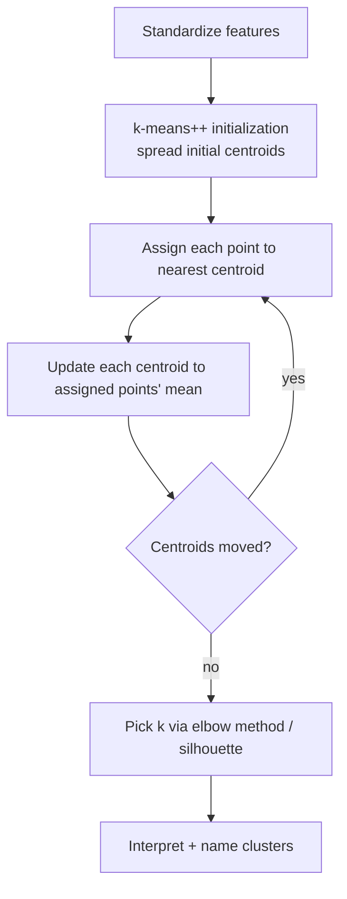

# Unsupervised 1 — K-Means Clustering

## Lectures covered
- K Means Clustering

---

## In one sentence
**K-Means** discovers groups in unlabeled data by repeatedly placing k "anchor points" (centroids) and assigning each row to its nearest anchor — without anyone telling it what the right groups are.

## Real-world analogy
A retail chain wants to open 4 new stores in a city, placed so each resident is close to one. Plot every resident on a map, drop 4 random store pins, then iterate: assign each resident to their nearest pin → move each pin to the geographic center of its assigned residents → repeat. After a few rounds, the pins settle into the optimal locations. K-Means does this, except the "map" is your feature space and "residents" are data rows.

For customer segmentation: treat each customer as a point with axes like spending, recency, age. K-Means finds 4 clusters → "loyal big spenders", "lapsed", "newcomers", "price sensitive" — without you ever labeling anyone.

## The intuition (plain English)
1. Pick k (the number of clusters you want — e.g., 4).
2. Drop k random initial centroids in feature space.
3. **Assign step**: every data point joins the cluster of the closest centroid.
4. **Update step**: every centroid moves to the mean of its assigned points.
5. Repeat 3–4 until nothing changes (or a max iteration hit).

It's an unsupervised algorithm — no labels given. You discover the groups instead of being told. The catch: you must pick k yourself, and K-Means assumes clusters are roughly spherical and similar size.

## Mini worked example — clustering 6 customers by 2 features

```
customer:  spend  recency
   A        100      30
   B        110      35
   C        105      28
   D        500       3
   E        510       5
   F        490       8
```

Pick k=2. Random initial centroids: c1 = (300, 20), c2 = (200, 25).

Iteration 1 (assign each to nearest):
```
A,B,C ─► all closer to c2 (200, 25)        → mean = (105, 31)
D,E,F ─► all closer to c1 (300, 20)        → mean = (500,  5.3)
```

Update centroids: c1 = (500, 5.3), c2 = (105, 31).

Iteration 2:
- Assign step → same groupings.
- Update step → centroids unchanged → **converged**.

Two clean clusters: low-spend / high-recency and high-spend / low-recency. (You'd label them "lapsed" vs. "active big spenders".)

## At-a-glance — algorithm + picking k

```
       Iteration                ●●●        ●●●            ●●●        ●●●
              0:    ★            ●●            ●● ★            ●●            ●●
                       ★    ●●●                          ★ ●●●
                          ●●●                                ●●●

Iteration 1:  ★ moves to mean of its assigned points.
Iteration 2:  Reassign → centroids barely move → converged.
```



## Why this matters
- **Most-used unsupervised algorithm.** Customer segmentation, document grouping, image color quantization.
- **Always scale features** — K-Means is distance-based, so a feature in millions dominates one in tens.
- **Pick k via elbow + silhouette**, not gut feel.
- **Fails on non-spherical or unequal-density clusters** — DBSCAN or Gaussian Mixture handle those.
- **Building block for AtliQo Bank-style customer segmentation** — once you have clusters, name them and let business teams target each.

---

## 1. The unsupervised setting

No labels. Just `X`. Goal: discover structure — groups, anomalies, lower-dimensional representations.

**Clustering** = partition observations into groups where members are similar to each other and dissimilar from other groups.

Common DS uses:
- Customer segmentation
- Image color quantization
- Document grouping
- Anomaly detection (lonely points)
- Pre-processing step before supervised models

---

## 2. K-Means — the algorithm

**Inputs**: data X, number of clusters k.

```
1. Pick k random initial centroids
2. Repeat:
   a. Assign each point to its nearest centroid (Euclidean distance)
   b. Update each centroid to the mean of its assigned points
3. Stop when assignments stop changing (or max iterations reached)
```

Visually: each cluster is a Voronoi cell around its centroid.

```python
from sklearn.cluster import KMeans
from sklearn.preprocessing import StandardScaler

X_scaled = StandardScaler().fit_transform(X)
km = KMeans(n_clusters=4, n_init="auto", random_state=42)
labels = km.fit_predict(X_scaled)

print(km.cluster_centers_)
print(km.inertia_)             # sum of within-cluster squared distances
```

> Always **scale** features for K-Means — it's distance-based.

---

## 3. Picking k — the elbow method

Plot **inertia** (within-cluster sum of squares) for k = 1, 2, 3, …

```python
import matplotlib.pyplot as plt
inertias = []
for k in range(1, 11):
    km = KMeans(n_clusters=k, n_init="auto", random_state=42).fit(X_scaled)
    inertias.append(km.inertia_)

plt.plot(range(1, 11), inertias, marker="o")
plt.xlabel("k"); plt.ylabel("inertia (lower is tighter)")
```

The **elbow** (where the curve bends sharply) is a reasonable k.

```
inertia
│  •
│   •
│    •
│     ╲
│      • <- elbow at k=4
│        ──
│         ────•
└────────────► k
```

---

## 4. Silhouette score — quantitative quality measure

For each point:
$$s = \frac{b - a}{\max(a, b)}$$
- $a$: avg distance to other points in same cluster
- $b$: avg distance to nearest other cluster

Range: −1 to 1.
- ~1: well-clustered
- ~0: on the boundary
- < 0: probably in the wrong cluster

```python
from sklearn.metrics import silhouette_score
score = silhouette_score(X_scaled, labels)
```

Compare scores across different k; higher = better.

---

## 5. K-Means initialization — `k-means++`

Randomly placed initial centroids can converge to bad local optima. **k-means++** picks initial centroids that are spread out, dramatically improving stability. sklearn uses it by default (`init="k-means++"`).

`n_init` controls how many random restarts to run; the best result wins. Default `n_init="auto"` in modern sklearn picks a sensible number.

---

## 6. K-Means assumptions / failure modes

K-Means works best when clusters are:
- Spherical (Euclidean distance bias)
- Roughly equal in size
- Well-separated

It fails when clusters are:
- Crescent / elongated → use **DBSCAN** or **Spectral Clustering**
- Density-based, varying sizes → DBSCAN
- Hierarchical structure → **Agglomerative Clustering**

```
   K-means OK            K-means fails
   ⚪⚪⚪    ⚫⚫⚫      ╮          ╭
   ⚪⚪⚪    ⚫⚫⚫       ╰─⚪⚪⚪──╯  ⚫⚫⚫
                          ╰⚫⚫⚫╯
```

---

## 7. Customer segmentation — typical workflow

```python
from sklearn.cluster import KMeans
from sklearn.preprocessing import StandardScaler

# features: spend, frequency, recency, etc. (RFM)
features = ["recency_days", "frequency", "monetary_amount"]
X = df[features]

scaler = StandardScaler()
X_scaled = scaler.fit_transform(X)

# pick k via elbow / silhouette
km = KMeans(n_clusters=4, n_init="auto", random_state=42).fit(X_scaled)
df["cluster"] = km.labels_

# interpret each cluster
df.groupby("cluster")[features].agg(["mean", "median", "count"])
```

Then name the clusters: "high-value loyalists", "lapsed", "newcomers", "price-sensitive."

This is exactly the AtliQo Bank target-segment exercise (Module 5) extended into an *unsupervised* path.

---

## 8. Other clustering algorithms (brief)

### DBSCAN — density-based
- Doesn't need k upfront
- Finds arbitrary shapes
- Marks noise points

```python
from sklearn.cluster import DBSCAN
DBSCAN(eps=0.5, min_samples=5).fit_predict(X_scaled)
```

### Hierarchical / Agglomerative
- Builds a dendrogram (tree) of clusters
- Useful when hierarchy itself is informative

```python
from sklearn.cluster import AgglomerativeClustering
AgglomerativeClustering(n_clusters=4).fit_predict(X_scaled)
```

### Gaussian Mixture (GMM) — soft clusters
- Each point gets a *probability* of belonging to each cluster
- Better than k-means when clusters overlap

---

## 9. PCA before clustering

Cluster algorithms struggle in high dimensions. Often:
1. Reduce to 2–10 dimensions with PCA
2. Cluster on PCA features
3. Visualize cluster assignments back in 2D

```python
from sklearn.decomposition import PCA
pca = PCA(n_components=2).fit_transform(X_scaled)
```

Or **t-SNE / UMAP** for visualization.

---

## 10. Common pitfalls

| Mistake | Effect | Fix |
|---|---|---|
| Skipping scaling | dominant feature kidnaps clusters | always scale |
| Picking k arbitrarily | weird clusters | elbow + silhouette |
| Reading k-means clusters as "true" categories | might be artifacts | always interpret + validate with domain |
| K-means on non-spherical clusters | fails | use DBSCAN / GMM |
| Tiny n_init | unstable | leave at default ("auto") |

## Self-check

- [ ] Walk through K-Means in 4 steps.
- [ ] Why scale before K-Means?
- [ ] Elbow method: how do you read it?
- [ ] What's the silhouette score and when prefer it over inertia?
- [ ] What are 3 ways K-Means can fail?
- [ ] When use DBSCAN over K-Means?
- [ ] What's `n_init` and `k-means++`?
- [ ] How would you cluster customer transaction histories?

---

## Glossary

| Term | Plain meaning |
|------|---------------|
| **Unsupervised learning** | Learning patterns from data without labels (no y) |
| **Clustering** | Grouping rows so similar rows land together |
| **K-Means** | Cluster algorithm that minimizes within-cluster squared distance |
| **k** | Number of clusters — you pick it |
| **Centroid** | The mean (center) of a cluster |
| **Assignment step** | Each point joins the cluster of its closest centroid |
| **Update step** | Each centroid moves to the mean of its assigned points |
| **Convergence** | Centroids stop moving (or maximum iterations reached) |
| **Inertia** | Within-cluster sum of squared distances — K-Means minimizes this |
| **Elbow method** | Plot inertia vs k; pick the k where the curve bends |
| **Silhouette score** | Range −1 to 1; how well each point fits its cluster vs the next-nearest |
| **k-means++** | Smart initialization that spreads starting centroids — sklearn default |
| **`n_init`** | Number of random restarts; best result wins |
| **Voronoi cells** | Regions of feature space where each centroid is the nearest — what K-Means produces |
| **Euclidean distance** | Straight-line distance between two points — what K-Means uses |
| **Standardization** | Scale features to mean 0, std 1 — required for K-Means |
| **DBSCAN** | Density-based clustering — finds arbitrary shapes, marks noise, no k needed |
| **Agglomerative clustering** | Hierarchical — builds a tree of clusters bottom-up |
| **Gaussian Mixture Model (GMM)** | Soft clustering — each point gets a probability per cluster |
| **PCA (Principal Component Analysis)** | Reduce feature dimensions to 2–10 before clustering high-dim data |
| **t-SNE / UMAP** | Non-linear dim-reduction great for visualizing clusters in 2D |
| **RFM** | Recency, Frequency, Monetary — classic customer-segmentation features |
| **Customer segmentation** | Splitting customers into groups for targeted marketing |
| **Soft cluster** | Probability of belonging to each cluster (GMM does this) |
| **Hard cluster** | Each point belongs to exactly one cluster (K-Means does this) |
| **Feature space** | The multi-dimensional space where data points live |

## Further reading
- Previous module: [../03-ensemble/03-cross-validation-tuning.md](../03-ensemble/03-cross-validation-tuning.md)
- Next: [02-vif.md](02-vif.md)
- AtliQo Bank target-segment context: [../../05-math-statistics/02-atliqo-bank-project](../../05-math-statistics/02-atliqo-bank-project)
- Distance-based scaling: [../01-foundations/05-preprocessing-encoding.md](../01-foundations/05-preprocessing-encoding.md)
