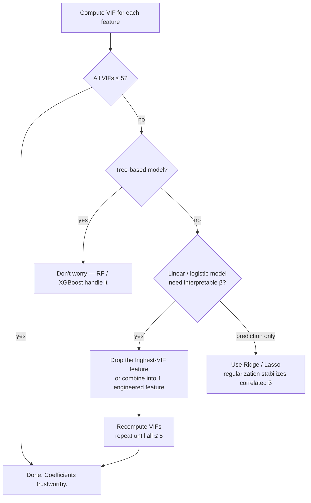

# Unsupervised 2 — VIF (Variance Inflation Factor)

## Lectures covered
- Variance Inflation Factor (VIF)

---

## In one sentence
**VIF (Variance Inflation Factor)** is a number that flags features which are essentially redundant with other features — and redundant features wreck the interpretability of linear-model coefficients.

## Real-world analogy
Imagine three witnesses to a robbery, but two of them are best friends who whispered to each other before testifying. Their statements are correlated — and a court can't tell which one is providing independent evidence. So testimony gets unreliable. In a regression model, two correlated features behave the same way: the model can't tell which one is "really" responsible for the change in y, so it spreads the credit weirdly between them. Coefficient signs flip; standard errors balloon. **VIF measures how much each feature is "whispering with" the others.**

## The intuition (plain English)
For each feature, fit a linear regression *predicting that feature from all the others*. If the other features can predict it well (high R²), the feature is redundant. VIF = `1 / (1 − R²)`:
- VIF = 1: feature is independent — perfect.
- VIF = 5: feature is 80% explained by others — concerning.
- VIF > 10: high multicollinearity — fix it.

VIF only matters for **linear / logistic models where you need interpretable coefficients**. Tree-based models (RF, XGBoost) don't care — they just pick whichever correlated feature splits best.

## Mini worked example — house features

Suppose your dataset has: `sqft`, `bedrooms`, `square_meters`, `bathrooms`, `age`.

```
Compute VIF for each:
   sqft           VIF = 95.4   ← almost perfectly explained by others
   bedrooms       VIF = 2.1
   square_meters  VIF = 95.4   ← yes — sqft × 0.0929 = square_meters
   bathrooms      VIF = 3.8
   age            VIF = 1.5
```

`sqft` and `square_meters` are the same info in different units → drop one. After removing `square_meters`:

```
   sqft           VIF = 2.3   ← now reasonable
   bedrooms       VIF = 2.0
   bathrooms      VIF = 3.1
   age            VIF = 1.5
```

Now coefficients are interpretable: a bedroom "by itself" adds X dollars while sqft is held constant.

## At-a-glance — when to act on VIF



## Why this matters
- **Saves you from coefficient nonsense** in regulated domains (banking, healthcare) where each feature's effect must be reported.
- **Doesn't matter for prediction-only models** with regularization or tree ensembles — useful to know when *not* to obsess.
- **Different from pairwise correlation**: VIF catches "this feature is explained by *combinations* of others," which a correlation matrix misses.
- **Used in the credit-risk project** to slim down features before fitting a regulator-friendly logistic regression.

---

## 1. The problem — multicollinearity

If two features are highly correlated, the model can't tell which one is "really" responsible for changes in y. Linear regression coefficients become unstable: small data perturbations produce wildly different coefficients.

Effects:
- Coefficient signs flip
- Standard errors balloon
- Interpretation becomes meaningless
- Predictions can still be OK (the model finds a working combo) — but you can't *trust* individual coefficients

---

## 2. What VIF measures

For each feature $x_j$:
1. Fit a regression of $x_j$ on **all other features**
2. Get $R_j^2$
3. $\text{VIF}_j = \frac{1}{1 - R_j^2}$

Interpretation:
- VIF = 1 → feature uncorrelated with others (great)
- VIF = 5 → feature 80% explained by others (concerning)
- VIF > 10 → high multicollinearity (act on it)

---

## 3. Computing VIF in Python

```python
from statsmodels.stats.outliers_influence import variance_inflation_factor
import pandas as pd
from statsmodels.tools.tools import add_constant

X_const = add_constant(X)                        # add intercept column
vifs = pd.Series(
    [variance_inflation_factor(X_const.values, i) for i in range(X_const.shape[1])],
    index=X_const.columns,
)
print(vifs.sort_values(ascending=False))
```

`add_constant` is required because VIF is computed in a regression that needs an intercept.

---

## 4. Treatment options

### 1. Drop one of the correlated features
The simplest fix. Often two features are essentially the same (e.g., `price` and `price_in_dollars`).

### 2. Combine them into one feature
E.g., `BMI = weight / height²` collapses two correlated features into one.

### 3. PCA
Project onto principal components — guaranteed orthogonal.

```python
from sklearn.decomposition import PCA
pca = PCA(n_components=0.95)         # keep 95% of variance
X_pca = pca.fit_transform(X_scaled)
```

### 4. Use regularization (Ridge / Lasso)
Doesn't fix interpretability, but stabilizes coefficients and prediction performance.

### 5. Tree models / gradient boosting
Don't really care about multicollinearity — they pick whichever feature splits best.

---

## 5. Iterative VIF reduction

The classic workflow:

```python
def reduce_vif(X, threshold=5):
    X = X.copy()
    while True:
        Xc = add_constant(X)
        vifs = pd.Series(
            [variance_inflation_factor(Xc.values, i) for i in range(Xc.shape[1])],
            index=Xc.columns,
        ).drop("const")
        if vifs.max() <= threshold:
            return X
        worst = vifs.idxmax()
        print(f"Dropping {worst} (VIF={vifs.max():.1f})")
        X = X.drop(columns=[worst])

X_reduced = reduce_vif(X)
```

Drop the highest-VIF feature, recompute, repeat until all are below threshold.

---

## 6. When VIF doesn't matter

- **Tree-based models** — robust to multicollinearity
- **Regularized linear models** (Ridge / Lasso) — stable in the presence of multicollinearity
- **Pure prediction tasks** — if you don't need to interpret coefficients, multicollinearity hurting interpretability isn't a problem

When VIF *does* matter:
- Plain OLS with focus on coefficient interpretation
- Statistical inference (CIs, p-values on coefficients)
- Healthcare / finance / regulated domains where each feature's effect is reported separately

---

## 7. Real example — the credit-risk project

In Codebasics' credit-risk project (Module 6 project 2), VIF analysis is part of the feature-engineering step. Often:
- `outstanding_debt` and `credit_utilization` are highly correlated → drop one
- Multiple credit-history-length features encode similar info → keep one
- Income and net-worth features → consolidate

This produces a cleaner, more interpretable model that satisfies regulators (banking models often need explainability for compliance).

---

## 8. Common pitfalls

| Mistake | Effect | Fix |
|---|---|---|
| VIF on un-standardized data | mostly fine, but check if results match expectation | scale before if comparing magnitudes |
| Forgetting `add_constant` | wrong VIFs | always add intercept |
| Dropping all high-VIF features at once | might drop *all* useful info | drop one at a time, recompute |
| Worrying about VIF for tree models | not a real concern there | only worry for linear models |
| Confusing correlation with VIF | correlation is pairwise, VIF is multivariate | VIF catches "this feature is explained by *combinations* of others" |

## Self-check

- [ ] What does VIF measure?
- [ ] Threshold: when do I act on a VIF value?
- [ ] Why does VIF require `add_constant`?
- [ ] Three ways to fix high VIF.
- [ ] When does VIF not matter for your model choice?
- [ ] How is VIF different from a pairwise correlation matrix?
- [ ] Walk through iterative VIF reduction on a 10-feature dataset.

---

## Glossary

| Term | Plain meaning |
|------|---------------|
| **VIF (Variance Inflation Factor)** | A number per feature: `1 / (1 − R²)` from regressing it on the others |
| **Multicollinearity** | Two or more features carry overlapping information |
| **Perfect multicollinearity** | One feature is an exact linear combination of others (e.g., the dummy-variable trap) |
| **Pairwise correlation** | Correlation between two features at a time — VIF generalizes this to multivariate |
| **R² in VIF** | How well other features predict this one — high R² → high VIF |
| **VIF threshold** | Common rules of thumb: >5 concerning, >10 high |
| **Coefficient instability** | Small data changes flipping the sign or magnitude of β — symptom of multicollinearity |
| **Standard error of β** | Uncertainty around a coefficient — multicollinearity inflates it |
| **`add_constant`** | statsmodels function adding an intercept column required for VIF computation |
| **`variance_inflation_factor`** | statsmodels function computing one VIF per feature |
| **PCA (Principal Component Analysis)** | Project onto orthogonal components — removes multicollinearity by construction |
| **Ridge regression** | Stabilizes coefficients in the presence of multicollinearity (without dropping features) |
| **Lasso regression** | Picks one of several correlated features and zeros the others |
| **Elastic Net** | L1 + L2 — handles correlated groups better than Lasso alone |
| **Tree-based models** | RF, XGBoost, LightGBM — don't suffer from multicollinearity |
| **Feature engineering combo** | Replace correlated features with one engineered combo (e.g., BMI = weight/height²) |
| **Iterative VIF reduction** | Drop highest-VIF feature, recompute, repeat until all ≤ threshold |
| **Dummy variable trap** | Keeping all one-hot columns produces perfect multicollinearity — drop one |
| **Regulator explainability** | Banking / insurance need to explain each coefficient — multicollinearity blocks this |
| **Credit-risk feature engineering** | VIF analysis is part of the pre-modeling pipeline in [credit-risk project](../06-projects/02-credit-risk-classification.md) |

## Further reading
- Previous: [01-clustering-kmeans.md](01-clustering-kmeans.md)
- Used in linear regression: [../01-foundations/02-linear-regression.md](../01-foundations/02-linear-regression.md)
- Used in regularization: [../01-foundations/07-regularization.md](../01-foundations/07-regularization.md)
- Credit-risk project: [../06-projects/02-credit-risk-classification.md](../06-projects/02-credit-risk-classification.md)
- Correlation foundations: [../../05-math-statistics/01-foundations/02-central-tendency-dispersion.md](../../05-math-statistics/01-foundations/02-central-tendency-dispersion.md)
