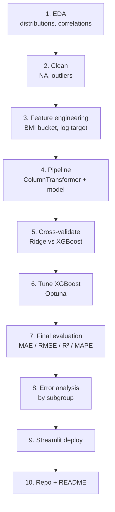

# Project — Healthcare Premium Prediction (Regression)

## Domain
A health insurer wants to predict the **annual premium** for a new applicant based on demographics, medical history, lifestyle factors. Used both for pricing transparency and to flag underwriting outliers.

## ML formulation
- **Type**: regression
- **Target**: `premium_amount` (continuous)
- **Features**: age, BMI, smoker, region, family medical history, income, etc.
- **Metrics**: MAE (in dollars — interpretable to stakeholders), RMSE, R², MAPE

---

## In one sentence
You build a model that, given a person's age, BMI, smoking status, region, and a few other facts, predicts what their annual health-insurance premium should be — and you ship a Streamlit demo that turns it into a small calculator.

## Real-world analogy
Insurance underwriters used to do this with intuition and lookup tables: "smoker plus age 50 plus BMI 32 → about $X". You're replacing that intuition with a model trained on thousands of past policies. Same job, more data-driven.

## The intuition (plain English)
1. Treat `premium_amount` as the number to predict (continuous → **regression**).
2. Smoker status and BMI tend to dominate the price — you'll see this in EDA.
3. Build a baseline (Ridge regression) so you have a number to beat. Then try XGBoost.
4. Report **MAE in dollars** — stakeholders care about "we're off by $1,800 on average," not "R² = 0.84."
5. Do **error analysis by subgroup** (smokers vs non, BMI buckets, region) — this is what separates a "C" project from a portfolio-worthy one.
6. Deploy with Streamlit so anyone can drop in a profile and see a predicted premium.

## Mini worked example — what one prediction looks like

```
input:    age=45, BMI=28, smoker=yes, region=NE, income=80k, children=2
model:    XGBoost regressor (trained on 10,000 past policies)
output:   predicted_premium = $14,320
training MAE on similar profiles: $1,750  →  reasonable confidence interval ±$1,750
```

The Streamlit demo turns this into:
```
[ Age: 45 ▾ ]   [ BMI: 28.0 ]   [ Smoker: yes ▾ ]   ... [Estimate]
        ── Estimated annual premium: $14,320 ──
```

## At-a-glance — full project flow



## Why this matters
- **A canonical regression project** — same recipe applies to demand forecasting, real-estate pricing, ad bidding.
- **Turns the foundations files into a deliverable**: linear regression baseline, gradient boosting upgrade, regression metrics, residual diagnostics, all together.
- **Portfolio-grade**: a Streamlit demo + a clear README with MAE in dollars beats 10 unfinished notebooks.
- **Healthcare flavor** signals domain awareness — recruiters notice.

---

## End-to-end walkthrough

### 1. EDA
```python
import pandas as pd, seaborn as sns
df = pd.read_csv("insurance.csv")
df.info()
df.describe()
sns.histplot(df["premium_amount"], kde=True)
df.corr(numeric_only=True)
```

Key observations:
- `premium_amount` right-skewed → consider log transform
- `smoker` is a huge driver
- BMI has a non-linear relationship with premium (very high BMI → much higher premium)

### 2. Cleaning
- Handle NULLs in income / BMI
- Cap or remove extreme outliers in BMI
- Validate categorical values (region: 4 options expected)

### 3. Feature engineering
- One-hot encode `region`
- Binary encode `smoker`, `gender`
- Create `bmi_category` (underweight / normal / overweight / obese)
- Optionally: log-transform `premium_amount` for the model, then exp at predict time

### 4. Pipeline
```python
from sklearn.pipeline import Pipeline
from sklearn.compose import ColumnTransformer
from sklearn.preprocessing import StandardScaler, OneHotEncoder
from sklearn.linear_model import Ridge
from xgboost import XGBRegressor

numeric = ["age", "bmi", "children", "income"]
categorical = ["smoker", "gender", "region"]

preprocess = ColumnTransformer([
    ("num", StandardScaler(), numeric),
    ("cat", OneHotEncoder(handle_unknown="ignore"), categorical),
])

models = {
    "ridge": Pipeline([("prep", preprocess), ("m", Ridge(alpha=1.0))]),
    "xgb":   Pipeline([("prep", preprocess), ("m", XGBRegressor(n_estimators=500, learning_rate=0.05))]),
}
```

### 5. Cross-validate
```python
from sklearn.model_selection import cross_val_score
import numpy as np

for name, m in models.items():
    rmse = -cross_val_score(m, X, y, cv=5, scoring="neg_root_mean_squared_error")
    print(f"{name}: RMSE = ${rmse.mean():,.0f} ± ${rmse.std():,.0f}")
```

### 6. Tune (XGBoost)
Use Optuna or RandomizedSearchCV on:
- `learning_rate`
- `max_depth`
- `n_estimators`
- `subsample`, `colsample_bytree`

### 7. Final evaluation
On held-out test set:
```python
final = models["xgb"].fit(X_train, y_train)
y_pred = final.predict(X_test)

from sklearn.metrics import mean_absolute_error, root_mean_squared_error, r2_score, mean_absolute_percentage_error
print(f"MAE:   ${mean_absolute_error(y_test, y_pred):,.0f}")
print(f"RMSE:  ${root_mean_squared_error(y_test, y_pred):,.0f}")
print(f"R²:    {r2_score(y_test, y_pred):.3f}")
print(f"MAPE:  {mean_absolute_percentage_error(y_test, y_pred) * 100:.1f}%")
```

### 8. Error analysis (the differentiator)
Find segments where the model is worst:
```python
df_test = X_test.copy()
df_test["actual"] = y_test
df_test["predicted"] = y_pred
df_test["abs_error"] = np.abs(y_test - y_pred)

# avg error by smoker status
df_test.groupby("smoker_yes")["abs_error"].mean()

# avg error by BMI bucket
df_test["bmi_bucket"] = pd.cut(df_test["bmi"], bins=[0, 18.5, 25, 30, 100])
df_test.groupby("bmi_bucket")["abs_error"].mean()
```

This kind of analysis is what makes a "good" project a "great" one.

### 9. Deployment — Streamlit
```python
# app.py
import streamlit as st
import pandas as pd
import joblib

model = joblib.load("model.joblib")

st.title("Health Insurance Premium Estimator")

age = st.slider("Age", 18, 70, 30)
bmi = st.number_input("BMI", 15.0, 50.0, 25.0)
children = st.slider("Children", 0, 5, 0)
smoker = st.selectbox("Smoker?", ["no", "yes"])
gender = st.selectbox("Gender", ["male", "female"])
region = st.selectbox("Region", ["NE", "NW", "SE", "SW"])
income = st.number_input("Annual income", 10_000, 500_000, 60_000)

if st.button("Estimate"):
    X = pd.DataFrame([{
        "age": age, "bmi": bmi, "children": children, "income": income,
        "smoker": smoker, "gender": gender, "region": region,
    }])
    pred = model.predict(X)[0]
    st.metric("Estimated annual premium", f"${pred:,.0f}")
```

Deploy on **Streamlit Cloud** (free) for free in 5 minutes.

### 10. Repo deliverables
```
healthcare-premium/
├── data/insurance.csv
├── notebooks/
│   ├── 01-eda.ipynb
│   ├── 02-feature-eng.ipynb
│   └── 03-modeling.ipynb
├── src/
│   ├── train.py
│   └── app.py                  # Streamlit
├── model.joblib
├── requirements.txt
└── README.md                   # screenshots, MAE, demo link
```

---

## Self-check

- [ ] Did I produce error analysis by subgroup, not just an overall metric?
- [ ] Did I deploy a Streamlit demo with screenshots?
- [ ] Does my README state MAE in dollars?
- [ ] Is my model versioned (joblib + commit)?
- [ ] Did I post a build-in-public update with demo link?

---

## Glossary

| Term | Plain meaning |
|------|---------------|
| **Premium** | The amount the policyholder pays for insurance coverage — the target we predict |
| **Underwriting** | The insurer's process of pricing risk for a new applicant |
| **BMI (Body Mass Index)** | Weight / height² — a standard health metric used as a feature |
| **Right-skewed target** | Most premiums small, a few very large — common; consider log transform |
| **Log transform** | Replace y with `log(y+1)` to make the distribution more symmetric, then `exp` predictions back |
| **One-hot encoding** | Turn categorical strings (region, gender) into 0/1 columns |
| **ColumnTransformer** | sklearn class applying different preprocessors to different columns |
| **Pipeline** | Chains preprocessing + model so CV is leak-free |
| **Ridge regression** | Linear regression with L2 regularization — strong baseline |
| **XGBoost** | Gradient-boosted trees — top tabular-regression performer |
| **MAE (Mean Absolute Error)** | Average dollar error — the metric stakeholders read |
| **RMSE (Root Mean Squared Error)** | Penalizes big misses harder than MAE |
| **R²** | Fraction of variance explained — summary metric |
| **MAPE (Mean Absolute Percentage Error)** | Percentage error — easy to communicate, breaks for tiny y |
| **Cross-validation (CV)** | Average score across multiple train/val splits — more honest than one split |
| **Optuna** | Bayesian hyperparameter tuner — finds great configs in fewer trials than grid search |
| **Hyperparameter** | Model knob set before training (depth, learning_rate) |
| **Held-out test set** | Final, never-touched data used once for the honest report |
| **Error analysis** | Slicing residuals by subgroup to find where the model is worst |
| **Subgroup performance** | MAE by smoker / BMI bucket / region — exposes model bias |
| **Residual** | `actual − predicted` per row |
| **Model card** | Short document describing what the model does, its data, and its known limits |
| **Streamlit** | Python library to build a web demo from a script in minutes |
| **`joblib.dump`** | Saves a trained sklearn / XGBoost model to disk |
| **Streamlit Cloud** | Free hosting for Streamlit apps — deploy a demo URL in 5 minutes |
| **Build-in-public** | Sharing project progress on LinkedIn / Twitter while building — boosts portfolio reach |
| **Repo deliverables** | The files a hiring manager expects: notebooks, src, model, requirements, README |

## Further reading
- Foundations: [../01-foundations/02-linear-regression.md](../01-foundations/02-linear-regression.md), [04-model-evaluation-regression.md](../01-foundations/04-model-evaluation-regression.md), [07-regularization.md](../01-foundations/07-regularization.md)
- Boosting: [../03-ensemble/02-boosting-adaboost-gbm-xgb.md](../03-ensemble/02-boosting-adaboost-gbm-xgb.md)
- Tuning: [../03-ensemble/03-cross-validation-tuning.md](../03-ensemble/03-cross-validation-tuning.md)
- Companion classification project: [02-credit-risk-classification.md](02-credit-risk-classification.md)
