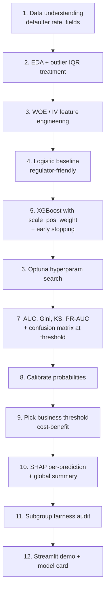

# Project — Credit Risk Modeling (Classification)

## Domain
A **non-banking financial company (NBFC)** issues loans. They want a model that scores each new applicant's **probability of default** to drive lend / decline / refer-to-human decisions.

This is one of the most common and well-paid ML use cases in financial services.

## ML formulation
- **Type**: binary classification
- **Target**: `defaulted` (0 = paid back, 1 = defaulted)
- **Class imbalance**: typically 5–15% defaulters
- **Metrics**: ROC-AUC, PR-AUC, **KS statistic**, **Gini coefficient**, recall at fixed precision

---

## In one sentence
You build a model that gives every loan applicant a "probability of defaulting" score — and that score drives the lender's automated decision: **approve, decline, or refer to a human**.

## Real-world analogy
Imagine an experienced loan officer who's seen 100,000 past borrowers. She remembers patterns — "high credit utilization plus short employment plus prior late payments → trouble." You're encoding that decades-worth of intuition into a model. The model never replaces her, but it scores 1,000 applications/day so she focuses her time on the borderline cases.

## The intuition (plain English)
1. **Imbalanced binary classification** — typically only 5–15% of applicants default. Accuracy is useless; use AUC, PR-AUC, KS.
2. **Two acceptable model families**:
   - **Logistic regression on WOE-encoded features** — interpretable, regulator-friendly, near-XGBoost performance.
   - **XGBoost with `scale_pos_weight`** — best raw accuracy, explained per-prediction via SHAP.
3. **Threshold tuning is the real work**: "approve top 60% of applications by score" or "keep precision ≥ 90% on rejects."
4. **SHAP explanations** are often *legally required* — you must be able to tell a rejected applicant why.
5. **Subgroup fairness check** — does the model perform similarly across age / gender / region? Banks face regulatory scrutiny here.

## Mini worked example — three loan applicants

```
applicant   income   credit_score   debt/income   prior_defaults     model_prob   decision
   Anil      90k       780             0.15             0               0.04        APPROVE
   Bina      35k       620             0.42             1               0.61        DECLINE
   Chand     55k       690             0.28             0               0.31        REFER (manual review)
```

The bank set thresholds: prob ≤ 0.20 → auto-approve; prob ≥ 0.55 → auto-decline; in between → human reviewer. Threshold values aren't 0.5 by default — they come from cost-benefit analysis: an approved default costs $10,000; a wrongly declined good loan costs $200 of customer goodwill. The breakeven threshold is what you ship.

## At-a-glance — full project flow



## Why this matters
- **Most-paid ML use case in banking and fintech.** Credit risk modelers earn 1.5–2× generic data scientists.
- **The portfolio project recruiters love.** It exercises every classification skill: imbalance, AUC/PR/KS, threshold tuning, calibration, SHAP, fairness.
- **Real regulatory teeth**: FCRA / GDPR / RBI rules require per-decision explanations and fairness audits — you'll learn the production-grade workflow.
- **Companion to the healthcare-premium regression project** — together they cover both flavors of supervised ML on tabular data.

---

## Domain-specific concepts

### KS Statistic (Kolmogorov-Smirnov)
Maximum difference between cumulative distribution of good vs bad applicants across the score range.
- KS > 0.4: strong model
- KS > 0.5: very strong
- KS < 0.3: weak

```python
from scipy.stats import ks_2samp
ks = ks_2samp(y_prob[y_test==1], y_prob[y_test==0]).statistic
```

### Gini coefficient
$$\text{Gini} = 2 \cdot \text{AUC} - 1$$

- Gini > 0.4 reasonable; > 0.6 very strong
- Industry-standard metric for credit models

### WOE / IV — Weight of Evidence and Information Value
Pre-modeling feature transformation widely used in credit risk:
$$\text{WOE} = \ln\left(\frac{P(\text{good}|x)}{P(\text{bad}|x)}\right)$$
$$\text{IV} = \sum (P(\text{good}|x) - P(\text{bad}|x)) \cdot \text{WOE}$$

| IV | Predictive power |
|---|---|
| < 0.02 | useless |
| 0.02–0.1 | weak |
| 0.1–0.3 | medium |
| 0.3–0.5 | strong |
| > 0.5 | suspicious — check for leakage |

```bash
pip install xverse  # or compute manually
```

WOE-encoded features feed cleanly into logistic regression and produce interpretable, monotonic coefficients — regulators love this.

---

## Walkthrough

### 1. Data understanding
Typical fields: age, income, employment length, debt-to-income ratio, credit utilization, # of past inquiries, prior defaults, loan amount, term, purpose.

```python
import pandas as pd
df = pd.read_csv("loans.csv")
print(df["defaulted"].value_counts(normalize=True))     # 90/10 imbalance typical
```

### 2. EDA + outlier treatment
- Income → IQR outlier treatment (right-skewed)
- Debt-to-income > 1 → flag (outlier or borrower in trouble)
- Defaulter rate by employment length, by debt bucket, by credit score bucket

### 3. Feature engineering with WOE/IV
```python
import xverse.transformer as xv

clf = xv.WOE()
X_woe = clf.fit_transform(X, y)
iv = clf.iv_df          # IV per feature

X_filtered = X_woe[iv.query("Information_Value > 0.05")["Variable_Name"]]
```

### 4. Modeling pipeline
```python
import xgboost as xgb
from sklearn.pipeline import Pipeline
from sklearn.preprocessing import StandardScaler

ratio = (y_train == 0).sum() / (y_train == 1).sum()

xgb_clf = xgb.XGBClassifier(
    n_estimators=2000,
    learning_rate=0.03,
    max_depth=4,                # shallow trees for stability
    subsample=0.8,
    colsample_bytree=0.8,
    scale_pos_weight=ratio,
    eval_metric="auc",
    early_stopping_rounds=100,
    random_state=42,
)
```

Often a calibrated logistic regression on WOE features performs nearly as well — and is far more interpretable. Banks frequently ship that for regulatory reasons.

### 5. Hyperparameter tuning (Optuna)
```python
import optuna
from sklearn.model_selection import cross_val_score

def objective(trial):
    params = {
        "n_estimators": trial.suggest_int("n_estimators", 200, 2000),
        "learning_rate": trial.suggest_float("learning_rate", 0.01, 0.1, log=True),
        "max_depth": trial.suggest_int("max_depth", 3, 8),
        "subsample": trial.suggest_float("subsample", 0.6, 1.0),
        "colsample_bytree": trial.suggest_float("colsample_bytree", 0.6, 1.0),
    }
    clf = xgb.XGBClassifier(**params, scale_pos_weight=ratio, random_state=42)
    return cross_val_score(clf, X_train, y_train, cv=5, scoring="roc_auc").mean()

study = optuna.create_study(direction="maximize")
study.optimize(objective, n_trials=30)
```

### 6. Evaluation suite
```python
from sklearn.metrics import roc_auc_score, classification_report
from scipy.stats import ks_2samp

y_prob = model.predict_proba(X_test)[:, 1]

auc = roc_auc_score(y_test, y_prob)
gini = 2 * auc - 1
ks = ks_2samp(y_prob[y_test == 1], y_prob[y_test == 0]).statistic
print(f"AUC: {auc:.3f}  |  Gini: {gini:.3f}  |  KS: {ks:.3f}")
print(classification_report(y_test, model.predict(X_test)))
```

### 7. Calibration + threshold setting
Often the business wants:
- "Approve top 60% by score" → set threshold at the 40th percentile
- "Maintain ≥ 90% precision on rejections" → use precision-recall curve

```python
y_prob_sorted = np.sort(y_prob)[::-1]
threshold = y_prob_sorted[int(len(y_prob) * 0.4)]
```

### 8. SHAP explanations (regulatory requirement)
```python
import shap
explainer = shap.TreeExplainer(model)
shap_values = explainer.shap_values(X_test)

# global: which features matter most
shap.summary_plot(shap_values, X_test)

# per-prediction: why was this customer rejected?
shap.force_plot(explainer.expected_value, shap_values[i], X_test.iloc[i])
```

For banking, **per-decision explanations** are often legally required.

### 9. Streamlit deployment
Same pattern as the healthcare project — form inputs, model.predict, present score with explanation.

### 10. Business presentation
The deliverable should include:
- Confusion matrix at the chosen threshold
- KS / Gini / AUC vs current production
- Expected $ impact (defaults caught × avg loss saved)
- Subgroup fairness check (does the model perform equally on age, gender, region?)

---

## Repo structure
```
credit-risk/
├── data/
│   ├── loans.csv
│   └── data_dictionary.md
├── notebooks/
│   ├── 01-eda.ipynb
│   ├── 02-woe-iv.ipynb
│   ├── 03-baseline-logreg.ipynb
│   ├── 04-xgboost.ipynb
│   ├── 05-tuning-optuna.ipynb
│   └── 06-shap-explanations.ipynb
├── src/
│   ├── train.py
│   ├── score.py
│   └── app.py            # Streamlit
├── reports/
│   ├── model-card.md
│   └── business-deck.pdf
├── model.joblib
├── requirements.txt
└── README.md
```

---

## Self-check

- [ ] Did I report KS, Gini, AUC, PR-AUC?
- [ ] Did I produce per-prediction SHAP explanations?
- [ ] Is my threshold business-driven, not arbitrary?
- [ ] Did I check fairness across age / gender / region?
- [ ] Is my README a defensible business case (impact in $)?
- [ ] Did I post a LinkedIn writeup with a Streamlit demo link?
- [ ] Does my repo include a model card?

---

## Glossary

| Term | Plain meaning |
|------|---------------|
| **Default** | Borrower stops repaying — the event we predict |
| **Probability of default (PD)** | Model output — how likely this applicant is to default |
| **NBFC (Non-Banking Financial Company)** | A lender that's not a traditional bank |
| **Class imbalance** | Defaulters are rare (5–15%); standard accuracy lies |
| **`scale_pos_weight`** | XGBoost's class-imbalance knob — set to `n_neg / n_pos` |
| **`class_weight="balanced"`** | sklearn equivalent for logistic regression / RF |
| **WOE (Weight of Evidence)** | `ln(P(good|x) / P(bad|x))` — turns each feature bin into a numeric score |
| **IV (Information Value)** | How predictive a feature is — drop features with IV < 0.02 |
| **`xverse`** | Python lib computing WOE / IV |
| **ROC-AUC** | Area under ROC curve — ranking quality |
| **PR-AUC / Average Precision** | Better than ROC-AUC under heavy imbalance |
| **Gini coefficient** | `2·AUC − 1` — banking-industry standard |
| **KS statistic (Kolmogorov-Smirnov)** | Max gap between CDFs of good and bad applicants — > 0.4 is strong |
| **Confusion matrix at threshold** | TP/FP/FN/TN counts at the deployed threshold |
| **Decision threshold** | Probability cutoff for declining vs. approving |
| **Cost-benefit analysis** | Pick threshold by maximizing `TP·B − FP·C − FN·K` in dollars |
| **Calibration** | Whether "30% probability" actually means 30% of such cases default |
| **`CalibratedClassifierCV`** | sklearn helper to recalibrate probabilities |
| **SHAP (SHapley Additive exPlanations)** | Per-prediction feature attribution — required for compliance |
| **TreeExplainer** | SHAP variant optimized for tree models — fast and exact |
| **Force plot** | SHAP visualization showing how each feature pushed one prediction up/down |
| **Summary plot** | SHAP global view — which features matter most overall |
| **Subgroup fairness** | Performance comparison across protected groups (age, gender, region) |
| **Disparate impact** | Legally significant gap in approval rates across groups |
| **Model card** | Document describing model purpose, data, metrics, limits, fairness audits |
| **Stratified k-fold** | CV split that preserves class proportions per fold |
| **Optuna** | Bayesian hyperparameter tuning library |
| **Early stopping** | Stop XGBoost training when validation AUC plateaus |
| **Streamlit** | Library to ship a model demo as a web app in minutes |
| **Repo deliverables** | Notebooks, src, model file, model card, business deck, requirements, README |

## Further reading
- Logistic regression baseline: [../02-classification/01-logistic-regression.md](../02-classification/01-logistic-regression.md)
- Classification metrics: [../02-classification/02-classification-metrics.md](../02-classification/02-classification-metrics.md)
- Class imbalance: [../02-classification/06-class-imbalance.md](../02-classification/06-class-imbalance.md)
- ROC / AUC / threshold tuning: [../02-classification/07-roc-auc.md](../02-classification/07-roc-auc.md)
- XGBoost: [../03-ensemble/02-boosting-adaboost-gbm-xgb.md](../03-ensemble/02-boosting-adaboost-gbm-xgb.md)
- VIF (multicollinearity): [../04-unsupervised/02-vif.md](../04-unsupervised/02-vif.md)
- Companion regression project: [01-healthcare-premium-regression.md](01-healthcare-premium-regression.md)
