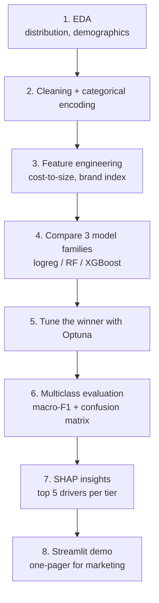

# Project — Beverage Price Range Prediction

## Domain
A beverage company wants to **price new SKUs** before launch. They have a survey dataset where consumers indicate willingness-to-pay across price tiers. ML predicts the **price range bucket** (low / mid / high / premium) a new SKU should target — avoiding both under-pricing (lost revenue) and over-pricing (low sell-through).

## ML formulation
- **Type**: multi-class classification (4 price buckets)
- **Features**: product attributes (size, flavor, sugar level), consumer demographics, region, brand strength, ingredient cost, competitor benchmarks
- **Metric**: macro-F1 (each price bucket equally weighted)

---

## In one sentence
You build a model that, given a beverage's attributes (flavor, size, sugar level, brand strength), predicts which **price bucket** (low / mid / high / premium) it should launch at — turning consumer-survey data into a pricing recommendation.

## Real-world analogy
A music producer sets the ticket price for a new artist. Too low and the venue's revenue suffers; too high and the venue stays empty. They guess based on past artists' attributes — genre, audience size, hype. You're doing the same for soft drinks: model decides "this new mango energy drink with strong brand strength → premium tier." The reward is fewer pricing mistakes than the marketing team's gut feel.

## The intuition (plain English)
1. **Multi-class classification** with 4 buckets — different from binary fraud/default. Each bucket has roughly similar weight, so you'll watch **macro-F1** (each class counted equally).
2. **Survey data is small** — a few thousand rows max. Don't reach for deep neural networks; classical models (RF, XGBoost) are perfect.
3. **Heavy categorical features** (flavor, region, packaging) — encode carefully; consider CatBoost.
4. **Off-diagonal patterns matter**. Confusing "mid" with "high" is forgivable; confusing "low" with "premium" is a costly mistake. Read the confusion matrix, not just metrics.
5. **Insights are the deliverable** — surface "top 5 attributes that move price" to the marketing team.

## Mini worked example — predicting price bucket for a new SKU

```
new SKU:  flavor=mango, size_ml=500, sugar=15g, brand_strength=7/10, region=south
model:    XGBoost classifier (4-class)
output:   class probabilities = [low: 0.05, mid: 0.62, high: 0.28, premium: 0.05]
recommendation:  launch at mid-tier; consider stretching to high in a premium pack
```

Confusion matrix on test data:
```
                  predicted
actual         low  mid  high  premium
low             45   12    1     0          ← rarely confused with premium ✓
mid             10   58   18     2
high             2   20   55    11
premium          0    3   12    44          ← rarely confused with low ✓
```

The model rarely mixes up extreme tiers — that's the *off-diagonal* pattern that matters for the business.

## At-a-glance — full project flow



## Why this matters
- **Multi-class extension** of the binary projects — same recipe, different metric and confusion-matrix reading.
- **Low-data scenario** — exercises the discipline of *not* reaching for fancy models when classical ones suffice.
- **Insights-driven**: hiring managers care that you can translate "feature_importance_" into a marketing one-pager.
- **Portfolio variety**: pairs nicely with healthcare-premium (regression) and credit-risk (binary classification) for a well-rounded ML portfolio.

---

## Why this project is unusual

It's **survey-driven**, so:
- Data is small relative to "industry" projects
- Heavy in categorical features
- Class imbalance is moderate but not extreme
- Insights matter as much as accuracy

---

## Walkthrough

### 1. EDA
```python
import pandas as pd, seaborn as sns
df = pd.read_csv("beverage_survey.csv")

print(df["price_range"].value_counts(normalize=True))
sns.countplot(x="price_range", data=df)

# explore feature distributions per bucket
for col in df.select_dtypes(include="object"):
    pd.crosstab(df[col], df["price_range"], normalize="index").plot(kind="bar", stacked=True)
```

Look for:
- Which features differ most across price buckets
- Demographic effects (do younger consumers prefer the budget tier?)
- Brand strength's role

### 2. Cleaning + feature engineering
- One-hot encode categorical features (with `min_frequency` if cardinality is high)
- Scale numeric features
- Engineer features:
  - `cost_to_size_ratio` (ingredient cost / pack size)
  - `brand_index` (brand recognition score from another survey)
  - `competitor_gap` (price difference from nearest competitor)
- Encode the target as 0/1/2/3 (ordinal — preserve order)

### 3. Modeling — try several
```python
from sklearn.linear_model import LogisticRegression
from sklearn.ensemble import RandomForestClassifier
from xgboost import XGBClassifier
from sklearn.model_selection import cross_val_score

models = {
    "logreg":  LogisticRegression(max_iter=1000, multi_class="multinomial"),
    "rf":      RandomForestClassifier(n_estimators=300, n_jobs=-1, class_weight="balanced"),
    "xgboost": XGBClassifier(n_estimators=300, learning_rate=0.05, max_depth=5, n_jobs=-1),
}

for name, m in models.items():
    score = cross_val_score(m, X, y, cv=5, scoring="f1_macro").mean()
    print(f"{name}: macro-F1 = {score:.3f}")
```

For multi-class with ordinal target, you can also try **ordinal regression** approaches (e.g., `mord` package) — but in practice multi-class with the right metric works fine.

### 4. Tuning + final model
Use Optuna for the winner; report on held-out test set.

### 5. Multiclass evaluation
```python
from sklearn.metrics import classification_report, confusion_matrix
import seaborn as sns

y_pred = model.predict(X_test)
print(classification_report(y_test, y_pred, target_names=["low", "mid", "high", "premium"]))

cm = confusion_matrix(y_test, y_pred)
sns.heatmap(cm, annot=True, fmt="d", xticklabels=labels, yticklabels=labels)
```

Pay attention to **off-diagonal patterns** — is the model confusing "mid" and "high" but never "low" and "premium"? That's actually fine business-wise (close mistakes hurt less than swapping ends).

### 6. Feature importance + SHAP
Same pattern as credit risk. Surface the **top 5 drivers of price range** to the marketing team.

### 7. Deliverable for stakeholders
A 1-pager showing:
- Top 5 product attributes that drive each price range
- Confusion matrix → "we rarely confuse 'low' with 'premium'; we sometimes confuse adjacent tiers"
- Recommendation for new SKU X based on its attributes → "model predicts mid (P=0.62), with a 28% chance of high"
- ROI estimate vs current "expert intuition" pricing

### 8. Streamlit demo
```python
import streamlit as st
import pandas as pd, joblib

model = joblib.load("model.joblib")

st.title("Beverage Price Range Predictor")

# inputs
flavor = st.selectbox("Flavor", ["cola", "lemon", "mango", "energy"])
size_ml = st.slider("Size (ml)", 200, 1000, 500)
sugar = st.slider("Sugar (g)", 0, 50, 10)
brand_strength = st.slider("Brand strength (1-10)", 1, 10, 5)

if st.button("Predict"):
    X_new = pd.DataFrame([{
        "flavor": flavor, "size_ml": size_ml,
        "sugar": sugar, "brand_strength": brand_strength,
    }])
    probs = model.predict_proba(X_new)[0]
    for label, p in zip(["low", "mid", "high", "premium"], probs):
        st.write(f"{label}: {p:.0%}")
```

---

## Repo deliverables
```
beverage-price/
├── data/
├── notebooks/
│   ├── 01-eda.ipynb
│   ├── 02-feature-eng.ipynb
│   ├── 03-modeling.ipynb
├── src/
│   ├── train.py
│   └── app.py
├── reports/
│   └── insights-for-marketing.md
├── model.joblib
└── README.md
```

---

## Self-check

- [ ] Did I report macro-F1, not just accuracy?
- [ ] Did I analyze the confusion matrix's off-diagonal pattern?
- [ ] Did I surface SHAP-driven insights for marketing?
- [ ] Is my Streamlit demo intuitive enough for a non-DS to use?
- [ ] Did I quantify business impact ("would have priced 80% of SKUs in the right bucket vs the team's 60%")?
- [ ] Did I post a build-in-public update?

---

## Glossary

| Term | Plain meaning |
|------|---------------|
| **SKU (Stock Keeping Unit)** | A specific product variant — flavor + size + packaging combination |
| **Price bucket / tier** | Discrete pricing band: low / mid / high / premium |
| **Multi-class classification** | Predicting one of three or more mutually exclusive classes |
| **Ordinal target** | Classes have a natural order (low < mid < high < premium) |
| **Ordinal regression** | Models that respect class order — `mord` package for Python |
| **Macro-F1** | Average F1 across classes, each class counted equally — fair when classes have different sizes |
| **Weighted F1** | F1 weighted by class frequency — large classes dominate |
| **Confusion matrix (multiclass)** | Square matrix; row = actual class, col = predicted class |
| **Off-diagonal pattern** | Where the model confuses adjacent vs. distant classes — adjacent confusion costs less |
| **Survey data** | Small dataset from consumer questionnaires |
| **Brand strength** | Numeric measure of brand recognition (typically from a separate survey) |
| **Cost-to-size ratio** | Ingredient cost / pack size — engineered feature |
| **Competitor gap** | Price difference from nearest competitor — engineered feature |
| **Categorical encoding** | One-hot for low cardinality, target encoding for high cardinality |
| **`min_frequency`** | OneHotEncoder option that lumps rare categories together |
| **CatBoost** | Gradient-boosting library that handles categorical features natively |
| **`multi_class="multinomial"`** | sklearn LogisticRegression's softmax setting for multi-class |
| **`class_weight="balanced"`** | Balances loss across uneven class sizes |
| **SHAP** | Per-prediction feature attribution — drives the marketing one-pager |
| **`predict_proba`** | Returns probability for each class — used for confidence reporting |
| **Macro vs micro vs weighted average** | Different ways to summarize per-class metrics into one number |
| **Streamlit demo** | Interactive web app showing predicted bucket + probabilities |
| **Insights for marketing** | Business-flavored writeup of which features drive pricing |
| **Build-in-public** | Sharing project progress online while building — boosts portfolio reach |

## Further reading
- Multi-class logistic regression: [../02-classification/01-logistic-regression.md](../02-classification/01-logistic-regression.md)
- Classification metrics + macro-F1: [../02-classification/02-classification-metrics.md](../02-classification/02-classification-metrics.md)
- Random Forest: [../03-ensemble/01-bagging-random-forest.md](../03-ensemble/01-bagging-random-forest.md)
- XGBoost / CatBoost: [../03-ensemble/02-boosting-adaboost-gbm-xgb.md](../03-ensemble/02-boosting-adaboost-gbm-xgb.md)
- Companion regression project: [01-healthcare-premium-regression.md](01-healthcare-premium-regression.md)
- Companion classification project: [02-credit-risk-classification.md](02-credit-risk-classification.md)
