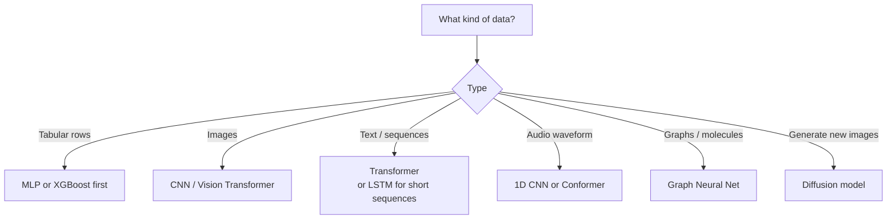

# Foundations 1 — Intro to Deep Learning, Applications, Hardware

## Lectures covered
- Introduction to Deep Learning
- Neural Networks · Deep Learning vs Statistical ML
- Neural Network Architectures · Applications of Deep Learning
- PyTorch vs TensorFlow · GPU, TPU

---

## In one sentence
**Deep learning** is teaching a computer to recognize patterns by stacking many simple "math neurons" into layers and letting them adjust themselves on lots of examples.

## Real-world analogy
A baby doesn't get a textbook on what a "cat" looks like — they see hundreds of cats and slowly build an internal sense of *cat-ness*. Deep learning is the same: feed a network thousands of cat photos, and its layers self-organize from "edges" → "fur patches" → "ears" → "cat".

## The intuition (plain English)
- A **neural network** is a stack of layers; each layer transforms numbers into more useful numbers.
- The bottom layers learn **tiny features** (edges, color blobs); the top layers combine them into **big concepts** (a face, a sentence's meaning).
- You don't write the rules — the network finds them by adjusting its internal "knobs" (weights) to reduce its error on examples you label for it.
- "Deep" just means **many layers** stacked. More layers → more abstract patterns possible, but also more data and compute needed.

## Mini worked example — image vs tabular
Imagine two tasks:

```
Task A: predict house price from 5 columns (size, beds, location, age, garage)
        → 5 neat numbers in, 1 number out → classical ML (XGBoost) wins

Task B: classify "is this a cat?" from a 224×224 RGB photo
        → 150,528 raw pixel numbers in → no human can write the rules
        → deep learning (CNN) wins
```

Same goal — prediction — but *non-tabular, perceptual* data is where DL pulls ahead.

## At-a-glance — picking an architecture



## Why this matters
- DL powers most modern AI you use: ChatGPT, Google Photos, voice assistants, self-driving features.
- Knowing **when** to reach for DL (vs simpler ML) saves weeks of wasted effort.
- Hardware choice (CPU vs GPU vs free Colab) determines whether your project finishes today or next week.

---

## 1. What deep learning is

Deep learning = neural networks with **multiple layers** that learn **hierarchical representations** of data.

- Layer 1: edges (in vision)
- Layer 2: corners, textures
- Layer 3: object parts
- Layer N: full objects, abstractions

The trick is that you don't *design* these features — the network learns them through gradient descent on lots of labeled data.

---

## 2. DL vs classical ML — when to choose each

| | Classical ML | Deep Learning |
|---|---|---|
| Data type | tabular, structured | images, audio, text, graphs |
| Sample efficiency | works with small data | needs lots of data |
| Feature engineering | manual | learned from data |
| Compute | CPU is fine | GPU strongly preferred |
| Interpretability | medium-high | low |
| State-of-the-art on | small/medium tabular | most non-tabular tasks |

**Default rule**: tabular → start with XGBoost/LightGBM; non-tabular → start with deep learning.

---

## 3. The major NN architectures

| Architecture | Best for |
|---|---|
| **MLP** (feed-forward) | tabular, simple regression/classification |
| **CNN** (convolutional) | images, audio spectrograms, 1D signals |
| **RNN / LSTM / GRU** | sequences (older approach) |
| **Transformer** | sequences (modern), vision (ViT), multimodal |
| **Autoencoder** | compression, denoising, anomaly detection |
| **GAN** | image generation (older), now mostly diffusion models |
| **Diffusion** | high-quality image / audio / video generation |
| **Graph Neural Network (GNN)** | molecules, social networks, knowledge graphs |

---

## 4. Where DL has won (the highlight reel)

- Image classification → ResNet, EfficientNet, ViT
- Object detection → YOLO, DETR
- Image segmentation → U-Net, Mask R-CNN, SAM
- Image generation → Stable Diffusion, DALL-E, Imagen
- Speech recognition → Whisper
- Speech synthesis → Tacotron, VALL-E
- Translation → Transformer (the original paper was for translation)
- Question answering → BERT, T5
- Chat / instruction following → GPT-4, Claude, Gemini
- Code → Codex, Code Llama, Claude Code
- Protein folding → AlphaFold
- Game playing → AlphaGo, AlphaZero, MuZero
- Robotics (grasping, control) → in progress

If a task involves perception, generation, or understanding of natural data → DL is the answer.

---

## 5. PyTorch vs TensorFlow

### PyTorch (Meta)
- Modern dominant choice in research
- Pythonic, eager-by-default, debuggable
- HuggingFace, fast.ai, Lightning are PyTorch-based
- This bootcamp uses PyTorch

### TensorFlow / Keras (Google)
- More mature in production / mobile / browser
- TFX, Vertex AI, on-device deployments
- Was the dominant educational framework pre-2020

### JAX (Google)
- Functional, fast on TPUs
- Used by DeepMind, Anthropic
- Less beginner-friendly

For 2025 learning: **PyTorch first, optionally TensorFlow later for breadth**.

---

## 6. GPU, TPU — why specialized hardware

Deep learning is matrix multiplication at scale. CPUs are general-purpose; GPUs/TPUs are massively parallel for that specific workload.

| | CPU | GPU | TPU |
|---|---|---|---|
| Cores | 4–64 | thousands | thousands |
| Best for | sequential | parallel float math | tensor ops |
| Memory | many GB | 8–80 GB | 16–32 GB |
| Cost | cheap | medium | high |
| Where | everywhere | gaming/cloud | Google Cloud |

### Free GPU options for the bootcamp
- **Google Colab** — free Tesla T4 / sometimes A100; daily limits
- **Kaggle** — 30 hours/week of P100/T4
- **Paperspace Gradient** — free tier
- **HuggingFace Spaces** — free CPU; small GPU on paid

For projects in this module: Colab is enough for everything except the most ambitious training.

### When you'd buy / rent a GPU
- Training takes >1 hour repeatedly
- Need privacy (data can't leave premises)
- Need a specific GPU not in free tiers (A100, H100)

For inference: even a 4070 in your laptop runs many models in real time.

---

## 7. Sample sizes for deep learning

Rough rule:
- Image classification (transfer learning): hundreds of images per class is enough
- Image classification (from scratch): tens of thousands
- Text fine-tuning (BERT): hundreds to thousands of labeled examples
- Training a Transformer from scratch: millions+
- Training a foundation model: trillions of tokens

Most bootcamp projects are **transfer-learning tasks** that fit on free Colab.

---

## 8. Common pitfalls

| Mistake | Effect | Fix |
|---|---|---|
| Reaching for DL when XGBoost would work | over-engineered, slow | start simple |
| Training from scratch when pre-trained exists | wasted compute, worse results | always check HuggingFace / torchvision first |
| No GPU for image training | hours per epoch | move to Colab / Kaggle |
| Ignoring batch size | OOM errors / slow | tune batch size for your GPU memory |
| Mixing PyTorch / TensorFlow code | doesn't work | pick one stack per project |

## Self-check

- [ ] When DL vs classical ML?
- [ ] Name 3 architectures and one task each.
- [ ] What's the role of GPU vs CPU in DL?
- [ ] What's PyTorch's main advantage over TensorFlow for learning?
- [ ] How much data do I need to fine-tune BERT vs train it from scratch?
- [ ] What's transfer learning and why does it work?
- [ ] Pick a task: car damage detection. Which architecture would you start with and why?

---

## Glossary

| Term | Plain meaning |
|------|---------------|
| **Deep learning (DL)** | Machine learning using neural networks with many layers |
| **Neural network (NN)** | A stack of math layers loosely inspired by neurons; learns by adjusting weights |
| **Layer** | One transformation step inside a network (e.g., a matrix multiply + activation) |
| **Hierarchical features** | Lower layers learn simple patterns (edges); higher layers combine them into objects |
| **Tabular data** | Data that fits neatly in rows and columns (like a spreadsheet) |
| **Non-tabular data** | Images, audio, text, video — anything not naturally a table |
| **Feature engineering** | Hand-crafting input columns. DL mostly skips this — it learns features itself. |
| **Gradient descent** | The algorithm that nudges weights to reduce error |
| **MLP** | Multi-Layer Perceptron — a basic feed-forward neural net |
| **CNN** | Convolutional Neural Network — best for images |
| **RNN / LSTM / GRU** | Older architectures for sequences (text, time series) |
| **Transformer** | Modern architecture for sequences and beyond; powers GPT, BERT, ChatGPT |
| **Autoencoder** | Network that compresses data then reconstructs it; used for denoising or anomaly detection |
| **GAN** | Generative Adversarial Network — older image-generation method |
| **Diffusion model** | Modern image/audio/video generator (Stable Diffusion, DALL-E) |
| **GNN** | Graph Neural Network — for data shaped like a graph (molecules, social networks) |
| **PyTorch** | Python deep-learning framework by Meta; the bootcamp's choice |
| **TensorFlow / Keras** | Google's deep-learning framework; common in production |
| **JAX** | Functional DL framework, fast on TPUs |
| **GPU** | Graphics Processing Unit — massively parallel chip ideal for neural-net math |
| **TPU** | Tensor Processing Unit — Google's custom chip for tensor operations |
| **Colab** | Google's free cloud notebook with a free GPU — used throughout the bootcamp |
| **Transfer learning** | Reusing a pre-trained model on your smaller task instead of training from scratch |
| **Foundation model** | A huge pre-trained model (GPT, BERT) you adapt to many downstream tasks |
| **Inference** | Running a trained model to make predictions (no learning happening) |
| **OOM** | "Out of memory" — your batch is too big for the GPU |

## Further reading
- Next: [02-neuron-perceptron-mlp.md](02-neuron-perceptron-mlp.md) — what a single neuron does
- Visual reference: [../architectures-and-math.md](../architectures-and-math.md) — diagrams + math for FFN and RNN
- Where DL fits in the broader course: [../../06-machine-learning/README.md](../../06-machine-learning/README.md)
