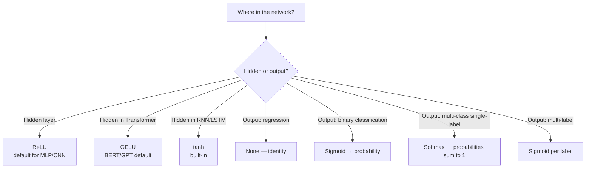

# Foundations 3 — Activation Functions

## Lectures covered
- Activation Function · Sigmoid · ReLU · Tanh · SoftMax

---

## In one sentence
An **activation function** is a small non-linear curve applied at the end of every neuron — without it, no matter how many layers you stack, the whole network is just a fancy straight line.

## Real-world analogy
Imagine you're stacking yes/no decisions: "Is it raining?" → "Should I bring an umbrella?". Each step needs a *decision* (yes or no), not a fuzzy partial number passed through. Activations are that decision moment — they bend the signal so the next layer sees something useful, not just a bigger version of the same line.

## The intuition (plain English)
- Without activations, three layers of math = one layer of math (linear combinations of linear combinations are still linear).
- An activation introduces a **bend** that lets the network model curves, edges, and complex regions.
- Different activations have different **shapes** and trade-offs (saturation, range, gradient flow).
- Modern default: **ReLU** for hidden layers, **softmax** for multi-class output, **sigmoid** for binary output.

## Mini worked example — applying ReLU and softmax

A 2-class classifier's last hidden layer outputs a vector of 4 numbers, then a final 2-class layer:

```
Hidden pre-activation:       z = [1.2, -0.5,  3.0, -2.1]
After ReLU = max(0, z):      a = [1.2,  0.0,  3.0,  0.0]   ← negatives wiped out

Output logits (2 classes):   logits = [2.0, 0.4]
After softmax:               eᶻ = [e², e^0.4] = [7.39, 1.49]
                             sum = 8.88
                             probs = [7.39/8.88, 1.49/8.88]
                                   = [0.83, 0.17]   ← sums to 1, ready to compare with a label
```

ReLU gave the hidden layer sparse, gradient-friendly outputs. Softmax turned the final scores into probabilities.

## At-a-glance — which activation, when?



## Why this matters
- Pick the wrong output activation and your loss function silently does the wrong thing.
- Pick the wrong hidden activation in a deep net and your gradients vanish — the network just won't learn.
- Knowing why ReLU beat sigmoid is the entire reason "very deep" networks became trainable in 2012.

---

## 1. Why activations matter

Without non-linear activations, stacking N linear layers is equivalent to a single linear layer:
$$W_3 (W_2 (W_1 x)) = (W_3 W_2 W_1) x$$

The whole network collapses to a single matrix multiplication. Activations are what make depth *useful*.

---

## 2. The classic activations

### Sigmoid
$$\sigma(z) = \frac{1}{1 + e^{-z}}$$

```
        1 ┤   ───
          │  /
      0.5 ┤ /
          │/
        0 ┤───
```

- Output ∈ (0, 1)
- **Used for**: binary classification output
- **Problems**: vanishing gradients in deep nets, not zero-centered

### Tanh
$$\tanh(z) = \frac{e^z - e^{-z}}{e^z + e^{-z}}$$

```
        1 ┤   ───
          │  /
        0 ┤─/─
          │/
       -1 ┤───
```

- Output ∈ (−1, 1)
- Zero-centered → better than sigmoid for hidden layers
- Still has vanishing gradients in deep nets
- Used in older RNNs

### ReLU (Rectified Linear Unit)
$$\text{ReLU}(z) = \max(0, z)$$

```
          ┤      /
          │     /
          │    /
        0 ┤───/
          │
```

- Simple, fast, no exponentials
- Doesn't saturate for positive z → no vanishing gradient
- Default for hidden layers in modern DL
- Problem: "dying ReLU" — neurons stuck at 0

### Leaky ReLU
$$\text{LeakyReLU}(z) = \max(0.01 z, z)$$

Fixes dying ReLU by allowing a tiny slope on the negative side.

### ELU, GELU, SiLU/Swish
- **ELU**: exponential on negative side; smooth
- **GELU**: Gaussian Error Linear Unit; used in BERT, GPT, modern Transformers
- **SiLU / Swish** (z · σ(z)): used in EfficientNet, modern LLMs

For this bootcamp: ReLU is the default. GELU is what you'll see in HuggingFace Transformers.

### SoftMax
$$\text{softmax}(z)_i = \frac{e^{z_i}}{\sum_j e^{z_j}}$$

- Converts a vector of logits into probabilities (sum to 1)
- **Used for**: multi-class classification output

---

## 3. Output layer activation cheat sheet

| Task | Output activation | Loss |
|---|---|---|
| Regression | none (identity) | MSE / MAE |
| Binary classification | Sigmoid | BCE (binary cross-entropy) |
| Multi-class classification (single label) | Softmax | Cross-entropy |
| Multi-label classification | Sigmoid (one per label) | BCE per label |

---

## 4. Hidden layer activation cheat sheet

| Use case | Default |
|---|---|
| Tabular MLP | ReLU |
| CNN | ReLU |
| RNN / LSTM | tanh (built-in) |
| Modern Transformers (BERT, GPT) | GELU |
| New efficient nets | SiLU / GELU |

You rarely need to deviate from ReLU unless you're chasing a paper's exact architecture.

---

## 5. Why ReLU works (intuition)

- **Sparsity**: about half of activations are 0 → sparse representation
- **No saturation for positive z** → gradients flow
- **Computational simplicity**: no exponentials, no division

But:
- "Dying ReLU": If most outputs are negative, neurons get stuck at 0 with no gradient. Lower the learning rate or use Leaky ReLU.

---

## 6. Vanishing gradient problem

When activation derivatives are small (sigmoid, tanh in saturation), gradients shrink as they propagate back through layers. By layer 10, the gradient is near 0 → no learning in early layers.

Sigmoid's derivative max is 0.25 → after 10 layers, gradient is multiplied by 0.25^10 ≈ 10^-7.

ReLU's derivative is 1 (for positive z) → no shrinkage.

This is why ReLU + good initialization (He / Kaiming) was a breakthrough for training deep nets.

---

## 7. PyTorch usage

```python
import torch.nn as nn

# as a module (in nn.Sequential)
nn.ReLU()
nn.Sigmoid()
nn.Tanh()
nn.Softmax(dim=-1)
nn.GELU()
nn.LeakyReLU(0.01)

# as functions
import torch.nn.functional as F
F.relu(x)
F.softmax(x, dim=-1)
F.gelu(x)
```

> For multi-class, use `nn.CrossEntropyLoss` — which **internally combines** softmax + cross-entropy. Don't apply softmax twice.

---

## 8. Common pitfalls

| Mistake | Effect | Fix |
|---|---|---|
| Forgot activation between hidden layers | net is just linear | always interleave non-linearity |
| Sigmoid hidden layers in deep nets | vanishing gradient | use ReLU / GELU |
| Manual softmax + `CrossEntropyLoss` | double softmax | let `CrossEntropyLoss` handle it |
| Sigmoid output for multi-class | doesn't sum to 1 | use softmax |
| Using ReLU + high learning rate | dying neurons | reduce LR or use Leaky ReLU |

## Self-check

- [ ] Why do networks need non-linear activations?
- [ ] Sigmoid vs Tanh — both bounded; what's the meaningful difference?
- [ ] Why does ReLU mostly fix vanishing gradients?
- [ ] What's "dying ReLU" and how do you fix it?
- [ ] When use Softmax vs Sigmoid as output activation?
- [ ] Why doesn't `nn.CrossEntropyLoss` need a softmax in the model?
- [ ] What activation goes on a regression output layer?
- [ ] Where will you encounter GELU?

---

## Glossary

| Term | Plain meaning |
|------|---------------|
| **Activation function** | The non-linear curve applied at the end of a neuron |
| **Linear** | A relationship that's a straight line (or flat plane in higher dimensions) |
| **Non-linear** | Anything that bends — what activations introduce |
| **Logit** | The raw pre-activation score before softmax / sigmoid is applied |
| **Sigmoid** | S-shaped curve squashing any number into (0, 1); used for binary output |
| **Tanh** | Like sigmoid but ranges (−1, 1) and is zero-centered |
| **ReLU (Rectified Linear Unit)** | `max(0, z)` — passes positives, zeroes out negatives |
| **Leaky ReLU** | ReLU with a tiny slope on the negative side, fixes "dying" neurons |
| **ELU** | Smooth alternative to ReLU with exponential negative side |
| **GELU** | Gaussian Error Linear Unit — smooth ReLU-like curve, standard in BERT and GPT |
| **SiLU / Swish** | `z · sigmoid(z)` — used in EfficientNet and modern LLMs |
| **Softmax** | Turns a vector of logits into probabilities that sum to 1 |
| **Saturate** | When an activation's output flattens at the extremes, killing the gradient |
| **Vanishing gradient** | Tiny gradients propagating back through deep nets, halting learning in early layers |
| **Dying ReLU** | A neuron stuck outputting 0 forever because it always sees negative inputs |
| **Sparsity** | Many activations are 0 — efficient and a side benefit of ReLU |
| **He / Kaiming initialization** | Weight init scaled for ReLU to keep activations stable |
| **Cross-entropy loss** | Standard loss for classification — pairs with softmax (multi-class) or sigmoid (binary) |
| **BCE (Binary Cross-Entropy)** | Cross-entropy specialized for two-class problems |
| **MSE / MAE** | Mean Squared / Absolute Error — losses for regression (use identity output) |
| **Multi-label vs multi-class** | Multi-class = exactly one label; multi-label = many labels can be on at once |

## Further reading
- Next: [04-pytorch-tensors-autograd.md](04-pytorch-tensors-autograd.md) — the framework you'll write activations in
- Used inside: [../architectures-and-math.md](../architectures-and-math.md) — see activations live in FFN and RNN math
- Theory background: [../../05-math-statistics/01-foundations/04-distributions.md](../../05-math-statistics/01-foundations/04-distributions.md) — sigmoid is also the logistic CDF
