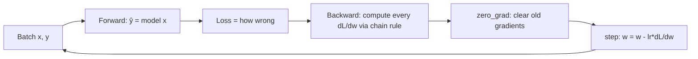

# Training 1 — Backpropagation & Gradient Descent

## Lectures covered
- Training through Backpropagation
- Gradient Descent · Theoretical Foundation, PyTorch Implementation
- Batch GD vs Mini Batch GD vs SGD

---

## In one sentence
**Gradient descent** is how a network *learns*: it nudges every weight a tiny step in the direction that makes its predictions less wrong, and **backpropagation** is the chain-rule trick that figures out which direction "less wrong" is for each weight.

## Real-world analogy
You're blindfolded on a hill and want the bottom. You feel which way slopes down most under your feet, take a small step, and feel again. That's gradient descent. Backprop is the messenger system that tells every "knob" in the network *"this is the slope you contribute to the overall hill — adjust accordingly."*

## The intuition (plain English)
- Every weight in the network has a tiny effect on the final loss; the **gradient** measures that effect.
- **Backpropagation** uses the chain rule to compute every gradient in one efficient backward sweep, instead of nudging weights one at a time and re-running the forward pass.
- **Gradient descent** then takes the gradients and updates the weights: `new = old − learning_rate × gradient`.
- You repeat this for every batch in your dataset, for many epochs, until the loss flattens.

## Mini worked example — one gradient-descent step

A weight `w = 0.50` contributes to a loss `L = 8.0`. Backprop tells you `∂L/∂w = +4.0` (positive: increasing `w` worsens the loss).

```
Learning rate η = 0.1

Update rule:  w_new = w_old − η · ∂L/∂w
              w_new = 0.50  − 0.1 · 4.0
              w_new = 0.50  − 0.40
              w_new = 0.10

Next forward pass uses w = 0.10, loss drops from 8.0 → 5.2 (say).
Repeat for every weight, every batch.
```

That tiny rule, applied a million times across millions of weights, is *all* a neural net does to learn.

## At-a-glance — one training step



```
batch ─► forward ─► loss ─► backward (autograd) ─► step ─► next batch
                              ▲
                  chain rule walks RIGHT to LEFT
                  through every layer's local derivative
```

## Why this matters
- **Every** modern AI model — GPT, Stable Diffusion, AlphaFold — was trained with gradient descent + backprop. No exceptions.
- The choice of **batch size** and **learning rate** decides whether your training converges, diverges, or stalls.
- Reading a loss curve correctly distinguishes "almost done" from "wasting GPU hours."

---

## 1. The big picture

Training a neural net is **iterative optimization**:
1. Initialize weights randomly
2. Forward pass: predict
3. Compute loss
4. Backward pass: compute gradient of loss w.r.t. each weight
5. Update weights using the gradient
6. Repeat for many batches and epochs

**Backpropagation** is step 4. **Gradient descent** is step 5.

---

## 2. Backpropagation in 60 seconds

For a network $y = f_3(f_2(f_1(x)))$, the chain rule gives:
$$\frac{\partial L}{\partial w_1} = \frac{\partial L}{\partial f_3} \cdot \frac{\partial f_3}{\partial f_2} \cdot \frac{\partial f_2}{\partial f_1} \cdot \frac{\partial f_1}{\partial w_1}$$

Backprop:
- Forward pass: cache the intermediate activations $f_1, f_2, f_3$
- Backward pass: walk backward, multiplying local derivatives

PyTorch's `autograd` does this automatically when you call `loss.backward()`.

---

## 3. Manual derivation — 2-layer network

Network: $h = \sigma(W_1 x + b_1)$, $y = W_2 h + b_2$, loss $L = (y - t)^2$.

Gradients (left as exercise — derive once, then trust autograd):
- $\frac{\partial L}{\partial W_2} = 2(y - t) h^T$
- $\frac{\partial L}{\partial W_1} = (W_2^T (2(y - t))) \odot \sigma'(W_1 x + b_1) \cdot x^T$

Doing this by hand once builds intuition. Do not do it twice.

---

## 4. Gradient Descent — the update rule

$$\theta \leftarrow \theta - \eta \cdot \nabla_\theta L$$

- $\theta$: parameters
- $\eta$: learning rate
- $\nabla_\theta L$: gradient (from backprop)

---

## 5. The three flavors

### Batch Gradient Descent
Compute gradient on **the whole training set** before each update.
- Pros: smooth convergence, accurate gradients
- Cons: slow; doesn't fit in GPU memory for large datasets

### Stochastic Gradient Descent (SGD)
Compute gradient on **one sample** at a time.
- Pros: fast updates, can escape local minima
- Cons: noisy path, doesn't exploit GPU parallelism

### Mini-batch Gradient Descent (the modern default)
Compute gradient on **a small batch** (32, 64, 128).
- Pros: best of both worlds; uses GPU efficiently
- Cons: have to tune batch size

For DL: **always use mini-batch** (the term "SGD" colloquially refers to mini-batch SGD).

---

## 6. PyTorch implementation

```python
import torch
import torch.nn as nn

model = MyMLP().to(device)
loss_fn = nn.CrossEntropyLoss()
optimizer = torch.optim.SGD(model.parameters(), lr=0.01, momentum=0.9)

for epoch in range(num_epochs):
    model.train()
    epoch_loss = 0
    for x, y in train_loader:                       # mini-batches
        x, y = x.to(device), y.to(device)
        optimizer.zero_grad()                       # 1. reset grads
        logits = model(x)                           # 2. forward
        loss = loss_fn(logits, y)                   # 3. compute loss
        loss.backward()                             # 4. backprop (autograd)
        optimizer.step()                            # 5. update params
        epoch_loss += loss.item()
    print(f"epoch {epoch}: loss = {epoch_loss / len(train_loader):.4f}")
```

This loop is universal — every PyTorch training script has this skeleton.

---

## 7. Batch size — what to pick

| Batch size | Effect |
|---|---|
| 1 (true SGD) | very noisy, rarely used |
| 32–64 | classic; works well |
| 128–512 | larger; smoother gradients, needs more memory |
| 1024+ | for big GPUs; sometimes loss-landscape issues |

Larger batch → smoother gradients → may need higher LR to compensate.

> Rough rule: when you double batch size, you can ≈ double the learning rate.

---

## 8. Epochs — when to stop

An **epoch** is one full pass through the training data.

- Too few: underfit
- Too many: overfit (memorizes training data)
- Right amount: validation loss starts going up — stop here

Use **early stopping** on validation loss:
```python
best_val = float("inf")
patience = 5
counter = 0

for epoch in range(100):
    train_one_epoch(...)
    val_loss = evaluate(...)
    if val_loss < best_val:
        best_val = val_loss
        counter = 0
        torch.save(model.state_dict(), "best.pt")
    else:
        counter += 1
        if counter >= patience:
            print("early stop")
            break
```

---

## 9. Loss curve diagnostics

Plot training and validation loss over epochs:
```
loss
│  train ────────
│        ────────────
│  val            ────  <- start overfitting here
│       ───────/
└─────────────────────► epoch
```

What to look for:
- Both decreasing → still learning
- Both flat → done (or stuck)
- Train decreasing, val going up → **overfitting** (regularize, more data, early stop)
- Both bouncing wildly → LR too high, or batch size too small

---

## 10. Common pitfalls

| Mistake | Effect | Fix |
|---|---|---|
| Forgot `optimizer.zero_grad()` | gradients accumulate across steps | always zero |
| LR too high | loss diverges to NaN | reduce LR by 10x |
| LR too low | training painfully slow | raise LR; use scheduler |
| Tensor not on GPU | runtime error | `.to(device)` |
| Train without `model.train()` / `model.eval()` | dropout / batchnorm wrong | always set |
| Comparing batch loss to epoch loss | apples to oranges | average per epoch |

## Self-check

- [ ] Walk through one step of backprop on a 2-layer net.
- [ ] State the gradient descent update rule.
- [ ] Difference between batch / SGD / mini-batch?
- [ ] Why does `optimizer.zero_grad()` exist?
- [ ] What's an epoch?
- [ ] What's early stopping and how do you implement it?
- [ ] What does the loss curve look like for a healthy training run?
- [ ] How does batch size interact with learning rate?

---

## Glossary

| Term | Plain meaning |
|------|---------------|
| **Gradient** | A vector of partial derivatives — points uphill on the loss surface |
| **Gradient descent (GD)** | Algorithm that walks downhill on the loss by stepping opposite to the gradient |
| **Loss / cost function** | Number measuring how wrong the model's predictions are |
| **Cross-entropy loss** | Default classification loss; pairs with softmax output |
| **MSE (Mean Squared Error)** | Default regression loss |
| **Learning rate (η, lr)** | Step size in the update rule; biggest hyperparameter |
| **Parameter / weight** | A learned number inside the network |
| **Backpropagation (backprop)** | Efficient chain-rule algorithm to compute every gradient in one backward pass |
| **Chain rule** | Calculus rule for differentiating nested functions: `(f(g(x)))' = f'(g) · g'(x)` |
| **Forward pass** | Running input through the model to get predictions |
| **Backward pass** | Walking backward through the computation graph to compute gradients |
| **Update rule** | `θ ← θ − η · ∇θL` |
| **Batch gradient descent** | Use the entire training set per update (slow, smooth) |
| **SGD (Stochastic GD)** | Update on one sample at a time (fast, noisy) |
| **Mini-batch GD** | Update on a small batch (32–512). The modern default. |
| **Batch size** | How many samples per update |
| **Epoch** | One full pass through the training set |
| **Iteration / step** | One weight update = one mini-batch forward + backward + step |
| **Convergence** | Loss has stopped decreasing meaningfully |
| **Diverge** | Loss explodes (often to NaN); usually means LR too high |
| **Overfitting** | Train loss keeps falling but validation loss rises |
| **Underfitting** | Both train and validation loss are high; model not powerful enough |
| **Early stopping** | Stop training when validation loss stops improving |
| **Patience** | How many bad-epochs you tolerate before early-stopping |
| **Validation set** | Held-out data used to monitor generalization during training |
| **`optimizer.zero_grad()`** | Resets stale gradients before each step |
| **`loss.backward()`** | Triggers autograd to compute all gradients |
| **`optimizer.step()`** | Applies the gradient update to parameters |
| **Gradient clipping** | Capping gradient magnitude to avoid explosions (used in RNNs) |
| **Local minimum** | A dip in the loss surface that isn't the global lowest point |
| **Saddle point** | A flat-ish region neither minimum nor maximum; common in high-D loss surfaces |

## Further reading
- Next: [02-mnist-digits.md](02-mnist-digits.md) — apply gradient descent on real digits
- Optimizer upgrades: [03-optimizers-momentum-adam.md](03-optimizers-momentum-adam.md)
- Math reference (BPTT for RNNs): [../architectures-and-math.md](../architectures-and-math.md)
