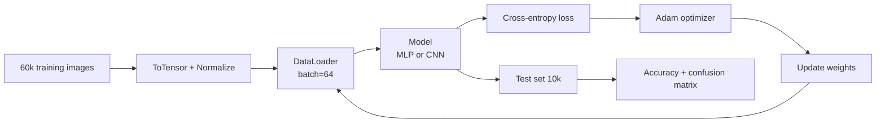

# Training 2 — Handwritten Digits Classification (MNIST)

## Lectures covered
- Handwritten Digits Classification

---

## In one sentence
**MNIST** is the "Hello World" of deep learning — 70,000 tiny 28×28 grayscale digits where you train your first network end-to-end and reach 99% accuracy in a few minutes.

## Real-world analogy
MNIST is to deep learning what *cooking pasta* is to learning to cook: low stakes, fast feedback, and once you can make it well you understand the basics that scale to fancier dishes.

## The intuition (plain English)
- Each image is a 28×28 grid of pixel intensities (0 = black, 1 = white).
- You **flatten** the grid into a 784-number vector and feed it to an MLP, or feed the 2D grid directly to a CNN.
- The model outputs 10 numbers (one per digit class); the largest one is the prediction.
- You train with cross-entropy loss + Adam, and after ~5 epochs the model gets ~98% on test data with an MLP, ~99% with a CNN.

## Mini worked example — what one prediction looks like

You feed in a 28×28 image of the digit "7":

```
input: image of "7"  →  Flatten → 784 numbers in [0, 1]

After model:
   logits  = [-1.0, -2.0, 0.5, 0.1, -0.5, -0.8, -1.5,  4.7,  0.0, -2.0]
                                                       ↑
                                        index 7 is the largest

After softmax:
   probs   = [0.003, 0.001, 0.013, 0.009, 0.005, 0.004, 0.002, 0.943, 0.008, 0.001]
                                                                ↑
                                         model says "7" with 94% confidence

prediction = argmax(probs) = 7        ← matches the true label
```

That same prediction shape — logits → softmax → argmax — is what every classifier in this module produces.

## At-a-glance — the MNIST pipeline



```
   28×28 grayscale image
         │
         ▼
    [Flatten 784]            (MLP path)
         │
         ▼
   [Linear 784→256] ─► ReLU ─► [Linear 256→64] ─► ReLU ─► [Linear 64→10] ─► logits
                                                                              │
                                                                          softmax → digit 0..9
```

## Why this matters
- Every concept in this module — DataLoader, model, loss, optimizer, training loop, evaluation — is on display in one short script.
- Once you can hit 98% on MNIST, swapping in CIFAR-10, Fashion-MNIST, or your own dataset is mostly *changing 5 lines of data-loading code*.
- The MLP-vs-CNN comparison is the cleanest demonstration of why architecture matters for image data.

---

## Why MNIST is the universal first DL project

- Simple: 28×28 grayscale digits, 10 classes
- Small: 60k train + 10k test
- Fast: trains in minutes on CPU, seconds on GPU
- Standard: every framework, every textbook uses it

It's the "Hello World" for neural networks. Master it; the patterns transfer everywhere.

---

## End-to-end MNIST in PyTorch

### 1. Data loading
```python
import torch
from torch.utils.data import DataLoader
from torchvision import datasets, transforms

transform = transforms.Compose([
    transforms.ToTensor(),                        # PIL image → tensor in [0,1]
    transforms.Normalize((0.1307,), (0.3081,)),    # MNIST stats
])

train_ds = datasets.MNIST("data/", train=True, download=True, transform=transform)
test_ds  = datasets.MNIST("data/", train=False, download=True, transform=transform)

train_loader = DataLoader(train_ds, batch_size=64, shuffle=True)
test_loader  = DataLoader(test_ds,  batch_size=256)
```

### 2. The model — first an MLP
```python
import torch.nn as nn

class MLP(nn.Module):
    def __init__(self):
        super().__init__()
        self.net = nn.Sequential(
            nn.Flatten(),                          # 28×28 → 784
            nn.Linear(784, 256), nn.ReLU(),
            nn.Linear(256, 64),  nn.ReLU(),
            nn.Linear(64, 10),                     # 10 classes
        )

    def forward(self, x):
        return self.net(x)
```

### 3. Training loop
```python
import torch.optim as optim

device = "cuda" if torch.cuda.is_available() else "cpu"
model = MLP().to(device)
loss_fn = nn.CrossEntropyLoss()
optimizer = optim.Adam(model.parameters(), lr=1e-3)

def train_epoch():
    model.train()
    for x, y in train_loader:
        x, y = x.to(device), y.to(device)
        optimizer.zero_grad()
        logits = model(x)
        loss = loss_fn(logits, y)
        loss.backward()
        optimizer.step()

@torch.no_grad()
def eval_acc(loader):
    model.eval()
    correct = 0
    total = 0
    for x, y in loader:
        x, y = x.to(device), y.to(device)
        preds = model(x).argmax(dim=1)
        correct += (preds == y).sum().item()
        total += y.size(0)
    return correct / total

for epoch in range(10):
    train_epoch()
    print(f"epoch {epoch}: train_acc={eval_acc(train_loader):.4f}, test_acc={eval_acc(test_loader):.4f}")
```

A vanilla MLP gets ~98% test accuracy on MNIST. Solid baseline.

### 4. Upgrade to a CNN (preview — full CNN treatment in the vision subfolder)
```python
class CNN(nn.Module):
    def __init__(self):
        super().__init__()
        self.conv = nn.Sequential(
            nn.Conv2d(1, 16, 3, padding=1), nn.ReLU(), nn.MaxPool2d(2),
            nn.Conv2d(16, 32, 3, padding=1), nn.ReLU(), nn.MaxPool2d(2),
        )
        self.fc = nn.Sequential(
            nn.Flatten(),
            nn.Linear(32 * 7 * 7, 64), nn.ReLU(),
            nn.Linear(64, 10),
        )

    def forward(self, x):
        return self.fc(self.conv(x))
```

CNN gets ~99.2% — meaningfully better than MLP because it exploits spatial structure.

### 5. Visualizing predictions
```python
import matplotlib.pyplot as plt

x, y = next(iter(test_loader))
x, y = x.to(device), y.to(device)
preds = model(x).argmax(dim=1)

fig, axes = plt.subplots(2, 5, figsize=(10, 4))
for i, ax in enumerate(axes.flatten()):
    ax.imshow(x[i].cpu().squeeze(), cmap="gray")
    ax.set_title(f"pred {preds[i].item()} / true {y[i].item()}")
    ax.axis("off")
plt.tight_layout()
```

### 6. Where the model struggles
Look at confusion matrix and the actual misclassified images:
```python
from sklearn.metrics import confusion_matrix
import seaborn as sns

all_preds, all_targets = [], []
model.eval()
with torch.no_grad():
    for x, y in test_loader:
        x = x.to(device)
        preds = model(x).argmax(dim=1).cpu()
        all_preds.append(preds); all_targets.append(y)
all_preds = torch.cat(all_preds); all_targets = torch.cat(all_targets)

cm = confusion_matrix(all_targets, all_preds)
sns.heatmap(cm, annot=True, fmt="d")
```

Common confusions: 4↔9, 3↔5, 7↔1. Most match human-eye difficulty.

---

## Fashion-MNIST — the natural next step

Same shape (28×28, 10 classes) but **clothing items** — much harder than digits. Drop in:
```python
datasets.FashionMNIST("data/", train=True, download=True, transform=transform)
```

Your MLP gets ~88%, CNN ~92%. Demonstrates that you have to *think* about architecture, not copy MNIST results.

---

## Common pitfalls

| Mistake | Effect | Fix |
|---|---|---|
| Forgot to flatten before MLP | shape error | `nn.Flatten()` first |
| No normalization | slow convergence | `transforms.Normalize` |
| Using softmax + CrossEntropy | double softmax | drop softmax (CE includes it) |
| Tested without `model.eval()` | dropout still on | always toggle |
| Tiny `num_workers` | data loading bottleneck | `num_workers=2` or 4 |

## Self-check

- [ ] Set up the MNIST DataLoader with normalization.
- [ ] Build an MLP and a CNN; compare accuracy.
- [ ] Why does the CNN beat the MLP on images?
- [ ] How do you compute test accuracy?
- [ ] What confusions are typical on MNIST?
- [ ] Switch to Fashion-MNIST without changing model code.
- [ ] Plot 10 misclassified images.
- [ ] Write the training loop from memory in 15 lines.

---

## Glossary

| Term | Plain meaning |
|------|---------------|
| **MNIST** | Classic dataset of 70,000 handwritten digit images, 28×28 grayscale |
| **Fashion-MNIST** | Drop-in replacement with clothing images — same shape, harder task |
| **Grayscale** | Single-channel image: each pixel is one intensity number |
| **Channel** | A 2D image plane (RGB images have 3 channels; MNIST has 1) |
| **Flatten** | Reshape a 2D image into a 1D vector (28×28 → 784) |
| **Normalize** | Subtract mean, divide by std — keeps inputs centered and scaled |
| **`transforms.ToTensor`** | Converts a PIL image to a `[0,1]` tensor of shape (C, H, W) |
| **`transforms.Normalize(mean, std)`** | Standardizes pixel values per channel |
| **DataLoader** | Iterator that batches and shuffles your dataset |
| **Batch size** | How many images per training step |
| **`shuffle=True`** | Randomize sample order each epoch — essential for training |
| **MLP** | Multi-Layer Perceptron — fully-connected baseline |
| **CNN** | Convolutional Neural Network — exploits spatial structure |
| **`Conv2d`** | A 2D convolution layer (image kernel) |
| **`MaxPool2d`** | Downsamples by taking the max in each window |
| **Padding** | Adds zero-pixels around the edge so the output keeps a useful size |
| **Logits** | Raw network outputs *before* softmax |
| **Softmax** | Converts logits into a probability distribution over classes |
| **Argmax** | Index of the largest value — used to pick the predicted class |
| **`CrossEntropyLoss`** | Combined log-softmax + negative-log-likelihood loss for classification |
| **Adam** | Adaptive optimizer — popular default for deep learning |
| **Accuracy** | Fraction of predictions that match the true label |
| **Confusion matrix** | Table showing which classes get mistaken for which others |
| **Epoch** | One full pass through the training data |
| **`model.train()` / `model.eval()`** | Toggles training-mode (dropout/BN active) vs eval-mode |
| **`@torch.no_grad()`** | Decorator/context that turns off gradient tracking — saves memory in evaluation |
| **`num_workers`** | DataLoader processes used to load batches in parallel |
| **Test accuracy** | Accuracy on data the model never trained on |
| **Spatial structure** | Pixels close together usually relate — CNNs use this; MLPs don't |

## Further reading
- Optimizer details: [03-optimizers-momentum-adam.md](03-optimizers-momentum-adam.md)
- Regularization to push past 99%: [04-regularization-dropout-batchnorm.md](04-regularization-dropout-batchnorm.md)
- Full CNN treatment: [../03-vision/01-cnn.md](../03-vision/01-cnn.md)
