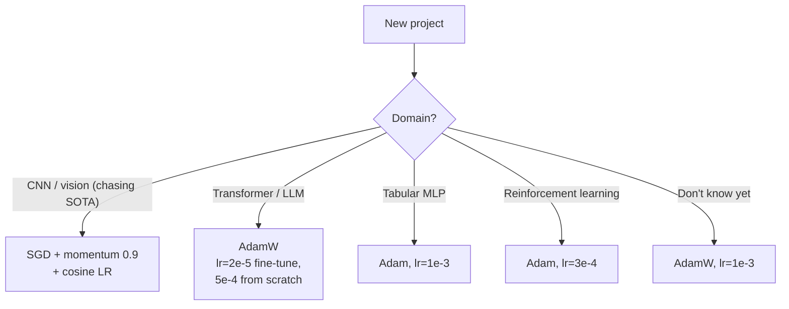

# Training 3 — Optimizers: Momentum, Adam, LR Schedules

## Lectures covered
- Model Optimization
- Gradient Descent with Momentum
- Adam Optimizer

---

## In one sentence
An **optimizer** is the algorithm that decides *exactly how big* a step each weight takes given its gradient — and the right optimizer can train a network 5x faster than plain SGD with no other change.

## Real-world analogy
- **Plain SGD** is like walking carefully down a slope: each step depends only on your current footing.
- **SGD with momentum** is like skiing — you build up speed in consistent directions, plowing through bumps.
- **Adam** is a hiker with a smart pedometer that takes *small* steps where the ground is rough and *long* strides where it's smooth, separately for each leg.

## The intuition (plain English)
- Vanilla SGD treats every weight the same and bounces around in narrow valleys; modern optimizers smooth the path and adapt per-parameter.
- **Momentum** averages recent gradients so consistent directions accelerate and noise cancels out.
- **Adam** adds a per-weight learning rate that shrinks in places with big/noisy gradients.
- The **learning-rate schedule** decays the step size over time so you make big leaps early and fine adjustments late — like a search that zooms in.

## Mini worked example — momentum vs vanilla SGD

A weight `w = 1.00` sees three gradients in a row from three batches: `[0.5, 0.4, 0.6]`. Learning rate η = 0.1, momentum β = 0.9.

```
Vanilla SGD (no momentum):
   w₁ = 1.00 - 0.1 · 0.5 = 0.95
   w₂ = 0.95 - 0.1 · 0.4 = 0.91
   w₃ = 0.91 - 0.1 · 0.6 = 0.85           total move: 0.15

SGD + momentum (β = 0.9, velocity v starts at 0):
   v₁ = 0.9·0   + 0.5 = 0.50  →  w₁ = 1.00 - 0.1·0.50 = 0.950
   v₂ = 0.9·0.5 + 0.4 = 0.85  →  w₂ = 0.95 - 0.1·0.85 = 0.865
   v₃ = 0.9·0.85+ 0.6 = 1.365 →  w₃ = 0.865- 0.1·1.365= 0.7285
                                                   total move: 0.27
```

Same gradients — momentum almost doubles the distance traveled because the consistent downhill direction "rolled" with velocity.

## At-a-glance — picking an optimizer



## Why this matters
- The default optimizer (Adam vs AdamW vs SGD) silently changes what your model learns.
- Wrong learning rate is the #1 reason a network "doesn't train" — schedulers and warmup save days.
- Mixed-precision training is a free 2x speedup once you know how to enable it.

---

## 1. Why "vanilla" SGD isn't always enough

Plain SGD has problems:
- Bounces around in narrow ravines (loss landscapes are usually anisotropic)
- Slow on plateaus (small gradients)
- Sensitive to learning rate

Modern optimizers fix some of these.

---

## 2. SGD with Momentum

Like a ball rolling — it accumulates velocity, smooths out noise, accelerates in consistent directions.

$$v_t = \beta v_{t-1} + \nabla L$$
$$\theta_t = \theta_{t-1} - \eta v_t$$

- $\beta$ (momentum coefficient): typically 0.9
- Effectively averages recent gradients

```python
optimizer = torch.optim.SGD(model.parameters(), lr=0.01, momentum=0.9)
```

### When to use SGD+momentum
- Computer vision (ResNet, YOLO are typically trained with SGD+momentum)
- When you have time to tune LR carefully — usually slightly better final accuracy than Adam

---

## 3. Adam — adaptive learning rates per parameter

Combines momentum + per-parameter learning rate scaling based on the **squared gradient** history.

$$m_t = \beta_1 m_{t-1} + (1-\beta_1) g_t$$
$$v_t = \beta_2 v_{t-1} + (1-\beta_2) g_t^2$$
$$\theta_t = \theta_{t-1} - \eta \cdot \frac{\hat{m}_t}{\sqrt{\hat{v}_t} + \epsilon}$$

(Hat = bias-corrected.)

In English: maintain a running mean (momentum) AND a running squared mean (per-parameter scale). Use the ratio.

```python
optimizer = torch.optim.Adam(model.parameters(), lr=1e-3)
```

### Why Adam is the default
- Less sensitive to LR choice
- Often converges faster than SGD
- Good default for almost everything

### When NOT to use Adam
- Final accuracy on vision tasks sometimes lower than SGD+momentum
- Some papers report Adam generalizes worse than SGD

### AdamW — Adam + correct weight decay
```python
optimizer = torch.optim.AdamW(model.parameters(), lr=1e-3, weight_decay=0.01)
```

The default for modern Transformers / LLMs.

---

## 4. Comparison of common optimizers

| Optimizer | Pros | Cons | Default for |
|---|---|---|---|
| SGD | simple | slow, sensitive | rarely used alone |
| SGD+momentum | strong final accuracy | tune LR | CNN training |
| RMSprop | per-param LR, simple | older | older RNNs |
| Adam | fast, robust, low-tune | sometimes generalizes worse | default for almost everything |
| AdamW | Adam + correct weight decay | ~same speed as Adam | Transformers, LLMs |

---

## 5. Learning rate scheduling

Even good optimizers benefit from **decaying** the LR over training:
- Start large to make progress
- Decay to refine

### StepLR — drop LR every N epochs
```python
from torch.optim.lr_scheduler import StepLR
scheduler = StepLR(optimizer, step_size=10, gamma=0.5)
# every 10 epochs, LR *= 0.5
```

### ExponentialLR
```python
ExponentialLR(optimizer, gamma=0.95)             # LR *= 0.95 every epoch
```

### CosineAnnealingLR — smooth decay
```python
from torch.optim.lr_scheduler import CosineAnnealingLR
scheduler = CosineAnnealingLR(optimizer, T_max=epochs)
```

The default for many modern Transformer trainings.

### OneCycleLR — go up then down
```python
from torch.optim.lr_scheduler import OneCycleLR
scheduler = OneCycleLR(optimizer, max_lr=1e-3, epochs=epochs, steps_per_epoch=len(loader))
```

Highly effective for vision; faster convergence in fewer epochs.

### ReduceLROnPlateau — auto-decay on validation plateau
```python
from torch.optim.lr_scheduler import ReduceLROnPlateau
scheduler = ReduceLROnPlateau(optimizer, mode="min", patience=3, factor=0.5)

# in training loop:
scheduler.step(val_loss)
```

### Scheduler call sites — which step where
- Most schedulers: `scheduler.step()` once per epoch
- OneCycle: `scheduler.step()` once per **batch**
- ReduceLROnPlateau: `scheduler.step(val_loss)` once per epoch

Read each scheduler's docs to be sure.

---

## 6. Warmup — the modern pattern

Big LRs early on can blow up. **Linear warmup** for the first few hundred steps, then your normal schedule.

```python
# manual warmup
warmup_steps = 500
for step, (x, y) in enumerate(loader):
    lr = base_lr * min(1.0, (step + 1) / warmup_steps)
    for g in optimizer.param_groups:
        g["lr"] = lr
    ...
```

Or use `torch.optim.lr_scheduler.LambdaLR` with a warmup function.

---

## 7. Mixed-precision training (free 2x speedup on GPU)

```python
scaler = torch.cuda.amp.GradScaler()

for x, y in loader:
    x, y = x.to(device), y.to(device)
    optimizer.zero_grad()
    with torch.cuda.amp.autocast():
        logits = model(x)
        loss = loss_fn(logits, y)
    scaler.scale(loss).backward()
    scaler.step(optimizer)
    scaler.update()
```

- 2× faster, ~half memory
- Required for training large models on consumer GPUs
- Built into PyTorch

---

## 8. Picking optimizer + LR for new projects

| Domain | Default starting point |
|---|---|
| MLP on tabular | Adam, lr=1e-3 |
| CNN on images | SGD+momentum, lr=0.1 with cosine; OR AdamW lr=1e-3 |
| Transformer / LLM | AdamW, lr=2e-5 (fine-tune), 5e-4 (from scratch) |
| Reinforcement learning | Adam, lr=3e-4 |
| Anything weird | AdamW, lr=1e-3 |

If unsure: start with AdamW, lr=1e-3, plot loss, adjust.

---

## 9. Common pitfalls

| Mistake | Effect | Fix |
|---|---|---|
| Calling `scheduler.step()` before `optimizer.step()` | warning + wrong LR | call after optimizer.step() |
| Not zeroing gradients | accumulation | `optimizer.zero_grad()` |
| Using Adam's defaults on unstable training | divergence | drop LR by 10x |
| Forgetting `weight_decay` for AdamW | over-regularization absent | tune weight_decay |
| Mixed-precision without GradScaler | NaN losses | always use `GradScaler` for FP16 |

## Self-check

- [ ] How does momentum modify plain SGD?
- [ ] What two running statistics does Adam maintain?
- [ ] When prefer SGD+momentum over Adam?
- [ ] What's the difference between Adam and AdamW?
- [ ] When use cosine annealing vs step LR?
- [ ] What's warmup and why does it help?
- [ ] How do you enable mixed precision in PyTorch?
- [ ] Show the right call order for `optimizer` and `scheduler`.

---

## Glossary

| Term | Plain meaning |
|------|---------------|
| **Optimizer** | Algorithm that updates weights using gradients |
| **SGD** | Stochastic Gradient Descent — base optimizer that uses raw gradients |
| **Momentum** | Running average of past gradients; accelerates in consistent directions |
| **β / β₁ / β₂** | Decay coefficients for momentum (β₁) and squared-gradient (β₂) running averages |
| **Adam** | Adaptive Moment estimation — combines momentum + per-parameter scaling |
| **AdamW** | Adam with decoupled weight decay — modern default for Transformers |
| **RMSprop** | Older adaptive optimizer; per-parameter LR via squared-gradient average |
| **Adaptive learning rate** | Different effective step size per weight, set by the optimizer |
| **Bias correction** | Adam's fix for the cold-start of running averages |
| **ε (epsilon)** | Tiny constant added to denominators to avoid divide-by-zero |
| **Weight decay** | Penalty that shrinks weights toward zero — a form of L2 regularization |
| **Learning rate (lr / η)** | Global step-size multiplier |
| **LR scheduler** | Object that changes the LR over time |
| **StepLR** | Drops LR by a factor every N epochs |
| **ExponentialLR** | Multiplies LR by a constant each epoch |
| **CosineAnnealingLR** | Smoothly decays LR like a half-cosine — popular for Transformers |
| **OneCycleLR** | LR rises then falls over training; effective for vision |
| **ReduceLROnPlateau** | Auto-decay when validation metric stops improving |
| **Warmup** | Linear LR ramp-up over the first few hundred steps to avoid early divergence |
| **`torch.optim.SGD`** | PyTorch's SGD class (supports momentum) |
| **`torch.optim.Adam` / `AdamW`** | PyTorch's Adam variants |
| **Mixed precision (AMP)** | Train with `float16` / `bfloat16` to save memory and run ~2x faster |
| **`GradScaler`** | Helper that prevents `float16` underflow in AMP training |
| **`autocast`** | Context manager that casts ops to lower precision automatically |
| **Loss landscape** | Geometry of the loss as a function of the weights |
| **Plateau** | Region where the gradient is near zero but you're not at a minimum |
| **Convergence** | Loss has stopped meaningfully decreasing |
| **Diverge / NaN** | Loss explodes — usually means LR too high |

## Further reading
- Next: [04-regularization-dropout-batchnorm.md](04-regularization-dropout-batchnorm.md)
- Tuning these knobs systematically: [05-hyperparameter-optuna.md](05-hyperparameter-optuna.md)
- Theory of why momentum works: [../architectures-and-math.md](../architectures-and-math.md)
