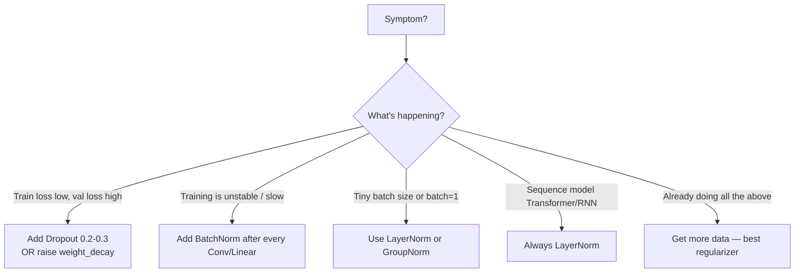

# Training 4 — Regularization: Dropout, BatchNorm, Weight Decay

## Lectures covered
- Regularization
- Dropout Regularization
- Batch Normalization

---

## In one sentence
**Regularization** is the umbrella term for any technique that stops a deep network from *memorizing* the training data so it can actually generalize to new data.

## Real-world analogy
Imagine a study group preparing for an exam. If everyone always studies together with the same friends, they collectively memorize the practice questions. **Dropout** is like randomly muting 30% of the group on every Zoom call — each person now has to learn the material themselves. The team becomes more resilient. **BatchNorm** is the meeting facilitator who, before each topic, normalizes everyone's volume so no one dominates and the discussion stays balanced.

## The intuition (plain English)
- A neural net usually has more weights than training samples → it can memorize the data unless you push back.
- **Weight decay** adds a small penalty for big weights, gently keeping them small.
- **Dropout** randomly turns off neurons during training so no single neuron becomes a single point of failure.
- **BatchNorm / LayerNorm** rescales the inside of the network so each layer sees a stable distribution — speeds training and gently regularizes too.

## Mini worked example — what dropout actually does to one layer

A hidden layer outputs activations `a = [0.8, 0.5, 1.2, 0.3, 0.9]` for one sample. Apply dropout with `p = 0.4` (40% chance of zeroing each one):

```
random mask drawn:        [1, 0, 1, 1, 0]      (entries kept with prob 1-p = 0.6)

raw masked:               [0.8, 0.0, 1.2, 0.3, 0.0]

PyTorch's "inverted dropout" rescales by 1/(1-p) = 1/0.6 ≈ 1.667:

dropout output (train):   [1.33, 0.0, 2.00, 0.50, 0.0]

at inference (model.eval): no zeroing, no rescaling — uses [0.8, 0.5, 1.2, 0.3, 0.9]
```

The next layer sees a different "subset" each batch, can't lock onto one teammate, and learns redundant pathways.

## At-a-glance — when to reach for which



```
   Modern CNN block recipe:

   x ─► Conv ─► BatchNorm ─► ReLU ─► Conv ─► BatchNorm ─► ReLU ─► Dropout2d ─► out
        │           │                    │           │                  │
   learnable    stable inputs       learnable    stable inputs    random zeroing
                to next layer                    to next layer    forces redundancy
```

## Why this matters
- A model that hits 99% on train and 80% on test is **broken** — regularization is how you fix it.
- BatchNorm is what made it possible to train networks 100+ layers deep without exploding.
- Picking the wrong normalization (BatchNorm in a Transformer, batch=1) is a classic silent-failure bug.

---

## 1. Why regularize neural networks

Neural nets are massively over-parameterized — millions of weights vs thousands of training samples. Without regularization they memorize training data and fail on test data.

The toolkit:
1. **Weight decay** (L2 penalty)
2. **Dropout** (random neuron deactivation)
3. **Batch / Layer normalization** (sneaky regularizer + speedup)
4. **Data augmentation** (image-specific; covered in vision subfolder)
5. **Early stopping** (covered in optimizer subfolder)

---

## 2. Weight decay (L2 regularization for NNs)

Adds penalty for large weights to the loss:
$$L_{\text{total}} = L_{\text{task}} + \lambda \sum w^2$$

```python
optimizer = torch.optim.AdamW(model.parameters(), lr=1e-3, weight_decay=0.01)
```

Typical values: 1e-4 to 1e-2.

> **AdamW** decouples weight decay from gradient updates correctly. **Adam's** `weight_decay` parameter implements it incorrectly (mixes it with the moment estimates). Always prefer AdamW.

---

## 3. Dropout

During training, randomly **set some neurons to 0** with probability $p$.

```
without dropout:                with dropout p=0.5:
○─→ ○─→ ○─→ output              ○─→ X ─→ ○─→ output
○─→ ○─→ ○                       ○─→ ○─→ X
○─→ ○─→ ○                       X ─→ ○─→ ○
```

### Why it regularizes
- Forces redundancy — no neuron can rely on a specific other neuron
- Equivalent to training an ensemble of subnetworks
- At inference: turn off dropout, scale activations to expected magnitude (PyTorch handles this)

### PyTorch
```python
import torch.nn as nn

self.fc = nn.Sequential(
    nn.Linear(256, 128),
    nn.ReLU(),
    nn.Dropout(p=0.3),                # 30% chance of zeroing each activation
    nn.Linear(128, 10),
)
```

`model.train()` enables dropout; `model.eval()` disables it.

### Typical p values
- 0.1–0.3 for hidden layers in vision/MLP
- 0.5 for very wide layers (original paper recommendation)
- Don't dropout the input usually
- Don't dropout the output

---

## 4. Batch Normalization

For each mini-batch, normalize each feature to mean 0, std 1, then scale + shift with learnable parameters:

$$\hat{x} = \frac{x - \mu_{\text{batch}}}{\sigma_{\text{batch}} + \epsilon}$$
$$y = \gamma \hat{x} + \beta$$

### Why it works
- Stabilizes training: each layer sees a consistent distribution
- Allows much higher learning rates
- Acts as a mild regularizer (introduces noise via batch statistics)
- Reduces sensitivity to weight initialization

### PyTorch
```python
nn.Sequential(
    nn.Conv2d(3, 16, 3, padding=1),
    nn.BatchNorm2d(16),                 # for 2D conv outputs
    nn.ReLU(),
    nn.Conv2d(16, 32, 3, padding=1),
    nn.BatchNorm2d(32),
    nn.ReLU(),
    ...
)
```

For MLPs: `nn.BatchNorm1d(num_features)`.

### At inference
Uses the running averages computed during training. `model.eval()` switches to this mode automatically — **don't forget it**.

### Typical placement
After the linear/conv layer, before the activation:
`Linear → BN → ReLU → Linear → BN → ReLU → ...`

Some recent work argues `Linear → ReLU → BN` is slightly better. Either works.

---

## 5. Layer Normalization (the Transformer's choice)

BatchNorm depends on the batch. **LayerNorm** normalizes across features within each sample — independent of batch.

```python
nn.LayerNorm(d_model)
```

Advantages:
- Works even with batch size 1 (BN doesn't)
- More stable for variable-length sequences (RNN, Transformer)
- Default in Transformers, modern LLMs

Use:
- LayerNorm for sequence models (Transformers, RNNs)
- BatchNorm for CNNs / MLPs

There are also `GroupNorm`, `InstanceNorm` for special cases.

---

## 6. The combined modern recipe

```python
class CNNBlock(nn.Module):
    def __init__(self, in_ch, out_ch):
        super().__init__()
        self.block = nn.Sequential(
            nn.Conv2d(in_ch, out_ch, 3, padding=1),
            nn.BatchNorm2d(out_ch),
            nn.ReLU(inplace=True),
            nn.Conv2d(out_ch, out_ch, 3, padding=1),
            nn.BatchNorm2d(out_ch),
            nn.ReLU(inplace=True),
            nn.Dropout2d(0.1),
        )

    def forward(self, x):
        return self.block(x)
```

Combined: weight decay (in optimizer) + BN + dropout + early stopping = robust training.

---

## 7. When to reach for which

| Symptom | Try |
|---|---|
| Training loss decreases, val loss increases | dropout ↑ or weight decay ↑ |
| Training is slow / unstable | BatchNorm |
| Big batch → small batch causes problems | switch BN → LayerNorm or GroupNorm |
| Want to train very deep without skip connections | BatchNorm + ReLU + careful init |
| Sequence model | LayerNorm always |
| Already using dropout, still overfitting | more data > more regularization |

---

## 8. Common pitfalls

| Mistake | Effect | Fix |
|---|---|---|
| Forgot `model.eval()` at inference | dropout still active, wrong predictions | always toggle |
| BN with batch size 1 | divides by 0 | use LayerNorm or GroupNorm |
| Dropout before BN | order matters; default is BN before dropout | follow the standard recipe |
| `weight_decay` on Adam (not AdamW) | wrong decay | use AdamW |
| Dropout p=0.5 on a tiny network | over-regularize | start at 0.1–0.3 |

## Self-check

- [ ] Why does dropout help generalization?
- [ ] What changes between `model.train()` and `model.eval()`?
- [ ] State BatchNorm's formula.
- [ ] When use LayerNorm over BatchNorm?
- [ ] Why is AdamW preferred over Adam + weight_decay?
- [ ] What's the recommended dropout p range?
- [ ] Where in a `Linear → ReLU` block does BN go?
- [ ] If you're at batch size 1, which normalization do you use?

---

## Glossary

| Term | Plain meaning |
|------|---------------|
| **Regularization** | Any technique that reduces overfitting (dropout, weight decay, etc.) |
| **Overfitting** | Model memorizes training data; performs poorly on new data |
| **Generalization** | How well the model performs on unseen data |
| **Weight decay** | Penalty added to the loss for large weights — keeps them small |
| **L2 regularization** | Same idea: sum of squared weights as a penalty |
| **L1 regularization** | Sum of absolute weights — encourages sparsity (zeros) |
| **AdamW** | Adam variant that applies weight decay correctly |
| **Dropout** | Randomly zero out a fraction `p` of neurons each training step |
| **`Dropout2d`** | Dropout that zeroes whole feature maps in a CNN |
| **Inverted dropout** | Standard implementation: scale up surviving activations by 1/(1-p) at train time so inference needs no change |
| **Probability `p`** | Chance any given neuron is dropped (typical 0.1–0.5) |
| **`model.train()`** | Activates dropout and uses batch stats in BatchNorm |
| **`model.eval()`** | Disables dropout and uses running stats in BatchNorm |
| **Batch Normalization (BN)** | Normalizes each feature across the batch to mean 0, std 1, then learns scale/shift |
| **`BatchNorm1d` / `BatchNorm2d`** | BN for fully-connected / 2D conv outputs |
| **Running mean / running var** | BatchNorm's stored stats used at inference time |
| **γ (gamma) and β (beta)** | BN's learnable scale and shift parameters |
| **Layer Normalization (LN)** | Normalize across features within each sample — used in Transformers |
| **`LayerNorm`** | PyTorch's LN module |
| **GroupNorm / InstanceNorm** | Variants for tiny batches or style transfer |
| **Internal covariate shift** | The historical "explanation" for why BN helps; now debated, but BN works regardless |
| **Skip / residual connection** | Shortcut path (used in ResNet) that helps gradients flow through deep nets |
| **Label smoothing** | Replacing one-hot labels with soft targets (e.g., 0.9 / 0.1) to prevent over-confidence |
| **Data augmentation** | Synthetically expanding the training set (rotations, crops) — covered in vision module |
| **Early stopping** | Halt training when validation loss stops improving |
| **Patience** | How many bad epochs early-stopping tolerates |

## Further reading
- Next: [05-hyperparameter-optuna.md](05-hyperparameter-optuna.md) — search for the right dropout/weight_decay automatically
- Image-specific augmentation: [../03-vision/02-data-augmentation.md](../03-vision/02-data-augmentation.md)
- LayerNorm in context: [../04-sequence/03-transformer-architecture.md](../04-sequence/03-transformer-architecture.md)
