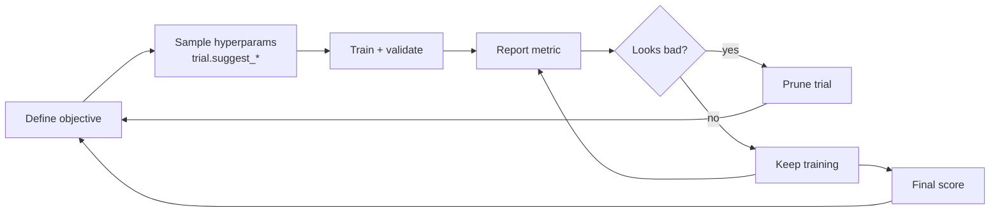

# Training 5 — Hyperparameter Tuning with Optuna

## Lectures covered
- Hyperparameter Tuning
- Optuna

---

## In one sentence
**Hyperparameter tuning** is searching for the best combination of training "knobs" (learning rate, dropout, layer size…) and **Optuna** is a smart search engine that learns from earlier guesses to pick promising next ones.

## Real-world analogy
Imagine baking cookies and you don't yet know the right temperature, time, and sugar amount. Grid search is *bake every possible combination* (slow). Random search is *try random combos* (often wasteful). Optuna is a baker who keeps notes — after 10 batches, she's noticed sugar matters most and 350°F always beats 400°F, so she focuses her next experiments around the promising region.

## The intuition (plain English)
- DL has many knobs and most of them don't matter; a few matter a lot. **Learning rate** almost always matters most.
- **Optuna's TPE algorithm** is a Bayesian-flavored optimizer: try, observe, model the response surface, suggest better next.
- **Pruning** kills clearly-bad trials early so you don't waste GPU hours on losers.
- Use `log=True` for parameters that span orders of magnitude (lr, weight_decay) — otherwise the search effectively ignores tiny values.

## Mini worked example — searching learning rate and dropout

```python
import optuna

def objective(trial):
    lr      = trial.suggest_float("lr",      1e-5, 1e-1, log=True)
    dropout = trial.suggest_float("dropout", 0.0,  0.5)
    val_loss = train_for_a_few_epochs(lr=lr, dropout=dropout)
    return val_loss                  # Optuna minimizes this

study = optuna.create_study(direction="minimize")
study.optimize(objective, n_trials=20)

print(study.best_params)
# Possible result: {"lr": 0.0017, "dropout": 0.21}
# best_value: 0.143
```

After 20 trials Optuna already concentrates samples near the best region — far more efficient than 20 random guesses.

## At-a-glance — the tuning workflow



```
   Stage 1 (10-30 trials, wide ranges)  ─► identify which knobs matter
   Stage 2 (50-100 trials, narrow ranges around best) ─► fine tune
   Stage 3 (1 long final run with best config) ─► production
```

## Why this matters
- A bad learning rate alone can make a model look "broken" — tuning rescues weeks of confusion.
- Optuna with pruning turns "infeasible" tuning into "overnight on one GPU."
- Visualizing **param importances** tells you which knobs to keep tuning and which to fix.

---

## 1. The DL hyperparameter zoo

Compared to classical ML (where you tune ~5 things), deep learning has many:

- **Architecture**: depth, width, kernel sizes, dropout p, normalization choice
- **Optimizer**: which one, learning rate, weight decay, momentum, β₁, β₂
- **Schedule**: scheduler type, max_lr, warmup steps, total epochs
- **Data**: batch size, augmentation strength
- **Regularization**: dropout p, label smoothing, weight decay

You can't grid-search this. You need a smart optimizer.

---

## 2. Optuna in 60 seconds

Optuna is a hyperparameter optimization library that uses **Tree-structured Parzen Estimator (TPE)** by default — a Bayesian-ish approach that learns from past trials to pick promising next ones.

```bash
pip install optuna
```

### Basic usage
```python
import optuna

def objective(trial):
    # 1. Sample hyperparameters
    lr = trial.suggest_float("lr", 1e-5, 1e-1, log=True)
    dropout = trial.suggest_float("dropout", 0.0, 0.5)
    hidden = trial.suggest_int("hidden", 64, 512, step=32)
    optimizer_name = trial.suggest_categorical("optim", ["adam", "adamw", "sgd"])

    # 2. Build + train model
    model = MyModel(hidden=hidden, dropout=dropout)
    val_loss = train_and_evaluate(model, lr=lr, optimizer_name=optimizer_name)

    # 3. Return metric to minimize / maximize
    return val_loss

study = optuna.create_study(direction="minimize")
study.optimize(objective, n_trials=50)

print("best:", study.best_params, study.best_value)
```

### Suggest API
```python
trial.suggest_int("n_layers", 1, 5)
trial.suggest_float("lr", 1e-5, 1e-1, log=True)            # log-uniform
trial.suggest_float("dropout", 0.0, 0.5)
trial.suggest_categorical("optim", ["adam", "sgd"])
```

`log=True` is critical for things like learning rate that span orders of magnitude.

---

## 3. Pruning — early termination of bad trials

Why train a clearly bad config for 50 epochs? Optuna can stop early.

```python
def objective(trial):
    model = build(trial)
    optimizer = optim.Adam(model.parameters(), lr=...)

    for epoch in range(epochs):
        train_one_epoch(...)
        val_loss = evaluate(...)

        trial.report(val_loss, step=epoch)
        if trial.should_prune():
            raise optuna.TrialPruned()

    return val_loss
```

Saves enormous compute when most configs are obvious losers.

---

## 4. Conditional hyperparameters

Some params only make sense given others. Optuna handles this:

```python
def objective(trial):
    optimizer_name = trial.suggest_categorical("optim", ["adam", "sgd"])
    lr = trial.suggest_float("lr", 1e-4, 1e-1, log=True)

    if optimizer_name == "sgd":
        momentum = trial.suggest_float("momentum", 0.0, 0.99)
    # else: not used; only sampled for SGD trials

    ...
```

---

## 5. Tracking trials

```python
print(study.best_trial)
print(study.best_params)

df = study.trials_dataframe()
df.sort_values("value").head()

# visualizations
import optuna.visualization as ov
ov.plot_optimization_history(study).show()
ov.plot_param_importances(study).show()           # tells you which knobs mattered
ov.plot_parallel_coordinate(study).show()
```

---

## 6. Practical workflow

```
Stage 1 — small budget, wide ranges (10–30 trials)
   → identify which params matter

Stage 2 — narrow ranges around best, more trials (50–100)
   → fine tune

Stage 3 — final long-training run with best config
```

Don't run a 500-trial study from scratch — be strategic.

---

## 7. Persisting + resuming studies

```python
study = optuna.create_study(
    direction="minimize",
    storage="sqlite:///optuna.db",
    study_name="my-experiment",
    load_if_exists=True,
)
```

Trials persist; next run resumes where you left off. Critical for long studies.

---

## 8. What hyperparameters typically matter most (rough order)

For a new vision/NLP DL project:
1. **Learning rate** (almost always #1)
2. **Architecture size** (depth + width)
3. **Batch size**
4. **Weight decay**
5. **Dropout**
6. **LR schedule**
7. **Optimizer choice** (Adam vs SGD)
8. **Activation function** (rarely matters past ReLU/GELU)

---

## 9. Tuning DL is different from tuning XGBoost

| | XGBoost | Deep Learning |
|---|---|---|
| Trials per study | 50–200 | 30–80 (each takes longer) |
| Important params | learning_rate, max_depth, n_estimators, regularization | learning_rate, model size, batch_size |
| Objective | one CV score | one validation metric |
| Pruning | not as critical | critical (epochs are expensive) |
| Total time | minutes | hours-days |

For DL, **pruning is the difference between feasible and infeasible** tuning.

---

## 10. Common pitfalls

| Mistake | Effect | Fix |
|---|---|---|
| Linear LR range | misses best LR | use `log=True` |
| Forgetting pruning | wasted hours | always implement `should_prune` |
| Tuning on test set | leakage | always use validation set |
| Running 500 trials with 8h training each | weeks of compute | smaller search; pruning |
| Not seeding | non-reproducible | set seeds; Optuna has `sampler=TPESampler(seed=42)` |

## Self-check

- [ ] Why is `log=True` important for learning-rate sampling?
- [ ] What does pruning do?
- [ ] How do you make a study resumable?
- [ ] What three params likely matter most for a new DL project?
- [ ] Walk through the steps of an Optuna objective function.
- [ ] Difference between `suggest_categorical` and `suggest_int`?
- [ ] When use Optuna over GridSearch / RandomSearch?
- [ ] Why is pruning especially valuable for DL vs classical ML tuning?

---

## Glossary

| Term | Plain meaning |
|------|---------------|
| **Hyperparameter** | A "knob" you set before training (lr, dropout) — vs *parameter* which the model learns |
| **Parameter** | A weight inside the model that gradient descent learns |
| **Tuning / HPO** | Hyperparameter Optimization — searching for the best knob combination |
| **Optuna** | Open-source HPO library with smart sampling and pruning |
| **Trial** | One attempt at a hyperparameter combination |
| **Study** | A collection of trials sharing one objective |
| **Objective function** | The function Optuna calls each trial; returns the score to minimize/maximize |
| **TPE (Tree-structured Parzen Estimator)** | Optuna's default Bayesian-flavored sampler |
| **Bayesian optimization** | Use past trial scores to model the score surface and pick promising next points |
| **Grid search** | Try every combination on a regular grid — exhaustive and slow |
| **Random search** | Try random combinations — often surprisingly competitive |
| **`suggest_float(name, low, high, log=True)`** | Sample a float, log-uniformly across orders of magnitude |
| **`suggest_int`** | Sample an integer in a range |
| **`suggest_categorical`** | Pick from a discrete list (e.g., optimizer name) |
| **Pruning** | Stop a trial early when its progress looks unpromising |
| **`trial.report` / `trial.should_prune`** | Optuna's hooks for early stopping a trial |
| **Conditional search space** | A hyperparameter only sampled when another takes a specific value |
| **Param importances** | A score telling which hyperparameters most affect the metric |
| **Optimization history** | Plot of trial scores over time |
| **Parallel coordinate plot** | Visualization showing how each param value relates to the metric |
| **Storage / SQLite** | Optuna's database for persisting and resuming studies |
| **`load_if_exists=True`** | Reuse an existing Optuna study on rerun |
| **Validation set** | Held-out data used to score each trial — never the test set |
| **Search budget** | Total trials or compute you allow for tuning |
| **Seed / reproducibility** | Setting a fixed random seed so the same search reproduces |
| **Cross-validation** | Splitting data into folds and averaging scores — used in classical ML, rare in DL |

## Further reading
- Optimizer choices that show up in your search space: [03-optimizers-momentum-adam.md](03-optimizers-momentum-adam.md)
- Regularization knobs to tune: [04-regularization-dropout-batchnorm.md](04-regularization-dropout-batchnorm.md)
- Optuna docs: https://optuna.readthedocs.io
