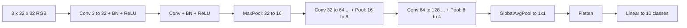

# Vision 1 — Convolutional Neural Networks

## Lectures covered
- CNN
- CIFAR10 Image Classification using CNN

---

## In one sentence
A **Convolutional Neural Network (CNN)** is a network that slides small **filters** across an image, layer after layer, building up from simple edges to whole objects — the standard tool for any image task.

## Real-world analogy
Imagine you're checking a wall for cracks with a magnifying glass. You sweep the glass across, noting where you see crack-like patterns. Then you zoom out and look for *clusters* of cracks (corners, joints). Finally you decide: is this wall damaged? A CNN does exactly that — many tiny "magnifying glasses" (filters) sweep across; deeper layers combine the findings into bigger structures.

## The intuition (plain English)
- A **filter** is a tiny grid of numbers (often 3×3) that looks for a specific pattern (vertical edge, color blob, texture).
- The filter **slides** over the whole image and produces a "where this pattern exists" map (the **feature map**).
- Each layer learns *many* filters in parallel; deeper layers combine earlier feature maps into more complex concepts.
- Filters are **reused** at every spatial position → far fewer parameters than an MLP, and patterns are detected anywhere in the image.

## Mini worked example — a 3×3 vertical-edge filter on a tiny 5×5 image

Input image (just light/dark pixels):

```
1 2 3 4 5
6 7 8 9 0     ← imagine "0" at the right edge means very dark
1 2 3 4 5
6 7 8 9 0
1 2 3 4 5
```

Vertical-edge filter (positive on left, negative on right):

```
 1  0 -1
 1  0 -1
 1  0 -1
```

To compute the top-left of the output, overlay the filter on the top-left 3×3 patch and do an element-wise multiply + sum:

```
patch:           filter:           product:
1 2 3            1 0 -1            (1)(1) + (2)(0) + (3)(-1)
6 7 8     ⊙      1 0 -1     =      (6)(1) + (7)(0) + (8)(-1)
1 2 3            1 0 -1            (1)(1) + (2)(0) + (3)(-1)

sum = (1 - 3) + (6 - 8) + (1 - 3) = -2 + -2 + -2 = -6
```

Slide the filter one step right, repeat — you get a feature map (3×3 here, since `5 - 3 + 1 = 3`). Negative values mean a left-to-right *bright→dark* edge. That single filter has now annotated the whole image with "where do vertical edges live?"

## At-a-glance — typical CNN flow for CIFAR-10



```
            spatial dim shrinks  ─────────────►
            channels grow        ─────────────►

  3×32×32 ─► [Conv+BN+ReLU]² ─► Pool ─► [Conv+BN+ReLU]² ─► Pool ─► [Conv+BN+ReLU]² ─► Pool
            32 channels        32×16×16  64 channels       64×8×8   128 channels       128×4×4
                                                                                          │
                                                                              GlobalAvgPool
                                                                                          │
                                                                                Flatten → FC
                                                                                          │
                                                                                       10 logits
```

## Why this matters
- CNNs are how every image task you'll see — classification, detection, segmentation — gets solved.
- Understanding the conv operation (filter + slide + sum) is the prerequisite for understanding CNNs, ViT patches, and even spectrogram audio models.
- The skip-connection (ResNet) idea introduced here is reused in **every** modern deep architecture, including Transformers.

---

## 1. Why CNNs (vs MLPs) for images

A 256×256 RGB image has 196,608 input numbers. An MLP layer with 1024 neurons → ~200M parameters in the first layer alone. Useless.

CNNs exploit two properties of images:
1. **Locality**: nearby pixels are correlated
2. **Translation equivariance**: a cat's features look the same wherever the cat is

→ **Shared weights** (one filter slides across the image) → drastically fewer parameters.

---

## 2. The convolution operation

A small filter (e.g., 3×3) slides over the image. At each position:
- Element-wise multiply filter with patch under it
- Sum into a single output value

Input image (5×5):
```
1 2 3 4 5
6 7 8 9 0
1 2 3 4 5
6 7 8 9 0
1 2 3 4 5
```

Filter (3×3):
```
1 0 -1
1 0 -1
1 0 -1
```

Output: a smaller "feature map" highlighting vertical edges.

### Hyperparameters
- **kernel_size** (e.g., 3, 5, 7) — filter spatial size
- **stride** — how far filter jumps each step (default 1)
- **padding** — pixels added around input (preserves spatial size)
- **out_channels** — how many filters to learn

```python
nn.Conv2d(in_channels=3, out_channels=32, kernel_size=3, stride=1, padding=1)
```

---

## 3. Pooling — downsample feature maps

```python
nn.MaxPool2d(kernel_size=2, stride=2)        # 2×2 max-pool, halves spatial dims
nn.AvgPool2d(kernel_size=2, stride=2)         # average-pool
nn.AdaptiveAvgPool2d((1, 1))                   # any input → 1×1 output
```

Why pool:
- Reduces spatial dims → fewer parameters in later layers
- Adds translation tolerance
- Concentrates features

Modern alternative: stride=2 in Conv2d (and skip pooling). Both work.

---

## 4. Output shape calculation

For a Conv2d with kernel `k`, stride `s`, padding `p` on input size `N`:
$$\text{out} = \frac{N - k + 2p}{s} + 1$$

Common cases:
- `k=3, p=1, s=1` → output **same** size as input
- `k=3, p=0, s=1` → output 2 smaller
- `s=2` → output halved

PyTorch: `nn.Conv2d(in, out, 3, padding=1)` is the workhorse.

---

## 5. A typical CNN block

```
[Conv → BN → ReLU → Conv → BN → ReLU → MaxPool] × N → Flatten → FC
```

Each block roughly:
- Doubles the number of channels
- Halves spatial dimensions

Going deeper means seeing larger and larger receptive fields → higher-level features.

---

## 6. CIFAR-10 — the typical first CNN project

10 classes, 32×32 RGB. 50k train + 10k test.

```python
import torch.nn as nn

class CNN(nn.Module):
    def __init__(self):
        super().__init__()
        self.features = nn.Sequential(
            # block 1
            nn.Conv2d(3, 32, 3, padding=1), nn.BatchNorm2d(32), nn.ReLU(),
            nn.Conv2d(32, 32, 3, padding=1), nn.BatchNorm2d(32), nn.ReLU(),
            nn.MaxPool2d(2),                                    # 32 → 16

            # block 2
            nn.Conv2d(32, 64, 3, padding=1), nn.BatchNorm2d(64), nn.ReLU(),
            nn.Conv2d(64, 64, 3, padding=1), nn.BatchNorm2d(64), nn.ReLU(),
            nn.MaxPool2d(2),                                    # 16 → 8

            # block 3
            nn.Conv2d(64, 128, 3, padding=1), nn.BatchNorm2d(128), nn.ReLU(),
            nn.Conv2d(128, 128, 3, padding=1), nn.BatchNorm2d(128), nn.ReLU(),
            nn.MaxPool2d(2),                                    # 8 → 4
        )
        self.classifier = nn.Sequential(
            nn.AdaptiveAvgPool2d((1, 1)),                       # 4×4 → 1×1
            nn.Flatten(),
            nn.Linear(128, 64), nn.ReLU(), nn.Dropout(0.3),
            nn.Linear(64, 10),
        )

    def forward(self, x):
        return self.classifier(self.features(x))
```

This gets ~85–88% on CIFAR-10 with proper training + augmentation. State of the art is 99%+ but uses bigger pre-trained networks.

---

## 7. Loading CIFAR-10
```python
from torchvision import datasets, transforms

train_tfm = transforms.Compose([
    transforms.RandomCrop(32, padding=4),
    transforms.RandomHorizontalFlip(),
    transforms.ToTensor(),
    transforms.Normalize((0.4914, 0.4822, 0.4465),
                          (0.2470, 0.2435, 0.2616)),
])

train_ds = datasets.CIFAR10("data/", train=True, download=True, transform=train_tfm)
```

Augmentation (crop + flip) is essential — ~3pp accuracy gain over no augmentation. Full augmentation treatment in next file.

---

## 8. Famous CNN architectures (a tour)

| Model | Year | Key idea |
|---|---|---|
| **LeNet** | 1998 | First CNN that worked at scale (digit recognition) |
| **AlexNet** | 2012 | Started the DL revolution; ImageNet winner |
| **VGG** | 2014 | Stack of small (3×3) convs |
| **GoogLeNet / Inception** | 2014 | Multi-scale "inception" blocks |
| **ResNet** | 2015 | Skip connections — enabled 100+ layer networks |
| **DenseNet** | 2017 | Even more skip connections |
| **MobileNet** | 2017 | Depthwise-separable convs for mobile |
| **EfficientNet** | 2019 | Systematic scaling of width/depth/resolution |
| **Vision Transformer (ViT)** | 2020 | Transformers for images — beats CNNs at scale |
| **ConvNeXt** | 2022 | "CNNs can keep up with ViTs" with modern training |

For 2025 production: **EfficientNet, ConvNeXt, ViT** are the sensible defaults. We don't write architectures from scratch — we pick a pre-trained one (next file).

---

## 9. ResNet skip connection — the most important invention

Plain deep nets struggled past 20 layers due to vanishing gradients. **ResNet** added a "shortcut" that skips one or more layers and adds the input to the output:

$$y = F(x) + x$$

This lets gradients flow directly from later layers to earlier ones. Suddenly, 50, 100, even 1000-layer networks trained well.

```python
class ResidualBlock(nn.Module):
    def __init__(self, ch):
        super().__init__()
        self.block = nn.Sequential(
            nn.Conv2d(ch, ch, 3, padding=1), nn.BatchNorm2d(ch), nn.ReLU(),
            nn.Conv2d(ch, ch, 3, padding=1), nn.BatchNorm2d(ch),
        )

    def forward(self, x):
        return F.relu(x + self.block(x))            # ← skip connection
```

Every modern deep architecture (Transformers, EfficientNet, etc.) uses skip connections. They're not optional.

---

## 10. Common pitfalls

| Mistake | Effect | Fix |
|---|---|---|
| Forgot padding=1 with kernel_size=3 | spatial dims shrink unexpectedly | use `padding=k // 2` |
| Wrong input channels in first Conv2d | shape mismatch | RGB = 3, grayscale = 1 |
| Forgot Flatten before Linear | shape error | `nn.Flatten()` |
| Massive `Linear(C*H*W, ...)` | over-parameterized | use `AdaptiveAvgPool2d((1,1))` first |
| Training without augmentation | overfits | always crop + flip on small datasets |

## Self-check

- [ ] Why are CNNs better for images than MLPs?
- [ ] What does `nn.Conv2d(3, 32, 3, padding=1)` do? Output shape on a 28×28 input?
- [ ] What's the role of pooling?
- [ ] What's a residual / skip connection and why does it matter?
- [ ] Why do channel counts grow as spatial dims shrink in a CNN?
- [ ] What's `AdaptiveAvgPool2d((1, 1))` and when use it?
- [ ] Build a 3-block CNN for CIFAR-10 in PyTorch from memory.
- [ ] Why does augmentation help so much on small datasets?

---

## Glossary

| Term | Plain meaning |
|------|---------------|
| **CNN** | Convolutional Neural Network — uses sliding filters on images |
| **Convolution** | Sliding a small filter across an input and computing weighted sums |
| **Filter / kernel** | A small grid (often 3×3) of learned numbers that detects a pattern |
| **Feature map** | The output of one filter applied across the whole input |
| **Channel** | A 2D plane of pixel values (RGB has 3); CNNs stack many channels per layer |
| **Stride** | How many pixels the filter jumps each step |
| **Padding** | Pixels (often zeros) added around the edge to control output size |
| **`Conv2d(in, out, k, padding=p)`** | PyTorch's 2D convolution layer |
| **Receptive field** | The patch of the original image one neuron deep in the net "sees" |
| **Pooling** | Downsampling step (max-pool or avg-pool) that reduces spatial size |
| **`MaxPool2d`** | Takes the maximum of each non-overlapping window |
| **`AvgPool2d`** | Takes the average of each window |
| **`AdaptiveAvgPool2d((1,1))`** | Pools any spatial size into 1×1 — common before the FC head |
| **Global Average Pooling (GAP)** | Average across all spatial positions per channel |
| **Locality** | Nearby pixels are correlated — the structural assumption CNNs exploit |
| **Translation equivariance** | Shifting the input shifts the output — built into convolution |
| **Weight sharing** | The same filter weights are reused at every position |
| **CIFAR-10** | 60k tiny 32×32 RGB images, 10 classes — standard CNN benchmark |
| **Skip / residual connection** | Output = layer(x) + x; lets gradients flow through deep nets |
| **ResNet** | Family of deep networks built on residual blocks |
| **EfficientNet** | Modern CNN family that scales depth, width, and resolution together |
| **MobileNet** | Lightweight CNN family using depthwise-separable convolutions |
| **ViT (Vision Transformer)** | Applies Transformer attention to image patches instead of using convolutions |
| **ConvNeXt** | Modern CNN designed with Transformer-era training tricks |
| **Backbone** | The feature-extracting part of a network (everything before the classifier) |
| **Head** | The final task-specific layers (e.g., the classifier) |
| **Output shape formula** | `out = (N − k + 2p) / s + 1` |
| **`nn.Flatten`** | Reshapes a tensor to (batch, −1) for the dense head |

## Further reading
- Next: [02-data-augmentation.md](02-data-augmentation.md) — how to multiply your training data
- Then: [03-transfer-learning-pretrained.md](03-transfer-learning-pretrained.md) — skip training from scratch
- Forward-pass math reference: [../architectures-and-math.md](../architectures-and-math.md)
