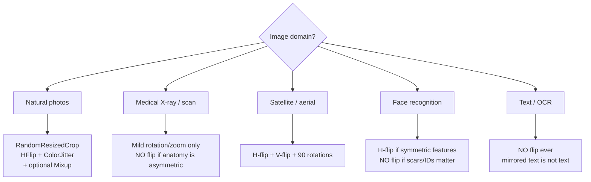

# Vision 2 — Data Augmentation

## Lectures covered
- Data Augmentation

---

## In one sentence
**Data augmentation** is randomly transforming each training image (flip, crop, jitter the colors) every time the model sees it, so a small dataset feels like a much bigger one and the model learns to ignore irrelevant variations.

## Real-world analogy
You're training a guard dog to recognize you. If you always show up wearing the same jacket in the same lighting, the dog learns "jacket + lamp = owner." Show up sometimes in a hat, sometimes mirrored, sometimes in shadow — now it learns *you*. Augmentation is identical: jitter the conditions so the network learns the actual content, not the lighting accident.

## The intuition (plain English)
- A small training set is the #1 cause of overfitting in vision; augmentation is the cheapest fix.
- **Geometric** augmentations (flip, crop, rotate) teach the network that the *content* matters, not the position.
- **Color** augmentations (brightness, contrast) make it robust to lighting differences.
- Augmentation is applied **only at training time**; validation must use a deterministic transform so your metric is reliable.
- Always **visualize** a batch of augmented images — over-strong augmentation can destroy the label.

## Mini worked example — what one image looks like across 4 epochs

A single CIFAR-10 cat image with `RandomCrop(32, padding=4) + RandomHorizontalFlip + ColorJitter`:

```
Epoch 1:  cat shifted 2px left, slight extra brightness
Epoch 2:  cat mirrored horizontally, normal lighting
Epoch 3:  cat shifted 3px down, +20% contrast
Epoch 4:  cat shifted up-right, slightly reddish

The model never sees the same image twice → it can't memorize pixel patterns.
The label "cat" stays the same in every version.
```

Result: a 5,000-image dataset behaves like ~50,000 effective images.

## At-a-glance — what to apply where



```
   train_tfm: random ─► augmented batches ─► model.train()
   val_tfm:   deterministic ─► same image every run ─► model.eval()
                                   (no augmentation, just resize + normalize)
```

## Why this matters
- A simple `RandomCrop + HFlip` adds ~3pp accuracy on CIFAR-10 — it's one of the highest ROI tricks in DL.
- Modern augmentations (**Mixup**, **CutMix**, **RandAugment**) push accuracy another 1–3pp on top of that.
- Wrong augmentation (vertical-flipping faces, mirroring text) creates a silent label bug that tanks production accuracy.

---

## 1. Why augment

You have 5,000 cat/dog images. The model sees the same images 50 times across 50 epochs → memorizes them. Augmentation creates *artificial diversity* by transforming each image differently each time it's seen.

Effects:
- **Reduces overfitting** (acts as regularization)
- **Improves generalization** (model becomes invariant to nuisance variations)
- **Effectively grows the dataset** without collecting new data

---

## 2. The standard `torchvision.transforms` pipeline

```python
from torchvision import transforms

train_tfm = transforms.Compose([
    transforms.Resize(256),
    transforms.RandomResizedCrop(224, scale=(0.7, 1.0)),
    transforms.RandomHorizontalFlip(p=0.5),
    transforms.ColorJitter(brightness=0.2, contrast=0.2, saturation=0.2),
    transforms.RandomRotation(15),
    transforms.ToTensor(),
    transforms.Normalize(mean=[0.485, 0.456, 0.406], std=[0.229, 0.224, 0.225]),
])

val_tfm = transforms.Compose([
    transforms.Resize(256),
    transforms.CenterCrop(224),
    transforms.ToTensor(),
    transforms.Normalize(mean=[0.485, 0.456, 0.406], std=[0.229, 0.224, 0.225]),
])
```

**Train transforms include random augmentations.** Validation transforms are deterministic — every run on the same image gives the same result.

---

## 3. The augmentation menu

### Geometric
| Transform | What |
|---|---|
| `RandomCrop` | crop a random patch |
| `RandomResizedCrop` | random crop + resize (aspect ratio jitter too) |
| `RandomHorizontalFlip` | mirror — common, useful |
| `RandomVerticalFlip` | rare; only when up/down is symmetric (e.g., satellite imagery) |
| `RandomRotation` | small rotations (5–20°) |
| `RandomAffine` | shear, translate, rotate, scale combined |
| `RandomPerspective` | 3D-look distortion |

### Color
| Transform | What |
|---|---|
| `ColorJitter` | brightness, contrast, saturation, hue |
| `Grayscale(p=0.1)` | random grayscale conversion |
| `RandomAdjustSharpness` | sharpen/blur |

### Mask / occlusion
| Transform | What |
|---|---|
| `RandomErasing` | replace a patch with noise — simulates occlusion |
| `Cutout` | similar; replaces with a fixed color |

### Stronger / data-mixing (huge accuracy gains in modern papers)
| Method | What |
|---|---|
| **Mixup** | linear combination of two images + their labels |
| **CutMix** | paste a patch of one image onto another, mix labels by area |
| **AugMix** | combines multiple augmentations |
| **AutoAugment / RandAugment** | learned/parameterized augmentation policies |

---

## 4. Mixup / CutMix in PyTorch

```python
import torch
import numpy as np

def mixup(x, y, alpha=0.2):
    lam = np.random.beta(alpha, alpha)
    idx = torch.randperm(x.size(0))
    mixed_x = lam * x + (1 - lam) * x[idx]
    return mixed_x, y, y[idx], lam

# in training step:
mixed_x, y_a, y_b, lam = mixup(x, y)
logits = model(mixed_x)
loss = lam * loss_fn(logits, y_a) + (1 - lam) * loss_fn(logits, y_b)
```

For modern image classification, mixup + cutmix together can add 1–3pp accuracy on top of standard augmentation.

---

## 5. Domain-specific augmentation

| Domain | Useful transforms |
|---|---|
| Natural photos | flip, crop, color jitter — standard recipe |
| Medical imaging | careful — might lose diagnostic features; modest rotation/zoom |
| Satellite | both flips, 90° rotations |
| Faces | NO horizontal flip if asymmetric features matter (e.g., scars) |
| Text in images (OCR) | NO flip (mirrored text isn't text) |
| Time-series (1D) | scaling, time-warping, jitter |
| Audio | time-stretch, pitch-shift, SpecAugment |

> **Augmentation is a domain decision.** Don't blindly apply the standard recipe.

---

## 6. Modern alternative — albumentations

Faster + more transforms than torchvision:

```bash
pip install albumentations
```

```python
import albumentations as A
from albumentations.pytorch import ToTensorV2

tfm = A.Compose([
    A.RandomResizedCrop(224, 224),
    A.HorizontalFlip(p=0.5),
    A.ColorJitter(p=0.3),
    A.OneOf([A.GaussianBlur(), A.GaussNoise()], p=0.2),
    A.Normalize(mean=[0.485, 0.456, 0.406], std=[0.229, 0.224, 0.225]),
    ToTensorV2(),
])

augmented = tfm(image=numpy_image)["image"]
```

Especially nice for object detection / segmentation where bounding boxes / masks must transform alongside the image.

---

## 7. Visualizing your augmentations

ALWAYS look at a few augmented samples before training. Surprisingly often the augmentation is too aggressive and destroys the label.

```python
import matplotlib.pyplot as plt

x, y = next(iter(train_loader))
fig, axes = plt.subplots(1, 8, figsize=(16, 2))
for i, ax in enumerate(axes):
    ax.imshow(x[i].permute(1, 2, 0).numpy().clip(0, 1))
    ax.set_title(class_names[y[i]])
    ax.axis("off")
```

If a "cat" image looks unrecognizable due to crop + jitter — back off the strength.

---

## 8. Test-time augmentation (TTA)

For the last 0.5–1pp of accuracy: apply augmentation at test time, average predictions.

```python
@torch.no_grad()
def predict_tta(model, image, n=8):
    preds = []
    for _ in range(n):
        x = train_tfm(image).unsqueeze(0).to(device)
        preds.append(F.softmax(model(x), dim=-1))
    return torch.stack(preds).mean(dim=0)
```

Good for competitions and final predictions; not worth it for real-time inference.

---

## 9. Common pitfalls

| Mistake | Effect | Fix |
|---|---|---|
| Augmenting validation data | unreliable val metric | val_tfm should be deterministic |
| Too aggressive augmentation | destroys label info | visualize before training |
| Wrong normalization stats | poor accuracy | use ImageNet stats for transfer learning, dataset stats for from-scratch |
| Forgot `Normalize` | different from training distribution | always normalize |
| Flipping when label depends on orientation | wrong labels | think about the domain |

## Self-check

- [ ] Why does augmentation help generalization?
- [ ] Default recipe for natural images?
- [ ] When is `RandomVerticalFlip` appropriate? When NOT?
- [ ] What does `Normalize` actually do?
- [ ] What's mixup, in one sentence?
- [ ] Why use albumentations over torchvision.transforms?
- [ ] What's TTA and when is it worth using?
- [ ] Walk through deciding the augmentation set for a medical X-ray classifier.

---

## Glossary

| Term | Plain meaning |
|------|---------------|
| **Data augmentation** | Random image transformations applied during training to create variety |
| **Train transform** | A pipeline that includes random augmentations |
| **Val / test transform** | A deterministic pipeline (no randomness) for fair evaluation |
| **`transforms.Compose`** | Chains transformations together |
| **`Resize` / `CenterCrop`** | Deterministic size adjustments |
| **`RandomCrop`** | Crop a random patch (used after a small padding) |
| **`RandomResizedCrop`** | Random crop + random aspect ratio + resize — strong augmentation |
| **`RandomHorizontalFlip`** | 50% chance to mirror the image left/right |
| **`RandomVerticalFlip`** | 50% chance to mirror up/down — only when the domain allows |
| **`RandomRotation`** | Rotate by a random angle within ±degrees |
| **`RandomAffine`** | Combined translate + rotate + shear + scale |
| **`ColorJitter`** | Random brightness/contrast/saturation/hue shifts |
| **`RandomErasing` / Cutout** | Replace a random rectangle with noise or a fixed color |
| **Mixup** | Blend two images linearly and blend their labels by the same weight |
| **CutMix** | Paste a patch of one image onto another; mix labels by area |
| **AugMix** | Compose multiple augmentation chains and average them |
| **AutoAugment / RandAugment** | Learned or parameterized augmentation policies |
| **TTA (Test-Time Augmentation)** | Apply augmentations at inference and average predictions |
| **`Normalize(mean, std)`** | Subtract mean, divide by std per channel |
| **ImageNet stats** | The standard mean/std (`[0.485, 0.456, 0.406]` / `[0.229, 0.224, 0.225]`) used by pre-trained models |
| **albumentations** | Faster augmentation library; handles bounding boxes and masks alongside images |
| **Bounding box / mask** | Extra label types for detection / segmentation that must be transformed with the image |
| **Determinism** | Same input → same output every time; required for validation transforms |
| **Label-preserving** | Augmentation that doesn't change the correct answer |
| **Effective dataset size** | How many "different-looking" samples your training pipeline yields |

## Further reading
- Pairs with: [01-cnn.md](01-cnn.md) — augmentation is essential to make CNNs generalize
- Used in: [03-transfer-learning-pretrained.md](03-transfer-learning-pretrained.md) — fine-tuning recipes always include augmentation
- albumentations docs: https://albumentations.ai
