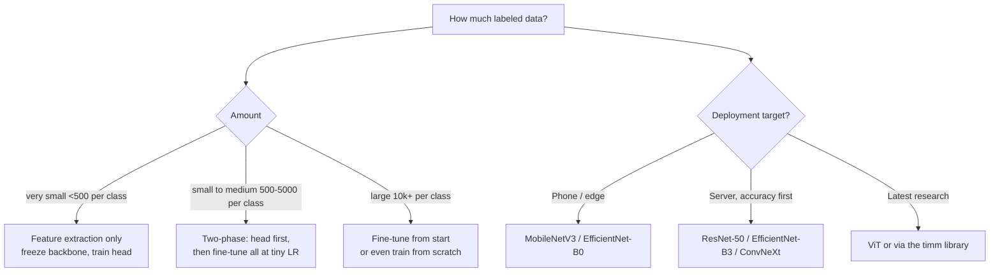

# Vision 3 — Transfer Learning and Pre-trained Models

## Lectures covered
- Transfer Learning
- Pre-trained Models: ResNet, EfficientNet, MobileNet
- Model Training using Transfer Learning

---

## In one sentence
**Transfer learning** is starting from a model that already learned to "see" on millions of images (ImageNet), then teaching it your specific task with just a few thousand examples — getting near state-of-the-art accuracy in an afternoon.

## Real-world analogy
Hiring a chef vs hiring someone off the street to cook a new dish. The chef already knows knife skills, heat control, and seasoning — you just teach them this *specific* recipe. A pre-trained CNN is the chef: it already knows edges, textures, and shapes, you just teach it the new categories.

## The intuition (plain English)
- A network pre-trained on ImageNet has already learned reusable visual concepts in its early/middle layers.
- **Feature extraction**: freeze the pre-trained backbone, train only a new final layer on your classes — fast, works with very little data.
- **Fine-tuning**: also unfreeze deeper layers and train them at a *much smaller* learning rate so you don't wreck the pre-trained knowledge.
- A common winning recipe is **two phases**: feature-extract for a few epochs, then fine-tune the whole network at a tiny LR.

## Mini worked example — adapting ResNet-50 to 4 classes (car damage)

```python
from torchvision import models
import torch.nn as nn

# 1. Load weights pre-trained on ImageNet (1000 classes)
model = models.resnet50(weights=models.ResNet50_Weights.IMAGENET1K_V2)

# 2. The original network's last layer:  nn.Linear(2048, 1000)
print(model.fc)            # Linear(in_features=2048, out_features=1000, ...)

# 3. Replace it with a new head for OUR 4 classes:
model.fc = nn.Linear(model.fc.in_features, 4)

# 4. Phase 1 — freeze the backbone, train only model.fc
for p in model.parameters():
    p.requires_grad = False
for p in model.fc.parameters():
    p.requires_grad = True
# train for ~5 epochs at lr=1e-3

# 5. Phase 2 — unfreeze everything, fine-tune at a tiny LR
for p in model.parameters():
    p.requires_grad = True
# train for ~15 more epochs at lr=1e-5
```

Net effect: a 25M-parameter model that already "sees" gets specialized to your 4 classes with maybe 1,000 labeled images per class.

## At-a-glance — choosing your transfer-learning recipe



```
   ImageNet pre-train          Your task
   ───────────────────         ──────────
   1.4M images, 1000 classes ─►  4 classes, 4k images
                                   │
        knows edges/textures       │  swap final layer
        from millions of photos    │  fine-tune softly
                                   │
                              high accuracy quickly
```

## Why this matters
- For 99% of vision projects today you should not train from scratch — transfer learning is the default.
- Picking the right pre-trained model (size vs accuracy vs deployment target) is more impactful than tuning hyperparameters.
- Matching the **input preprocessing** (size + ImageNet normalization) to the pre-trained model is a silent-failure trap many beginners hit.

---

## 1. Why transfer learning is non-negotiable in 2025

Training a CNN from scratch on a few thousand images gives mediocre accuracy. Taking a model **pre-trained on ImageNet** (1.4M images, 1000 classes) and fine-tuning it on your few thousand → near state-of-the-art.

The pre-trained model already learned:
- Edges
- Textures
- Object parts
- High-level patterns

You're just *adapting* the last layer(s) to your specific classes.

> **For 99% of vision projects, you should not be training from scratch.**

---

## 2. Two flavors of transfer learning

### Feature extraction
- **Freeze** the pre-trained layers (no gradient updates)
- Replace + train only the final classifier head
- Fast, works with small data

### Fine-tuning
- Replace the head AND **unfreeze** some / all of the backbone
- Use a small learning rate so you don't destroy the pre-trained weights
- More accurate, slower, needs more data

A common middle ground: **two-phase training** — first feature-extract, then unfreeze and fine-tune at a small LR.

---

## 3. Loading a pre-trained model in PyTorch

```python
import torch
import torch.nn as nn
from torchvision import models

# ResNet-50, pre-trained on ImageNet
model = models.resnet50(weights=models.ResNet50_Weights.IMAGENET1K_V2)

# replace the final layer for your number of classes
n_classes = 4
model.fc = nn.Linear(model.fc.in_features, n_classes)
```

For different architectures:
```python
models.efficientnet_b0(weights=...)              # EfficientNet
models.mobilenet_v3_large(weights=...)            # MobileNet
models.vit_b_16(weights=...)                      # Vision Transformer
models.convnext_tiny(weights=...)                 # ConvNeXt
```

---

## 4. Freezing layers

```python
# freeze all backbone params
for p in model.parameters():
    p.requires_grad = False

# unfreeze just the new head
n_classes = 4
model.fc = nn.Linear(model.fc.in_features, n_classes)        # new layer auto requires_grad=True

# only optimize the head
optimizer = torch.optim.Adam(model.fc.parameters(), lr=1e-3)
```

For fine-tuning later:
```python
# unfreeze everything
for p in model.parameters():
    p.requires_grad = True
optimizer = torch.optim.Adam(model.parameters(), lr=1e-5)        # tiny LR
```

---

## 5. Two-phase fine-tuning recipe

```python
# Phase 1: head only
for p in model.parameters(): p.requires_grad = False
model.fc = nn.Linear(model.fc.in_features, n_classes)
optimizer = torch.optim.Adam(model.fc.parameters(), lr=1e-3)
train_for(epochs=5)

# Phase 2: full fine-tune
for p in model.parameters(): p.requires_grad = True
optimizer = torch.optim.Adam(model.parameters(), lr=1e-5)
train_for(epochs=15)
```

Often gives the best of both worlds. Used in the car-damage-detection project.

---

## 6. Layer-wise learning rates (advanced)

Lower LR for early layers (general features), higher for later layers (task-specific):

```python
optimizer = torch.optim.Adam([
    {"params": model.layer1.parameters(), "lr": 1e-6},
    {"params": model.layer2.parameters(), "lr": 1e-5},
    {"params": model.layer3.parameters(), "lr": 1e-4},
    {"params": model.layer4.parameters(), "lr": 1e-4},
    {"params": model.fc.parameters(),     "lr": 1e-3},
])
```

---

## 7. Image preprocessing — must match the pre-training

ImageNet stats:
```python
transforms.Normalize(mean=[0.485, 0.456, 0.406], std=[0.229, 0.224, 0.225])
```

These are the per-channel means and stds of ImageNet. Pre-trained models expect this normalization.

Most pre-trained models expect 224×224 input (or 299×299 for some).

```python
from torchvision import transforms
tfm = transforms.Compose([
    transforms.Resize(256),
    transforms.CenterCrop(224),
    transforms.ToTensor(),
    transforms.Normalize(mean=[0.485, 0.456, 0.406], std=[0.229, 0.224, 0.225]),
])
```

For the new `weights` API, the transform comes built-in:
```python
weights = models.ResNet50_Weights.IMAGENET1K_V2
preprocess = weights.transforms()
```

---

## 8. Common pre-trained models compared

| Model | Params | ImageNet top-1 | When pick |
|---|---|---|---|
| **ResNet-50** | 25M | 80.9% | Solid baseline; widely used |
| **ResNet-152** | 60M | 82.4% | Deeper if you have data |
| **EfficientNet-B0** | 5M | 77.7% | Mobile-friendly; small |
| **EfficientNet-B7** | 66M | 84.3% | High-accuracy CPU/GPU |
| **MobileNetV3** | 5M | 74.0% | Mobile / edge deployment |
| **ViT-B/16** | 86M | 81.1% | Modern; benefits from more data |
| **ConvNeXt-Tiny** | 28M | 82.1% | Great accuracy/efficiency tradeoff |

For a portfolio project: **EfficientNet-B0** or **ResNet-50** is a great default.

---

## 9. timm — the modern alternative

`timm` (PyTorch Image Models) has hundreds of pre-trained models, often state-of-the-art:

```bash
pip install timm
```

```python
import timm
model = timm.create_model("efficientnet_b3", pretrained=True, num_classes=4)
```

For competitions / research, `timm` is the standard.

---

## 10. End-to-end transfer learning recipe

```python
import torch
import torch.nn as nn
from torch.utils.data import DataLoader
from torchvision import datasets, transforms, models

# Data
train_tfm = transforms.Compose([
    transforms.Resize(256),
    transforms.RandomResizedCrop(224),
    transforms.RandomHorizontalFlip(),
    transforms.ToTensor(),
    transforms.Normalize([0.485, 0.456, 0.406], [0.229, 0.224, 0.225]),
])
val_tfm = transforms.Compose([
    transforms.Resize(256),
    transforms.CenterCrop(224),
    transforms.ToTensor(),
    transforms.Normalize([0.485, 0.456, 0.406], [0.229, 0.224, 0.225]),
])

train_ds = datasets.ImageFolder("data/train", transform=train_tfm)
val_ds   = datasets.ImageFolder("data/val", transform=val_tfm)

train_loader = DataLoader(train_ds, batch_size=32, shuffle=True, num_workers=4)
val_loader   = DataLoader(val_ds, batch_size=64, num_workers=4)

# Model
model = models.efficientnet_b0(weights=models.EfficientNet_B0_Weights.IMAGENET1K_V1)
model.classifier[1] = nn.Linear(model.classifier[1].in_features, len(train_ds.classes))

# Phase 1: feature extraction
for p in model.features.parameters(): p.requires_grad = False
optimizer = torch.optim.Adam(model.classifier.parameters(), lr=1e-3)
train(model, train_loader, val_loader, epochs=5)

# Phase 2: fine-tune
for p in model.parameters(): p.requires_grad = True
optimizer = torch.optim.Adam(model.parameters(), lr=1e-5)
train(model, train_loader, val_loader, epochs=15)
```

This is exactly the recipe for the car-damage-detection project.

---

## 11. Common pitfalls

| Mistake | Effect | Fix |
|---|---|---|
| Wrong normalization stats | poor accuracy | use ImageNet stats for transfer learning |
| Forgot to replace final layer | trains 1000-class output | replace `model.fc` (or equivalent) |
| LR too high during fine-tune | destroys pre-trained weights | use 1e-4 or smaller |
| Unfroze everything from epoch 0 | catastrophic forgetting | two-phase: freeze, then unfreeze |
| Used 224×224 model on tiny images | can't extract features | upscale or pick a model trained at smaller resolution |

## Self-check

- [ ] Why is transfer learning the default in 2025?
- [ ] Two flavors of transfer learning — when use each?
- [ ] What's the typical input size + normalization for an ImageNet model?
- [ ] Walk through the two-phase fine-tune recipe.
- [ ] What's `timm` and why is it useful?
- [ ] Pick a pre-trained model for a small mobile-deployed app.
- [ ] Pick one for a high-accuracy server-side classifier.
- [ ] Why use a tiny LR during fine-tune?

---

## Glossary

| Term | Plain meaning |
|------|---------------|
| **Transfer learning** | Reusing a model trained on one task to solve a related task |
| **Pre-trained model** | A network whose weights were already learned on a big dataset (e.g., ImageNet) |
| **Backbone** | The feature-extracting part of a pre-trained network |
| **Head** | The final task-specific layers (the classifier) |
| **Feature extraction** | Freeze the backbone, train only a new head |
| **Fine-tuning** | Unfreeze (some of) the backbone and continue training at a small LR |
| **Two-phase training** | Feature-extract first, then fine-tune — the modern default |
| **Frozen layer** | Layer with `requires_grad=False`; gradients don't flow into it |
| **Unfreeze** | Re-enable training on previously frozen layers |
| **Catastrophic forgetting** | Aggressive fine-tuning erases useful pre-trained knowledge |
| **ImageNet** | The 1.4M-image, 1000-class dataset most pre-trained models were trained on |
| **`models.resnet50` / `efficientnet_b0`** | torchvision shortcuts to load pre-trained networks |
| **`weights=...`** | Modern torchvision API for selecting which pre-trained weight set to load |
| **`weights.transforms()`** | Auto-generated preprocessing pipeline matching the pre-trained model |
| **`model.fc` / `model.classifier`** | Common attribute names for the final classifier layer |
| **timm** | PyTorch Image Models — community library with hundreds of pre-trained vision models |
| **ResNet** | Residual-network family with skip connections; reliable baseline |
| **EfficientNet** | Family that scales depth/width/resolution together — accuracy-efficient |
| **MobileNet** | Compact CNN family for mobile/edge deployment |
| **ViT** | Vision Transformer — splits images into patches and uses attention |
| **ConvNeXt** | Modern CNN designed with Transformer-era training tricks |
| **Layer-wise LR** | Different learning rates for different layers (early layers smaller, late layers larger) |
| **Top-1 accuracy** | Whether the top-predicted class matches the true label |
| **224×224** | Standard input size for most ImageNet pre-trained models |
| **Normalize stats** | The per-channel mean/std the pre-trained model expects (use ImageNet's) |
| **`ImageFolder`** | torchvision dataset that infers labels from folder names |
| **Distillation** | Compressing a big teacher model into a smaller student model |

## Further reading
- Project that uses this directly: [../06-projects/01-car-damage-detection.md](../06-projects/01-car-damage-detection.md)
- Augmentation pairs with transfer learning: [02-data-augmentation.md](02-data-augmentation.md)
- For NLP: equivalent idea via BERT in [../04-sequence/05-bert-huggingface.md](../04-sequence/05-bert-huggingface.md)
- timm docs: https://huggingface.co/docs/timm
