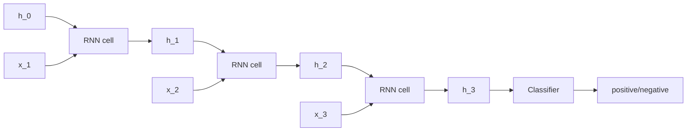

# Sequence 1 — Recurrent Neural Networks (RNN)

## Lectures covered
- RNN
- Vanishing Gradient Problem

---

## In one sentence
A **Recurrent Neural Network (RNN)** processes a sequence one item at a time while keeping a "running memory" of what it saw before — perfect for language, audio, and time-series where order matters.

## Real-world analogy
Reading a sentence word by word: you don't reset your understanding on each word, you carry forward a running impression that gets updated. After "The cat sat on the…", you're already expecting *mat / sofa / floor*. An RNN does the same — it keeps a hidden state that's updated by each new word.

## The intuition (plain English)
- Unlike an MLP/CNN that sees everything at once, an RNN takes in **one timestep at a time** (one word, one audio frame, one daily price).
- Each step's output depends on **(this input)** AND **(memory from the past)**.
- The same weight matrices are reused at every step → fixed parameter count regardless of sequence length.
- Vanilla RNNs **forget** what they saw long ago because the gradient shrinks as it flows back through time (the **vanishing gradient** problem). LSTM and Transformer fix this differently.

## Mini worked example — sentiment classification on a 4-word review

Sequence: "the movie was great". The RNN processes one word at a time:

```
                                                       hidden state h_t
                                                       (running impression)

t=1  word="the"     → h_1 = tanh(W_xh · emb("the")    + W_hh · h_0  + b_h) = [0.10, -0.05]
t=2  word="movie"   → h_2 = tanh(W_xh · emb("movie")  + W_hh · h_1  + b_h) = [0.15,  0.02]
t=3  word="was"     → h_3 = tanh(W_xh · emb("was")    + W_hh · h_2  + b_h) = [0.18,  0.08]
t=4  word="great"   → h_4 = tanh(W_xh · emb("great")  + W_hh · h_3  + b_h) = [0.45,  0.62]
                                                                              ↑
                                                            "great" pulled the state strongly
                                                              positive — encoded sentiment

Final classifier:  logits = W_hy · h_4 + b_y → softmax → "positive" with 92% confidence
```

Same RNN, same weights, every step — the **memory** does the heavy lifting.

## At-a-glance — the RNN unrolled across time

```
   t=1            t=2            t=3            t=4

  h₀ ──► [RNN] ──► h₁ ──► [RNN] ──► h₂ ──► [RNN] ──► h₃ ──► [RNN] ──► h₄
          ▲              ▲              ▲              ▲
          │              │              │              │
        x₁="the"      x₂="movie"     x₃="was"       x₄="great"
                                                       │
                                                       ▼
                                                    classify
                                                    (positive / negative)

   Same weights W_xh, W_hh, W_hy reused every timestep.
```



## Why this matters
- The RNN is the gateway architecture to all sequence models — once you understand `h_t = f(x_t, h_{t-1})`, LSTMs and Transformers become natural extensions.
- The **vanishing gradient** problem here motivates *every* later architecture (LSTM, GRU, Transformer).
- Many real systems (streaming speech, on-device keyboards, small forecasting models) still use RNNs because they're tiny and fast.

---

## 1. The sequence problem

CNNs/MLPs see a fixed-size input. Real-world sequences (text, audio, time-series) have variable length and **order matters**:
- "the dog bit the man" ≠ "the man bit the dog"
- "happy → sad" ≠ "sad → happy"

We need a model that processes inputs one at a time and **maintains state**.

---

## 2. The RNN cell

At each timestep $t$:
$$h_t = \tanh(W_{xh} x_t + W_{hh} h_{t-1} + b_h)$$
$$y_t = W_{hy} h_t + b_y$$

- $x_t$: input at time t
- $h_t$: hidden state at time t (the "memory")
- $h_{t-1}$: previous state — this is the recurrence
- The same weights $W_{xh}$, $W_{hh}$ are used at every timestep

```
x_1 ──► [RNN] ──► h_1 ──► y_1
                    │
x_2 ──► [RNN] ──► h_2 ──► y_2
                    │
x_3 ──► [RNN] ──► h_3 ──► y_3
                    │
                  ...
```

---

## 3. PyTorch RNN

```python
import torch.nn as nn

rnn = nn.RNN(input_size=10, hidden_size=20, num_layers=2, batch_first=True)

# input shape: (batch, seq_len, features)
x = torch.randn(4, 50, 10)              # batch=4, seq=50, features=10
output, h_n = rnn(x)
# output: (4, 50, 20)  — h at every step
# h_n:    (2, 4, 20)   — h at the final step, per layer
```

---

## 4. Use cases (where RNNs apply)

| Pattern | Output | Example |
|---|---|---|
| **Many-to-one** | one output for whole sequence | Sentiment classification |
| **One-to-many** | sequence from one input | Image captioning |
| **Many-to-many (aligned)** | one output per input | POS tagging |
| **Many-to-many (encoder-decoder)** | different-length sequences | Translation, summarization |

---

## 5. The vanishing gradient problem

Backpropagation through time (BPTT) unrolls the RNN through the sequence. Gradients propagate through $W_{hh}$ at each step:
$$\frac{\partial L}{\partial h_0} = \frac{\partial L}{\partial h_T} \cdot \prod_{t=1}^{T} \frac{\partial h_t}{\partial h_{t-1}}$$

If $\|W_{hh}\| < 1$ → gradients shrink exponentially with sequence length → **early steps don't learn**.
If $\|W_{hh}\| > 1$ → gradients explode → NaN losses.

For sequences longer than ~20 steps, plain RNNs **forget** what they saw earlier.

### Mitigations
- Better activations (tanh saturates → use ReLU? RNNs with ReLU are unstable — special techniques needed)
- Gradient clipping (handles explosion):
  ```python
  torch.nn.utils.clip_grad_norm_(model.parameters(), max_norm=1.0)
  ```
- Better cell architectures: **LSTM, GRU** (next file)

---

## 6. Bidirectional RNN

Process the sequence both forward and backward; concatenate. Useful when full context is available (not real-time):

```python
rnn = nn.RNN(input_size=10, hidden_size=20, bidirectional=True, batch_first=True)
```

Output dim doubles to `2 * hidden_size`.

---

## 7. Stacking layers

```python
nn.RNN(input_size=10, hidden_size=20, num_layers=3)
```

Hidden state from layer 1 feeds into layer 2 at the same time step. Each layer can learn higher-level temporal features.

---

## 8. RNNs in 2025 — when (and when not) to use them

### Still appropriate
- Short sequences (length < 50)
- Streaming / real-time data with tight latency
- Embedded / mobile (smaller than Transformers)
- Educational / illustrative purposes

### Beaten by Transformers for
- Long sequences (Transformers handle 1000s easily)
- NLP — pretty much everything
- Anywhere you have lots of data

For the bootcamp: understand RNN/LSTM as foundation, but modern projects use Transformers / BERT.

---

## 9. Word-level text generator (illustrative example)

```python
import torch
import torch.nn as nn

class CharRNN(nn.Module):
    def __init__(self, vocab_size, embed_size=64, hidden_size=128, num_layers=2):
        super().__init__()
        self.embed = nn.Embedding(vocab_size, embed_size)
        self.rnn = nn.LSTM(embed_size, hidden_size, num_layers, batch_first=True)
        self.head = nn.Linear(hidden_size, vocab_size)

    def forward(self, x, hidden=None):
        x = self.embed(x)
        out, hidden = self.rnn(x, hidden)
        logits = self.head(out)
        return logits, hidden
```

Train it on Shakespeare text → generates Shakespeare-ish text. Karpathy's classic blog post; a great hands-on RNN exercise.

---

## 10. Common pitfalls

| Mistake | Effect | Fix |
|---|---|---|
| Forgot `batch_first=True` | wrong shape interpretation | always set it |
| No gradient clipping | NaN losses | `clip_grad_norm_` |
| Long sequences with vanilla RNN | model forgets early | use LSTM / GRU / Transformer |
| Treating hidden state at end as "the encoding" without proper pooling | OK for small but suboptimal | use mean / max pool over outputs |
| Forgetting to detach hidden state across batches | memory leak / wrong gradients | `hidden = hidden.detach()` |

## Self-check

- [ ] Walk through the RNN cell update equation.
- [ ] What's the vanishing gradient problem and why does it hurt RNNs?
- [ ] Difference between input shape (B, T, F) with `batch_first=True` and (T, B, F)?
- [ ] When use bidirectional RNN?
- [ ] Why do modern NLP problems use Transformers instead of RNNs?
- [ ] What's gradient clipping and why is it needed for RNNs?
- [ ] What's the difference between "many-to-one" and "many-to-many" RNN setups?
- [ ] Implement a sentiment classifier with `nn.LSTM`.

---

## Glossary

| Term | Plain meaning |
|------|---------------|
| **Sequence** | An ordered series of inputs (words, time steps, audio frames) |
| **Timestep** | One position in the sequence |
| **RNN** | Recurrent Neural Network — processes a sequence one step at a time |
| **Hidden state (h_t)** | The "memory" passed from one timestep to the next |
| **Recurrence** | The idea that the next state depends on the previous state |
| **`W_xh`, `W_hh`, `W_hy`** | Input→hidden, hidden→hidden, hidden→output weight matrices |
| **`tanh`** | Default RNN activation; range (−1, 1) |
| **Embedding** | Trainable vector representing a word/token |
| **`nn.Embedding`** | PyTorch lookup that maps token IDs to vectors |
| **`nn.RNN`** | PyTorch's vanilla recurrent layer |
| **`batch_first=True`** | Tells PyTorch the input is (batch, seq, features) instead of (seq, batch, features) |
| **`num_layers`** | How many RNN layers to stack |
| **Bidirectional** | Process the sequence forward and backward, then concatenate |
| **Many-to-one** | One output per sequence (e.g., sentiment classification) |
| **One-to-many** | Generate a sequence from one input (e.g., image captioning) |
| **Many-to-many** | Output token per input token (e.g., POS tagging) |
| **Encoder-decoder** | Two RNNs: one encodes input into a vector, one decodes into output |
| **BPTT (Backpropagation Through Time)** | Backprop applied to the unrolled RNN across timesteps |
| **Vanishing gradient** | Gradients shrink exponentially across long sequences — early steps stop learning |
| **Exploding gradient** | Gradients grow without bound — usually causes NaN losses |
| **Gradient clipping** | Cap gradient norm to avoid explosions |
| **`clip_grad_norm_`** | PyTorch utility for gradient clipping |
| **Detach** | `.detach()` — stop gradient tracking, used to break backprop chains across batches |
| **Padding** | Filling shorter sequences with a dummy token so they share a length in a batch |
| **Packed sequence** | Tensor format that lets RNNs skip padding tokens efficiently |
| **POS tagging** | Labeling each word with its part of speech |
| **Streaming inference** | Producing outputs as inputs arrive, one step at a time |

## Further reading
- Visual + math reference: [../architectures-and-math.md](../architectures-and-math.md)
- Next: [02-lstm.md](02-lstm.md) — gated cells that beat the vanishing-gradient problem
- Modern replacement: [03-transformer-architecture.md](03-transformer-architecture.md)
