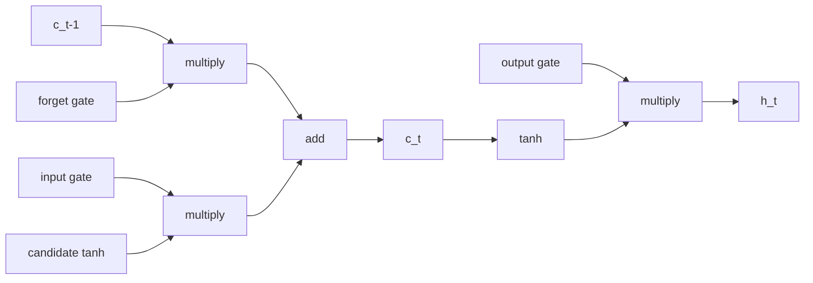

# Sequence 2 — LSTM (and GRU)

## Lectures covered
- LSTM

---

## In one sentence
**LSTM (Long Short-Term Memory)** is an RNN cell with three little gates that decide *what to forget, what to remember, and what to output* — letting the network hold information across hundreds of timesteps where a vanilla RNN would forget after about twenty.

## Real-world analogy
Imagine a notebook with three smart switches:
- A **forget switch** that decides which old notes to cross out.
- An **input switch** that decides which new notes to actually write down.
- An **output switch** that decides which notes from the page to read out loud right now.
LSTM's gates do exactly that to its memory cell on every timestep, learning *what's worth keeping*.

## The intuition (plain English)
- Vanilla RNNs forget because their memory is *multiplied* through time → it shrinks or explodes.
- LSTM keeps a separate **cell state** that gets *added to*, not multiplied — gradients can flow back through it cleanly.
- Three sigmoid **gates** (output values 0–1) control what gets added, kept, or revealed.
- **GRU** is a simpler cousin with two gates — fewer parameters, similar performance for most tasks.

## Mini worked example — what each gate does to the cell state

Suppose at timestep `t-1` the cell state is `c_{t-1} = [2.0, -1.0, 0.5]` (3-dim memory). Now the LSTM sees a new input.

```
forget gate    f_t = sigmoid(...) = [0.9, 0.1, 0.5]      ← keep most of dim 0,
                                                            mostly forget dim 1, half-keep dim 2

candidate     ~c_t = tanh(...)    = [0.3,  0.6, -0.4]    ← new info proposed

input gate     i_t = sigmoid(...) = [0.2,  0.8, 0.0]     ← lightly accept dim 0,
                                                            heavily accept dim 1, ignore dim 2

new cell state:
  c_t = f_t · c_{t-1}     +   i_t · ~c_t
      = [0.9·2.0, 0.1·(-1.0), 0.5·0.5]   +   [0.2·0.3, 0.8·0.6, 0.0·(-0.4)]
      = [1.80, -0.10, 0.25]              +   [0.06, 0.48, 0.0]
      = [1.86,  0.38, 0.25]

output gate    o_t = sigmoid(...) = [0.7, 0.5, 0.9]
hidden state   h_t = o_t · tanh(c_t) = [0.7·tanh(1.86), 0.5·tanh(0.38), 0.9·tanh(0.25)]
                                     ≈ [0.66, 0.18, 0.22]    ← what's exposed to the next layer
```

The cell-state update is **additive** — that's why gradients survive across long sequences.

## At-a-glance — LSTM cell flow

```
                       c_{t-1}  ──────────►  ×  ──────────►  +  ──────────►  c_t
                                              ▲                ▲                │
                            forget gate ──────┘   input gate ──┘                │
                                                                                ▼
                                                                              tanh
                                                                                │
                                                                                ▼
                       h_{t-1} + x_t  ──► [forget,input,candidate,output]      ×
                                                                  output gate ──┘
                                                                                │
                                                                                ▼
                                                                              h_t
```



## Why this matters
- LSTM is what made language modeling, machine translation, and speech recognition viable in 2014–2017 — the bridge between RNNs and Transformers.
- Many real-world sequence models on edge devices still use LSTM/GRU because they're tiny and stream naturally.
- Understanding LSTM gating is great prep for **attention** (which generalizes the "decide what to read" idea to every position at once).

---

## 1. Why LSTM exists

Plain RNNs forget anything more than ~20 steps back. **LSTM (Long Short-Term Memory)** introduces a separate "memory cell" with explicit gating — what to forget, what to remember, what to output.

Result: LSTM can hold information across hundreds of steps, dramatically better at language and long sequences than vanilla RNN.

---

## 2. LSTM cell — the gates

Three sigmoid gates control the flow:

```
                 ┌─────────────────┐
              ──►│   forget gate   │── × ── add ──►   new cell state c_t
                 └─────────────────┘                       │
                 ┌─────────────────┐                       │
              ──►│   input gate    │── × ── tanh ─────────┘
                 └─────────────────┘
                 ┌─────────────────┐
              ──►│   output gate   │── × ── tanh(c_t) ───►  hidden state h_t
                 └─────────────────┘
```

### Equations
- **Forget gate**: $f_t = \sigma(W_f [h_{t-1}, x_t] + b_f)$ — what to drop from the cell
- **Input gate**: $i_t = \sigma(W_i [h_{t-1}, x_t] + b_i)$ — how much new info to add
- **Candidate**: $\tilde{c}_t = \tanh(W_c [h_{t-1}, x_t] + b_c)$ — the new info itself
- **New cell**: $c_t = f_t \odot c_{t-1} + i_t \odot \tilde{c}_t$
- **Output gate**: $o_t = \sigma(W_o [h_{t-1}, x_t] + b_o)$ — how much of the cell to expose
- **New hidden**: $h_t = o_t \odot \tanh(c_t)$

### Two states flow through time
- $c_t$: cell state (long-term memory)
- $h_t$: hidden state (short-term memory, what's exposed to next layer / output)

---

## 3. Why this fixes vanishing gradients

The cell-state update is **additive** (gated). Gradients of $c_t$ wrt $c_{t-1}$ are dominated by $f_t$ — a value between 0 and 1, learned by the model.

Compare to vanilla RNN where $h_t$ involves a multiplication by $W_{hh}$ tanh-derivative-squashed every step → exponential decay.

LSTM's additive gating lets gradients flow back through time without the same shrinkage.

---

## 4. PyTorch LSTM

```python
import torch.nn as nn

lstm = nn.LSTM(
    input_size=10,
    hidden_size=20,
    num_layers=2,
    bidirectional=True,
    dropout=0.2,
    batch_first=True,
)

x = torch.randn(4, 50, 10)
output, (h_n, c_n) = lstm(x)
# output: (4, 50, 40)   — 40 because bidirectional doubles hidden_size
# h_n:    (4, 4, 20)    — final hidden state per (layer * direction, batch, hidden)
# c_n:    (4, 4, 20)    — final cell state
```

The interface returns *both* hidden and cell states because some downstream tasks need both.

---

## 5. GRU — the simpler cousin

**Gated Recurrent Unit** combines the forget and input gates into one and merges cell + hidden:

- **Reset gate**: $r_t$ — how much past to forget
- **Update gate**: $z_t$ — interpolate between old and new hidden

```python
gru = nn.GRU(input_size=10, hidden_size=20, batch_first=True)
```

Fewer parameters → faster training, slightly lower capacity.
Often roughly equal performance to LSTM in practice.
Modern preference often goes to LSTM for slight edge, but GRU is fine.

---

## 6. Building a sequence classifier

```python
import torch
import torch.nn as nn

class SentimentLSTM(nn.Module):
    def __init__(self, vocab_size, embed_dim=128, hidden_dim=256, n_classes=2):
        super().__init__()
        self.embed = nn.Embedding(vocab_size, embed_dim, padding_idx=0)
        self.lstm  = nn.LSTM(embed_dim, hidden_dim, batch_first=True, bidirectional=True)
        self.head  = nn.Linear(hidden_dim * 2, n_classes)         # ×2 for bidirectional

    def forward(self, x):
        # x: (batch, seq_len) of token ids
        emb = self.embed(x)                                        # (B, T, embed)
        output, (h_n, c_n) = self.lstm(emb)                        # output: (B, T, 2*hidden)

        # take the last time step's output (or pool)
        last = output[:, -1, :]                                    # (B, 2*hidden)
        return self.head(last)
```

For variable-length sequences, use **packed sequences** to skip padding tokens:
```python
from torch.nn.utils.rnn import pack_padded_sequence, pad_packed_sequence

packed = pack_padded_sequence(emb, lengths=seq_lens, batch_first=True, enforce_sorted=False)
output, (h_n, c_n) = self.lstm(packed)
output, _ = pad_packed_sequence(output, batch_first=True)
```

---

## 7. Encoder-Decoder LSTM (for sequence-to-sequence tasks)

For translation / summarization (before Transformers ate this lunch):

```
input  → [Encoder LSTM] → final_hidden_state → [Decoder LSTM] → output
```

The encoder summarizes the input into a single vector. The decoder generates the output sequence conditioned on it.

This was the dominant approach pre-2017. Now Transformers do this far better.

---

## 8. LSTM use cases that still make sense in 2025

- Time-series forecasting on small datasets
- Real-time / streaming with low latency
- Edge devices (LSTMs are smaller than Transformers)
- Speech / audio (some hybrid models use LSTMs)
- Educational baselines

For NLP from scratch: jump straight to Transformer / BERT (next files).

---

## 9. Common pitfalls

| Mistake | Effect | Fix |
|---|---|---|
| Forgot to detach states across batches | gradients leak across batches | `h = h.detach()` for stateful inference |
| Wrong handling of variable-length seqs | model "learns" padding tokens | use packed sequences |
| Comparing last hidden to mean-pool | last is one timestep; pool covers all | mean/max pool often better |
| Initializing forget-gate bias at 0 | LSTMs forget aggressively early | initialize forget bias to 1 (some papers) |
| Single-layer LSTM on hard tasks | underfit | stack 2-3 layers |

## Self-check

- [ ] Why does plain RNN fail on long sequences?
- [ ] Walk through the three LSTM gates and what each controls.
- [ ] Difference between cell state and hidden state?
- [ ] Why does LSTM's additive update fix vanishing gradients?
- [ ] When prefer GRU over LSTM?
- [ ] What's a packed sequence and when use it?
- [ ] Build a sentiment classifier with bidirectional LSTM.
- [ ] What's the encoder-decoder pattern and what replaced it?

---

## Glossary

| Term | Plain meaning |
|------|---------------|
| **LSTM** | Long Short-Term Memory — gated RNN cell that handles long sequences |
| **GRU** | Gated Recurrent Unit — simpler 2-gate cousin of LSTM |
| **Cell state (c_t)** | LSTM's long-term memory; updated additively, gradients survive |
| **Hidden state (h_t)** | What the cell exposes outward; passed to next layer or output head |
| **Gate** | A 0-to-1 vector (sigmoid output) that controls how much information passes |
| **Forget gate (f_t)** | Decides which parts of the cell state to drop |
| **Input gate (i_t)** | Decides how much new info to write into the cell |
| **Candidate (\~c_t)** | The new info itself, produced by a tanh |
| **Output gate (o_t)** | Decides how much of the cell state to expose as h_t |
| **Reset gate (GRU)** | How much past hidden state to forget |
| **Update gate (GRU)** | Interpolation weight between old and new hidden state |
| **Sigmoid** | Squashes inputs to (0, 1); used for all gating |
| **`nn.LSTM`** | PyTorch's LSTM module |
| **`nn.GRU`** | PyTorch's GRU module |
| **Bidirectional LSTM** | LSTM that reads both forward and backward, then concatenates |
| **`hidden_size`** | Dimension of h_t and c_t |
| **`num_layers`** | Stacks multiple LSTM layers vertically |
| **Pack / `pack_padded_sequence`** | Tensor format that lets the LSTM skip padding tokens |
| **`pad_packed_sequence`** | Reverse of pack — back to a regular tensor |
| **`enforce_sorted`** | Whether sequences in a batch are sorted by length (PyTorch optimization) |
| **Detach** | `.detach()` — break gradient graph between batches in stateful settings |
| **Encoder-decoder** | Two networks: encoder summarizes input; decoder generates output |
| **Sequence-to-sequence (seq2seq)** | Encoder-decoder pattern for variable-length input → variable-length output |
| **Vanishing gradient** | The shrinkage problem LSTM solves via additive cell-state updates |
| **Forget bias** | Initializing forget-gate bias to 1 so the model starts by remembering |
| **Embedding (`padding_idx`)** | Tells `nn.Embedding` which token ID is padding (zeros gradients there) |

## Further reading
- Previous: [01-rnn.md](01-rnn.md) — vanilla RNN + the vanishing gradient problem
- Modern replacement: [03-transformer-architecture.md](03-transformer-architecture.md)
- Attention motivation: [04-attention.md](04-attention.md) — generalizes "decide what to read"
