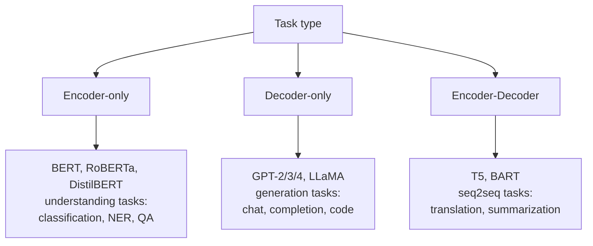

# Sequence 3 — Transformer Architecture

## Lectures covered
- Transformer Architecture
- Word Embeddings (intro — covered fully in NLP module)

---

## In one sentence
A **Transformer** is a sequence model that throws out recurrence entirely and instead lets every token directly look at every other token via **attention** — making it parallel on GPUs, great at long-range dependencies, and the foundation of GPT, BERT, ChatGPT, and almost every modern AI system.

## Real-world analogy
RNNs are like reading a book one word at a time and trying to remember the start by the time you reach the end. A Transformer is like having the whole book open on a desk: you can glance back at any page instantly. That random-access view is what attention gives every token at every layer.

## The intuition (plain English)
- A Transformer **embeds** each token (word, image patch) into a vector and **adds a positional encoding** so it knows the order.
- Each layer is two parts: **self-attention** (every token looks at every other token) + a **feed-forward network** (applied independently per position).
- **Residual connections** and **LayerNorm** wrap each part so the network can be very deep without gradients vanishing.
- Stack 6, 12, 24, or 96 of these layers, train on huge data, and you get BERT, GPT-2, GPT-3, etc.

## Mini worked example — what one encoder layer does

Imagine 4 token embeddings for "the cat sat down" each of dimension `d_model = 512`. The encoder layer does:

```
input X     shape (T=4, d=512)        ← token embeddings + positional encodings

Sub-layer 1 — Multi-Head Self-Attention
    Q, K, V = X · W_Q, X · W_K, X · W_V       (each shape (4, 512))
    For each token, attention computes a 4-weight distribution over all tokens
    → produces a new vector that mixes information from the whole sentence
    output1 shape (4, 512)
    after residual + LayerNorm:  X' = LN(X + output1)

Sub-layer 2 — Position-wise Feed-Forward
    For each token independently:  hidden = ReLU(X' · W₁ + b₁)        (4, 2048)
                                    out    =       hidden · W₂ + b₂   (4, 512)
    after residual + LayerNorm:  X'' = LN(X' + out)

X''  is the encoder layer's output, same shape (4, 512), ready for the next layer.
```

Stack 12 of these → BERT-base. Stack 96 + scale up → GPT-3.

## At-a-glance — the three Transformer flavors



```
   Encoder block (BERT-style):

   x ─► [Self-Attn] ─► +residual ─► LayerNorm ─► [FFN] ─► +residual ─► LayerNorm ─► out
        all tokens                                     applied per token
        attend to                                     independently
        all tokens
```

## Why this matters
- Every state-of-the-art model since 2018 (BERT, GPT, ViT, AlphaFold, Stable Diffusion's text encoder, Whisper) is a Transformer.
- Choosing **encoder vs decoder vs encoder-decoder** is the highest-level design decision in any modern NLP project.
- Understanding **positional encoding** explains why context length is a hard limit on Transformer models.

---

## 1. Why Transformers replaced RNNs

| | RNN/LSTM | Transformer |
|---|---|---|
| Sequence processing | sequential | parallel |
| Long-range dependencies | weak (despite gating) | excellent |
| Train speed | slow (sequential) | fast (parallel on GPU) |
| Inference latency | low (per-token) | depends |
| State of the art | almost nowhere | everywhere |

Single insight: **attention is all you need** (Vaswani et al., 2017). Drop recurrence; use attention to let every token attend to every other token directly.

This launched: BERT, GPT, T5, BART, ViT, Whisper, AlphaFold, modern LLMs, modern image models.

---

## 2. The architecture (high-level)

The original Transformer is **encoder-decoder**:

```
       INPUT                           OUTPUT
       SEQUENCE                        SEQUENCE
          ↓                                ↓
     ┌─────────┐                      ┌─────────┐
     │ embed + │                      │ embed + │
     │  posi-  │                      │  posi-  │
     │  tional │                      │  tional │
     └────┬────┘                      └────┬────┘
          ↓                                ↓
   ┌─[Encoder layer × N]─┐         ┌─[Decoder layer × N]─┐
   │  - Self-attention   │   ───►  │  - Masked self-attn │
   │  - FFN              │   info  │  - Cross-attention  │  ← from encoder
   │  - Residual + LN    │         │  - FFN              │
   └─────────────────────┘         │  - Residual + LN    │
                                    └────┬────────────────┘
                                          ↓
                                       linear → softmax
                                          ↓
                                       output token probs
```

Modern variants:
- **Encoder-only** (BERT) → understanding tasks (classification, NER)
- **Decoder-only** (GPT) → generation
- **Encoder-decoder** (T5, BART) → translation / summarization

---

## 3. The encoder block

```
input (B, T, d_model)
   │
   ▼
┌────────────────────────────────────┐
│  Multi-Head Self-Attention         │
│  (Q, K, V from same input)         │
└──────────┬─────────────────────────┘
           │  + residual
           ▼
        LayerNorm
           │
           ▼
┌────────────────────────────────────┐
│  Position-wise Feed-Forward (MLP)  │
│  Linear → ReLU/GELU → Linear       │
└──────────┬─────────────────────────┘
           │  + residual
           ▼
        LayerNorm
           ▼
        output
```

Stack `N` of these (typically 6, 12, 24).

---

## 4. Positional encoding — putting order back in

Transformers process all positions in parallel → they have no built-in sense of order. Solution: **add positional encoding** to each token's embedding.

### Sinusoidal (original paper)
$$PE_{(pos, 2i)} = \sin(pos / 10000^{2i/d})$$
$$PE_{(pos, 2i+1)} = \cos(pos / 10000^{2i/d})$$

Each position gets a unique vector. Different positions are easily distinguishable; nearby positions are similar.

### Learned positional embeddings (BERT, GPT)
Just a learnable parameter per position. Works equally well, max length capped at training length.

### Modern (RoPE — Rotary Positional Embeddings)
Used in LLaMA, Mistral, etc. Encodes position by *rotating* the Q/K vectors by an angle proportional to position. Better at extrapolating beyond training length.

---

## 5. The decoder block

```
input (target tokens shifted right)
   │
   ▼
Masked Self-Attention (can only attend to past tokens)
   │  + residual + LN
   ▼
Cross-Attention (Q from decoder, K/V from encoder output)
   │  + residual + LN
   ▼
Feed-Forward (MLP)
   │  + residual + LN
   ▼
output
```

The "masked" attention is what makes generation autoregressive — token at position $t$ can only see tokens at positions ≤ t, never the future.

---

## 6. Multi-head attention (high level)

Instead of one attention computation, do N (e.g., 8) **in parallel**, each with its own Q/K/V projection. Concatenate the results.

Why: different heads can attend to different relationships (subject-verb, adjective-noun, distant-context, etc.).

Full attention math is in `04-attention.md`.

---

## 7. PyTorch Transformer

```python
import torch.nn as nn

# raw transformer encoder
encoder_layer = nn.TransformerEncoderLayer(
    d_model=512, nhead=8, dim_feedforward=2048,
    dropout=0.1, batch_first=True,
)
transformer_encoder = nn.TransformerEncoder(encoder_layer, num_layers=6)

# full encoder-decoder
transformer = nn.Transformer(
    d_model=512, nhead=8, num_encoder_layers=6, num_decoder_layers=6,
    dim_feedforward=2048, dropout=0.1, batch_first=True,
)
```

In practice, we don't write this from scratch — we use HuggingFace pre-trained models (BERT, GPT-2, T5).

---

## 8. Why Transformers scale (the secret weapon)

- **Parallelizable** — process whole sequence at once on GPU
- **Constant path length** — any token can attend to any other in 1 op (vs O(seq_len) for RNN)
- **No vanishing gradient** — gradients flow through residuals
- **Compute scales** — performance keeps improving with more compute, more data, more parameters

This is why we have GPT-4 and Claude. RNNs *couldn't* be scaled this way.

---

## 9. Sizing reference

| Model | Layers | d_model | Heads | Params |
|---|---|---|---|---|
| BERT-base | 12 | 768 | 12 | 110M |
| BERT-large | 24 | 1024 | 16 | 340M |
| GPT-2 small | 12 | 768 | 12 | 124M |
| GPT-2 large | 36 | 1280 | 20 | 774M |
| GPT-3 | 96 | 12288 | 96 | 175B |
| LLaMA 3 70B | 80 | 8192 | 64 | 70B |

---

## 10. Common pitfalls

| Mistake | Effect | Fix |
|---|---|---|
| Forgetting positional encoding | model treats sequence as a bag | always include PE |
| Forgetting attention mask in decoder | sees the future → can't generate | use causal mask |
| Padding tokens attended | wrong attention weights | use padding mask |
| Trying to write Transformer from scratch | bugs, slow | use `nn.Transformer` or HuggingFace |
| Training a tiny Transformer on tiny data | overfits | use a pre-trained one |

## Self-check

- [ ] Why did Transformers replace RNNs?
- [ ] Three architectural variants and what each is used for?
- [ ] What's the role of positional encoding?
- [ ] What's the difference between self-attention and cross-attention?
- [ ] What's masked self-attention and why is it needed in the decoder?
- [ ] Why is multi-head attention better than single-head?
- [ ] Why are residuals + LayerNorm used heavily?
- [ ] Look up GPT-2 small's params: how many heads, layers, d_model?

---

## Glossary

| Term | Plain meaning |
|------|---------------|
| **Transformer** | Attention-based architecture that replaced RNNs for sequences |
| **Encoder** | Reads the input and produces contextual representations |
| **Decoder** | Generates output tokens one at a time, attending to past output and (optionally) encoder |
| **Encoder-only model** | Used for understanding tasks (BERT, RoBERTa) |
| **Decoder-only model** | Used for generation (GPT, LLaMA) |
| **Encoder-decoder** | Used for seq2seq tasks (T5, BART) |
| **Embedding** | Token-id → dense vector lookup |
| **Token** | Smallest input unit — word, subword (BPE/WordPiece), image patch |
| **Vocabulary size** | Total number of tokens the model knows |
| **`d_model`** | Hidden dimension of the model (e.g., 512, 768, 1024) |
| **`n_heads`** | Number of attention heads per layer |
| **`d_k`** | Dimension per head (`d_model / n_heads`) |
| **`num_layers`** | Stacked Transformer layers (typical 6, 12, 24) |
| **`dim_feedforward`** | Hidden width of the FFN sub-layer (often 4× d_model) |
| **Self-attention** | Token attends to other tokens in the same sequence |
| **Cross-attention** | Decoder attends to encoder output |
| **Masked self-attention** | Causal mask blocks attending to future tokens (used in decoders) |
| **Multi-head attention** | Several attention computations in parallel, then concatenated |
| **Positional encoding** | Adds order information to token embeddings |
| **Sinusoidal PE** | Original encoding using sine/cosine of position |
| **Learned PE** | Trainable position vectors (BERT, GPT-2) |
| **RoPE (Rotary)** | Modern positional encoding via rotation, used in LLaMA / Mistral |
| **LayerNorm** | Normalization across features within each token; standard in Transformers |
| **Residual connection** | `output = sublayer(x) + x`; lets deep nets train |
| **Feed-Forward Network (FFN)** | Two-layer MLP applied independently per position |
| **Causal mask** | Lower-triangular mask preventing future tokens from being attended |
| **Padding mask** | Mask hiding padding tokens from attention |
| **Autoregressive** | Generates one token at a time, each conditioned on the previous ones |
| **`nn.Transformer`** | PyTorch's full encoder-decoder Transformer module |
| **`nn.TransformerEncoderLayer`** | Single encoder block |
| **HuggingFace transformers** | Library with pre-trained Transformer models |
| **Context length** | Max number of tokens the model can attend over (e.g., 512, 4k, 32k) |
| **Scaling law** | Empirical rule: more compute + data + params = better Transformer |

## Further reading
- Deeper dive into the attention math: [04-attention.md](04-attention.md)
- Pre-trained Transformers in practice: [05-bert-huggingface.md](05-bert-huggingface.md)
- Visual + math reference for sequence models: [../architectures-and-math.md](../architectures-and-math.md)
- Why we needed this: [01-rnn.md](01-rnn.md), [02-lstm.md](02-lstm.md)
