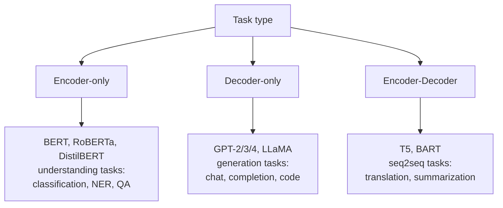
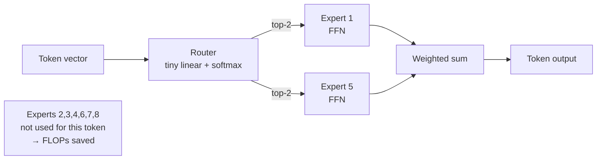

# Sequence 3 — Transformer Architecture

## Lectures covered
- Transformer Architecture
- Word Embeddings (intro — covered fully in NLP module)

---

## In one sentence
A **Transformer** is a sequence model that throws out recurrence entirely and instead lets every token directly look at every other token via **attention** — making it parallel on GPUs, great at long-range dependencies, and the foundation of GPT, BERT, ChatGPT, and almost every modern AI system.

## Real-world analogy
RNNs are like reading a book one word at a time and trying to remember the start by the time you reach the end. A Transformer is like having the whole book open on a desk: you can glance back at any page instantly. That random-access view is what attention gives every token at every layer.

## The intuition (plain English)
- A Transformer **embeds** each token (word, image patch) into a vector and **adds a positional encoding** so it knows the order.
- Each layer is two parts: **self-attention** (every token looks at every other token) + a **feed-forward network** (applied independently per position).
- **Residual connections** and **LayerNorm** wrap each part so the network can be very deep without gradients vanishing.
- Stack 6, 12, 24, or 96 of these layers, train on huge data, and you get BERT, GPT-2, GPT-3, etc.

## Mini worked example — what one encoder layer does

Imagine 4 token embeddings for "the cat sat down" each of dimension `d_model = 512`. The encoder layer does:

```
input X     shape (T=4, d=512)        ← token embeddings + positional encodings

Sub-layer 1 — Multi-Head Self-Attention
    Q, K, V = X · W_Q, X · W_K, X · W_V       (each shape (4, 512))
    For each token, attention computes a 4-weight distribution over all tokens
    → produces a new vector that mixes information from the whole sentence
    output1 shape (4, 512)
    after residual + LayerNorm:  X' = LN(X + output1)

Sub-layer 2 — Position-wise Feed-Forward
    For each token independently:  hidden = ReLU(X' · W₁ + b₁)        (4, 2048)
                                    out    =       hidden · W₂ + b₂   (4, 512)
    after residual + LayerNorm:  X'' = LN(X' + out)

X''  is the encoder layer's output, same shape (4, 512), ready for the next layer.
```

Stack 12 of these → BERT-base. Stack 96 + scale up → GPT-3.

## At-a-glance — the three Transformer flavors



```
   Encoder block (BERT-style):

   x ─► [Self-Attn] ─► +residual ─► LayerNorm ─► [FFN] ─► +residual ─► LayerNorm ─► out
        all tokens                                     applied per token
        attend to                                     independently
        all tokens
```

## Why this matters
- Every state-of-the-art model since 2018 (BERT, GPT, ViT, AlphaFold, Stable Diffusion's text encoder, Whisper) is a Transformer.
- Choosing **encoder vs decoder vs encoder-decoder** is the highest-level design decision in any modern NLP project.
- Understanding **positional encoding** explains why context length is a hard limit on Transformer models.

---

## 1. Why Transformers replaced RNNs

| | RNN/LSTM | Transformer |
|---|---|---|
| Sequence processing | sequential | parallel |
| Long-range dependencies | weak (despite gating) | excellent |
| Train speed | slow (sequential) | fast (parallel on GPU) |
| Inference latency | low (per-token) | depends |
| State of the art | almost nowhere | everywhere |

Single insight: **attention is all you need** (Vaswani et al., 2017). Drop recurrence; use attention to let every token attend to every other token directly.

This launched: BERT, GPT, T5, BART, ViT, Whisper, AlphaFold, modern LLMs, modern image models.

---

## 2. The architecture (high-level)

The original Transformer is **encoder-decoder**:

```
       INPUT                           OUTPUT
       SEQUENCE                        SEQUENCE
          ↓                                ↓
     ┌─────────┐                      ┌─────────┐
     │ embed + │                      │ embed + │
     │  posi-  │                      │  posi-  │
     │  tional │                      │  tional │
     └────┬────┘                      └────┬────┘
          ↓                                ↓
   ┌─[Encoder layer × N]─┐         ┌─[Decoder layer × N]─┐
   │  - Self-attention   │   ───►  │  - Masked self-attn │
   │  - FFN              │   info  │  - Cross-attention  │  ← from encoder
   │  - Residual + LN    │         │  - FFN              │
   └─────────────────────┘         │  - Residual + LN    │
                                    └────┬────────────────┘
                                          ↓
                                       linear → softmax
                                          ↓
                                       output token probs
```

Modern variants:
- **Encoder-only** (BERT) → understanding tasks (classification, NER)
- **Decoder-only** (GPT) → generation
- **Encoder-decoder** (T5, BART) → translation / summarization

---

## 3. The encoder block

```
input (B, T, d_model)
   │
   ▼
┌────────────────────────────────────┐
│  Multi-Head Self-Attention         │
│  (Q, K, V from same input)         │
└──────────┬─────────────────────────┘
           │  + residual
           ▼
        LayerNorm
           │
           ▼
┌────────────────────────────────────┐
│  Position-wise Feed-Forward (MLP)  │
│  Linear → ReLU/GELU → Linear       │
└──────────┬─────────────────────────┘
           │  + residual
           ▼
        LayerNorm
           ▼
        output
```

Stack `N` of these (typically 6, 12, 24).

---

## 4. Positional encoding — putting order back in

Transformers process all positions in parallel → they have no built-in sense of order. Solution: **add positional encoding** to each token's embedding.

### Sinusoidal (original paper)
$$PE_{(pos, 2i)} = \sin(pos / 10000^{2i/d})$$
$$PE_{(pos, 2i+1)} = \cos(pos / 10000^{2i/d})$$

Each position gets a unique vector. Different positions are easily distinguishable; nearby positions are similar.

### Learned positional embeddings (BERT, GPT)
Just a learnable parameter per position. Works equally well, max length capped at training length.

### Modern (RoPE — Rotary Positional Embeddings)
Used in LLaMA, Mistral, etc. Encodes position by *rotating* the Q/K vectors by an angle proportional to position. Better at extrapolating beyond training length.

---

## 5. The decoder block

```
input (target tokens shifted right)
   │
   ▼
Masked Self-Attention (can only attend to past tokens)
   │  + residual + LN
   ▼
Cross-Attention (Q from decoder, K/V from encoder output)
   │  + residual + LN
   ▼
Feed-Forward (MLP)
   │  + residual + LN
   ▼
output
```

The "masked" attention is what makes generation autoregressive — token at position $t$ can only see tokens at positions ≤ t, never the future.

---

## 6. Multi-head attention (high level)

Instead of one attention computation, do N (e.g., 8) **in parallel**, each with its own Q/K/V projection. Concatenate the results.

Why: different heads can attend to different relationships (subject-verb, adjective-noun, distant-context, etc.).

Full attention math is in `04-attention.md`.

---

## 7. PyTorch Transformer

```python
import torch.nn as nn

# raw transformer encoder
encoder_layer = nn.TransformerEncoderLayer(
    d_model=512, nhead=8, dim_feedforward=2048,
    dropout=0.1, batch_first=True,
)
transformer_encoder = nn.TransformerEncoder(encoder_layer, num_layers=6)

# full encoder-decoder
transformer = nn.Transformer(
    d_model=512, nhead=8, num_encoder_layers=6, num_decoder_layers=6,
    dim_feedforward=2048, dropout=0.1, batch_first=True,
)
```

In practice, we don't write this from scratch — we use HuggingFace pre-trained models (BERT, GPT-2, T5).

---

## 8. Why Transformers scale (the secret weapon)

- **Parallelizable** — process whole sequence at once on GPU
- **Constant path length** — any token can attend to any other in 1 op (vs O(seq_len) for RNN)
- **No vanishing gradient** — gradients flow through residuals
- **Compute scales** — performance keeps improving with more compute, more data, more parameters

This is why we have GPT-4 and Claude. RNNs *couldn't* be scaled this way.

---

## 9. Sizing reference

| Model | Layers | d_model | Heads | Params |
|---|---|---|---|---|
| BERT-base | 12 | 768 | 12 | 110M |
| BERT-large | 24 | 1024 | 16 | 340M |
| GPT-2 small | 12 | 768 | 12 | 124M |
| GPT-2 large | 36 | 1280 | 20 | 774M |
| GPT-3 | 96 | 12288 | 96 | 175B |
| LLaMA 3 70B | 80 | 8192 | 64 | 70B |

---

## 10. Common pitfalls

| Mistake | Effect | Fix |
|---|---|---|
| Forgetting positional encoding | model treats sequence as a bag | always include PE |
| Forgetting attention mask in decoder | sees the future → can't generate | use causal mask |
| Padding tokens attended | wrong attention weights | use padding mask |
| Trying to write Transformer from scratch | bugs, slow | use `nn.Transformer` or HuggingFace |
| Training a tiny Transformer on tiny data | overfits | use a pre-trained one |

---

## 11. Self-attention — a fully worked numerical example

Most explanations hand-wave attention. Let's actually compute it for a 3-token, 2-dim toy.

### Setup
3 tokens: `the`, `cat`, `sat`. Each embedded into a 2-dim vector after positional encoding:

```
X = [[1, 0],     ← "the"
     [0, 1],     ← "cat"
     [1, 1]]    ← "sat"        (shape: 3 × 2)
```

Three projection matrices (in real Transformers these are learned; here they're chosen for clarity, all `2 × 2`):

```
W_Q = [[1, 0],    W_K = [[0, 1],    W_V = [[1, 0],
       [0, 1]]           [1, 0]]           [0, 1]]
```

### Step 1 — compute Q, K, V

```
Q = X · W_Q = [[1,0], [0,1], [1,1]]    (each token's "question")
K = X · W_K = [[0,1], [1,0], [1,1]]    (each token's "key" / what it advertises)
V = X · W_V = [[1,0], [0,1], [1,1]]    (each token's "value" / what it carries)
```

### Step 2 — score matrix S = Q · Kᵀ

```
              K_the  K_cat  K_sat
Q_the  [1,0]·[0,1]·[1,0]·[1,1]  =  0,  1,  1
Q_cat  [0,1]·[0,1]·[1,0]·[1,1]  =  1,  0,  1
Q_sat  [1,1]·[0,1]·[1,0]·[1,1]  =  1,  1,  2
```

So `S = [[0, 1, 1], [1, 0, 1], [1, 1, 2]]`.

### Step 3 — scale by √d_k

`d_k = 2`, so `√2 ≈ 1.41`. Divide every entry:

```
S/√d_k ≈ [[0.00, 0.71, 0.71],
          [0.71, 0.00, 0.71],
          [0.71, 0.71, 1.41]]
```

### Step 4 — row-wise softmax → attention weights A

For row 1 (the "the" token's view):
`exp([0, 0.71, 0.71]) = [1.00, 2.03, 2.03]` → sum 5.06 → `[0.198, 0.401, 0.401]`

For row 2 (the "cat" token's view):
`[0.401, 0.198, 0.401]`

For row 3 (the "sat" token's view, which has the highest self-score):
`exp([0.71, 0.71, 1.41]) = [2.03, 2.03, 4.10]` → sum 8.16 → `[0.249, 0.249, 0.502]`

```
A ≈ [[0.198, 0.401, 0.401],     ← "the" looks ~equally at "cat" and "sat", less at itself
     [0.401, 0.198, 0.401],     ← "cat" looks ~equally at "the" and "sat"
     [0.249, 0.249, 0.502]]    ← "sat" looks half at itself, ~quarter at each other
```

Each row sums to 1 — that's the softmax output.

### Step 5 — weighted sum: output = A · V

```
out_the = 0.198·[1,0] + 0.401·[0,1] + 0.401·[1,1] = [0.599, 0.802]
out_cat = 0.401·[1,0] + 0.198·[0,1] + 0.401·[1,1] = [0.802, 0.599]
out_sat = 0.249·[1,0] + 0.249·[0,1] + 0.502·[1,1] = [0.751, 0.751]
```

That's the entire self-attention computation. The output for each token is a **weighted blend of every token's value**, weights chosen by query-key compatibility. Real Transformers do this with `d_model = 768` and 12 heads in parallel — same math, more numbers.

---

## 12. Tokenization — how text becomes tokens

Before anything goes into a Transformer, text is broken into integer IDs. The tokenizer is its own learned algorithm.

### BPE (Byte-Pair Encoding) — used by GPT-2/3/4, LLaMA, Claude
1. Start with characters as atoms.
2. Find the most frequent adjacent pair in the corpus → merge into one new token.
3. Repeat ~50,000 times → final vocabulary.

Result: common words are one token (`the`, `running`); rare words are split (`tokenization` → `token`, `ization`); foreign / unseen text falls back to bytes.

### WordPiece — used by BERT
Similar to BPE; chooses merges by likelihood gain rather than raw frequency.

### Worked example

```
text:     "Tokenization is fun"
GPT-2 BPE → ["Token", "ization", " is", " fun"]   → IDs [30642, 1634, 318, 1257]
BERT WordPiece → ["token", "##ization", "is", "fun"] → IDs [19204, 3989, 2003, 4569]
```

Notice GPT-2 keeps spaces inside tokens (`" is"`); BERT uses `##` to mark continuation pieces. Both produce ~4 tokens here, but the IDs differ — **never mix tokenizers across models**.

### Why it matters
- 1 token ≠ 1 word. `"GPT-4"` is often 3 tokens (`G`, `PT`, `-4`).
- API costs are quoted per **token**, not per word.
- Context-length limits are in **tokens**.
- Non-English text often costs 2-4× more tokens per word.

---

## 13. Training vs inference — the autoregressive secret

A Transformer is trained one way and used another. Confusing the two trips up most beginners.

### Training (parallel, "teacher forcing")

```
Input:   "the cat sat on the"
Target:  "cat sat on the mat"     ← shifted by 1

The decoder sees the WHOLE target sequence at once, with a causal mask
so position t can only attend to positions ≤ t. Loss is computed over
ALL positions in parallel. One forward pass = many predictions.
```

Training uses the *true* previous token as input to predict the next — even if the model would have predicted wrong. This is "teacher forcing". It's why training is fast (one pass per sequence) but creates a slight train-test gap called *exposure bias*.

### Inference (sequential, autoregressive)

```
Step 1:  prompt → model → "the"      (sample one token)
Step 2:  prompt + "the" → model → "cat"
Step 3:  prompt + "the cat" → model → "sat"
... repeat until end-of-sequence token or max_tokens reached.
```

Each step costs **one full forward pass**. That's why generation is slow even on big GPUs — you can't parallelize across output positions.


---

## 14. KV-cache — the trick that makes generation fast

In step 3 above, the prompt is `"The cat"` plus the new token `"sat"`. Naive recomputation re-does attention for *every* previous position — wasteful.

**Insight**: the K and V vectors for `"The"` and `"cat"` were already computed in steps 1-2. Cache them. When generating token *t*, only compute K,V for the *new* token; keep prior K,V around.

```
Without KV-cache: each step costs O(t²) attention → total O(n³) for n tokens
With   KV-cache: each step costs O(t)  attention → total O(n²) for n tokens
```

**Memory cost**: KV-cache size = `2 · n_layers · n_heads · d_k · seq_len · batch_size · dtype_bytes`. For LLaMA-3-70B at 4k context, that's **~10 GB per request**. This is why LLM serving is a memory game.

### Modern attention variants reduce KV-cache size

| Variant | Trick | KV-cache savings |
|---|---|---|
| **MHA (vanilla)** | Each head has its own K, V | baseline |
| **MQA (Multi-Query)** | All heads share one K, V | ÷ n_heads |
| **GQA (Grouped Query)** | Heads share K, V in groups (LLaMA, Mistral) | ÷ group_size |
| **MLA (Multi-Head Latent)** | Compress K, V to a low-rank space (DeepSeek-v2) | massive |

This is one of the few areas where the architecture has visibly evolved post-2017.

---

## 15. Modern improvements (post-original-paper)

The 2017 paper is recognizable but no production model uses it untouched. Major upgrades:

### Flash Attention (Dao et al., 2022)
A clever way to compute exact attention in tiles that fit in GPU SRAM, avoiding the giant `(seq_len × seq_len)` materialized matrix. **2-10× faster training**, no math change. Now standard.

### Pre-Norm vs Post-Norm
Original paper: `LayerNorm(x + Sublayer(x))` (post-norm). Modern: `x + Sublayer(LayerNorm(x))` (pre-norm). Pre-norm trains more stably at depth — used in GPT-3+, LLaMA.

### RMSNorm (instead of LayerNorm)
Drop the mean centering, keep only the variance scaling. ~10% faster, same quality. Used in LLaMA.

### SwiGLU (instead of ReLU FFN)
Swish-Gated Linear Unit replaces the FFN's ReLU. ~1-2% accuracy gain. Used in LLaMA, PaLM.

### Mixture of Experts (MoE)
Replace the FFN with N expert FFNs + a router that picks 1-2 per token. **Sparse compute** — model has 8× params but only 2× FLOPs. Used in Mixtral, GPT-4 (rumored), DeepSeek-v3.



### Long-context tricks
- **Sliding window** (Mistral): each token only attends to the last 4k tokens
- **YaRN / Rope scaling**: stretch RoPE to handle longer contexts than training
- **State-space hybrids** (Mamba, RWKV): combine SSMs with attention for million-token context

---

## 16. Sampling at inference — controlling what the model says

The Transformer outputs a probability distribution over the vocabulary at each step. **How you pick the next token matters as much as the model itself.**

### Greedy decoding
Pick the highest-probability token every step. Deterministic, often boring/repetitive.

### Temperature
Scales logits before softmax: `softmax(logits / T)`.
- `T → 0`: sharper distribution → near-greedy
- `T = 1`: original distribution
- `T → ∞`: uniform → random
Typical chat: `T = 0.7`. Code generation: `T = 0.2`. Creative writing: `T = 1.0+`.

### Top-k sampling
Keep only the k highest-probability tokens, renormalize, sample. `k = 50` is common.

### Top-p (nucleus) sampling
Keep the smallest set of tokens whose cumulative probability ≥ p. `p = 0.9` is the default for most APIs. Adapts to the distribution's shape — fewer tokens when the model is confident, more when it's uncertain.

### Beam search
Track the **k most-likely sequences** (not tokens) at each step. Higher quality on translation/summarization; rarely used for chat.

### Worked example
For the prompt "The capital of France is" the model might produce logits → softmax:

```
Paris    0.85       ← greedy picks this
Lyon     0.05
the      0.03
not      0.02
... rest 0.05
```

- Greedy: "Paris"
- Top-k=3 + sample: most likely "Paris", small chance of "Lyon" or "the"
- Top-p=0.9: cuts off after "Paris" (already > 0.9 alone) → essentially greedy
- Top-p=0.95 with T=0.7: distribution sharpens, still samples "Paris" almost always

---

## 17. Scaling laws and emergent abilities

Why do Transformers keep getting better with size?

### Chinchilla scaling law (Hoffmann et al., 2022)
For a fixed compute budget, optimal performance comes from scaling **parameters and data together**:

```
N_optimal_params ∝ C^0.5
D_optimal_tokens ∝ C^0.5

where C = total compute (FLOPs)
```

Practical rule: **train on ~20 tokens per parameter**. GPT-3 (175B) was *under-trained* by this rule (only ~300B tokens). LLaMA-3 (70B) trained on 15T tokens — over-trained for compute optimality but better at small inference cost.

### Emergent abilities
Some capabilities (multi-step reasoning, in-context learning, instruction following) **don't appear at all** until model crosses a size threshold, then suddenly work. This is what makes 70B+ models qualitatively different from 7B ones, and what fueled the "GPT-3 → ChatGPT" jump.

---

## 18. End-to-end pipeline visualization

```mermaid
flowchart TB
    Input[Input text<br/>'Translate to French: hello world'] --> Tok[Tokenizer<br/>BPE / WordPiece]
    Tok --> IDs[Token IDs<br/>e.g. [4937, 12, 4001, ...]]
    IDs --> Embed[Embedding lookup<br/>+ Positional encoding]
    Embed --> Layer1[Transformer layer 1<br/>Attn → FFN]
    Layer1 --> Layer2[Transformer layer 2]
    Layer2 --> LayerN[... layer N]
    LayerN --> Final[Final hidden states]
    Final --> Head{Task head}
    Head -- classification --> Cls[Linear → softmax → label]
    Head -- generation --> Gen[Linear over vocab → softmax → sample → next token]
    Gen -.feedback.-> Embed
```

Inference loops the dotted arrow until end-of-sequence token or max_tokens.

---

## Self-check

### Architecture
- [ ] Why did Transformers replace RNNs?
- [ ] Three architectural variants and what each is used for?
- [ ] What's the role of positional encoding?
- [ ] What's the difference between self-attention and cross-attention?
- [ ] What's masked self-attention and why is it needed in the decoder?
- [ ] Why is multi-head attention better than single-head?
- [ ] Why are residuals + LayerNorm used heavily?
- [ ] Look up GPT-2 small's params: how many heads, layers, d_model?

### Self-attention math (§11)
- [ ] Walk through Q · Kᵀ → /√d_k → softmax → ·V on a 2×2 toy by hand
- [ ] Why divide by √d_k in the attention formula?
- [ ] What's the time complexity of self-attention in `seq_len`?

### Tokenization (§12)
- [ ] What does BPE do, and why are spaces sometimes part of a token in GPT-2?
- [ ] Why does English text cost fewer tokens than Hindi or Chinese?
- [ ] If your prompt is 1000 words, roughly how many tokens does that translate to?

### Training vs inference (§13-14)
- [ ] What's "teacher forcing"?
- [ ] Why is inference sequential while training can be parallel?
- [ ] What does the KV-cache do, and why is it memory-intensive?
- [ ] What's the difference between MQA, GQA, and MLA?

### Modern improvements (§15)
- [ ] What problem does Flash Attention solve?
- [ ] Why pre-norm over post-norm?
- [ ] In an MoE model, what does the "router" do?
- [ ] What's RoPE and why is it used in LLaMA?

### Sampling (§16)
- [ ] Difference between top-k and top-p sampling?
- [ ] What does temperature = 0 mean? Temperature = 2?
- [ ] When would you use beam search vs. nucleus sampling?

### Scaling (§17)
- [ ] State the Chinchilla rule of thumb
- [ ] What's an "emergent ability"?

---

## Glossary

| Term | Plain meaning |
|------|---------------|
| **Transformer** | Attention-based architecture that replaced RNNs for sequences |
| **Encoder** | Reads the input and produces contextual representations |
| **Decoder** | Generates output tokens one at a time, attending to past output and (optionally) encoder |
| **Encoder-only model** | Used for understanding tasks (BERT, RoBERTa) |
| **Decoder-only model** | Used for generation (GPT, LLaMA) |
| **Encoder-decoder** | Used for seq2seq tasks (T5, BART) |
| **Embedding** | Token-id → dense vector lookup |
| **Token** | Smallest input unit — word, subword (BPE/WordPiece), image patch |
| **Vocabulary size** | Total number of tokens the model knows |
| **`d_model`** | Hidden dimension of the model (e.g., 512, 768, 1024) |
| **`n_heads`** | Number of attention heads per layer |
| **`d_k`** | Dimension per head (`d_model / n_heads`) |
| **`num_layers`** | Stacked Transformer layers (typical 6, 12, 24) |
| **`dim_feedforward`** | Hidden width of the FFN sub-layer (often 4× d_model) |
| **Self-attention** | Token attends to other tokens in the same sequence |
| **Cross-attention** | Decoder attends to encoder output |
| **Masked self-attention** | Causal mask blocks attending to future tokens (used in decoders) |
| **Multi-head attention** | Several attention computations in parallel, then concatenated |
| **Positional encoding** | Adds order information to token embeddings |
| **Sinusoidal PE** | Original encoding using sine/cosine of position |
| **Learned PE** | Trainable position vectors (BERT, GPT-2) |
| **RoPE (Rotary)** | Modern positional encoding via rotation, used in LLaMA / Mistral |
| **LayerNorm** | Normalization across features within each token; standard in Transformers |
| **Residual connection** | `output = sublayer(x) + x`; lets deep nets train |
| **Feed-Forward Network (FFN)** | Two-layer MLP applied independently per position |
| **Causal mask** | Lower-triangular mask preventing future tokens from being attended |
| **Padding mask** | Mask hiding padding tokens from attention |
| **Autoregressive** | Generates one token at a time, each conditioned on the previous ones |
| **`nn.Transformer`** | PyTorch's full encoder-decoder Transformer module |
| **`nn.TransformerEncoderLayer`** | Single encoder block |
| **HuggingFace transformers** | Library with pre-trained Transformer models |
| **Context length** | Max number of tokens the model can attend over (e.g., 512, 4k, 32k) |
| **Scaling law** | Empirical rule: more compute + data + params = better Transformer |
| **Q (query)** | The vector each token uses to *ask* "who's relevant to me?" |
| **K (key)** | The vector each token *advertises* — Q · K = how relevant they are to me |
| **V (value)** | The vector each token *contributes* once attention picks it |
| **`d_k`** | Per-head key/query dimension; appears in the `√d_k` scaling factor |
| **Scaled dot-product** | Attention formula: `softmax(QKᵀ / √d_k) · V` |
| **BPE (Byte-Pair Encoding)** | Tokenizer that merges frequent character pairs iteratively (GPT, LLaMA, Claude) |
| **WordPiece** | BERT's tokenizer; uses likelihood gain instead of frequency |
| **Subword token** | A token that's part of a word (`##ization`, `un-`) |
| **Vocabulary** | The fixed set of tokens a model knows (~50k for GPT-2, ~256k for Llama-3) |
| **Token ID** | Integer index of a token in the vocabulary |
| **Teacher forcing** | Training trick: feed the *true* previous token as input each step |
| **Exposure bias** | Train-test gap caused by teacher forcing (model never trained on its own mistakes) |
| **Autoregressive generation** | Sample one token at a time, each conditioned on previous |
| **EOS (end-of-sequence)** | Special token that signals "stop generating" |
| **KV-cache** | Stored K and V vectors from previous tokens — avoids recomputation during generation |
| **MHA (Multi-Head Attention)** | Original — each head has its own K, V projections |
| **MQA (Multi-Query Attention)** | All heads share one K, V — saves memory |
| **GQA (Grouped Query Attention)** | Heads share K, V in groups (used by LLaMA, Mistral) |
| **MLA (Multi-Head Latent)** | DeepSeek-v2's compressed K/V scheme |
| **Flash Attention** | GPU-friendly tiled exact attention; standard since 2022 |
| **Pre-norm** | LayerNorm before the sublayer; trains more stably |
| **Post-norm** | LayerNorm after the sublayer; original paper's choice |
| **RMSNorm** | Variant of LayerNorm without mean centering; used in LLaMA |
| **SwiGLU** | Swish-Gated Linear Unit FFN; LLaMA / PaLM choice |
| **MoE (Mixture of Experts)** | Sparse FFN — token-level router picks 1-2 experts of N |
| **Router (in MoE)** | Tiny learned linear that decides which expert(s) handle each token |
| **Sliding-window attention** | Each token attends only to a recent window — Mistral's trick |
| **Mamba / RWKV / SSM** | State-space models — Transformer alternatives for very long context |
| **Greedy decoding** | Always pick the most probable next token |
| **Temperature** | Logit scaling factor; controls randomness (0 = greedy, 1 = original) |
| **Top-k sampling** | Keep only k most likely tokens, sample from those |
| **Top-p / nucleus sampling** | Keep smallest set with cumulative prob ≥ p |
| **Beam search** | Track k most-likely sequences (not tokens) — used in translation |
| **Logits** | Pre-softmax raw scores |
| **Chinchilla scaling law** | "~20 tokens per parameter" optimal training rule |
| **Compute-optimal** | Training point where adding params or tokens equally improves loss |
| **Emergent ability** | A capability that suddenly appears past a model-size threshold |
| **In-context learning** | Model learns a task from examples in the prompt — no weight updates |

## Further reading
- Deeper dive into the attention math: [04-attention.md](04-attention.md)
- Pre-trained Transformers in practice: [05-bert-huggingface.md](05-bert-huggingface.md)
- Visual + math reference for sequence models: [../architectures-and-math.md](../architectures-and-math.md)
- Why we needed this: [01-rnn.md](01-rnn.md), [02-lstm.md](02-lstm.md)
- LLM API patterns built on this: [../../09-gen-ai-agentic-ai/01-llm-fundamentals.md](../../09-gen-ai-agentic-ai/01-llm-fundamentals.md), [../../09-gen-ai-agentic-ai/06-langchain-claude-api.md](../../09-gen-ai-agentic-ai/06-langchain-claude-api.md)
- Fine-tuning a pretrained Transformer: [../../09-gen-ai-agentic-ai/05-fine-tuning-llms.md](../../09-gen-ai-agentic-ai/05-fine-tuning-llms.md)
- Tokenization in NLP context: [../../08-nlp/02-text-preprocessing.md](../../08-nlp/02-text-preprocessing.md)
- Word embeddings recap: [../../08-nlp/05-word-embeddings.md](../../08-nlp/05-word-embeddings.md)
- The architecture-and-math reference: [../architectures-and-math.md](../architectures-and-math.md)
- Style guide this file follows: [../../../BEGINNER-STYLE-GUIDE.md](../../../BEGINNER-STYLE-GUIDE.md)
