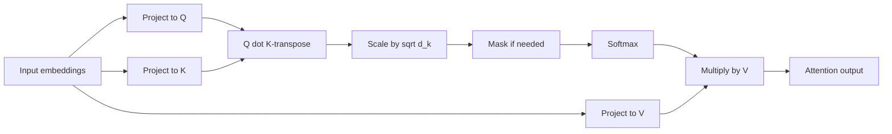
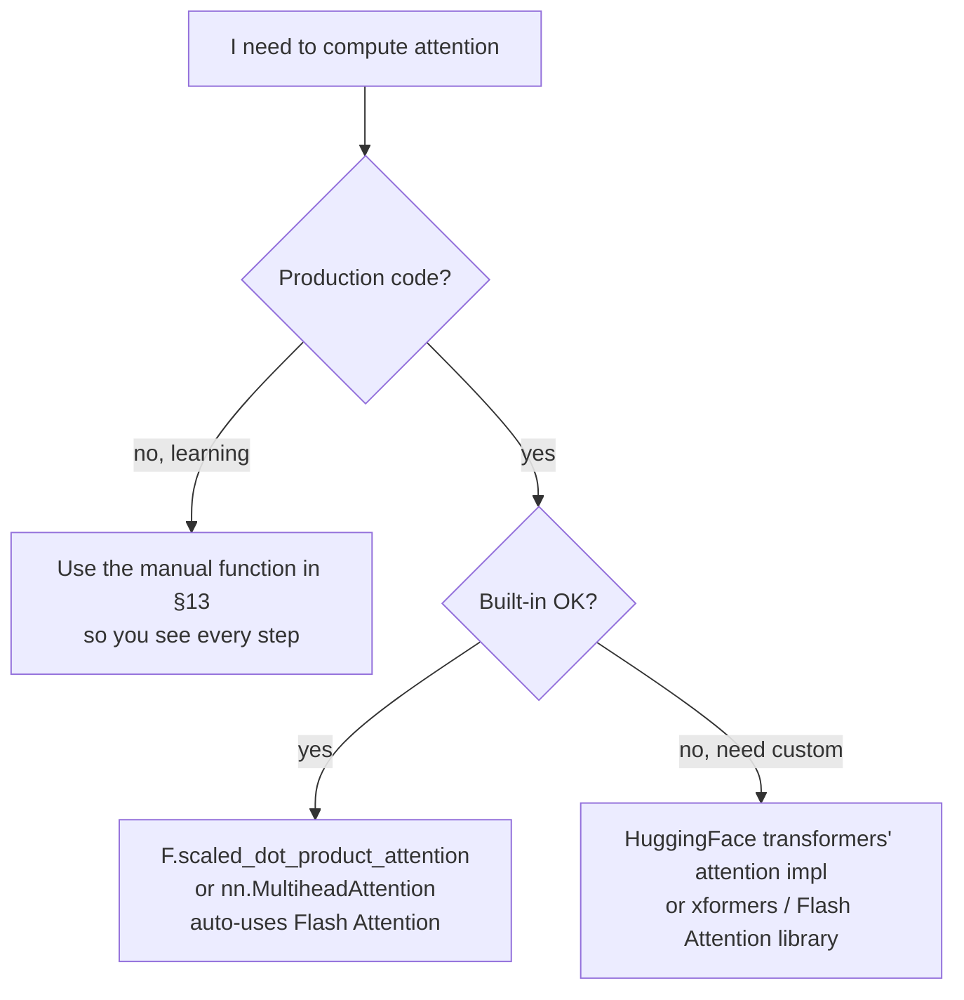

# Sequence 4 — Attention Mechanism

## Lectures covered
- Attention Mechanism

---

## In one sentence
**Attention** is the mechanism that lets each token in a sequence look at every other token, decide *who's most relevant*, and pull a weighted summary of their information — it's the engine inside every Transformer.

## Real-world analogy
You're at a noisy party trying to understand what your friend is saying. You don't listen to every voice equally — your brain *attends* to the relevant speaker and tunes the rest down. Each token in a Transformer is doing exactly this: deciding who in the room (sequence) it should listen to in order to understand itself.

## The intuition (plain English)
- Each token is projected into three vectors: **Query** ("what do I want to know?"), **Key** ("what info do I offer?"), **Value** ("what would I actually share?").
- A token's **attention weights** are the softmax of how well its query matches every other token's key.
- The token's output is a **weighted sum of all values** — a personalized summary of the whole sequence.
- **Multi-head attention** runs many of these in parallel so different heads can specialize (subject-verb, coreference, position, etc.).

## Mini worked example — attention for one token

3 tokens in a tiny sequence with `d_k = 2`. Token 2 ("bit") is computing its attention output.

```
Q for token 2:  q_2 = [1.0,  0.5]
Keys:           k_0 = [0.2,  0.8]   "the"
                k_1 = [1.2,  0.4]   "dog"
                k_2 = [0.5,  0.5]   "bit"
Values:         v_0 = [0.1, -0.2,  0.3]
                v_1 = [0.7,  0.6,  0.1]
                v_2 = [0.0,  0.4, -0.1]

Step 1 — dot products (compatibility scores):
   q_2 · k_0 = 1.0·0.2 + 0.5·0.8 = 0.60
   q_2 · k_1 = 1.0·1.2 + 0.5·0.4 = 1.40   ← highest: "bit" cares about "dog"
   q_2 · k_2 = 1.0·0.5 + 0.5·0.5 = 0.75

Step 2 — scale by sqrt(d_k) = sqrt(2) ≈ 1.414:
   [0.60, 1.40, 0.75] / 1.414 ≈ [0.42, 0.99, 0.53]

Step 3 — softmax → attention weights:
   ≈ [0.22, 0.45, 0.33]      (rows sum to 1)

Step 4 — weighted sum of values:
   out_2 = 0.22·v_0 + 0.45·v_1 + 0.33·v_2
         = 0.22·[0.1,-0.2,0.3] + 0.45·[0.7,0.6,0.1] + 0.33·[0.0,0.4,-0.1]
         ≈ [0.34,  0.36,  0.04]
```

That output replaces "bit"'s embedding for the next layer — heavily flavored by "dog".

## At-a-glance — the attention pipeline



```
   Multi-head:

   X ─► split into 8 heads ─► [attention] each with its own Q/K/V ─► concat ─► linear ─► out
                                ▲
                       different heads specialize
                       (syntax, coreference, position, etc.)
```

## Why this matters
- Attention is the single mathematical idea behind GPT, BERT, ChatGPT, ViT, Whisper, AlphaFold.
- Knowing what Q, K, V represent intuitively unlocks the rest of the Transformer.
- The O(T²) cost of attention is why "context length" is a major engineering frontier (Flash Attention, sparse attention, state-space models).

---

## 1. The intuition

When you read a sentence, you don't process every word with equal attention. To understand "the dog **bit** the man," "bit" depends heavily on "dog" (subject) and "man" (object) — less on "the".

Attention mathematically captures this: each token assigns weights to every other token, decides what's relevant for understanding itself, and creates a weighted summary.

---

## 2. Query, Key, Value — the three projections

For each token, project its embedding into three vectors:
- **Query (Q)**: "what am I looking for?"
- **Key (K)**: "what do I have to offer?"
- **Value (V)**: "what's my actual content?"

A token's attention output = weighted sum of all tokens' values, where the weight is determined by **how much its query matches each token's key**.

---

## 3. Scaled dot-product attention — the formula

$$\text{Attention}(Q, K, V) = \text{softmax}\!\left(\frac{Q K^T}{\sqrt{d_k}}\right) V$$

Steps:
1. **Compute scores**: $QK^T$ — dot products of every Q with every K. Result: (T, T) matrix of compatibility scores.
2. **Scale**: divide by $\sqrt{d_k}$ — keeps softmax in a healthy range as $d_k$ grows.
3. **Softmax**: rows now sum to 1 — these are attention weights.
4. **Weighted sum**: multiply by V to get the output.

Output shape: same as V (number of tokens × value dim).

### Why $\sqrt{d_k}$
Dot products of high-dim vectors have variance proportional to $d_k$. Without scaling, softmax becomes near-binary (one entry = 1, others = 0) → vanishing gradients in attention weights. Dividing by $\sqrt{d_k}$ stabilizes this.

---

## 4. Walking through one token

Suppose token "bit" is at position 2:
- Compute its Q vector: $q_2$
- Compute K vectors for all tokens: $k_0, k_1, k_2, k_3, k_4$ ("the", "dog", "bit", "the", "man")
- Dot products: $q_2 \cdot k_0$, $q_2 \cdot k_1$, ..., $q_2 \cdot k_4$ → 5 scores
- Scale + softmax → 5 weights summing to 1
- Output for "bit" = weighted sum of $v_0, v_1, ..., v_4$

The model learns Q/K/V projections such that "bit" attends most to "dog" and "man".

---

## 5. Self-attention vs cross-attention

### Self-attention
Q, K, V all come from the **same** input. Each token attends to others in its own sequence.
- Used in: encoder layers, decoder's first attention sublayer

### Cross-attention
Q comes from one sequence, K/V from **another**.
- Used in: decoder's second attention sublayer (Q = decoder, K/V = encoder output)
- Example: translation — decoder generates English, attending back to the French encoder output

### Masked self-attention
Same as self-attention but with a mask preventing attending to future tokens. Used in decoders for autoregressive generation.

```python
# causal mask: lower triangular
mask = torch.tril(torch.ones(T, T))
# scores where mask=0 → -inf → softmax → 0
```

---

## 6. Multi-head attention

Run the attention computation `h` times in parallel, each with its own Q/K/V projections.

```
input → split into h heads
   ├── head 1: Q₁ K₁ V₁ → out₁
   ├── head 2: Q₂ K₂ V₂ → out₂
   ├── ...
   └── head h: Qₕ Kₕ Vₕ → outₕ

concat(out₁, ..., outₕ) → linear → final output
```

Each head's projection dim is `d_model / h`, so the total compute is roughly the same as single-head with full dim — but the model can attend to different relationship types simultaneously.

```python
# typical: d_model=512, h=8 → each head has d_k=64
```

### What heads typically learn
- Some attend to syntactic structure (subject-verb)
- Some attend to coreference ("she" → previous noun)
- Some attend to delimiters / punctuation
- Some are nearly redundant (research shows you can prune ~40% of heads with little loss)

---

## 7. PyTorch implementation

```python
import torch
import torch.nn as nn
import torch.nn.functional as F

class MultiHeadAttention(nn.Module):
    def __init__(self, d_model, n_heads):
        super().__init__()
        assert d_model % n_heads == 0
        self.d_k = d_model // n_heads
        self.n_heads = n_heads
        self.W_q = nn.Linear(d_model, d_model)
        self.W_k = nn.Linear(d_model, d_model)
        self.W_v = nn.Linear(d_model, d_model)
        self.W_o = nn.Linear(d_model, d_model)

    def forward(self, x, mask=None):
        B, T, d = x.shape
        Q = self.W_q(x).view(B, T, self.n_heads, self.d_k).transpose(1, 2)  # (B, h, T, d_k)
        K = self.W_k(x).view(B, T, self.n_heads, self.d_k).transpose(1, 2)
        V = self.W_v(x).view(B, T, self.n_heads, self.d_k).transpose(1, 2)

        scores = Q @ K.transpose(-2, -1) / self.d_k ** 0.5                  # (B, h, T, T)
        if mask is not None:
            scores = scores.masked_fill(mask == 0, float("-inf"))
        weights = F.softmax(scores, dim=-1)
        out = weights @ V                                                    # (B, h, T, d_k)

        out = out.transpose(1, 2).contiguous().view(B, T, d)                 # (B, T, d_model)
        return self.W_o(out)
```

PyTorch ships an optimized version: `nn.MultiheadAttention(d_model, n_heads, batch_first=True)`.

---

## 8. Computational cost — the scaling problem

Self-attention is O(T²) in sequence length (every token attends to every other).

For T=1000: 1M attention scores per layer × heads × batch.
For T=100,000: 10B scores. Doesn't fit.

This drives many "long-context" research directions:
- **Sparse attention** (Longformer, BigBird) — each token attends to a subset
- **Linear attention** (Performer, Linformer)
- **State-space models** (Mamba) — alternative to attention
- **Sliding-window attention** (Mistral)
- **Flash Attention** — same math, faster + lower memory implementation

For the bootcamp's needs (≤512 tokens, BERT-style), classic attention is fine.

---

## 9. Visualizing attention

After fine-tuning a Transformer, you can plot attention weights to see what tokens attend to what:

```python
# from a HuggingFace model with output_attentions=True
outputs = model(input_ids, output_attentions=True)
attentions = outputs.attentions          # tuple of (B, heads, T, T) per layer

import seaborn as sns
sns.heatmap(attentions[6][0, 3].cpu(), xticklabels=tokens, yticklabels=tokens)
```

This is the visualization that made attention "the new chunked LSTM hidden state" — interpretable in a way RNNs aren't.

---

## 10. Common pitfalls

| Mistake | Effect | Fix |
|---|---|---|
| Forgot to scale by $\sqrt{d_k}$ | softmax saturates | always scale |
| Wrong mask shape | "softmax over -inf" → NaN | check shapes |
| Forgot causal mask in decoder | sees future | always mask in autoregressive |
| Using the same dim for Q/K/V across heads without splitting | head doing nothing | split d_model across heads |
| Dropout removed from attention weights | risk of overfit on small data | `nn.MultiheadAttention(dropout=0.1)` |

---

## 11. Full attention matrix — visualizing what gets attended to

After all the math, an attention layer produces a `(T × T)` matrix where row `i` shows what fraction of token `i`'s update came from each token. Here's what a typical pattern looks like for the sentence **"the cat sat on the mat"** in a real Transformer head:

```
                  the   cat   sat   on    the   mat
                  ────  ────  ────  ────  ────  ────
   the     ─►    [0.30  0.20  0.15  0.10  0.15  0.10]
   cat     ─►    [0.10  0.45  0.20  0.05  0.05  0.15]   ← attends to "mat" (the object)
   sat     ─►    [0.05  0.40  0.30  0.10  0.05  0.10]   ← attends to "cat" (the subject)
   on      ─►    [0.05  0.10  0.20  0.30  0.10  0.25]
   the(2)  ─►    [0.20  0.10  0.10  0.10  0.30  0.20]
   mat     ─►    [0.10  0.30  0.10  0.15  0.10  0.25]   ← attends back to "cat"
```

Reading row 2: when the model updates the `"cat"` representation, it pulls 45% of the new info from itself, 20% from `"sat"`, and notably 15% from `"mat"` — the model is learning that "cat" and "mat" are related (subject-object across the sentence).

A full Transformer has **`n_layers × n_heads`** of these matrices simultaneously. BERT-base has 12 × 12 = **144 attention heads**, each potentially learning a different relationship.

---

## 12. Causal mask — the `T × T` lower triangle

The mask used in decoder self-attention to prevent peeking at future tokens:

```
Position:    0    1    2    3    4
   0        [1    0    0    0    0]    ← can only see itself
   1        [1    1    0    0    0]    ← can see 0, 1
   2        [1    1    1    0    0]    ← can see 0, 1, 2
   3        [1    1    1    1    0]
   4        [1    1    1    1    1]    ← can see everything before+itself

Apply BEFORE softmax:
  scores  = scores.masked_fill(mask == 0, -1e9)
  weights = softmax(scores, dim=-1)        ← masked positions go to ~0
```

That single triangle is why GPT can generate text but BERT can only score it.

---

## 13. The full self-attention computation in code (for understanding)

This `forward` is mathematically identical to `nn.MultiheadAttention` — read it line by line and you'll never confuse the dims again.

```python
import torch
import torch.nn.functional as F

def attention(Q, K, V, mask=None):
    """
    Q, K, V: (batch, n_heads, seq_len, d_k)
    mask:    (batch, 1, seq_len, seq_len)   or None
    returns: (batch, n_heads, seq_len, d_k)
    """
    d_k = Q.size(-1)
    scores = Q @ K.transpose(-2, -1)            # (B, h, T, T)
    scores = scores / (d_k ** 0.5)              # scaled dot-product
    if mask is not None:
        scores = scores.masked_fill(mask == 0, float('-inf'))
    weights = F.softmax(scores, dim=-1)         # rows sum to 1
    return weights @ V                          # (B, h, T, d_k)
```

Add `W_Q`, `W_K`, `W_V` linear layers to project the input into Q, K, V — and an output `W_O` to mix the heads — and you have a full attention layer.

---

## 14. Production attention variants (post-2017)

The 2017 attention algorithm is correct but not what runs in production LLMs anymore. The frontier moved on three axes: **memory**, **speed**, **context length**.

### Memory: MHA → MQA → GQA → MLA
The KV-cache during generation grows linearly with `n_heads`. Modern variants share K/V across heads:

```
MHA (original):     each head has independent  K, V       ← 100% memory
MQA (PaLM):         all heads share         one K, V      ← 1/n_heads memory
GQA (LLaMA, Mistral): heads share K, V in groups          ← compromise — most quality, much less memory
MLA (DeepSeek-v2):  K, V compressed to a low-rank latent  ← extreme savings, slight quality cost
```

### Speed: Flash Attention
The naive implementation materializes the `(T × T)` score matrix in HBM (slow GPU memory). **Flash Attention** computes attention in tiles that fit in SRAM (fast GPU memory) without ever building the full matrix.

- **Math is identical** — same outputs, same gradients
- **Speed**: 2-10× faster training and inference
- **Memory**: linear in sequence length instead of quadratic
- **Default everywhere now** — PyTorch 2.0+ uses it transparently via `F.scaled_dot_product_attention`

### Context length: sliding window + sparse attention
For T = 100,000+ tokens, full attention is unaffordable. Tricks:

```
Full attention:        every token attends to every token   O(T²)
Sliding window:        each token attends to last W tokens  O(T·W)   ← Mistral, longformer
Dilated attention:     attends to a strided pattern         O(T·log T)
Local + global:        most tokens local, few "global" tokens see all  ← BigBird
State-space hybrids:   replace attention with SSM (Mamba)   O(T)
```

These are how you get LLMs with 1M+ context windows.

---

## 15. Attention quick reference



| You want... | Use this |
|---|---|
| To learn the math | hand-roll the function in §13 |
| Standard PyTorch attention | `F.scaled_dot_product_attention(Q, K, V, attn_mask=mask)` |
| Multi-head wrapper | `nn.MultiheadAttention(d_model, n_heads, batch_first=True)` |
| HuggingFace pre-trained model | their `transformers.AutoModel` handles attention internally |
| Long-context production | `flash-attn` or `xformers` packages |
| Memory-bound deployment | a model with **GQA** (LLaMA-3, Mistral) |

---

## Self-check

### Mechanics
- [ ] Walk through self-attention computation for one token.
- [ ] What does Q vs K vs V represent intuitively?
- [ ] Why divide by $\sqrt{d_k}$?
- [ ] What's the difference between self-attention and cross-attention?
- [ ] Why use multi-head attention instead of single-head?
- [ ] What's the masked attention used in decoders for?

### Implementation
- [ ] Implement scaled dot-product attention from scratch in PyTorch.
- [ ] Show how the causal mask matrix looks for T=4.
- [ ] Why is `dim=-1` the right axis for the softmax?

### Production attention (§14)
- [ ] What's the difference between MHA, MQA, GQA, and MLA?
- [ ] What problem does Flash Attention solve, and what's its trick?
- [ ] Name 3 ways production LLMs scale to 100k+ context.
- [ ] Why is attention O(T²) — and what are some workarounds for long contexts?

---

## Glossary

| Term | Plain meaning |
|------|---------------|
| **Attention** | Weighted-sum mechanism: each token pulls info from others based on relevance |
| **Self-attention** | Q, K, V all come from the same input |
| **Cross-attention** | Q from one sequence, K and V from another (e.g., decoder ↔ encoder) |
| **Masked attention** | Causal mask hiding future positions, used for autoregressive generation |
| **Query (Q)** | "What am I looking for?" vector for a token |
| **Key (K)** | "What do I have to offer?" vector for a token |
| **Value (V)** | "What's my actual content?" vector for a token |
| **Scaled dot-product attention** | `softmax(QKᵀ / √d_k) · V` |
| **`d_k`** | Dimension per head — used in the √d_k scaling |
| **Attention scores** | Raw `QKᵀ` matrix before softmax |
| **Attention weights** | Softmaxed scores; rows sum to 1 |
| **Multi-head attention** | Several attention computations in parallel, then concatenated |
| **`n_heads`** | Number of parallel attention heads |
| **Head dimension** | `d_model / n_heads`, the width per head |
| **`W_Q`, `W_K`, `W_V`, `W_O`** | Learnable projection matrices for queries, keys, values, and output |
| **Causal mask** | Lower-triangular mask used in decoder self-attention |
| **Padding mask** | Mask hiding padding tokens from attention |
| **`-inf` masking** | Set masked positions to −∞ before softmax so they get probability 0 |
| **`nn.MultiheadAttention`** | PyTorch's built-in multi-head attention module |
| **Flash Attention** | GPU-efficient implementation of exact attention |
| **Sparse attention** | Each token attends to a subset (Longformer, BigBird) |
| **Linear attention** | Approximations that drop O(T²) to O(T) (Performer, Linformer) |
| **State-space model** | Alternative to attention (Mamba) |
| **Attention map / heatmap** | (T × T) visualization of which tokens attend to which |
| **Coreference** | When different words refer to the same entity ("she" → "Alice") |
| **Quadratic complexity** | Cost grows with the square of sequence length |
| **Context length** | Maximum tokens the model can attend to at once |

## Further reading
- Where attention sits in the bigger picture: [03-transformer-architecture.md](03-transformer-architecture.md)
- Pre-trained Transformer use: [05-bert-huggingface.md](05-bert-huggingface.md)
- Original paper "Attention Is All You Need": https://arxiv.org/abs/1706.03762
