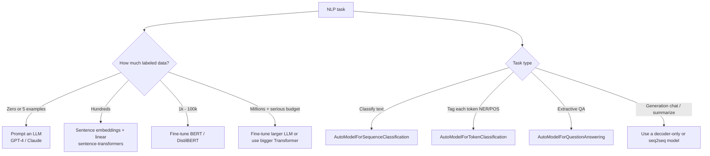

# Sequence 5 — Word Embeddings & BERT (with HuggingFace)

## Lectures covered
- Word Embeddings
- Hugging Face: BERT Basics

---

## In one sentence
**BERT** is a pre-trained Transformer encoder that turns each word into a *context-aware* vector, and **HuggingFace** is the library that lets you load BERT (or a thousand other models) in three lines and fine-tune it for your task.

## Real-world analogy
Word2Vec gave each word a fixed business-card identity ("bank" = same vector everywhere). BERT gives each word a context-aware identity — like a chameleon. In "river bank" it's near "shore"; in "deposit at the bank" it's near "money". HuggingFace is the universal hiring agency where you grab pre-trained chameleons by name and put them to work in your project.

## The intuition (plain English)
- BERT was pre-trained on huge text by **masking** ~15% of tokens and training the model to predict them — forcing it to use bidirectional context.
- After pre-training, BERT's middle layers are full of **general language understanding**.
- For your task (sentiment, NER, QA), you swap in a tiny task head and **fine-tune** at a small learning rate (~2e-5) for a few epochs.
- The HuggingFace `Trainer` and `pipeline` APIs hide most boilerplate so you can focus on the data and the metric.

## Mini worked example — IMDB sentiment in 8 lines

```python
from transformers import AutoTokenizer, AutoModelForSequenceClassification, pipeline
from datasets import load_dataset

ds = load_dataset("imdb")
tok = AutoTokenizer.from_pretrained("distilbert-base-uncased")
model = AutoModelForSequenceClassification.from_pretrained(
    "distilbert-base-uncased", num_labels=2
)
# (Trainer config + trainer.train() — see full recipe below)

# After fine-tuning, inference is one line:
clf = pipeline("sentiment-analysis", model=model, tokenizer=tok)
print(clf("This bootcamp made deep learning click for me"))
# [{'label': 'LABEL_1', 'score': 0.997}]    ← positive
```

A 90%-accurate sentiment classifier on free Colab in roughly 10 minutes.

## At-a-glance — when to reach for which approach



```
   BERT input  →  [CLS] my dog is cute [SEP]  →  768-dim vectors per token
                          │
                          ▼
                  use [CLS] vector for classification head
                  use per-token vectors for NER / token tasks
                  pool tokens for sentence embeddings
```

## Why this matters
- Almost every NLP project in production uses HuggingFace + a BERT-family model or an LLM.
- Knowing **fine-tune vs prompt vs sentence-embed** decides whether your project takes 1 hour or 1 month.
- The `pipeline` API hides the boilerplate — but understanding tokens, attention masks, and `[CLS]` lets you debug when it inevitably misbehaves.

---

## 1. Word embeddings — vectors that mean something

Before Transformers: words were one-hot (sparse, no semantic relationship). **Word embeddings** turn each word into a dense vector where semantically similar words are close.

### Word2Vec (2013)
Train a small NN to predict word from context (or vice versa). The middle layer's vectors are word embeddings.

Famous demo:
$$\text{vec(king)} - \text{vec(man)} + \text{vec(woman)} \approx \text{vec(queen)}$$

### GloVe
Global word co-occurrence stats. Different math, similar idea.

### FastText
Same idea with subword units → handles out-of-vocabulary.

### Limitations
- One vector per word, regardless of context
- "bank" (river) and "bank" (financial) get the same vector

---

## 2. Contextual embeddings — what BERT brought

Modern transformers produce **contextual embeddings**: the same word gets *different* embeddings depending on its surrounding context.

```
"the river bank"      → "bank" vector ≈ near "river", "shore"
"deposit at the bank" → "bank" vector ≈ near "money", "account"
```

This is *the* shift that made modern NLP possible.

---

## 3. BERT — Bidirectional Encoder Representations from Transformers (2018)

A Transformer **encoder** pre-trained on huge text data with two unsupervised tasks:

### Masked Language Modeling (MLM)
Hide ~15% of tokens; predict them from context.
```
Input:  "The cat sat on the [MASK]."
Output: "mat" (target)
```

### Next Sentence Prediction (NSP)
Given two sentences, predict if B follows A in the original text.
(Later models like RoBERTa drop this.)

After pre-training, BERT can be **fine-tuned** on downstream tasks (classification, NER, QA, etc.) with very little task-specific data.

---

## 4. BERT variants and modern descendants

| Model | Key idea |
|---|---|
| **BERT** | Original |
| **RoBERTa** | More data, longer training, drop NSP |
| **DistilBERT** | Distilled — smaller, ~95% of BERT's quality, 60% faster |
| **ALBERT** | Parameter sharing across layers |
| **DeBERTa** | Disentangled attention |
| **XLM-R** | Multi-lingual |
| **ModernBERT** | 2024 — much longer context, modern training |

For the bootcamp: **DistilBERT** is the default — it's small enough for free Colab.

---

## 5. HuggingFace `transformers` — the standard library

```bash
pip install transformers datasets
```

### The 3 core classes
```python
from transformers import AutoTokenizer, AutoModel, AutoModelForSequenceClassification

tokenizer = AutoTokenizer.from_pretrained("bert-base-uncased")
model = AutoModel.from_pretrained("bert-base-uncased")
```

### Tokenizing
```python
inputs = tokenizer("Hello, my dog is cute", return_tensors="pt")
print(inputs)
# {'input_ids': tensor([[101, 7592, 1010, 2026, 3899, 2003, 10140, 102]]),
#  'attention_mask': tensor([[1, 1, 1, 1, 1, 1, 1, 1]])}

# 101 = [CLS], 102 = [SEP]
```

### Running the model
```python
import torch
with torch.no_grad():
    out = model(**inputs)
out.last_hidden_state.shape         # (1, 8, 768)  — one vector per token
out.pooler_output.shape              # (1, 768)     — single sentence vector
```

The `[CLS]` token's hidden state is the canonical sentence representation.

---

## 6. Fine-tuning BERT for classification

### Setup
```python
from transformers import AutoTokenizer, AutoModelForSequenceClassification, TrainingArguments, Trainer
from datasets import load_dataset

ds = load_dataset("imdb")
tokenizer = AutoTokenizer.from_pretrained("distilbert-base-uncased")

def tokenize(batch):
    return tokenizer(batch["text"], truncation=True, padding="max_length", max_length=256)

ds = ds.map(tokenize, batched=True)
ds = ds.rename_column("label", "labels")
ds.set_format("torch", columns=["input_ids", "attention_mask", "labels"])
```

### Training
```python
model = AutoModelForSequenceClassification.from_pretrained("distilbert-base-uncased", num_labels=2)

args = TrainingArguments(
    output_dir="out",
    num_train_epochs=3,
    per_device_train_batch_size=16,
    per_device_eval_batch_size=64,
    learning_rate=2e-5,
    weight_decay=0.01,
    eval_strategy="epoch",
    save_strategy="epoch",
    load_best_model_at_end=True,
    metric_for_best_model="accuracy",
)

import numpy as np
def compute_metrics(p):
    preds = p.predictions.argmax(-1)
    return {"accuracy": (preds == p.label_ids).mean()}

trainer = Trainer(
    model=model,
    args=args,
    train_dataset=ds["train"].select(range(2000)),       # subsample for speed
    eval_dataset=ds["test"].select(range(500)),
    compute_metrics=compute_metrics,
)
trainer.train()
```

This trains a sentiment classifier on IMDB in ~10 min on a free Colab GPU. Accuracy ~90%.

---

## 7. Pipeline API — for inference

```python
from transformers import pipeline

clf = pipeline("sentiment-analysis", model="distilbert-base-uncased-finetuned-sst-2-english")
print(clf("I love this bootcamp"))
# [{'label': 'POSITIVE', 'score': 0.9997}]

ner = pipeline("ner", aggregation_strategy="simple")
print(ner("Awais lives in Lahore and works at Codebasics."))

qa = pipeline("question-answering")
print(qa(question="Who created Codebasics?",
         context="Dhaval Patel founded Codebasics in 2016."))
```

Pipelines abstract everything: tokenizer + model + decoding.

---

## 8. Tasks that BERT (or descendants) solve well

| Task | Approach |
|---|---|
| Text classification | `AutoModelForSequenceClassification` |
| Token classification (NER, POS) | `AutoModelForTokenClassification` |
| QA (extractive) | `AutoModelForQuestionAnswering` |
| Sentence similarity | `sentence-transformers` (MPNet, MiniLM, BGE) |
| Multi-label | `AutoModelForSequenceClassification` + sigmoid |

For **generation** (chat, summarization, translation), use decoder-only or encoder-decoder models — GPT-2/3/4, T5, BART, LLaMA. Covered in the Gen AI module.

---

## 9. When to fine-tune vs use as embedding extractor vs prompt an LLM

| Approach | When |
|---|---|
| Fine-tune BERT | classification with small-medium domain dataset (1k–100k examples) |
| Use BERT as embedding extractor + linear classifier | very small data, fast prototyping |
| Sentence embeddings + cosine sim (`sentence-transformers`) | semantic search, RAG |
| Prompt an LLM (ChatGPT, Claude) | zero/few-shot, very small data, want flexibility |

For 2025 production: **try LLM prompt first**; fine-tune BERT only when latency/cost forces specialized smaller models.

---

## 10. Common pitfalls

| Mistake | Effect | Fix |
|---|---|---|
| Tokenizer mismatch (different model than checkpoint) | wrong embeddings | always pair tokenizer + model from same checkpoint |
| Truncating without warning | losing critical text | use `max_length=512` carefully |
| Comparing `pooler_output` across BERT variants | not all have it | use `last_hidden_state[:, 0]` ([CLS] token) |
| Training on CPU | hours per epoch | move to Colab GPU |
| Sequence > 512 | error | truncate, chunk, or use Longformer |
| Forgetting `model.eval()` for inference | dropout active | use `.eval()` + `torch.no_grad()` |

## Self-check

- [ ] Difference between Word2Vec and BERT embeddings?
- [ ] What two tasks is BERT pre-trained on?
- [ ] What's the [CLS] token used for?
- [ ] Walk through fine-tuning BERT for IMDB sentiment in HuggingFace.
- [ ] When use DistilBERT over BERT?
- [ ] Difference between `AutoModel` and `AutoModelForSequenceClassification`?
- [ ] When fine-tune vs prompt an LLM?
- [ ] What's `sentence-transformers` and when to reach for it?

---

## Glossary

| Term | Plain meaning |
|------|---------------|
| **Word embedding** | A learned vector representing a word |
| **Word2Vec** | Early static-embedding method (skip-gram or CBOW) |
| **GloVe** | Static embeddings from co-occurrence statistics |
| **FastText** | Subword-aware static embeddings |
| **Static embedding** | Same vector for a word regardless of context |
| **Contextual embedding** | Different vector depending on the surrounding sentence (BERT-style) |
| **Tokenizer** | Splits text into tokens and maps them to integer IDs |
| **WordPiece / BPE / SentencePiece** | Subword tokenization algorithms |
| **`[CLS]`** | Special "classification" token at position 0 — its vector summarizes the sentence |
| **`[SEP]`** | Separator between two sentences in a pair |
| **`[MASK]`** | Token used during BERT pre-training to hide words |
| **`input_ids`** | Tensor of token IDs |
| **`attention_mask`** | 1/0 mask telling the model which tokens are real vs padding |
| **`token_type_ids`** | Segment IDs distinguishing sentence A from sentence B |
| **BERT** | Bidirectional Encoder Representations from Transformers |
| **MLM (Masked Language Modeling)** | Pre-training task: predict masked tokens |
| **NSP (Next Sentence Prediction)** | Pre-training task: does sentence B follow sentence A? |
| **RoBERTa** | More-data, no-NSP, better-trained BERT variant |
| **DistilBERT** | Smaller, faster BERT distilled from the original (~95% of quality) |
| **ALBERT** | BERT with parameter sharing across layers |
| **DeBERTa** | BERT with disentangled attention |
| **XLM-R** | Multilingual BERT-style model |
| **HuggingFace `transformers`** | Open-source library for pre-trained Transformer models |
| **`AutoTokenizer` / `AutoModel`** | Auto-loaders that fetch the right class for a given checkpoint |
| **`AutoModelForSequenceClassification`** | BERT + a classification head |
| **`AutoModelForTokenClassification`** | BERT + a per-token (NER, POS) head |
| **`AutoModelForQuestionAnswering`** | BERT + start/end span heads for extractive QA |
| **`Trainer`** | HuggingFace's high-level training loop |
| **`TrainingArguments`** | Config object for `Trainer` (epochs, LR, batch sizes, eval strategy) |
| **`pipeline`** | One-line inference API for common tasks |
| **`datasets`** | HuggingFace's library for loading and preprocessing datasets |
| **Fine-tuning** | Continue training a pre-trained model on your task with a small LR |
| **Sentence embedding** | Single vector for a whole sentence (often via `sentence-transformers`) |
| **`sentence-transformers`** | Library for sentence-level embeddings; great for semantic search |
| **Cosine similarity** | Standard metric for comparing two embeddings |
| **NER (Named Entity Recognition)** | Tag person/organization/location in text |
| **POS tagging** | Label each word's part of speech |
| **Extractive QA** | Pull the answer span out of a passage |
| **`pooler_output`** | A pooled `[CLS]` representation (note: not all models provide it) |
| **`last_hidden_state`** | Per-token hidden states from the final encoder layer |

## Further reading
- Architecture reference: [03-transformer-architecture.md](03-transformer-architecture.md)
- The attention math under the hood: [04-attention.md](04-attention.md)
- Course module on NLP foundations: see the bootcamp NLP module
- HuggingFace docs: https://huggingface.co/docs/transformers
