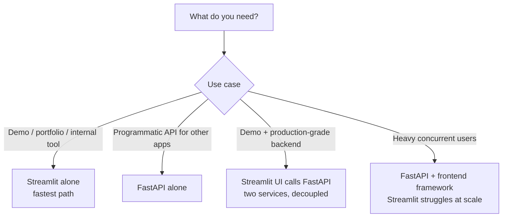

# Deployment 1 — Streamlit App

## Lectures covered
- Streamlit App

---

## In one sentence
**Streamlit** lets you wrap a trained model in a clickable web app using *only Python* — no HTML, no JavaScript — and host it for free in about 5 minutes.

## Real-world analogy
You've cooked a great meal (trained your model). Streamlit is the takeout container with a label and a fork — recruiters or non-technical stakeholders can taste your work without asking "how do I run a Jupyter notebook?".

## The intuition (plain English)
- A Streamlit app is just a Python script that runs **top-to-bottom on every interaction**.
- Heavy resources (models, DB connections) get cached with `@st.cache_resource` so they don't reload on every click.
- Persistent state across reruns lives in `st.session_state`.
- Pushing to GitHub + connecting Streamlit Cloud gives you a public URL in minutes — perfect for portfolio links.

## Mini worked example — image classifier in 12 lines

```python
import streamlit as st
from PIL import Image
import torch.nn.functional as F

@st.cache_resource
def load_model():
    return torch.load("model.pt", map_location="cpu").eval()

st.title("Car Damage Detector")

file = st.file_uploader("Upload a photo", type=["jpg", "png"])
if file:
    img = Image.open(file).convert("RGB")
    st.image(img)
    x = preprocess(img).unsqueeze(0)
    probs = F.softmax(load_model()(x), dim=-1)[0]
    st.success(f"Prediction: {CLASSES[probs.argmax()]} ({probs.max():.0%})")
```

That single file is what gets deployed. No backend, no frontend framework, no DevOps.

## At-a-glance — Streamlit vs FastAPI



```
   Streamlit reruns the script top-to-bottom on every interaction:
   ┌──────────────────────────────────────────────────────────────┐
   │  1. import + define functions                               │
   │  2. @st.cache_resource → load model ONCE                    │
   │  3. st.title / st.file_uploader / st.button → render UI     │
   │  4. on user click → script reruns from the top              │
   │  5. cache hits skip the heavy load                          │
   └──────────────────────────────────────────────────────────────┘
```

## Why this matters
- A live demo URL on a resume is worth more than 10 GitHub repos for many recruiters.
- Streamlit Cloud is free for public apps — you can ship today.
- Knowing when Streamlit *isn't* enough (high traffic, multi-user state) pushes you to the FastAPI pattern in the next file.

---

## Why Streamlit for DL demos

A Streamlit app is the **fastest way** to put a model behind a UI. No HTML, no JS, no React. Just Python.

For bootcamp portfolio projects, Streamlit + a hosted demo on Streamlit Cloud is the **single highest-ROI deployment effort**. Recruiters click the link, play with your model, and remember you.

---

## 1. Install
```bash
pip install streamlit
streamlit hello
```

## 2. Hello-world app
```python
# app.py
import streamlit as st

st.title("Image Classifier")
st.write("Upload an image, get a prediction.")

uploaded = st.file_uploader("Choose an image", type=["jpg", "png"])
if uploaded:
    st.image(uploaded, caption="Your image")
    st.write("Prediction: ...")
```

Run:
```bash
streamlit run app.py
```

Opens at `http://localhost:8501`.

---

## 3. Loading a PyTorch model — `@st.cache_resource`

You don't want to reload your 100MB model on every interaction. Cache it:

```python
import torch
from torchvision import models, transforms

@st.cache_resource
def load_model():
    model = models.efficientnet_b0(num_classes=4)
    model.load_state_dict(torch.load("model.pt", map_location="cpu"))
    model.eval()
    return model

model = load_model()
```

`@st.cache_resource` runs once per session. `@st.cache_data` is for cheap data caching.

---

## 4. Image classification app — full

```python
import streamlit as st
import torch
import torch.nn.functional as F
from PIL import Image
from torchvision import transforms, models

CLASSES = ["No Damage", "Scratch", "Dent", "Severe"]

@st.cache_resource
def load_model():
    model = models.efficientnet_b0(num_classes=len(CLASSES))
    model.load_state_dict(torch.load("model.pt", map_location="cpu"))
    model.eval()
    return model

tfm = transforms.Compose([
    transforms.Resize(256),
    transforms.CenterCrop(224),
    transforms.ToTensor(),
    transforms.Normalize([0.485, 0.456, 0.406], [0.229, 0.224, 0.225]),
])

st.title("🚗 Car Damage Detector")
st.write("Upload a photo of a car; the model predicts damage class and confidence.")

uploaded = st.file_uploader("Choose an image", type=["jpg", "jpeg", "png"])

if uploaded:
    image = Image.open(uploaded).convert("RGB")
    st.image(image, caption="Uploaded image", use_column_width=True)

    model = load_model()
    x = tfm(image).unsqueeze(0)
    with torch.no_grad():
        logits = model(x)
        probs = F.softmax(logits, dim=-1)[0]

    pred_class = CLASSES[probs.argmax().item()]
    st.success(f"Prediction: **{pred_class}**")

    st.subheader("Confidence per class")
    for cls, p in zip(CLASSES, probs):
        st.progress(p.item(), text=f"{cls}: {p:.2%}")
```

That's a complete app for the car-damage-detection project. ~40 lines.

---

## 5. Layout primitives

```python
st.title("...")
st.header("...")
st.subheader("...")
st.write(...)              # auto-formats for any type
st.markdown("...")
st.code("...", language="python")

# inputs
st.text_input("Name")
st.text_area("Description")
st.number_input("Age", min_value=0, max_value=120)
st.slider("Threshold", 0.0, 1.0, 0.5)
st.selectbox("Choose", ["A", "B", "C"])
st.multiselect("Pick many", ["X", "Y", "Z"])
st.checkbox("Agree?")
st.radio("Pick one", ["yes", "no"])
st.date_input("Date")
st.file_uploader("Upload")

# output
st.success("..."); st.warning("..."); st.error("..."); st.info("...")
st.metric("Accuracy", "92%", "+3%")
st.progress(0.7)
st.image(...); st.video(...); st.audio(...)
st.dataframe(df); st.table(df)            # interactive vs static
st.line_chart(df); st.bar_chart(df)       # quick charts

# layout
col1, col2 = st.columns(2)
col1.metric("Train acc", "98%")
col2.metric("Val acc", "94%")

with st.expander("Show details"):
    st.write("...")

with st.sidebar:
    st.write("settings")
```

---

## 6. Multi-page apps

```
my_app/
├── streamlit_app.py        # main page
└── pages/
    ├── 1_model_info.py
    └── 2_about.py
```

Streamlit auto-discovers `pages/` and adds them to a sidebar nav.

---

## 7. State management with `st.session_state`

```python
if "counter" not in st.session_state:
    st.session_state.counter = 0

if st.button("Click"):
    st.session_state.counter += 1
st.write(st.session_state.counter)
```

---

## 8. Hosting — Streamlit Cloud (free)

1. Push your repo to GitHub (must include `requirements.txt`)
2. Go to https://streamlit.io/cloud
3. Connect repo + branch + file path
4. Click Deploy → live URL in ~2 minutes

For larger models, secrets (API keys), or higher traffic: see Streamlit Cloud's paid tiers, or self-host on Render / Railway.

---

## 9. Performance tips

- `@st.cache_resource` for models, DB connections (heavy, persistent objects)
- `@st.cache_data` for cheap pure functions
- For huge models (LLMs): hosted inference (HuggingFace Inference, OpenAI/Anthropic API) instead of loading locally
- For real-time / many concurrent users: use FastAPI backend + Streamlit calling it (next file)

---

## 10. Production-y patterns

| Need | How |
|---|---|
| Auth | `st.secrets` for keys; for user auth use `streamlit-authenticator` or external Auth0 |
| Logging | regular Python logging |
| Background jobs | not Streamlit's strength — use FastAPI + Celery |
| File uploads at scale | upload to S3 / blob storage, not on disk |
| Custom domain | Streamlit Cloud supports it on paid plans; Vercel + iframe is a workaround |

For real production, **Streamlit is best for internal tools / demos, not customer-facing scaled web apps.** Pair with FastAPI when needed.

---

## 11. Common pitfalls

| Mistake | Effect | Fix |
|---|---|---|
| Model reloads each interaction | slow | `@st.cache_resource` |
| State lost on rerun | unexpected behavior | use `st.session_state` |
| Pushing model to GitHub | huge repo | use Git LFS, or host model on HuggingFace Hub / S3 |
| Hardcoded API keys | security leak | use `st.secrets` and `.streamlit/secrets.toml` |
| `st.image()` huge images | slow page | resize before display |

## Self-check

- [ ] Build a "hello" Streamlit app in 5 lines.
- [ ] Why use `@st.cache_resource` for models?
- [ ] How do you deploy to Streamlit Cloud?
- [ ] What's `st.session_state` and when use it?
- [ ] How do you store an API key safely?
- [ ] Build a multi-page app — show me the folder structure.
- [ ] When prefer FastAPI over Streamlit for serving a model?
- [ ] Walk through a Streamlit demo for an image classifier.

---

## Glossary

| Term | Plain meaning |
|------|---------------|
| **Streamlit** | Python framework for building data/ML web apps |
| **`streamlit run app.py`** | Command that launches the app at localhost:8501 |
| **Top-to-bottom rerun** | Streamlit re-executes the whole script on every interaction |
| **`@st.cache_resource`** | Cache for heavy persistent objects (models, DB connections) |
| **`@st.cache_data`** | Cache for cheap pure functions (DataFrames, computations) |
| **`st.session_state`** | Dict-like object that persists across reruns within a session |
| **`st.file_uploader`** | Widget for uploading files; returns a file-like object |
| **`st.image / video / audio`** | Display image/video/audio assets |
| **`st.metric`** | Big-number widget with optional delta arrow |
| **`st.progress`** | Progress bar (0–1) |
| **`st.expander`** | Collapsible region |
| **`st.sidebar`** | Left-hand panel for global controls |
| **`st.columns`** | Grid layout helper |
| **Multi-page app** | Folder named `pages/` auto-creates sidebar nav |
| **`st.secrets`** | Secure key-value store (`.streamlit/secrets.toml`) for API keys |
| **Streamlit Cloud** | Free hosting — connect a GitHub repo and deploy in minutes |
| **`requirements.txt`** | Pinned Python dependencies your hosted app needs |
| **Git LFS** | Git Large File Storage — for big model files |
| **HuggingFace Hub** | Place to host model weights externally so your repo stays small |
| **Cold start** | First-load delay when an idle service spins up |
| **Decoupled architecture** | UI and model API are separate services that talk over HTTP |

## Further reading
- Backend pair: [02-fastapi.md](02-fastapi.md) — when Streamlit alone isn't enough
- Project that deploys both: [../06-projects/01-car-damage-detection.md](../06-projects/01-car-damage-detection.md)
- Streamlit docs: https://docs.streamlit.io
