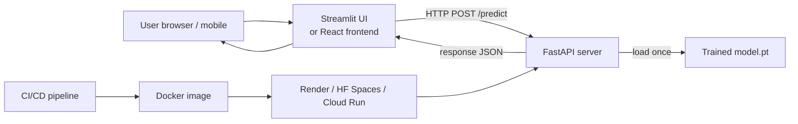

# Deployment 2 — FastAPI Server

## Lectures covered
- FastAPI Server

---

## In one sentence
**FastAPI** is a Python framework that turns your trained model into a typed, documented HTTP API in a few dozen lines — exactly what mobile apps, web frontends, and other services call to get predictions.

## Real-world analogy
Streamlit is a *food truck* — you sell directly to one customer who walks up. FastAPI is the *commercial kitchen* — chefs cook efficiently and the food gets shipped to many restaurants (frontends, mobile apps, internal tools) through standard delivery (HTTP). Same model, different distribution model.

## The intuition (plain English)
- A FastAPI app declares **endpoints** (URLs); each endpoint is a Python function decorated with `@app.post(...)` or `@app.get(...)`.
- The model is loaded **once at startup**, not per request, so every prediction is fast.
- **Pydantic** typed inputs/outputs give you automatic validation and an interactive docs page at `/docs`.
- For real production: containerize with **Docker**, host on Render / HuggingFace Spaces / Cloud Run, optionally pair with Streamlit as the UI.

## Mini worked example — `/predict` endpoint

```python
from fastapi import FastAPI, UploadFile, File
from PIL import Image
import io, torch, torch.nn.functional as F

app = FastAPI()
model = torch.load("model.pt", map_location="cpu").eval()    # loaded ONCE
CLASSES = ["no_damage", "scratch", "dent", "severe"]

@app.post("/predict")
async def predict(file: UploadFile = File(...)):
    img = Image.open(io.BytesIO(await file.read())).convert("RGB")
    x = preprocess(img).unsqueeze(0)
    with torch.no_grad():
        probs = F.softmax(model(x), dim=-1)[0].tolist()
    return {
        "prediction": CLASSES[max(range(4), key=lambda i: probs[i])],
        "probabilities": dict(zip(CLASSES, probs)),
    }
```

Run `uvicorn server:app --reload`, open `http://localhost:8000/docs`, click "Try it out" — you have an interactive API.

## At-a-glance — the modern split



```
   Request flow:

   client ─► POST /predict (multipart image)
            │
            ▼
        FastAPI receives → preprocess → model.eval() forward → softmax
            │
            ▼
   client ◄─ JSON {prediction, probabilities}
```

## Why this matters
- The "Streamlit UI calls FastAPI backend" pattern is the standard modern ML demo architecture.
- Type-checked endpoints (Pydantic) prevent half the bugs you'd otherwise hit.
- A Dockerized FastAPI server is the **portable artifact** that runs anywhere — a real engineering deliverable on a resume.

---

## When to use FastAPI

Streamlit is for **demos and dashboards**. FastAPI is for **production model APIs**:
- Service that other apps call
- Mobile / web frontends consume the API
- High-throughput inference
- Versioned, monitored, scaleable

For the bootcamp's car-damage-detection project, you'd build:
- **FastAPI server** — `/predict` endpoint
- **Streamlit UI** — hits the FastAPI server (decoupled)

This separation is the modern best practice.

---

## 1. Minimal FastAPI ML server

```python
# server.py
from fastapi import FastAPI, UploadFile, File
from PIL import Image
import torch
import torch.nn.functional as F
from torchvision import transforms, models
import io

app = FastAPI()
CLASSES = ["No Damage", "Scratch", "Dent", "Severe"]

# Load model once at startup
model = models.efficientnet_b0(num_classes=len(CLASSES))
model.load_state_dict(torch.load("model.pt", map_location="cpu"))
model.eval()

tfm = transforms.Compose([
    transforms.Resize(256),
    transforms.CenterCrop(224),
    transforms.ToTensor(),
    transforms.Normalize([0.485, 0.456, 0.406], [0.229, 0.224, 0.225]),
])

@app.get("/")
def root():
    return {"status": "alive"}

@app.post("/predict")
async def predict(file: UploadFile = File(...)):
    image_bytes = await file.read()
    image = Image.open(io.BytesIO(image_bytes)).convert("RGB")
    x = tfm(image).unsqueeze(0)
    with torch.no_grad():
        probs = F.softmax(model(x), dim=-1)[0].tolist()
    pred_idx = max(range(len(probs)), key=lambda i: probs[i])
    return {
        "prediction": CLASSES[pred_idx],
        "confidence": probs[pred_idx],
        "probabilities": dict(zip(CLASSES, probs)),
    }
```

Run:
```bash
uvicorn server:app --reload --host 0.0.0.0 --port 8000
```

Interactive docs at `http://localhost:8000/docs`.

---

## 2. Pydantic for typed responses

```python
from pydantic import BaseModel
from typing import Dict

class Prediction(BaseModel):
    prediction: str
    confidence: float
    probabilities: Dict[str, float]

@app.post("/predict", response_model=Prediction)
async def predict(file: UploadFile = File(...)):
    ...
```

Now the OpenAPI doc shows the exact response schema, and FastAPI validates outputs.

---

## 3. Async vs sync

- Use `async def` when the endpoint does I/O (HTTP, DB) — FastAPI handles concurrency well.
- Use `def` for CPU-bound work (model inference). FastAPI runs sync functions in a thread pool, which is also fine.

For PyTorch inference, sync (`def`) is typical. The bottleneck is GPU, not the event loop.

---

## 4. Batch inference for throughput

```python
@app.post("/predict_batch")
async def predict_batch(files: list[UploadFile] = File(...)):
    images = [tfm(Image.open(io.BytesIO(await f.read())).convert("RGB"))
              for f in files]
    x = torch.stack(images)
    with torch.no_grad():
        probs = F.softmax(model(x), dim=-1).tolist()
    return [{"probabilities": dict(zip(CLASSES, p))} for p in probs]
```

Batches of 16–64 images can be much more efficient than 16 separate calls.

---

## 5. Background tasks

For non-blocking work after returning a response:
```python
from fastapi import BackgroundTasks

def log_to_db(prediction):
    # write to DB
    ...

@app.post("/predict")
async def predict(file: UploadFile, background_tasks: BackgroundTasks):
    ...
    background_tasks.add_task(log_to_db, prediction)
    return {"prediction": prediction}
```

For longer-running async, use Celery + Redis or a queue system.

---

## 6. CORS — letting a browser app call your API

```python
from fastapi.middleware.cors import CORSMiddleware

app.add_middleware(
    CORSMiddleware,
    allow_origins=["http://localhost:5173", "https://my-frontend.vercel.app"],
    allow_methods=["*"],
    allow_headers=["*"],
)
```

Without this, browser security blocks cross-origin calls.

---

## 7. Health and readiness endpoints

```python
@app.get("/health")
def health():
    return {"status": "ok"}

@app.get("/ready")
def ready():
    return {"model_loaded": model is not None}
```

Cloud platforms (Render, Railway, Kubernetes) use these to know when to route traffic.

---

## 8. Containerizing with Docker

```dockerfile
FROM python:3.12-slim

WORKDIR /app
COPY requirements.txt .
RUN pip install --no-cache-dir -r requirements.txt
COPY . .

CMD ["uvicorn", "server:app", "--host", "0.0.0.0", "--port", "8000"]
```

```bash
docker build -t car-damage-api .
docker run -p 8000:8000 car-damage-api
```

Now your model is reproducibly packaged and deployable anywhere.

---

## 9. Hosting options

| Service | Cost | When |
|---|---|---|
| **Render** | Free tier sleeps after 15 min idle | Demos |
| **Railway** | Cheap usage-based | Always-on small services |
| **Fly.io** | Generous free tier | Global edge |
| **Hugging Face Spaces** | Free for public; supports FastAPI + Docker | DL demos |
| **AWS Lambda** | Free tier; cold starts | Sporadic traffic |
| **AWS ECS / GCP Cloud Run** | Pay-per-use | Production |
| **AWS SageMaker / Vertex AI** | Higher cost | Enterprise model serving |

For the bootcamp's car-damage-detection: **Hugging Face Spaces** or **Render** are both free and 5 minutes to deploy.

---

## 10. Calling FastAPI from Streamlit

```python
# In streamlit app
import streamlit as st
import requests

API = "https://my-api.onrender.com"

uploaded = st.file_uploader("Image", type=["jpg", "png"])
if uploaded and st.button("Predict"):
    files = {"file": uploaded.getvalue()}
    r = requests.post(f"{API}/predict", files=files, timeout=20)
    st.json(r.json())
```

This is the recommended split: heavy model on FastAPI; UI on Streamlit. Two services, two URLs, one demo.

---

## 11. Production checklist

- [ ] Health endpoint
- [ ] Logging (structured)
- [ ] Request rate limiting (e.g., `slowapi`)
- [ ] API key authentication
- [ ] Pydantic validation everywhere
- [ ] OpenAPI docs accessible (auto via `/docs`)
- [ ] Error handling — return clear `HTTPException`
- [ ] Tests with `httpx.AsyncClient`
- [ ] Pinned `requirements.txt`
- [ ] Dockerfile that builds in CI
- [ ] Monitoring (request count, latency, errors) — Prometheus + Grafana

---

## 12. Common pitfalls

| Mistake | Effect | Fix |
|---|---|---|
| Loading model inside the request handler | slow per-request | load once at startup |
| Returning numpy arrays directly | not JSON-serializable | `.tolist()` first |
| Not setting `response_model` | OpenAPI docs shaky | always specify |
| Forgetting CORS | browser frontend blocked | add middleware |
| Huge model in Lambda | 15-min cold start | use Cloud Run / ECS instead |

## Self-check

- [ ] Why split UI (Streamlit) and API (FastAPI)?
- [ ] How do you load a PyTorch model at server startup, not per-request?
- [ ] What's a Pydantic response model and why use it?
- [ ] When use sync `def` vs `async def`?
- [ ] How do you enable CORS?
- [ ] Containerize the FastAPI server with Docker.
- [ ] Pick a hosting provider for a free demo of the car-damage API.
- [ ] What's a health endpoint and who calls it?

---

## Glossary

| Term | Plain meaning |
|------|---------------|
| **FastAPI** | Modern Python web framework with automatic typed validation and OpenAPI docs |
| **Endpoint** | A URL + HTTP method handled by a function (e.g., `POST /predict`) |
| **`@app.get` / `@app.post`** | Decorators that bind a function to an HTTP method + path |
| **uvicorn** | ASGI server that actually runs your FastAPI app |
| **`UploadFile`** | FastAPI helper for receiving uploaded files |
| **Pydantic** | Library for typed data validation; FastAPI uses it for inputs/outputs |
| **`BaseModel`** | Pydantic class for declaring a schema |
| **`response_model`** | Tells FastAPI the expected output schema |
| **OpenAPI / Swagger** | Auto-generated interactive docs at `/docs` |
| **CORS** | "Cross-Origin Resource Sharing" — browser security; usually enabled via middleware |
| **Middleware** | Code that wraps every request (CORS, logging, auth) |
| **`async def` vs `def`** | Async for I/O-bound, sync for CPU-bound (e.g., model inference) |
| **`BackgroundTasks`** | Run something *after* sending the response (logging, queueing) |
| **Health endpoint** | `/health` returns OK; used by load balancers to check service is up |
| **Readiness endpoint** | `/ready` returns true when model is fully loaded |
| **Docker** | Container platform that packages app + dependencies |
| **Dockerfile** | Recipe describing how to build the container image |
| **Image / container** | Built artifact / running instance of that artifact |
| **Render / Railway / Fly.io** | Cloud hosting providers with free tiers |
| **HuggingFace Spaces** | Free hosting for ML demos (Gradio, Streamlit, FastAPI) |
| **AWS Lambda** | Serverless compute; cold starts can be a problem for big models |
| **Cloud Run / ECS** | Container-based pay-per-use compute |
| **SageMaker / Vertex AI** | Managed model-serving platforms (enterprise) |
| **Batch inference** | Sending many inputs in one call for throughput |
| **Cold start** | Latency when a sleeping service spins up |
| **Rate limiting** | Capping how many requests a client can make per second/minute |
| **`HTTPException`** | FastAPI's clean way to return error responses |
| **`response_model`** | Pydantic schema enforcing the response shape |
| **Pinned `requirements.txt`** | Dependency versions locked so production matches dev |

## Further reading
- UI counterpart: [01-streamlit.md](01-streamlit.md)
- Project that deploys this stack: [../06-projects/01-car-damage-detection.md](../06-projects/01-car-damage-detection.md)
- FastAPI docs: https://fastapi.tiangolo.com
