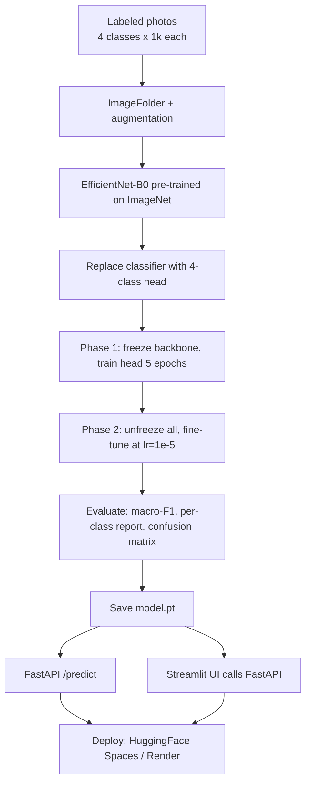

# Project — Car Damage Detection (CNN)

---

## In one sentence
Build an image classifier that looks at a photo of a car and predicts one of four damage classes — using a pre-trained CNN, two-phase fine-tuning, and a Streamlit + FastAPI demo you can put on your resume.

## Real-world analogy
Imagine an insurance claims agent who's seen thousands of damaged cars. After enough experience, they can glance at a photo and say "minor scratch" or "totaled" almost instantly. The CNN here is that agent — pre-trained on ImageNet (general visual knowledge), then fine-tuned on car-damage photos to specialize.

## The intuition (plain English)
- You don't train from scratch — you start from **EfficientNet-B0** pre-trained on 1.4M ImageNet images and replace its final classifier with a 4-class head.
- **Phase 1**: freeze the backbone, train only the new head — fast, gets you to ~80% accuracy in 5 epochs.
- **Phase 2**: unfreeze everything, fine-tune at a tiny LR (1e-5) — squeezes out the last 5–10pp.
- Wrap the trained model in **FastAPI** for the prediction service and **Streamlit** for the UI; deploy free on HuggingFace Spaces or Render.

## Mini worked example — what one prediction looks like

A claims adjuster uploads a photo of a side-swiped car. The model produces:

```
input:  car_photo.jpg  (3 x 224 x 224 after preprocessing)

logits   = [-1.2, 2.8, 0.4, -0.1]
softmax  = [0.05, 0.78, 0.12, 0.05]
            │     │     │     │
       no_damage scratch dent severe
                  ↑
       prediction: "scratch" (78% confidence)

API response:
{
  "prediction": "scratch",
  "probabilities": {
    "no_damage": 0.05,
    "scratch":   0.78,
    "dent":      0.12,
    "severe":    0.05
  }
}
```

The UI shows progress bars per class so a human reviewer can override low-confidence cases.

## At-a-glance — the project pipeline



```
   data/                          model                         deployment
   ─────                          ─────                         ──────────
   train/no_damage/               EfficientNet-B0 (frozen)      FastAPI server (model.pt)
   train/scratch/      ─►   ─►    + new Linear(1280→4)     ─►   + /predict endpoint
   train/dent/                                                  + Streamlit UI
   train/severe/                                                + HuggingFace Space URL
```

## Why this matters
- Combines every module skill: CNN, transfer learning, augmentation, two-phase training, deployment.
- The visual demo (upload a car photo, see prediction) is exactly what hiring managers click on.
- Insurance / automotive are real industries that hire ML engineers — the project is genuinely close to production.

---

## Domain
Insurance + automotive. After an accident, customers upload photos of their car. The system **automatically classifies** the damage so claims can be triaged faster.

## ML formulation
- **Type**: image classification (multi-class)
- **Classes**: typically 4 — `no_damage`, `scratch`, `dent`, `severe`
- **Metric**: macro-F1, plus per-class precision/recall (severe damage matters more than missing a tiny scratch)
- **Architecture**: pre-trained CNN (ResNet / EfficientNet) + transfer learning

---

## Why this is a great DL portfolio project

1. **Real-world domain** (automotive / insurance — both hire ML)
2. **Visual demo** — recruiters love a Streamlit app where they upload a car photo
3. **Full stack** — CNN + transfer learning + augmentation + Streamlit + FastAPI
4. **Production-relevant** — insurers actually use systems like this

---

## Walkthrough

### 1. Dataset setup
Find or construct a labeled dataset. Options:
- Existing Kaggle datasets ("car damage detection")
- Codebasics' provided dataset
- Hand-labeled (if you collect images)

```
data/
├── train/
│   ├── no_damage/      <- 800 images
│   ├── scratch/         <- 800
│   ├── dent/            <- 800
│   └── severe/          <- 800
└── val/
    ├── no_damage/      <- 200
    ├── scratch/         <- 200
    ├── dent/            <- 200
    └── severe/          <- 200
```

`torchvision.datasets.ImageFolder` reads this layout natively.

### 2. EDA + class balance check
```python
from collections import Counter
from torchvision import datasets

ds = datasets.ImageFolder("data/train")
print(Counter([y for _, y in ds.samples]))    # ensure balance
```

If imbalanced: use `WeightedRandomSampler` or `class_weight` in loss.

### 3. Augmentation pipeline
```python
from torchvision import transforms

train_tfm = transforms.Compose([
    transforms.Resize(256),
    transforms.RandomResizedCrop(224, scale=(0.7, 1.0)),
    transforms.RandomHorizontalFlip(),
    transforms.ColorJitter(brightness=0.2, contrast=0.2, saturation=0.2),
    transforms.RandomRotation(15),
    transforms.ToTensor(),
    transforms.Normalize([0.485, 0.456, 0.406], [0.229, 0.224, 0.225]),
])
val_tfm = transforms.Compose([
    transforms.Resize(256),
    transforms.CenterCrop(224),
    transforms.ToTensor(),
    transforms.Normalize([0.485, 0.456, 0.406], [0.229, 0.224, 0.225]),
])
```

### 4. Model — EfficientNet-B0 transfer learning
```python
import torch.nn as nn
from torchvision import models

CLASSES = ["no_damage", "scratch", "dent", "severe"]

def build_model(n_classes=len(CLASSES)):
    weights = models.EfficientNet_B0_Weights.IMAGENET1K_V1
    model = models.efficientnet_b0(weights=weights)
    model.classifier[1] = nn.Linear(model.classifier[1].in_features, n_classes)
    return model
```

### 5. Two-phase training
```python
import torch.optim as optim
import torch.nn as nn
import torch

device = "cuda" if torch.cuda.is_available() else "cpu"
model = build_model().to(device)
loss_fn = nn.CrossEntropyLoss()

# Phase 1: feature extraction
for p in model.features.parameters(): p.requires_grad = False
opt = optim.Adam(model.classifier.parameters(), lr=1e-3)
train_loop(model, train_loader, val_loader, opt, loss_fn, epochs=5)

# Phase 2: full fine-tune
for p in model.parameters(): p.requires_grad = True
opt = optim.Adam(model.parameters(), lr=1e-5)
sched = optim.lr_scheduler.CosineAnnealingLR(opt, T_max=15)
train_loop(model, train_loader, val_loader, opt, loss_fn, epochs=15, scheduler=sched)
```

### 6. Hyperparameter tuning with Optuna (optional but nice)
- LR (log)
- Augmentation strength
- Dropout in classifier head
- Batch size

### 7. Evaluation
```python
from sklearn.metrics import classification_report, confusion_matrix
import seaborn as sns

@torch.no_grad()
def evaluate(model, loader):
    model.eval()
    all_preds, all_y = [], []
    for x, y in loader:
        preds = model(x.to(device)).argmax(dim=1).cpu()
        all_preds.append(preds); all_y.append(y)
    return torch.cat(all_preds), torch.cat(all_y)

preds, y_true = evaluate(model, val_loader)
print(classification_report(y_true, preds, target_names=CLASSES))
sns.heatmap(confusion_matrix(y_true, preds), annot=True, xticklabels=CLASSES, yticklabels=CLASSES)
```

### 8. Error analysis
Look at misclassified images:
- Worst confused pair → maybe scratches + dents — visually similar
- Recommend more data for that pair
- Or class-specific rules (severity score from area)

### 9. Deployment

#### FastAPI server (saves model.pt + serves /predict)
See `05-deployment/02-fastapi.md` — full template there.

#### Streamlit UI
See `05-deployment/01-streamlit.md`.

#### Hosting
- **HuggingFace Spaces** — free, fastest path
- **Render** — also free
- Both: push code + model to GitHub → connect → live URL in 5 min

### 10. Demo polish
- Demo gif / Loom recording
- README with screenshot
- 3 example images bundled (so reviewers don't need their own)
- Performance numbers in README ("macro-F1 0.91; per-class table below")

---

## Repo structure
```
car-damage-detection/
├── data/                            # not committed (huge)
├── notebooks/
│   ├── 01-data-overview.ipynb
│   ├── 02-baseline-training.ipynb
│   ├── 03-fine-tune.ipynb
│   └── 04-error-analysis.ipynb
├── src/
│   ├── train.py
│   ├── server.py                    # FastAPI
│   └── app.py                       # Streamlit
├── models/
│   └── model.pt                     # (or hosted on HuggingFace Hub)
├── examples/                        # 3 sample images for the README
├── Dockerfile
├── requirements.txt
└── README.md
```

---

## Stretch goals

- **Object detection / bounding box** instead of classification (using YOLOv8 or Detectron2)
- **Segmentation** of damage area (Mask R-CNN, U-Net)
- **Cost estimation** model that takes the damage class + car make/model → predicted repair cost
- **Mobile** deployment (TorchScript / ONNX → CoreML / TFLite)

These are great extensions for follow-up posts and demonstrate progression.

---

## Self-check

- [ ] Did I use a pre-trained model + transfer learning (not from scratch)?
- [ ] Two-phase training: feature extraction then fine-tune?
- [ ] Augmentation appropriate for the domain?
- [ ] Per-class metrics + confusion matrix in the README?
- [ ] Streamlit demo deployed publicly?
- [ ] Error analysis section included?
- [ ] README with screenshots, demo link, and per-class numbers?
- [ ] LinkedIn post with the demo link?

---

## Glossary

| Term | Plain meaning |
|------|---------------|
| **Image classification** | Predict one label per image |
| **Multi-class** | More than two mutually exclusive classes |
| **macro-F1** | Average per-class F1, treating all classes equally — robust to imbalance |
| **Per-class precision/recall** | Separate metrics for each class — surface specific weaknesses |
| **Confusion matrix** | Table of true vs predicted labels — shows which classes get confused |
| **`ImageFolder`** | torchvision dataset that infers labels from folder names |
| **Class imbalance** | Some classes have far more samples than others |
| **`WeightedRandomSampler`** | DataLoader sampler that oversamples rare classes |
| **Class weights** | Per-class scaling in the loss function to combat imbalance |
| **Data augmentation** | Random transforms applied at training time (flip, crop, jitter) |
| **EfficientNet-B0** | Compact pre-trained CNN (~5M params); great accuracy/efficiency |
| **Transfer learning** | Reuse a pre-trained model's weights for your task |
| **Backbone** | Feature-extracting part of a pre-trained network |
| **Classifier head** | Final task-specific layers (here, `Linear(1280, 4)`) |
| **Feature extraction** | Phase 1 — freeze backbone, train only the head |
| **Fine-tuning** | Phase 2 — unfreeze all and continue at a tiny LR |
| **Two-phase training** | Combination of feature extraction then fine-tuning |
| **Cosine annealing LR** | Smoothly decay the learning rate over epochs |
| **Optuna** | Hyperparameter-search library for tuning LR, dropout, etc. |
| **Macro vs micro average** | Macro = average per class; micro = pool all predictions |
| **Error analysis** | Inspect misclassified examples to identify systematic gaps |
| **`classification_report`** | sklearn helper printing precision/recall/F1/support per class |
| **FastAPI** | Backend framework serving the prediction endpoint |
| **Streamlit** | Frontend framework for the demo UI |
| **HuggingFace Spaces** | Free hosting for ML demos |
| **TorchScript / ONNX** | Portable model formats for mobile/edge deployment |
| **Mask R-CNN / U-Net** | Models for segmentation (a stretch goal) |
| **YOLO / Detectron2** | Object-detection frameworks (another stretch goal) |

## Further reading
- CNN basics: [../03-vision/01-cnn.md](../03-vision/01-cnn.md)
- Transfer learning recipe used here: [../03-vision/03-transfer-learning-pretrained.md](../03-vision/03-transfer-learning-pretrained.md)
- Augmentation pipeline: [../03-vision/02-data-augmentation.md](../03-vision/02-data-augmentation.md)
- FastAPI server: [../05-deployment/02-fastapi.md](../05-deployment/02-fastapi.md)
- Streamlit UI: [../05-deployment/01-streamlit.md](../05-deployment/01-streamlit.md)
