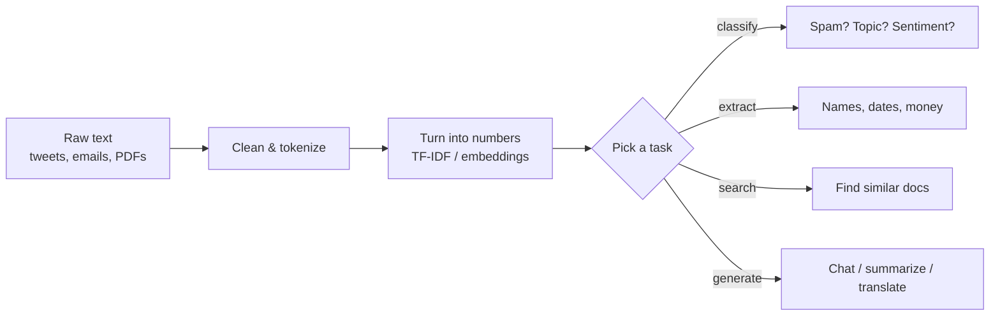

# NLP 1 — Intro, Pipeline, Tools Overview

## Lectures covered
- Introduction to NLP
- NLP Pipeline
- Tools Overview

---

## In one sentence
**NLP** ("Natural Language Processing") is the toolkit that turns raw human text — tweets, emails, news articles — into something a computer can search, classify, summarize, or answer questions about.

## Real-world analogy
Think of NLP as a translator standing between you and a library that only speaks numbers. You hand it a book ("Apple raised $3B today"), and it hands the computer back a structured slip: company = Apple, amount = $3B, action = raised. Once everything is on numeric slips, the computer can sort, count, and reason about a million books at once.

## The intuition (plain English)
Computers are great with numbers and terrible with prose. NLP is the staircase from prose to numbers. Older NLP did this in many small steps: split into words, tag the parts of speech, find the names, count the words. Modern NLP (transformers, large language models) skips most of those steps — the model learns the staircase on its own. You still need to know the small steps because they let you debug, save money, run on a phone, or work on data the big models never saw.

## Mini worked example — what one news headline looks like at each stage

Take the headline:

```
"Apple bought Beats for $3 billion in 2014."
```

Walk it through a classical pipeline:

```
Sentence split  -> ["Apple bought Beats for $3 billion in 2014."]
Tokenize        -> ["Apple", "bought", "Beats", "for", "$3", "billion", "in", "2014", "."]
POS tag         -> [PROPN, VERB, PROPN, ADP, NUM, NUM, ADP, NUM, PUNCT]
NER             -> Apple=ORG, Beats=ORG, $3 billion=MONEY, 2014=DATE
Vector (TF-IDF) -> [0.0, 0.41, 0.0, 0.12, 0.55, ...]   (one number per word in the vocabulary)
Classifier      -> "Business" (probability 0.93)
```

Each row is one step. By the end, the headline is a vector and a label — things a computer can index, search, and learn from.

## At-a-glance — the big picture



## Why this matters
- Every chatbot, search bar, autocomplete, spam filter, voice assistant runs NLP under the hood.
- Even with LLMs everywhere, classical NLP is still cheaper, faster, and more reliable for many production tasks.
- Knowing the pipeline lets you debug "why did it misclassify this email?" instead of treating the model as a magic box.
- Resume parsers, support-ticket routers, news dashboards — all built from these blocks.

---

## 1. What NLP is (and isn't)

NLP = "make computers understand and produce human language."

Tasks:
- **Understand**: classify, extract entities, parse syntax, summarize, retrieve
- **Generate**: chat, translate, write code, write articles
- **Both**: question answering, dialogue systems

In 2025, the line between "NLP" and "Generative AI" has blurred — LLMs do most NLP tasks better than traditional pipelines. But NLP fundamentals still matter for:
- **Cost** — small classifiers are way cheaper than LLM calls
- **Latency** — DistilBERT is 100× faster than GPT-4
- **Privacy** — keep data on-prem
- **Reliability** — deterministic pipelines vs hallucination
- **As building blocks** — RAG, search, embedding, classification all use these tools

---

## 2. The classical NLP pipeline

```
raw text
  │
  ▼
1. Sentence segmentation     ("split this. into sentences." → ["split this.", "into sentences."])
  │
  ▼
2. Tokenization              ("hello world!" → ["hello", "world", "!"])
  │
  ▼
3. Lowercasing               (sometimes)
  │
  ▼
4. Stop-word removal         (remove "the", "a", "is")
  │
  ▼
5. Stemming or lemmatization (reduce words to roots: "running" → "run")
  │
  ▼
6. POS tagging               (tag each token: noun, verb, adj)
  │
  ▼
7. Named Entity Recognition  (find PERSON, ORG, DATE, LOCATION)
  │
  ▼
8. Parsing                   (build dependency or constituency tree)
  │
  ▼
9. Vectorize                 (TF-IDF, word embeddings, contextual embeddings)
  │
  ▼
10. Downstream task          (classification, NER, similarity, search, ...)
```

Modern transformer-based NLP **skips most of these** — the model learns implicitly. But knowing them lets you mix-and-match.

---

## 3. Tool landscape

### NLTK (Natural Language Toolkit)
- The original Python NLP library (2001)
- Great for **education** — every algorithm is exposed
- Lots of corpora, stemmers, classic features
- Slow for production

```python
import nltk
nltk.download("punkt")
from nltk.tokenize import word_tokenize, sent_tokenize
```

### spaCy
- **Production-grade** pipelines: tokenization, POS, NER, dependency parsing — fast
- Loads pre-built language models (English, multilingual, etc.)
- Great for: extracting structured info from text at scale

```python
import spacy
nlp = spacy.load("en_core_web_sm")
doc = nlp("Apple is opening a store in San Francisco next year.")
for ent in doc.ents:
    print(ent.text, ent.label_)
# Apple ORG
# San Francisco GPE
# next year DATE
```

### gensim
- Topic modeling (LDA), Word2Vec, Doc2Vec, FastText
- Great for: training your own embeddings, topic models on document corpora

### scikit-learn
- `CountVectorizer`, `TfidfVectorizer` — classic text-to-features
- Plug into any sklearn classifier

### HuggingFace `transformers`
- The standard for **modern, transformer-based NLP**
- 100,000+ pre-trained models
- Pipelines API for instant inference

```python
from transformers import pipeline
clf = pipeline("sentiment-analysis")
clf("I love this bootcamp!")
```

### `sentence-transformers`
- Sentence embeddings (semantic similarity, retrieval)
- Foundation for RAG

```python
from sentence_transformers import SentenceTransformer
model = SentenceTransformer("all-MiniLM-L6-v2")
embeddings = model.encode(["sentence one", "sentence two"])
```

### Specialized
- **fast.ai** — high-level wrapper around PyTorch for NLP/CV
- **Stanza** (Stanford) — alternative to spaCy with stronger linguistic features
- **flair** — word + sentence embeddings, NER

---

## 4. When to use which (quick decision)

| Task | Default tool |
|---|---|
| Tokenize, lowercase, stop-words | NLTK or spaCy |
| Industrial NER, POS, parsing | spaCy |
| TF-IDF + simple classifier | scikit-learn |
| Word embeddings from your own corpus | gensim |
| Sentence embeddings / semantic search | `sentence-transformers` |
| Sentiment / classification with SOTA accuracy | HuggingFace + DistilBERT |
| Chat / generation / agents | LLM API (OpenAI / Anthropic) — Module 9 |

---

## 5. Languages — multilingual considerations

- **English-only models** (DistilBERT-base) → smallest, fastest
- **Multilingual** (`xlm-roberta-base`, `bge-m3`) → for Asian/European/African scripts
- **Indic-specific** (e.g., MuRIL for Indian languages) → if working in Hindi, Urdu, Tamil, Bengali, etc.

For Pakistani / Indian context: MuRIL or XLM-R are good defaults.

---

## 6. NLP-specific evaluation

- **Classification** — accuracy, F1, macro-F1
- **NER** — exact-match F1 (entity-level)
- **Translation** — BLEU, chrF, COMET
- **Summarization** — ROUGE-1, ROUGE-2, ROUGE-L
- **Embedding quality** — STS Benchmark (Semantic Textual Similarity)
- **QA (extractive)** — exact match, F1
- **LLM eval** — human eval, LLM-as-judge, RAGAS (for RAG)

---

## 7. The 2025 NLP project mental model

```
┌────────────────────────────────────────────┐
│  Stage 1: prompt an LLM                    │   <- start here
│  (works for many tasks zero-shot)          │
└────────────────────────────────────────────┘
            │   not good enough?
            ▼
┌────────────────────────────────────────────┐
│  Stage 2: few-shot prompting + RAG          │
│  (give context + examples)                  │
└────────────────────────────────────────────┘
            │   still not good?
            ▼
┌────────────────────────────────────────────┐
│  Stage 3: fine-tune small model             │   <- BERT-class
│  (cheaper, faster, more controllable)       │
└────────────────────────────────────────────┘
            │
            ▼
┌────────────────────────────────────────────┐
│  Stage 4: classical NLP pipeline            │   <- only when previous fail
│  (hand-crafted, fully controllable)         │
└────────────────────────────────────────────┘
```

---

## 8. Common pitfalls

| Mistake | Effect | Fix |
|---|---|---|
| Lowercasing for case-sensitive tasks (NER) | drops signal | only lowercase for tasks that benefit |
| Removing stop-words for sentiment | "not good" → "good" | be careful; stop-words depend on task |
| Using NLTK in production | slow | spaCy or HuggingFace |
| Same tokenizer for all models | wrong vocab | always pair tokenizer + model from same checkpoint |
| Wrong evaluation metric | optimizing wrong thing | match metric to task (F1 for NER, BLEU for translation) |

## Self-check

- [ ] List the steps of the classical NLP pipeline.
- [ ] When use NLTK vs spaCy?
- [ ] What's `sentence-transformers` used for?
- [ ] When prefer fine-tuning a small model over prompting an LLM?
- [ ] What metric for: news classification / NER / translation / RAG?
- [ ] Why is "remove stop-words" not always a good idea?
- [ ] What languages should I worry about for South Asian text?
- [ ] Walk through the 2025 mental model — which stage do you start at?

---

## Glossary

| Term | Plain meaning |
|------|---------------|
| **NLP** (Natural Language Processing) | Getting computers to read, write, or understand human language |
| **Token** | A unit of text the computer works with — usually a word or sub-word piece |
| **Tokenization** | Splitting text into tokens |
| **Corpus** | A collection of documents you train or test on (plural: corpora) |
| **Document** | One piece of text — a tweet, email, news article, paragraph |
| **Vocabulary** | The full list of unique tokens the model knows |
| **Stop words** | Very common words (the, a, is) that often add little meaning |
| **Stemming** | Crudely chopping word endings: "running" -> "run", "easily" -> "easili" |
| **Lemmatization** | Reducing a word to its dictionary form: "running" -> "run", "better" -> "good" |
| **POS** (Part of Speech) | The grammatical role of a word: noun, verb, adjective |
| **NER** (Named Entity Recognition) | Finding people, companies, places, dates inside text |
| **Parsing** | Building a tree of how words depend on each other grammatically |
| **TF-IDF** | A way of scoring words: high if a word is common in *this* doc but rare overall |
| **Embedding** | A short list of numbers (vector) that represents the meaning of a word or sentence |
| **Vectorize** | Turn text into a list of numbers a model can consume |
| **Classifier** | A model that picks one label out of a fixed set (spam vs not, topic A vs B) |
| **Pipeline** | An ordered chain of steps: raw text in -> result out |
| **LLM** (Large Language Model) | A huge transformer (GPT, Claude, Llama) that can chat, write, reason |
| **Transformer** | The neural-network architecture behind BERT, GPT, and most modern NLP. See [DL transformers](../07-deep-learning/04-sequence/03-transformer-architecture.md) |
| **BERT** | A famous transformer good at understanding text. See [DL BERT](../07-deep-learning/04-sequence/05-bert-huggingface.md) |
| **DistilBERT** | A smaller, faster version of BERT — keeps 95% of the quality at half the size |
| **RAG** (Retrieval-Augmented Generation) | Letting an LLM look up real docs before answering, instead of guessing |
| **F1 score** | A single number that balances precision and recall — common metric for classification |
| **BLEU / ROUGE** | Automatic scoring metrics for translation and summarization |
| **Zero-shot** | Asking a model to do a task it was never explicitly trained on |
| **Fine-tuning** | Taking a pre-trained model and training it a bit more on your own data |
| **HuggingFace** | The de-facto registry of pre-trained NLP models and the `transformers` library |
| **spaCy** | A fast Python NLP library for tokenization, POS, NER, parsing |
| **NLTK** | The original teaching-oriented Python NLP library |
| **gensim** | A Python library focused on topic models and word embeddings |

## Further reading
- Next: [02-text-preprocessing.md](02-text-preprocessing.md) — splitting, cleaning, lemmatizing
- Then: [04-bow-ngrams-tfidf.md](04-bow-ngrams-tfidf.md) — first way to turn text into numbers
- DL bridge: [transformers](../07-deep-learning/04-sequence/03-transformer-architecture.md), [BERT](../07-deep-learning/04-sequence/05-bert-huggingface.md)
- Style guide: [BEGINNER-STYLE-GUIDE.md](../../BEGINNER-STYLE-GUIDE.md)
