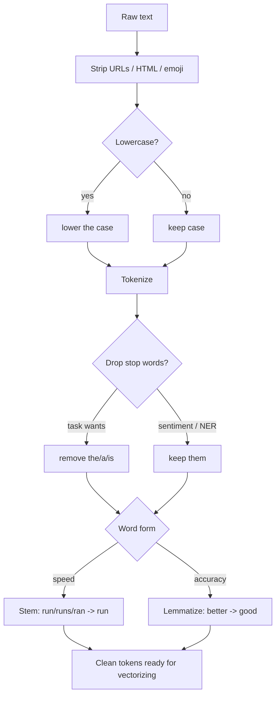

# NLP 2 — Text Preprocessing: Tokenization, Stemming, Lemmatization, Stop Words

## Lectures covered
- Tokenization Techniques
- Stemming & Lemmatization
- Stop Words

---

## In one sentence
Text preprocessing is how you turn messy raw text — with random capitals, weird punctuation, URLs, and word variations — into a clean, consistent stream of tokens your model can handle.

## Real-world analogy
Imagine you're a librarian receiving boxes of donated books. Some are in ALL CAPS, some have coffee stains, some say "running" while others say "ran" or "runs." Before you can shelve them, you straighten them up: same case, same word forms, throw out the junk pages. That cleanup is preprocessing. The cleaner your shelf, the easier it is to find what you want later.

## The intuition (plain English)
Three main jobs happen here. First, **tokenize**: chop a string into small pieces (words, sub-words, or characters). Second, **normalize**: lowercase, strip URLs, collapse "running / runs / ran" into a single root so the model treats them as the same idea. Third, **filter**: drop ultra-common words like "the" and "is" if they're noise for your task. You don't always do all three — modern transformer models prefer raw text, while a search engine still wants aggressive cleaning.

## Mini worked example — one tweet, four pipelines

Tweet:
```
"I'm LOVING the new iPhone!! Visit https://apple.com for details. #excited"
```

| Step | Output |
|------|--------|
| Raw | `"I'm LOVING the new iPhone!! Visit https://apple.com for details. #excited"` |
| Lowercase | `"i'm loving the new iphone!! visit https://apple.com for details. #excited"` |
| Strip URLs | `"i'm loving the new iphone!! visit  for details. #excited"` |
| Word tokens | `["i", "'m", "loving", "the", "new", "iphone", "!", "!", "visit", "for", "details", ".", "#", "excited"]` |
| Drop stop words | `["loving", "new", "iphone", "!", "!", "visit", "details", ".", "#", "excited"]` |
| Lemmatize | `["love", "new", "iphone", "!", "!", "visit", "detail", ".", "#", "excited"]` |
| BERT sub-word tokens | `["i", "'", "m", "loving", "the", "new", "i", "##phone", "!", "!", ...]` |

Notice that `"loving"` becomes `"love"` after lemmatization, but BERT just keeps it as `"loving"` — different models prefer different cleaning levels.

## At-a-glance — pipeline you'll build



## Why this matters
- Bad preprocessing silently kills downstream accuracy. "Apple" lowercased to "apple" can wipe out company-name detection.
- The right tokenizer gives smaller models 5-10 percentage points of accuracy for free.
- For BERT/GPT-class models you preprocess **less** than you think — over-cleaning hurts.
- Search engines and BoW classifiers depend on clean, normalized tokens.

---

## 1. Tokenization — splitting text into units

### Word tokenization
```python
from nltk.tokenize import word_tokenize
word_tokenize("Hello, world! Let's split.")
# ['Hello', ',', 'world', '!', 'Let', "'s", 'split', '.']
```

```python
import spacy
nlp = spacy.load("en_core_web_sm")
[t.text for t in nlp("Hello, world! Let's split.")]
# ['Hello', ',', 'world', '!', 'Let', "'s", 'split', '.']
```

### Sentence tokenization
```python
from nltk.tokenize import sent_tokenize
sent_tokenize("Hello world. How are you? I'm fine.")
# ['Hello world.', 'How are you?', "I'm fine."]
```

### Subword tokenization — what BERT/GPT actually use

Modern transformers tokenize into **subwords**, handling out-of-vocabulary gracefully.

#### BPE (Byte-Pair Encoding) — used by GPT
"unhappily" → ["un", "happ", "ily"]

#### WordPiece — used by BERT
"playing" → ["play", "##ing"]    (## marks "continues previous")

#### SentencePiece — used by T5, multilingual models
Treats text as a stream of bytes, no whitespace assumption — works across languages.

```python
from transformers import AutoTokenizer
tk = AutoTokenizer.from_pretrained("bert-base-uncased")
tk.tokenize("transformers are unbelievable")
# ['transformers', 'are', 'un', '##bel', '##ievable']
```

> **Always use the tokenizer that matches your pre-trained model**. Mixing them silently produces wrong embeddings.

### Character / byte tokenization
- For Chinese, Japanese — sometimes character is the unit
- For very robust models — byte-level (GPT-2) handles any text

---

## 2. Stemming — chop endings off

Crude but fast. Reduces words to a common stem (not necessarily a real word).

```python
from nltk.stem import PorterStemmer, SnowballStemmer

ps = PorterStemmer()
[ps.stem(w) for w in ["running", "runs", "ran", "easily", "fairly"]]
# ['run', 'run', 'ran', 'easili', 'fairli']
```

Stemmers:
- **PorterStemmer** — original, English only
- **SnowballStemmer** — many languages
- **LancasterStemmer** — more aggressive

> "Easili" isn't a word. Stemmers don't care.

### When use stemming
- Search engines (faster than lemmatization)
- Bag-of-words for text classification (when speed matters)
- Older NLP pipelines

---

## 3. Lemmatization — proper word reduction

Returns the **base form (lemma)** — a real dictionary word. Considers part of speech.

```python
import spacy
nlp = spacy.load("en_core_web_sm")
doc = nlp("running runs ran easily fairly")
[t.lemma_ for t in doc]
# ['run', 'run', 'run', 'easily', 'fairly']
```

Better quality than stemming, but slower (requires linguistic knowledge).

### When use lemmatization
- When the output needs to be a real word (NER, summarization, chatbots)
- When accuracy matters more than raw speed
- Modern preference

---

## 4. Stemming vs Lemmatization — quick decision

| | Stemming | Lemmatization |
|---|---|---|
| Speed | very fast | slow |
| Output | may not be a word | always a real word |
| Accuracy | rough | precise |
| Needs POS info | no | yes |
| Default | older / search-engine | NER / classification / dialogue |

For most modern projects: **just lemmatize** with spaCy. Or use a **subword tokenizer** (BERT/GPT-style) which sidesteps the question entirely.

---

## 5. Stop words — common words to (sometimes) remove

```python
from nltk.corpus import stopwords
sw = set(stopwords.words("english"))
print(list(sw)[:10])
# ['i', 'me', 'my', 'myself', 'we', 'our', 'ours', 'ourselves', 'you', "you're"]

["this is a test of stop word removal".split() if w not in sw]
# ['test', 'stop', 'word', 'removal']
```

```python
# spaCy
[t.text for t in doc if not t.is_stop]
```

### When to remove stop words
- Topic modeling (LDA — they dilute topics)
- Search / TF-IDF (they're not informative)

### When NOT to remove
- **Sentiment analysis** ("not good" needs "not")
- **Translation** (every word matters)
- **Modern transformers** — they handle stop words correctly via attention

> Default in 2025: **don't remove stop words** unless you have a specific reason.

---

## 6. Other common cleaning steps

### Lowercasing
```python
text = text.lower()
```
- Useful for: BoW, search, case-insensitive matching
- Not useful for: NER (case is signal — "Apple" the company vs "apple" the fruit)

### Punctuation removal
```python
import string
text = text.translate(str.maketrans("", "", string.punctuation))
```
Useful for BoW. NOT for sentiment ("!!!" is signal).

### Numbers & special chars
- Replace with `<NUM>` token if numbers are noise
- Keep if numbers are signal (financial data, dates)

### URLs / HTML / emojis
```python
import re
text = re.sub(r"http\S+", "<URL>", text)
text = re.sub(r"<.*?>", "", text)              # strip HTML
text = re.sub(r"[\U00010000-\U0010ffff]", "", text)   # strip emoji
```

### Whitespace normalization
```python
text = " ".join(text.split())     # collapse whitespace
```

---

## 7. The full preprocessing function (template)

```python
import re
import spacy

nlp = spacy.load("en_core_web_sm", disable=["ner", "parser"])

def preprocess(text: str, lemmatize=True, drop_stop=False) -> str:
    text = text.lower()                                 # case
    text = re.sub(r"http\S+", " ", text)                # URLs
    text = re.sub(r"\d+", " ", text)                     # numbers
    text = re.sub(r"[^a-z\s]", " ", text)                # only letters
    text = " ".join(text.split())                         # whitespace

    doc = nlp(text)
    tokens = []
    for t in doc:
        if t.is_punct or t.is_space:
            continue
        if drop_stop and t.is_stop:
            continue
        tokens.append(t.lemma_ if lemmatize else t.text)

    return " ".join(tokens)
```

Use this as a starting point; adjust per task.

---

## 8. For modern transformer pipelines — DON'T preprocess much

BERT / GPT do their own subword tokenization. Heavy preprocessing (lowercase, remove punctuation) often **hurts** because the model learned with the original distribution.

### Modern recipe
- Strip URLs / HTML if they're noise
- Maybe lowercase if using `bert-base-uncased`
- Otherwise leave the raw text alone
- Let the tokenizer handle the rest

---

## 9. Common pitfalls

| Mistake | Effect | Fix |
|---|---|---|
| Stem before NER | "Apple" → "apple" → entity lost | don't stem before structural tasks |
| Remove stop words for sentiment | "not good" → "good" | keep them |
| Lowercase for NER | confuses entities | preserve case |
| Strip all punctuation always | sentiment "!" lost | task-dependent |
| Wrong tokenizer for a transformer | wrong vocabulary | match tokenizer to model |

## Self-check

- [ ] Difference between word, subword, character tokenization?
- [ ] When use BPE vs WordPiece?
- [ ] Stemming vs lemmatization — quick rule for which to use?
- [ ] Why might removing stop words hurt sentiment analysis?
- [ ] Should I lowercase before NER? Why?
- [ ] How does subword tokenization handle "antiestablishmentarianism"?
- [ ] When can I skip preprocessing entirely?
- [ ] Build a `preprocess(text)` function that strips URLs, lowercases, lemmatizes.

---

## Glossary

| Term | Plain meaning |
|------|---------------|
| **Tokenization** | Chopping a string into small pieces (tokens) |
| **Token** | One piece of text the model treats as a unit — a word, sub-word, or character |
| **Word tokenizer** | Splits on whitespace + punctuation: `"hello, world"` -> `["hello", ",", "world"]` |
| **Sentence tokenizer** | Splits a paragraph into sentences |
| **Sub-word tokenizer** | Splits rare words into smaller known pieces: `"unbelievable"` -> `["un", "##bel", "##ievable"]` |
| **BPE** (Byte-Pair Encoding) | Sub-word method used by GPT — merges frequent character pairs |
| **WordPiece** | Sub-word method used by BERT — `##` marks "this is the rest of the previous word" |
| **SentencePiece** | Sub-word method used by T5 and most multilingual models — language-agnostic |
| **Out-of-vocabulary (OOV)** | A word the tokenizer has never seen — sub-words solve this |
| **Stop words** | Common low-information words: the, a, is, of, to |
| **Stemming** | Crude rule-based chopping: "running" -> "run", "easily" -> "easili" (not a real word) |
| **Lemmatization** | Smart reduction to dictionary form: "ran" -> "run", "better" -> "good" |
| **Lemma** | The dictionary form of a word |
| **Porter / Snowball / Lancaster** | Three classic English stemmers, increasing in aggressiveness |
| **Lowercase / casefold** | Converting all letters to lower case |
| **Punctuation stripping** | Removing `.`, `,`, `!`, etc. — useful for BoW, hurtful for sentiment |
| **Normalization** | Generic term for "make text consistent": case, accents, whitespace |
| **Whitespace collapse** | Replacing multiple spaces / newlines with a single space |
| **Regex** | Pattern language for matching text. See [03-pos-ner-regex.md](03-pos-ner-regex.md) |
| **Vocabulary** | The set of unique tokens the model knows |
| **Attention mask** | A 0/1 array telling the model which positions are real tokens vs padding |
| **Padding** | Adding `[PAD]` tokens so all sequences in a batch have equal length |
| **Truncation** | Cutting off tokens past `max_length` |
| **Subword model coverage** | A property of BPE/WordPiece: any string can be encoded, no OOV |

## Further reading
- Next: [03-pos-ner-regex.md](03-pos-ner-regex.md) — pulling structure out of text
- Then: [04-bow-ngrams-tfidf.md](04-bow-ngrams-tfidf.md) — first way to turn cleaned tokens into numbers
- DL bridge: tokenizers in HuggingFace are covered in [BERT fine-tuning](../07-deep-learning/04-sequence/05-bert-huggingface.md)
- Style guide: [BEGINNER-STYLE-GUIDE.md](../../BEGINNER-STYLE-GUIDE.md)
