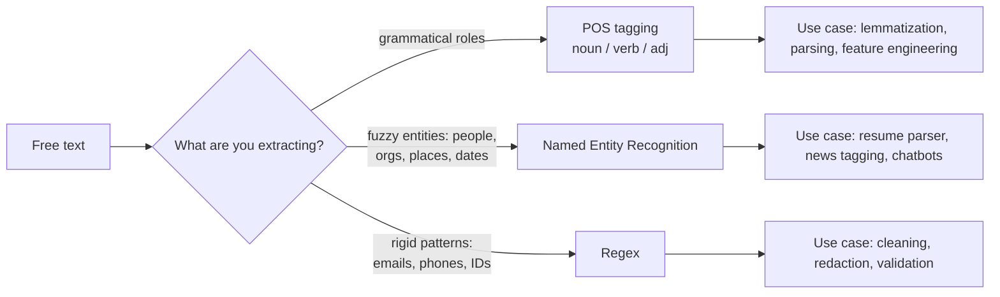

# NLP 3 — POS Tagging, NER, Regex

## Lectures covered
- Part of Speech (POS) Tagging
- Named Entity Recognition (NER)
- Regular Expressions (Regex)

---

## In one sentence
This chapter is about pulling **structure** out of free text — labelling each word's grammatical role (POS), spotting people / companies / dates (NER), and matching exact patterns like emails and phone numbers (regex).

## Real-world analogy
Think of POS tagging as putting a coloured sticker on every word in a sentence — green for nouns, red for verbs, blue for adjectives. NER is the highlighter pen you grab to circle "Apple", "Tim Cook", "California". Regex is a stencil cut to the exact shape of "an email address" — slide it over the page and only emails fall through.

## The intuition (plain English)
A sentence is more than a bag of words; it has roles. POS tagging tells you which word is doing the action and which is being acted on. NER goes further: it labels chunks of text as real-world things (people, places, money). Regex is the brittle-but-perfect tool for things that follow rigid formats (emails always have an `@`, dates always have digits). Modern projects mix all three: NER for fuzzy concepts, regex for rigid patterns, POS as the glue.

## Mini worked example — one news sentence, three lenses

Input:
```
"Tim Cook said Apple bought Beats for $3 billion on May 28, 2014, in California."
```

POS tags (one sticker per word):
```
Tim/PROPN  Cook/PROPN  said/VERB  Apple/PROPN  bought/VERB  Beats/PROPN
for/ADP  $/SYM  3/NUM  billion/NUM  on/ADP  May/PROPN  28/NUM  ,/PUNCT  2014/NUM
,/PUNCT  in/ADP  California/PROPN  ./PUNCT
```

NER (highlighter):
```
PERSON   = "Tim Cook"
ORG      = "Apple", "Beats"
MONEY    = "$3 billion"
DATE     = "May 28, 2014"
GPE      = "California"
```

Regex (stencils for fixed shapes — different sentence to show emails / phones):
```
text = "Email tim@apple.com or call +1-408-555-0100 by 2014-05-28."

emails = re.findall(r"[\w\.-]+@[\w\.-]+", text)   -> ["tim@apple.com"]
phones = re.findall(r"\+?\d[\d\-\s]{8,}\d", text) -> ["+1-408-555-0100"]
dates  = re.findall(r"\d{4}-\d{2}-\d{2}", text)   -> ["2014-05-28"]
```

Same paragraph, three different ways of pulling structure out of it.

## At-a-glance — pick the right lens



## Why this matters
- Resume parsers, support-ticket classifiers, and news taggers all live or die by good entity extraction.
- POS is the silent helper behind lemmatization, dependency parsing, and many feature-engineering tricks.
- Regex stays in your toolbox forever — it's the cheapest, most reliable way to catch fixed formats.
- Knowing when to use NER vs regex saves hours of debugging brittle pipelines.

---

## 1. Part-of-speech (POS) tagging

For each token, predict its **grammatical role** — noun, verb, adjective, etc.

```python
import spacy
nlp = spacy.load("en_core_web_sm")
doc = nlp("The quick brown fox jumps over the lazy dog.")
for tok in doc:
    print(tok.text, tok.pos_, tok.tag_)
# The DET DT
# quick ADJ JJ
# brown ADJ JJ
# fox NOUN NN
# jumps VERB VBZ
# ...
```

`pos_` is the coarse universal tag. `tag_` is the fine-grained Penn Treebank tag.

### Universal POS tags (the 17 you'll see)
NOUN · VERB · ADJ · ADV · DET · PROPN · PRON · NUM · SYM · PUNCT · ADP · CONJ · CCONJ · SCONJ · PART · INTJ · X

### Why POS matters
- Disambiguation — "play" the verb vs "play" the noun
- Feature for downstream tasks (NER, parsing)
- Lemmatization needs POS to get the right lemma
- Information extraction (find all NOUN+VERB pairs)

---

## 2. Dependency parsing — the next layer up

```python
for tok in doc:
    print(tok.text, "→", tok.head.text, f"({tok.dep_})")
# The → fox (det)
# quick → fox (amod)
# brown → fox (amod)
# fox → jumps (nsubj)
# jumps → jumps (ROOT)
# over → jumps (prep)
# ...
```

Builds a tree of grammatical relationships. Used for:
- Subject-verb-object extraction
- Question answering
- Translation

```python
from spacy import displacy
displacy.serve(doc, style="dep")        # visual tree in browser
```

---

## 3. Named Entity Recognition (NER)

Extract structured entities from text: PERSON, ORG, LOCATION, DATE, MONEY, etc.

```python
import spacy
nlp = spacy.load("en_core_web_sm")
doc = nlp("Apple bought Beats for $3 billion in 2014. Tim Cook announced it in California.")

for ent in doc.ents:
    print(ent.text, ent.label_)
# Apple ORG
# Beats ORG
# $3 billion MONEY
# 2014 DATE
# Tim Cook PERSON
# California GPE
```

### Common entity labels (spaCy)
- **PERSON** — people
- **ORG** — organizations
- **GPE** — countries, cities, states (geo-political)
- **LOC** — non-GPE locations
- **DATE** / **TIME** — temporal
- **MONEY** / **PERCENT** / **CARDINAL** — quantities
- **PRODUCT** · **EVENT** · **WORK_OF_ART** · **LANGUAGE** · **NORP** (nationality / religion)

### Visualize
```python
from spacy import displacy
displacy.serve(doc, style="ent")
```

### Custom NER (training your own labels)

When the default labels don't cover your domain — e.g., medical conditions, product names, laboratories. Two approaches:

#### A. Train spaCy NER on annotated examples
```python
# data: list of (text, {"entities": [(start, end, "LABEL")]})
import spacy
from spacy.training.example import Example
nlp = spacy.blank("en")
ner = nlp.add_pipe("ner")
ner.add_label("PRODUCT")
# ... train loop
```

#### B. Fine-tune a HuggingFace token-classification model
```python
from transformers import AutoTokenizer, AutoModelForTokenClassification
# typical labels: B-PERSON, I-PERSON, O, B-ORG, ...
```

---

## 4. Regex (regular expressions) — pattern-based extraction

Sometimes the simplest tool wins. Regex is great for:
- Email addresses
- Phone numbers
- Dates in known formats
- URLs
- Cleaning structured text

```python
import re

text = "Contact us at info@codebasics.io or +1-555-0100."

emails = re.findall(r"[\w\.-]+@[\w\.-]+", text)
phones = re.findall(r"\+?\d[\d\-\s]{8,}\d", text)
```

### Cheat-sheet patterns

| Need | Pattern |
|---|---|
| Email | `r"[\w\.-]+@[\w\.-]+\.\w+"` |
| URL | `r"https?://\S+"` |
| US phone | `r"\(?\d{3}\)?[\s-]?\d{3}[\s-]?\d{4}"` |
| Date YYYY-MM-DD | `r"\d{4}-\d{2}-\d{2}"` |
| Hashtag | `r"#\w+"` |
| Money | `r"\$\d+(?:,\d{3})*(?:\.\d+)?"` |
| Whitespace | `r"\s+"` |
| Word boundary | `\b` |

### Useful flags
```python
re.findall(pat, text, re.IGNORECASE | re.MULTILINE | re.DOTALL)
```

### Compile if reusing
```python
EMAIL = re.compile(r"[\w\.-]+@[\w\.-]+\.\w+")
EMAIL.findall(text)
```

### When NOT to regex
- Messy / unstructured text where edge cases dominate (don't regex names; use NER)
- Anything with HTML — use a parser like BeautifulSoup
- Floating-point numbers in arbitrary formats — use a real parser

The classic warning: **"Now you have two problems."** Regex is powerful and easy to misuse.

---

## 5. Combining NER + regex

```python
import re, spacy

nlp = spacy.load("en_core_web_sm")
text = "Email me at awais@example.com about the meeting on 2025-04-15."

doc = nlp(text)
entities_from_ner = [(ent.text, ent.label_) for ent in doc.ents]

emails = re.findall(r"[\w\.-]+@[\w\.-]+", text)
dates  = re.findall(r"\d{4}-\d{2}-\d{2}", text)

print(entities_from_ner)   # NER might miss email; regex catches it
print(emails, dates)
```

This is exactly the pattern for **resume parsers** (Codebasics' ATS Resume builder uses something similar).

---

## 6. Practical extraction examples

### Resume → structured fields
- spaCy NER for name (PERSON), companies (ORG), schools (ORG), location (GPE)
- Regex for email, phone, dates
- POS to spot verbs ("led", "built", "shipped" in bullets)

### Customer feedback → topics + entities
- spaCy NER for product names
- TF-IDF / topic models for theme

### News → tags + people + companies
- spaCy NER for PERSON / ORG / GPE
- Sentence parsing for headline summarization

---

## 7. Common pitfalls

| Mistake | Effect | Fix |
|---|---|---|
| Lowercase before NER | "Apple" lost | preserve case |
| Single small spaCy model on all langs | misses non-English entities | use `xx_ent_wiki_sm` for multilingual |
| Greedy regex without anchors | catches too much | use `\b` boundaries |
| Forgetting to escape special chars | regex breaks | `re.escape()` for user input |
| NER on very noisy text (tweets) | poor accuracy | train domain-specific |

## Self-check

- [ ] Why is POS tagging useful for lemmatization?
- [ ] Walk through the most common spaCy entity labels.
- [ ] Difference between NER and regex extraction — when each?
- [ ] Build a regex for: emails, dates (YYYY-MM-DD), money in $.
- [ ] How would you build a resume parser combining NER + regex?
- [ ] Why preserve case for NER?
- [ ] How do you train a custom NER label in spaCy?
- [ ] When is regex the wrong tool?

---

## Glossary

| Term | Plain meaning |
|------|---------------|
| **POS** (Part of Speech) | The grammatical role of a word: noun, verb, adjective, adverb, etc. |
| **POS tag** | The label attached to a token: NOUN, VERB, ADJ, ADV, PROPN, etc. |
| **Universal POS tagset** | A 17-tag scheme used across languages (NOUN, VERB, ADJ, ...) |
| **Penn Treebank tag** | The fine-grained English-only tagset (NN, NNS, VBZ, JJ, ...) |
| **PROPN** (Proper Noun) | A name: "Apple", "Lahore", "Tim" |
| **NOUN** | A common noun: "car", "city", "manager" |
| **VERB / AUX** | An action / a helper verb ("is", "have", "will") |
| **DET** (Determiner) | "the", "a", "this", "some" |
| **ADP** (Adposition) | Preposition or postposition: "in", "on", "of" |
| **CONJ / CCONJ / SCONJ** | Conjunctions: "and", "but", "because" |
| **Dependency parsing** | Building a tree of how words depend on each other grammatically |
| **Head / dependent** | In a dependency tree, the parent word vs the child word |
| **NER** (Named Entity Recognition) | Finding spans of text that refer to real-world things |
| **Entity** | A span like "Tim Cook" or "$3 billion" with a label |
| **PERSON / ORG / GPE / LOC / DATE / MONEY** | Common entity labels (people, organizations, geo-political entity, location, date, money) |
| **GPE** (Geo-Political Entity) | Countries, cities, states — political places |
| **NORP** | Nationalities, religions, political groups |
| **B- / I- / O tags** | Token-level scheme: B-eginning of entity, I-nside, O-utside |
| **Token classification** | The HuggingFace task type used to train modern NER models |
| **Custom NER** | Training a model to recognize your own labels (e.g., DRUG, PRODUCT_CODE) |
| **Regex** (Regular Expression) | A pattern language for matching text |
| **Pattern** | The regex string itself, e.g., `r"\d{4}-\d{2}-\d{2}"` |
| **Anchor** | A regex piece that ties to a position: `^` start, `$` end, `\b` word boundary |
| **Greedy / lazy** | Whether regex matches as much (`+`) or as little (`+?`) as possible |
| **Capture group** | Parentheses `( )` that pull out a sub-match |
| **Flags** | Modifiers like `re.IGNORECASE`, `re.MULTILINE`, `re.DOTALL` |
| **Compile** | Pre-build a regex once for fast reuse with `re.compile(pattern)` |
| **`re.escape`** | Escape user input so special characters lose their regex meaning |
| **displaCy** | spaCy's built-in HTML visualizer for POS trees and entities |

## Further reading
- Next: [04-bow-ngrams-tfidf.md](04-bow-ngrams-tfidf.md) — turn extracted tokens into features
- Then: [06-news-classification-spacy.md](06-news-classification-spacy.md) — combine NER and classification on real news
- DL bridge: modern NER often uses [transformers](../07-deep-learning/04-sequence/03-transformer-architecture.md) and [BERT](../07-deep-learning/04-sequence/05-bert-huggingface.md)
- Style guide: [BEGINNER-STYLE-GUIDE.md](../../BEGINNER-STYLE-GUIDE.md)
