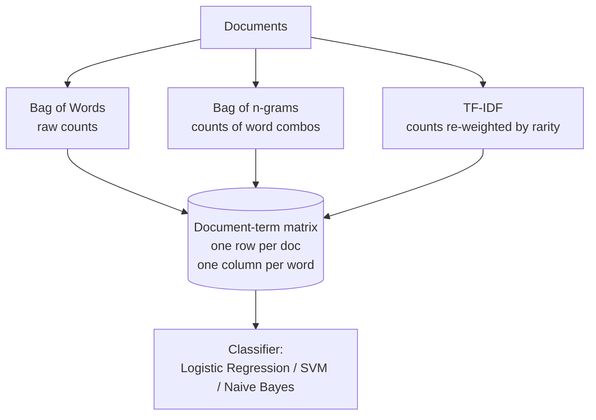

# NLP 4 — Bag of Words, n-grams, TF-IDF

## Lectures covered
- Bag of Words, n-grams, TF-IDF

---

## In one sentence
**Bag of Words** turns each document into a vector of word counts; **n-grams** add tiny phrases like "not good"; **TF-IDF** re-weights those counts so common words ("the") get crushed and informative words ("vaccine") get amplified.

## Real-world analogy
Imagine each movie review is a grocery basket. Bag of Words is the receipt: how many times each word ended up in the basket, with order ignored. TF-IDF is a smarter receipt — it cares less about milk and bread (everyone buys those) and more about saffron or oat milk (rare items that tell you who the shopper is). N-grams add "two-item combos" to the receipt: noticing that "oat milk" is its own thing, not just "oat" plus "milk".

## The intuition (plain English)
The simplest way to feed text to a classifier is to count words. That's BoW. The problem is words like "the" appear everywhere and dominate the count without telling you anything about the document. TF-IDF fixes this by dividing each word's count by how many documents it shows up in — rare-but-present words win. N-grams patch BoW's other weakness: it ignores order, so "not good" and "good" look identical. Add bigrams and "not good" becomes its own feature.

## Mini worked example — three movie reviews

Three tiny reviews:
```
d1: "the movie was great"
d2: "the movie was bad"
d3: "great acting bad story"
```

Vocabulary: `the, movie, was, great, bad, acting, story`

**Bag of Words counts:**

|     | the | movie | was | great | bad | acting | story |
|-----|-----|-------|-----|-------|-----|--------|-------|
| d1  | 1   | 1     | 1   | 1     | 0   | 0      | 0     |
| d2  | 1   | 1     | 1   | 0     | 1   | 0      | 0     |
| d3  | 0   | 0     | 0   | 1     | 1   | 1      | 1     |

**TF-IDF** — pick the word `"the"`:
- Appears in 2 of 3 documents -> very common -> low IDF
- `IDF("the") = log(3 / (1 + 2)) = log(1) = 0` -> weight collapses to zero

Pick `"acting"`:
- Appears in 1 of 3 -> rare
- `IDF("acting") = log(3 / (1 + 1)) = log(1.5) ~= 0.405` -> stays in
- `TF("acting", d3) = 1/4 = 0.25`
- `TFIDF("acting", d3) ~= 0.25 * 0.405 = 0.101`

So `"acting"` is a *signal* for d3, while `"the"` is noise.

**Bigram example (`ngram_range=(1,2)`)**:
Vocabulary now also contains `"not good"`, `"the movie"`, `"great acting"`, etc. A review saying "not good" gets a non-zero entry in the `"not good"` column, so a sentiment classifier can finally tell it apart from "good".

## At-a-glance — three flavours of word features



## Why this matters
- TF-IDF + Logistic Regression is the strongest "no-GPU" baseline in NLP — often within 5pp of BERT.
- It trains in seconds, runs in milliseconds, and explains *which words* drove a prediction.
- Search engines (Elasticsearch, Lucene) still use BM25, a close cousin of TF-IDF.
- Modern RAG systems use TF-IDF / BM25 alongside dense embeddings in **hybrid retrieval**.
- If you ever need to ship NLP without a GPU, this is the toolkit.

---

## 1. Bag of Words (BoW)

Treat each document as a **multiset of words** (ignoring order). Each document → a vector of word counts.

### The vocabulary + matrix

Documents:
1. "the cat sat"
2. "the dog ran"
3. "cat and dog"

Vocabulary: `{the, cat, sat, dog, ran, and}`

Document-term matrix:
| | the | cat | sat | dog | ran | and |
|---|---|---|---|---|---|---|
| doc 1 | 1 | 1 | 1 | 0 | 0 | 0 |
| doc 2 | 1 | 0 | 0 | 1 | 1 | 0 |
| doc 3 | 0 | 1 | 0 | 1 | 0 | 1 |

Each row is the doc's vector. Now we have numbers — feed to any classifier.

### sklearn `CountVectorizer`
```python
from sklearn.feature_extraction.text import CountVectorizer

texts = ["the cat sat", "the dog ran", "cat and dog"]
cv = CountVectorizer()
X = cv.fit_transform(texts)         # sparse matrix
print(cv.get_feature_names_out())    # ['and', 'cat', 'dog', 'ran', 'sat', 'the']
print(X.toarray())
```

### Pros / cons
- **Pros**: simple, interpretable, fast, sparse-friendly
- **Cons**: ignores order, ignores meaning ("good" and "great" are unrelated dimensions), high-dim (vocab size)

---

## 2. n-grams — capturing local order

Instead of single words, use **sequences of n words**.

- 1-gram (unigram): "the", "cat", "sat"
- 2-gram (bigram): "the cat", "cat sat"
- 3-gram (trigram): "the cat sat"

```python
cv = CountVectorizer(ngram_range=(1, 2))      # unigrams + bigrams
X = cv.fit_transform(texts)
```

### Why
- Captures phrases ("not good", "New York")
- Helps with sentiment ("not happy" ≠ "happy")
- More features → more capacity, more sparsity

### Watch out
- Vocabulary explodes (~10× per n)
- Use `min_df=2` or `max_features=10000` to control size

```python
cv = CountVectorizer(ngram_range=(1, 2), min_df=3, max_features=20000)
```

---

## 3. TF-IDF — Term Frequency × Inverse Document Frequency

Plain BoW gives equal weight to "the" and "antibiotic". TF-IDF down-weights words that appear in many documents (uninformative) and up-weights rare-but-meaningful words.

### Math
$$\text{TF}(t, d) = \frac{\text{count}(t, d)}{\text{words in } d}$$

$$\text{IDF}(t) = \log\!\left(\frac{N}{1 + |\{d : t \in d\}|}\right)$$

$$\text{TFIDF}(t, d) = \text{TF}(t, d) \cdot \text{IDF}(t)$$

Higher score → "this term is important *for this document* relative to the corpus."

### sklearn `TfidfVectorizer`
```python
from sklearn.feature_extraction.text import TfidfVectorizer

tfidf = TfidfVectorizer(ngram_range=(1, 2), max_features=20_000, sublinear_tf=True)
X = tfidf.fit_transform(texts)
```

### Useful parameters
| Param | What |
|---|---|
| `ngram_range` | (1, 1) unigram only; (1, 2) uni + bi |
| `max_features` | top N most frequent terms |
| `min_df` | ignore terms in fewer than k docs |
| `max_df` | ignore terms in too many docs (stopword-like) |
| `sublinear_tf=True` | use 1 + log(tf) — dampens high counts |
| `stop_words="english"` | drops English stop-words |
| `analyzer="char_wb"` | character n-grams, robust to misspellings |

---

## 4. Pipeline + classifier — full BoW/TF-IDF baseline

```python
from sklearn.feature_extraction.text import TfidfVectorizer
from sklearn.linear_model import LogisticRegression
from sklearn.pipeline import Pipeline
from sklearn.model_selection import cross_val_score

pipe = Pipeline([
    ("tfidf", TfidfVectorizer(ngram_range=(1, 2), min_df=3, max_features=50_000)),
    ("clf",   LogisticRegression(max_iter=1000, C=1.0)),
])

scores = cross_val_score(pipe, texts, labels, cv=5, scoring="f1_macro")
print(scores.mean())
```

For text classification on small-to-medium data, **TF-IDF + Logistic Regression** is the classic baseline. Often hits 80–90% of a fine-tuned BERT's accuracy in 1% of the compute.

---

## 5. Why TF-IDF still matters in 2025

- **Speed**: vectorize 1M documents in seconds
- **Sparse**: efficient memory
- **Interpretable**: which features drove the prediction → coefficients are readable
- **Strong baseline**: always run it first
- **RAG**: BM25 (a TF-IDF cousin) is part of every modern hybrid retrieval system
- **Search**: TF-IDF + cosine sim still powers many search bars

---

## 6. BM25 — TF-IDF's cousin (the search engine standard)

BM25 = TF-IDF with diminishing returns on TF and length normalization. Used in **Elasticsearch, Solr, Lucene** — every search engine you've used.

```python
from rank_bm25 import BM25Okapi
corpus = [doc.split() for doc in docs]
bm25 = BM25Okapi(corpus)
scores = bm25.get_scores("query words".split())
```

BM25 + dense embeddings (BERT-style) is the **hybrid retrieval** that powers modern RAG systems. Module 9.

---

## 7. Hashing trick — for huge vocabularies

When vocab is so large you can't fit it:
```python
from sklearn.feature_extraction.text import HashingVectorizer
hv = HashingVectorizer(n_features=2**18)
X = hv.transform(texts)
```

Maps any word to one of N buckets via hashing. No vocabulary stored. Fast, online-learnable. Some collisions but they're tolerable.

---

## 8. End-to-end sentiment classifier (10 lines)

```python
from sklearn.datasets import fetch_20newsgroups
from sklearn.feature_extraction.text import TfidfVectorizer
from sklearn.linear_model import LogisticRegression
from sklearn.pipeline import Pipeline
from sklearn.metrics import classification_report

data = fetch_20newsgroups(subset="train")
test = fetch_20newsgroups(subset="test")

pipe = Pipeline([
    ("tfidf", TfidfVectorizer(ngram_range=(1, 2), min_df=3, max_features=50_000)),
    ("clf", LogisticRegression(max_iter=1000)),
])
pipe.fit(data.data, data.target)
print(classification_report(test.target, pipe.predict(test.data), target_names=test.target_names[:5]))
```

20-newsgroups in 1 minute, ~85% F1.

---

## 9. Common pitfalls

| Mistake | Effect | Fix |
|---|---|---|
| Calling `vectorizer.fit_transform` on test data | leakage | `fit` on train, `transform` on test |
| Removing punctuation/case before TF-IDF for sentiment | losing signal | leave it; TF-IDF handles |
| `ngram_range=(1, 5)` blindly | massive memory blow-up | start with (1, 2), grow only if needed |
| Forgetting to normalize | length bias | TfidfVectorizer normalizes by default |
| Comparing TF-IDF + LR vs BERT without baseline | over-engineering | always start with TF-IDF |

## Self-check

- [ ] What does Bag of Words ignore?
- [ ] Why are bigrams useful?
- [ ] Define TF-IDF in plain English.
- [ ] What does `min_df=3` do?
- [ ] When use HashingVectorizer over CountVectorizer?
- [ ] What's BM25 and how does it relate to TF-IDF?
- [ ] Build a TF-IDF + LogReg pipeline for sentiment in 10 lines.
- [ ] Why is TF-IDF still relevant in 2025 even with LLMs?

---

## Glossary

| Term | Plain meaning |
|------|---------------|
| **Bag of Words (BoW)** | Represent a document by how many times each word appears, ignoring order |
| **Document** | One piece of text (review, email, article) |
| **Document-term matrix** | A table: rows = documents, columns = words, cells = counts |
| **Vocabulary** | The set of unique words / n-grams the vectorizer keeps |
| **n-gram** | A sequence of n adjacent tokens |
| **Unigram / bigram / trigram** | n-grams of length 1, 2, 3 |
| **TF** (Term Frequency) | How often a word appears in a single document |
| **DF** (Document Frequency) | How many documents contain the word |
| **IDF** (Inverse Document Frequency) | `log(N / DF)` — high if a word is rare across the corpus |
| **TF-IDF** | TF * IDF — high if a word is common in *this* doc and rare in others |
| **Sparse matrix** | A matrix mostly full of zeros, stored compactly (most BoW matrices are sparse) |
| **`CountVectorizer`** | sklearn class that turns text into BoW counts |
| **`TfidfVectorizer`** | sklearn class that turns text into TF-IDF weights |
| **`min_df`** | Drop words that appear in fewer than `min_df` documents (cuts rare typos) |
| **`max_df`** | Drop words that appear in too many documents (acts like a stopword filter) |
| **`max_features`** | Keep only the top N most frequent words |
| **`sublinear_tf`** | Use `1 + log(tf)` instead of raw `tf` to soften runaway counts |
| **Stop words** | Common words like "the", "a", "is" — often dropped before vectorizing |
| **BM25** | A TF-IDF cousin used by search engines (Elasticsearch, Solr) — better length normalization |
| **Hashing trick** | Map words to fixed-size buckets via hashing, no vocabulary stored |
| **`HashingVectorizer`** | sklearn implementation of the hashing trick |
| **Cosine similarity** | A score from 0 to 1 telling how similar two TF-IDF vectors are |
| **Logistic regression** | Simple linear classifier — the default partner for TF-IDF |
| **Pipeline** | sklearn object chaining vectorizer + classifier so you fit / transform together |
| **Data leakage** | Accidentally letting test info into training (e.g., fitting the vectorizer on test data) |
| **Hybrid retrieval** | Combining sparse (TF-IDF / BM25) and dense (embedding) search for RAG |
| **Sparse vs dense** | Sparse: most entries are zero (BoW). Dense: every entry is a real number (embeddings) |

## Further reading
- Next: [05-word-embeddings.md](05-word-embeddings.md) — dense vectors that capture meaning, not just counts
- Project: [06-news-classification-spacy.md](06-news-classification-spacy.md) uses TF-IDF as the baseline
- DL bridge: contextual embeddings from [BERT](../07-deep-learning/04-sequence/05-bert-huggingface.md) and [transformers](../07-deep-learning/04-sequence/03-transformer-architecture.md) are the modern step beyond TF-IDF
- Style guide: [BEGINNER-STYLE-GUIDE.md](../../BEGINNER-STYLE-GUIDE.md)
