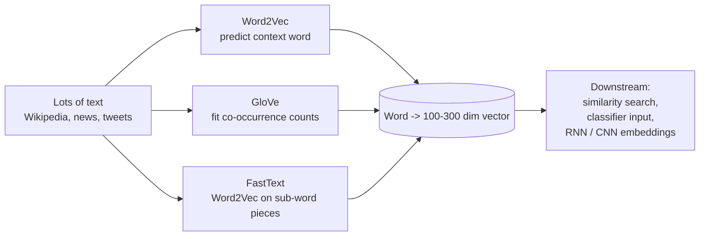

# NLP 5 — Word Embeddings (Word2Vec, GloVe, FastText)

## Lectures covered
- Word Embeddings (×2 lectures in the curriculum)

---

## In one sentence
A **word embedding** is a short list of numbers that represents a word's meaning, so that similar words ("happy" and "joyful") end up close together in number-space.

## Real-world analogy
Picture a giant city map where every word in the dictionary gets dropped at a GPS coordinate. The map is laid out so that "king" and "queen" sit on the same street, "Paris" and "London" land in the same neighbourhood (capitals), and "asteroid" lives across town from "kitten". Two words are similar if their GPS pins are close. That map of coordinates is what an embedding gives you — except the "GPS" has 100 to 300 dimensions, not just two.

## The intuition (plain English)
Bag-of-Words treated every word as its own column, with no notion that "happy" and "joyful" mean similar things. Embeddings fix this by learning, from billions of sentences, that words used in similar contexts should sit close. The idea — "you shall know a word by the company it keeps" — is called the distributional hypothesis. Once you have these vectors, you can do shockingly word-like math: `king - man + woman ≈ queen`. Modern transformer models (BERT) build on this by giving each word a *different* vector depending on the sentence, but the foundation is still embeddings.

## Mini worked example — vectors that obey arithmetic

Imagine 3-dimensional toy embeddings (real ones have 100-300 dims):

```
king   = [ 0.95,  0.10, 0.85 ]
man    = [ 0.85, -0.50, 0.30 ]
woman  = [ 0.85,  0.95, 0.30 ]
queen  = [ 0.95,  1.55, 0.85 ]
```

Try the famous analogy:

```
king - man  =  [ 0.10,  0.60, 0.55 ]    (the "royalty minus male" vector)
+ woman     =  [ 0.95,  1.55, 0.85 ]    -> exactly queen
```

Now look up nearest neighbours:

```
most_similar("cat") -> [("dog", 0.85), ("kitten", 0.81), ("puppy", 0.74)]
most_similar("paris") -> [("london", 0.79), ("rome", 0.78), ("berlin", 0.74)]
```

Real Word2Vec / GloVe trained on Wikipedia gives this exact behaviour out of the box.

## At-a-glance — three flavours



## Why this matters
- Embeddings are the bridge between symbols (words) and the math models love (vectors).
- Semantic search, recommendation, and clustering all sit on top of embeddings.
- Word2Vec / GloVe were the first big win of "self-supervised" NLP — no labels needed.
- Modern contextual embeddings (BERT, sentence-transformers) are direct descendants — same idea, smarter math.
- For RAG and LLM-powered apps, sentence embeddings are the retrieval engine.

---

## 1. The problem with one-hot

If your vocab has 50,000 words, each word is a vector of length 50,000 with a single 1. Disadvantages:
- **No similarity**: dot product between any two words = 0
- **Huge dimensionality**: linear models with 50k features overfit
- **No generalization**: knowing "happy" tells you nothing about "joyful"

Solution: dense, low-dim, **learned** vectors where similar words are close.

---

## 2. Word2Vec (2013)

A small neural network trained on a simple task. Two flavors:

### Skip-gram
Given a center word, predict surrounding context words.
"the cat sat on the mat"
- center: "cat" → predict {"the", "sat"}

### CBOW (Continuous Bag of Words)
Given context, predict the center word.
- context: {"the", "sat"} → predict "cat"

The middle layer's weights become the **word embeddings**.

### Famous result
$$\text{vec(king)} - \text{vec(man)} + \text{vec(woman)} \approx \text{vec(queen)}$$

The model captures **semantic relationships** through geometry. Similar property:
- vec(Paris) − vec(France) + vec(Italy) ≈ vec(Rome)
- vec(walking) − vec(walked) + vec(swam) ≈ vec(swimming)

### Train your own with gensim
```python
from gensim.models import Word2Vec

sentences = [["the", "cat", "sat", "on", "the", "mat"], ...]    # tokenized
model = Word2Vec(sentences, vector_size=100, window=5, min_count=2, workers=4)
model.wv["cat"]                          # 100-dim vector
model.wv.most_similar("cat")             # [(dog, 0.85), (mouse, 0.78), ...]
model.wv.similarity("cat", "dog")
```

---

## 3. GloVe — Global Vectors (2014)

Different math. Trained on the **co-occurrence matrix** of the entire corpus instead of local windows.

```
"cat" co-occurs with "dog" often → close vectors
"cat" rarely co-occurs with "asteroid" → distant vectors
```

In practice, very similar quality to Word2Vec. Often easier to use because Stanford released pre-trained GloVe vectors trained on Common Crawl + Wikipedia.

```python
import gensim.downloader as api
glove = api.load("glove-wiki-gigaword-100")
glove["cat"]
glove.most_similar("cat")
```

---

## 4. FastText (2016)

Same recipe as Word2Vec but trained on **subwords** (character n-grams).

- "playing" → "<pl", "pla", "lay", "ayi", "yin", "ing", "ng>"
- Sum subword vectors → word vector

Advantages:
- Handles **out-of-vocabulary** — even if "uncertainly" wasn't seen, its subwords were
- Better for morphologically rich languages (German, Turkish, Finnish)
- Better for misspellings ("recieve" gets a vector close to "receive")

```python
import gensim.downloader as api
ft = api.load("fasttext-wiki-news-subwords-300")
ft["uncertainly"]               # works even if not in vocab
```

---

## 5. Pre-trained embeddings worth knowing

| Model | Dim | Source | Notes |
|---|---|---|---|
| GloVe (Wikipedia + Gigaword) | 50, 100, 200, 300 | Stanford | Classic |
| GloVe (Common Crawl) | 300 | Stanford | Bigger corpus |
| Word2Vec (Google News) | 300 | Google | Original |
| FastText (Wikipedia, multilingual) | 300 | Facebook | OOV-friendly |
| ConceptNet Numberbatch | 300 | ConceptNet | Includes commonsense relations |

### For 2025 production: contextual embeddings beat these
- BERT / DistilBERT — covered in `04-sequence/05-bert-huggingface.md`
- `sentence-transformers` MiniLM, BGE — for sentence-level similarity
- text-embedding-3-small (OpenAI), Cohere embeddings, Voyage — for RAG

But Word2Vec/GloVe are still useful for:
- **Educational** (embedding intuition)
- **Lightweight** apps (no GPU needed)
- **Initialization** for downstream models
- **Edge** deployments

---

## 6. Using embeddings in your model

### As input to a NN
```python
import torch.nn as nn

embed_layer = nn.Embedding.from_pretrained(
    torch.tensor(pretrained_matrix, dtype=torch.float32),
    freeze=False,                      # allow fine-tuning
)
```

### As average for sentence embedding (crude but useful)
```python
def sentence_vec(words, kv):
    vecs = [kv[w] for w in words if w in kv]
    return np.mean(vecs, axis=0) if vecs else np.zeros(kv.vector_size)
```

The "averaged Word2Vec" sentence vector is a decent baseline for similarity search before reaching for sentence-transformers.

---

## 7. Visualizing embeddings — t-SNE / UMAP

```python
import gensim.downloader as api
from sklearn.manifold import TSNE
import matplotlib.pyplot as plt

glove = api.load("glove-wiki-gigaword-100")
words = ["king", "queen", "man", "woman", "prince", "princess",
         "dog", "cat", "puppy", "kitten",
         "italy", "rome", "france", "paris"]
vecs = np.array([glove[w] for w in words])
proj = TSNE(n_components=2, perplexity=5).fit_transform(vecs)

plt.scatter(proj[:, 0], proj[:, 1])
for i, w in enumerate(words):
    plt.annotate(w, proj[i])
```

You'll see country-capital pairs cluster, gender pairs align, animal-baby pairs align. Excellent demo for any audience.

---

## 8. Caveats — what embeddings get wrong

- **Homographs**: "bank" (river) and "bank" (financial) collapse to one vector. Contextual embeddings (BERT) fix this.
- **Bias**: trained on internet text → reproduce gender, racial, cultural bias. Documented and active research area.
- **Stable vocabulary**: vocabulary is fixed at training time. Subword tokenizers + transformer models handle vocab dynamically.

---

## 9. Common pitfalls

| Mistake | Effect | Fix |
|---|---|---|
| Using GloVe vectors with case-sensitive task | "Apple" missing | use lowercase + GloVe; or BERT |
| Confusing one-hot and embedding | conceptual error | one-hot is sparse; embedding is dense |
| Averaging Word2Vec for sentence sim | weak baseline | use sentence-transformers |
| Training Word2Vec on tiny corpus | meaningless vectors | use pre-trained on large corpus |
| Forgetting OOV handling | NaN propagates | check `w in kv` first |

## Self-check

- [ ] Why do we need word embeddings at all (vs one-hot)?
- [ ] What's the famous "king − man + woman ≈ queen" example showing?
- [ ] Difference between Word2Vec Skip-gram and CBOW?
- [ ] How does FastText handle OOV?
- [ ] Train Word2Vec on a list of tokenized sentences using gensim.
- [ ] Why don't Word2Vec/GloVe handle homographs well?
- [ ] When still use Word2Vec in 2025?
- [ ] What replaces Word2Vec for modern sentence-similarity tasks?

---

## Glossary

| Term | Plain meaning |
|------|---------------|
| **Embedding** | A short, dense vector (50-300 numbers) that represents an item's meaning |
| **Word embedding** | An embedding for a single word |
| **Sentence embedding** | An embedding for a whole sentence or paragraph |
| **Vector** | An ordered list of numbers — `[0.12, -0.45, 0.83, ...]` |
| **Dense vs sparse** | Dense: every dimension has a real number. Sparse: mostly zeros (BoW) |
| **Dimensionality** | The length of the vector (Word2Vec: 300, MiniLM: 384, OpenAI: 1536) |
| **One-hot encoding** | A sparse vector with a single 1 at the word's index — no notion of similarity |
| **Cosine similarity** | A score from -1 to 1 measuring vector angle: 1 = same direction, 0 = unrelated |
| **Distributional hypothesis** | "A word's meaning is the company it keeps" — the foundation of embeddings |
| **Word2Vec** | 2013 method that trains a small neural net to predict context words |
| **Skip-gram** | Word2Vec variant: from the centre word, predict surrounding words |
| **CBOW** (Continuous Bag of Words) | Word2Vec variant: from surrounding words, predict the centre word |
| **Window size** | How many words to the left/right count as "context" |
| **GloVe** (Global Vectors) | 2014 method that factorizes the word co-occurrence matrix |
| **Co-occurrence matrix** | A table counting how often each pair of words appears near each other |
| **FastText** | Word2Vec on sub-word pieces — handles unseen words and typos |
| **OOV** (Out-of-Vocabulary) | A word the model never saw during training |
| **Pre-trained embeddings** | Vectors someone else trained on a giant corpus and shared (GloVe, FastText, ConceptNet) |
| **gensim** | Python library that loads and trains Word2Vec / GloVe / FastText |
| **Static embedding** | One vector per word, no matter the sentence — Word2Vec, GloVe |
| **Contextual embedding** | A different vector each time, based on the sentence — BERT, GPT |
| **Homograph** | Same spelling, different meanings: "bank" (river) vs "bank" (money) |
| **Analogy task** | The `king - man + woman ≈ queen` benchmark |
| **t-SNE / UMAP** | Methods to project high-dim vectors to 2D for plotting |
| **Sentence-transformers** | Library that fine-tunes BERT-class models to produce sentence embeddings |
| **MiniLM / BGE / E5** | Popular small sentence-embedding models for retrieval |
| **Embedding layer** | The first layer of a neural net that maps token IDs to vectors |
| **Frozen vs fine-tuned** | Frozen: weights stay fixed. Fine-tuned: weights keep updating during training |
| **Bias in embeddings** | Embeddings reflect biases of training data (gender, race, region) |

## Further reading
- Next: [06-news-classification-spacy.md](06-news-classification-spacy.md) — embeddings in a real classifier
- Then: [07-bert-finetuning-huggingface.md](07-bert-finetuning-huggingface.md) — the contextual successor to Word2Vec
- DL bridge: [transformers](../07-deep-learning/04-sequence/03-transformer-architecture.md), [attention](../07-deep-learning/04-sequence/04-attention.md), [BERT](../07-deep-learning/04-sequence/05-bert-huggingface.md), [RNNs that consume embeddings](../07-deep-learning/04-sequence/01-rnn.md)
- Style guide: [BEGINNER-STYLE-GUIDE.md](../../BEGINNER-STYLE-GUIDE.md)
