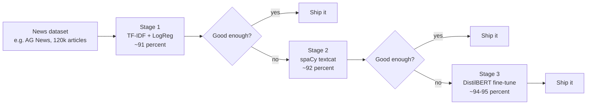

# NLP 6 — News Classification with spaCy

## Lectures covered
- News Classification with Spacy

---

## In one sentence
You build a model that reads a news article and tags it with a topic — Sports, Business, Sci/Tech, World — then compare three approaches (TF-IDF, spaCy, DistilBERT) on the same dataset.

## Real-world analogy
Think of it as hiring an intern to sort the morning's news into the right newspaper sections. A junior intern (TF-IDF + Logistic Regression) is fast, cheap, and right ~91% of the time. A more experienced editor (spaCy textcat) reads a touch more carefully — ~92%. A senior editor (DistilBERT) reads the whole article in context — ~94-95% but takes a lot longer per article. Pick the intern that fits your budget and deadline.

## The intuition (plain English)
News classification is *the* canonical NLP project. The same template you build here works for spam detection, support-ticket routing, sentiment analysis, and topic tagging. You always start with a TF-IDF + Logistic Regression baseline because it trains in seconds and tells you what's *barely* possible. Only when that's not good enough do you climb the ladder: spaCy's text categorizer for slightly better accuracy with NLP-friendly tooling, then DistilBERT when you really need state of the art and have a GPU.

## Mini worked example — three real headlines, three labels

Inputs:
```
1. "Manchester United beat Chelsea 3-1 in Premier League opener."
2. "Apple reports record Q4 profits, stock hits all-time high."
3. "NASA confirms water on the Moon's sunlit surface."
```

A trained classifier returns:

```
1 -> Sports     (probability 0.97)
2 -> Business   (probability 0.93)
3 -> Sci/Tech   (probability 0.91)
```

Inside, the TF-IDF + Logistic Regression model is just doing this:

```
features for headline 1 = TF-IDF(["manchester", "united", "beat", "chelsea", "3-1", ...])
score per class         = features . weights[class]
pick class with highest score
```

The model learns weights like: `weights["beat"]` is high for Sports and near zero for everything else. Same idea for `weights["profits"]` -> Business and `weights["nasa"]` -> Sci/Tech.

## At-a-glance — climb the accuracy ladder



## Why this matters
- This is the bread-and-butter NLP project — interview-friendly and portfolio-ready.
- It teaches the most important lesson: **always have a cheap baseline** before reaching for BERT.
- Error analysis on this project teaches you to spot which categories overlap (Business vs Sci/Tech) and what to do about it.
- Same code structure ports straight to spam detection, ticket routing, and sentiment analysis.

---

## The project

Given a news article (headline + body), predict its **category**: business, sports, tech, politics, entertainment, etc.

This is the canonical multi-class text classification problem. Three approaches, increasing in sophistication:

1. **TF-IDF + Logistic Regression** (classical, fast, interpretable)
2. **spaCy text categorizer** (slightly better, integrated NLP)
3. **DistilBERT fine-tune** (state of the art on small data — covered in next file)

---

## 1. The dataset

Use **AG News** (Hugging Face has it pre-split):
```python
from datasets import load_dataset
ds = load_dataset("ag_news")
ds["train"][0]
# {'text': '...', 'label': 2}     (0=World, 1=Sports, 2=Business, 3=Sci/Tech)
```

Or BBC News topics, or a Codebasics-provided news dataset.

---

## 2. Approach 1 — TF-IDF + Logistic Regression baseline

```python
from sklearn.feature_extraction.text import TfidfVectorizer
from sklearn.linear_model import LogisticRegression
from sklearn.pipeline import Pipeline
from sklearn.metrics import classification_report

CLASSES = ["World", "Sports", "Business", "Sci/Tech"]

pipe = Pipeline([
    ("tfidf", TfidfVectorizer(ngram_range=(1, 2), min_df=3, max_features=50_000)),
    ("clf",   LogisticRegression(max_iter=1000, C=1.0)),
])

pipe.fit(train_texts, train_labels)
preds = pipe.predict(test_texts)
print(classification_report(test_labels, preds, target_names=CLASSES))
```

Typically ~91% F1 on AG News. Strong baseline; trains in seconds.

---

## 3. Approach 2 — spaCy `textcat`

spaCy ships a built-in text categorizer. Pros: integrated with the rest of your spaCy pipeline (NER + parsing all at once).

### Set up
```python
import spacy
from spacy.training.example import Example
from spacy.util import minibatch
import random

nlp = spacy.blank("en")
textcat = nlp.add_pipe("textcat", config={"exclusive_classes": True})

for c in CLASSES:
    textcat.add_label(c)
```

### Prepare training data
```python
def to_example(text, label):
    cats = {c: (1.0 if c == CLASSES[label] else 0.0) for c in CLASSES}
    doc = nlp.make_doc(text)
    return Example.from_dict(doc, {"cats": cats})

train_examples = [to_example(t, l) for t, l in zip(train_texts, train_labels)]
```

### Training loop
```python
optimizer = nlp.begin_training()
for epoch in range(5):
    random.shuffle(train_examples)
    losses = {}
    for batch in minibatch(train_examples, size=32):
        nlp.update(batch, drop=0.2, losses=losses, sgd=optimizer)
    print(epoch, losses)

nlp.to_disk("spacy_news_model")
```

### Inference
```python
nlp = spacy.load("spacy_news_model")
doc = nlp("Apple announced its strongest quarterly profits.")
print(doc.cats)
# {'World': 0.04, 'Sports': 0.01, 'Business': 0.93, 'Sci/Tech': 0.02}
```

---

## 4. Approach 3 — DistilBERT fine-tune (preview; full version in next file)

```python
from transformers import AutoTokenizer, AutoModelForSequenceClassification, Trainer, TrainingArguments
from datasets import load_dataset
import numpy as np

ds = load_dataset("ag_news")
tok = AutoTokenizer.from_pretrained("distilbert-base-uncased")

def tokenize(b): return tok(b["text"], truncation=True, padding="max_length", max_length=256)
ds = ds.map(tokenize, batched=True).rename_column("label", "labels")

model = AutoModelForSequenceClassification.from_pretrained("distilbert-base-uncased", num_labels=4)
args = TrainingArguments(output_dir="out", num_train_epochs=3, per_device_train_batch_size=16,
                         learning_rate=2e-5, eval_strategy="epoch", save_strategy="epoch",
                         load_best_model_at_end=True)

def metrics(p):
    preds = p.predictions.argmax(-1); return {"acc": (preds == p.label_ids).mean()}

trainer = Trainer(model=model, args=args,
                  train_dataset=ds["train"].select(range(20_000)),
                  eval_dataset=ds["test"].select(range(2_000)),
                  compute_metrics=metrics)
trainer.train()
```

Typically ~94–95% F1 — meaningfully better than TF-IDF, but takes 30 min on a free Colab GPU.

---

## 5. Compare the three approaches

| Approach | Accuracy | Train time | Inference speed | Interpretability | When pick |
|---|---|---|---|---|---|
| TF-IDF + LR | ~91% | seconds | very fast | high | always start |
| spaCy textcat | ~92% | minutes | fast | medium | integrated NLP pipelines |
| DistilBERT fine-tune | ~94–95% | hours | medium | low | when accuracy matters |
| Prompt an LLM | ~95% | none | slow + cost | low | smallest dataset / quickest setup |

For real production: pick based on cost / latency / accuracy needs, not just accuracy.

---

## 6. Error analysis on the news classifier

```python
import pandas as pd

df = pd.DataFrame({"text": test_texts, "true": test_labels, "pred": preds})
errors = df[df.true != df.pred]
errors["true_class"] = errors.true.map(lambda i: CLASSES[i])
errors["pred_class"] = errors.pred.map(lambda i: CLASSES[i])

# common confusions
errors.groupby(["true_class", "pred_class"]).size().sort_values(ascending=False)
```

Typical pattern: **Business ↔ Sci/Tech** confusion (overlapping vocabulary). Adjust by:
- More feature engineering (entities, source domain)
- Better model

---

## 7. Deploying the news classifier

Streamlit:
```python
import streamlit as st
import joblib

pipe = joblib.load("model.joblib")
st.title("News Topic Classifier")
text = st.text_area("Paste article")
if st.button("Classify"):
    pred = pipe.predict([text])[0]
    st.success(f"Topic: {CLASSES[pred]}")
```

Done. 15 lines, deployable on Streamlit Cloud in 5 minutes.

---

## 8. Self-check

- [ ] Build the TF-IDF + LR baseline on AG News.
- [ ] Compare accuracy to spaCy textcat.
- [ ] Compare both to DistilBERT.
- [ ] What confusions dominate the errors?
- [ ] When pick TF-IDF over BERT in production?
- [ ] Deploy a news classifier as a Streamlit app.
- [ ] Why is "always start with TF-IDF baseline" a mantra?

---

## Glossary

| Term | Plain meaning |
|------|---------------|
| **Text classification** | Assigning a label from a fixed set to a piece of text |
| **Multi-class** | More than two possible labels (Sports, Business, Sci/Tech, World) |
| **Multi-label** | Each item can have several labels at once (different from multi-class) |
| **Baseline** | The simplest model you build first, to measure improvement against |
| **AG News** | A standard 4-class news dataset on HuggingFace `datasets` |
| **BBC News topics** | An alternative 5-class news dataset |
| **Pipeline** | sklearn or spaCy object that bundles preprocessing + model |
| **TF-IDF + LogReg** | The classic text-classification baseline (TF-IDF features, logistic regression) |
| **spaCy textcat** | spaCy's built-in text categorizer component |
| **`exclusive_classes`** | spaCy textcat option meaning "exactly one label per doc" (not multi-label) |
| **`Example.from_dict`** | spaCy training format that pairs a doc with its target labels |
| **`minibatch`** | spaCy helper that yields batches of training examples |
| **`begin_training`** | spaCy call that initializes optimizer state |
| **DistilBERT** | A 40% smaller, 60% faster BERT — keeps ~95% of the accuracy |
| **Fine-tuning** | Continuing to train a pre-trained model on your specific data |
| **Trainer** | HuggingFace's high-level training loop that handles batching, GPU, evaluation |
| **`TrainingArguments`** | HuggingFace config for epochs, batch size, learning rate |
| **Tokenizer** | The component that turns raw text into model-readable token IDs |
| **`AutoTokenizer` / `AutoModelForSequenceClassification`** | HuggingFace shortcuts that load the right class for a checkpoint name |
| **`load_dataset`** | HuggingFace `datasets` function for downloading benchmark datasets |
| **Accuracy / F1** | Classification metrics — accuracy = % correct, F1 balances precision and recall |
| **Macro-F1** | F1 averaged equally across classes — fairer when classes are imbalanced |
| **Confusion matrix** | A table showing which true label got predicted as which |
| **Error analysis** | Inspecting wrong predictions to find systematic patterns |
| **Class confusion** | When two classes look similar to the model (e.g., Business vs Sci/Tech) |
| **Streamlit** | A Python library for one-file web apps — perfect for ML demos |
| **`joblib.load` / `joblib.dump`** | Python serialization for sklearn models |
| **Inference latency** | How long the model takes to predict one item |
| **Cost / latency / accuracy trade-off** | The three production knobs you balance |

## Further reading
- Previous: [04-bow-ngrams-tfidf.md](04-bow-ngrams-tfidf.md) — the features used by the baseline
- Next: [07-bert-finetuning-huggingface.md](07-bert-finetuning-huggingface.md) — the full DistilBERT recipe
- DL bridge: [transformers](../07-deep-learning/04-sequence/03-transformer-architecture.md), [BERT](../07-deep-learning/04-sequence/05-bert-huggingface.md)
- Deployment: [Streamlit guide](../07-deep-learning/05-deployment/01-streamlit.md), [FastAPI guide](../07-deep-learning/05-deployment/02-fastapi.md)
- Style guide: [BEGINNER-STYLE-GUIDE.md](../../BEGINNER-STYLE-GUIDE.md)
