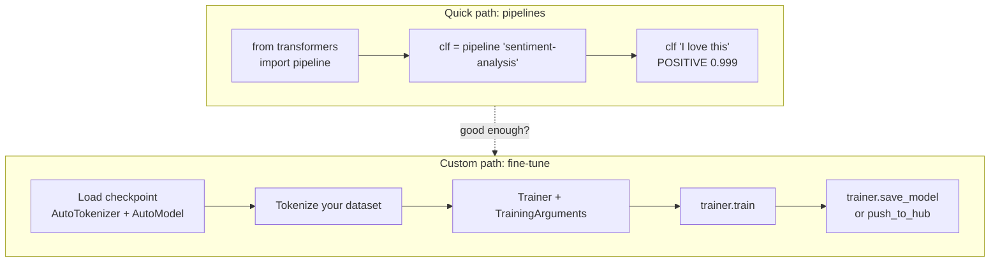

# NLP 7 — HuggingFace Pipelines, Tokenizers, BERT Fine-Tuning

## Lectures covered
- Introduction to Hugging Face
- Pipelines and Tokenizers
- BERT and Model Fine Tuning

---

## In one sentence
**Fine-tuning** takes a giant pre-trained transformer (BERT, DistilBERT) that already understands language and trains it a little more on *your* labelled examples — getting state-of-the-art accuracy with a few thousand rows and a free Colab GPU.

## Real-world analogy
Imagine BERT is a college graduate who has read most of Wikipedia and a chunk of the internet. They understand grammar, context, idioms, and how words relate. To use them at your company, you don't re-teach them English — you give them a one-week onboarding on your specific job (movie sentiment, news topics, support-ticket triage). That onboarding is fine-tuning. HuggingFace is the recruiting agency that lets you hire any of 100,000+ such graduates with one line of code.

## The intuition (plain English)
Training a transformer from scratch costs millions of dollars. But once it's trained, the heavy lifting — knowing English, world facts, syntax — is already done and shared with you for free on the HuggingFace Hub. Fine-tuning swaps in a small classification head and gently adjusts the model's weights with your few thousand labelled examples and a tiny learning rate. The pre-trained brain provides language understanding; the fine-tune phase provides task specialization. Pipelines are a separate idea: a one-line shortcut for using already-fine-tuned models without writing any training code.

## Mini worked example — fine-tune sentiment in 5 lines (the conceptual flow)

Imagine you have 5,000 movie reviews labelled positive / negative.

```
Step 1: load tokenizer + model with the SAME checkpoint name
        tok   = AutoTokenizer.from_pretrained("distilbert-base-uncased")
        model = AutoModelForSequenceClassification.from_pretrained(
                    "distilbert-base-uncased", num_labels=2
                )

Step 2: tokenize your reviews
        "I loved the visuals."   ->  [101, 1045, 3866, ...]   (input_ids)
                                     [  1,    1,    1, ...]   (attention_mask)

Step 3: hand everything to Trainer with 3 epochs, lr=2e-5
        trainer.train()

Step 4: ~10 min on a free T4 GPU -> ~92% accuracy

Step 5: predict on a new review
        clf("This movie was a slow disaster.")  ->  NEGATIVE 0.99
```

Same five-step pattern works for news topics, spam detection, intent classification — change the dataset and `num_labels`, everything else stays.

## At-a-glance — pipelines vs fine-tuning



## Why this matters
- BERT-class fine-tuning is the modern default for production text classification, NER, and QA.
- One pre-trained checkpoint + a few thousand labels usually beats months of feature engineering.
- HuggingFace lets you ship your fine-tuned model to the world with `push_to_hub` — instant portfolio piece.
- Understanding tokenizers (padding, attention masks, special tokens) is the difference between "it works" and "OOM at 3am".
- LoRA / PEFT extends this same idea to giant LLMs (Llama, Mistral) using 1% of the GPU memory.

---

## 1. The Hugging Face universe

Three core libraries:

### `transformers`
Pre-trained models for every NLP / vision / audio task. The standard.

### `datasets`
Standardized datasets with caching, streaming, splits.

### `tokenizers`
Fast Rust-based tokenizers. Often used through `transformers` indirectly.

Plus: `accelerate` (distributed training), `peft` (parameter-efficient fine-tuning), `evaluate` (metrics), `trl` (RLHF), `diffusers` (image generation).

```bash
pip install transformers datasets tokenizers
```

---

## 2. Pipelines — instant inference

```python
from transformers import pipeline

# sentiment
clf = pipeline("sentiment-analysis")
clf("I love this bootcamp")
# [{'label': 'POSITIVE', 'score': 0.9997}]

# zero-shot classification (no training!)
zsc = pipeline("zero-shot-classification")
zsc("I want to deposit money", candidate_labels=["banking", "shopping", "travel"])
# {'labels': ['banking', 'shopping', 'travel'], 'scores': [0.94, 0.04, 0.02]}

# NER
ner = pipeline("ner", aggregation_strategy="simple")
ner("Awais lives in Lahore and works at Codebasics.")

# Question answering
qa = pipeline("question-answering")
qa(question="Who created Codebasics?", context="Dhaval Patel founded Codebasics in 2016.")

# Summarization
summ = pipeline("summarization")
summ("very long article ...")

# Translation
tr = pipeline("translation_en_to_de")
tr("Hello, how are you?")

# Text generation
gen = pipeline("text-generation", model="gpt2")
gen("The bootcamp will", max_length=30, num_return_sequences=2)

# Fill-in-the-blank
mlm = pipeline("fill-mask")
mlm("The cat sat on the [MASK].")
```

For a quick demo or prototype, `pipeline` is unbeatable.

---

## 3. Tokenizers (a closer look)

```python
from transformers import AutoTokenizer

tok = AutoTokenizer.from_pretrained("distilbert-base-uncased")

inputs = tok(
    "Hello, my dog is cute",
    padding="max_length",
    truncation=True,
    max_length=64,
    return_tensors="pt",
)
# inputs.input_ids:      (1, 64) — token IDs
# inputs.attention_mask: (1, 64) — 1 for real, 0 for padding
```

### Useful methods
```python
tok.tokenize("unbelievable")           # ['un', '##bel', '##iev', '##able']
tok.encode("hello")                     # token IDs
tok.decode([7592, 1010, 2026])          # back to text
tok.convert_ids_to_tokens([7592])
```

### Special tokens (BERT-family)
- `[CLS]` (id 101) — start of every sequence
- `[SEP]` (id 102) — separator (between sentence pairs)
- `[PAD]` (id 0) — padding
- `[UNK]` — unknown
- `[MASK]` — for MLM

For pairs of sentences:
```python
tok("first sentence", "second sentence", padding=True, truncation=True, return_tensors="pt")
# token_type_ids: 0s for first, 1s for second
```

---

## 4. The full fine-tuning recipe (DistilBERT, sentiment / classification)

```python
import numpy as np
from transformers import (AutoTokenizer, AutoModelForSequenceClassification,
                           Trainer, TrainingArguments, DataCollatorWithPadding)
from datasets import load_dataset
import evaluate

# 1. Data
ds = load_dataset("imdb")               # binary sentiment
tok = AutoTokenizer.from_pretrained("distilbert-base-uncased")

def tokenize(batch): return tok(batch["text"], truncation=True, max_length=256)
ds = ds.map(tokenize, batched=True)
ds = ds.rename_column("label", "labels")

collate = DataCollatorWithPadding(tokenizer=tok)

# 2. Model
model = AutoModelForSequenceClassification.from_pretrained("distilbert-base-uncased", num_labels=2)

# 3. Metrics
acc_metric = evaluate.load("accuracy")
def compute_metrics(p):
    preds = p.predictions.argmax(-1)
    return acc_metric.compute(predictions=preds, references=p.label_ids)

# 4. Trainer
args = TrainingArguments(
    output_dir="out",
    num_train_epochs=3,
    per_device_train_batch_size=16,
    per_device_eval_batch_size=64,
    learning_rate=2e-5,
    weight_decay=0.01,
    warmup_ratio=0.1,
    eval_strategy="epoch",
    save_strategy="epoch",
    load_best_model_at_end=True,
    metric_for_best_model="accuracy",
    push_to_hub=False,
    report_to="none",
)

trainer = Trainer(
    model=model,
    args=args,
    train_dataset=ds["train"].shuffle(seed=42).select(range(5000)),    # subsample for speed
    eval_dataset=ds["test"].shuffle(seed=42).select(range(1000)),
    tokenizer=tok,
    data_collator=collate,
    compute_metrics=compute_metrics,
)
trainer.train()
trainer.save_model("models/distilbert-imdb")
```

5,000 training examples on a free Colab T4 → ~92% accuracy in ~10 min.

---

## 5. Inference after fine-tuning

```python
from transformers import pipeline
clf = pipeline("text-classification", model="models/distilbert-imdb", tokenizer=tok)
clf(["I love this", "I hate this"])
```

Or push to the Hub and load from anywhere:
```bash
huggingface-cli login
```
```python
trainer.push_to_hub()
```

---

## 6. PEFT / LoRA — fine-tuning huge models cheaply

For full LLMs (Llama, Mistral), full fine-tuning is expensive. **LoRA** (Low-Rank Adaptation) freezes the base model and trains only small "adapter" matrices — 1% of parameters, near-equivalent quality.

```bash
pip install peft
```
```python
from peft import LoraConfig, get_peft_model, TaskType

config = LoraConfig(task_type=TaskType.SEQ_CLS, r=8, lora_alpha=16, lora_dropout=0.1)
model = get_peft_model(model, config)
```

For the bootcamp's BERT-class projects, you don't strictly need LoRA — full fine-tune fits on free Colab. Mention it for context.

---

## 7. Common HuggingFace tasks & model picks

| Task | Recommended model | Fine-tune? |
|---|---|---|
| Binary sentiment | `distilbert-base-uncased-finetuned-sst-2-english` | already fine-tuned |
| Multi-class topic | `distilbert-base-uncased` | yes, on your data |
| NER (English) | `dslim/bert-base-NER` | already fine-tuned |
| QA (extractive) | `deepset/roberta-base-squad2` | already fine-tuned |
| Sentence embeddings | `sentence-transformers/all-MiniLM-L6-v2` | usually no |
| Multilingual | `xlm-roberta-base` | yes for downstream |
| Summarization | `facebook/bart-large-cnn`, `google/flan-t5-base` | depending |
| Translation | `Helsinki-NLP/opus-mt-en-de` | rarely |
| Code | `Salesforce/codet5-base`, `bigcode/starcoder2-3b` | depending |

For Indic / Urdu / Hindi: `ai4bharat/IndicBERT`, `MuRIL`, `xlm-roberta-base`.

---

## 8. Saving / loading / sharing

```python
trainer.save_model("models/my-model")
tok.save_pretrained("models/my-model")

# load anywhere
model = AutoModelForSequenceClassification.from_pretrained("models/my-model")
tok = AutoTokenizer.from_pretrained("models/my-model")
```

To share publicly:
```python
trainer.push_to_hub("myuser/my-imdb-classifier")
```

People can load it with `AutoModel.from_pretrained("myuser/my-imdb-classifier")`. This is **massive** for a portfolio — your name appears on the Hub model page.

---

## 9. Common pitfalls

| Mistake | Effect | Fix |
|---|---|---|
| Tokenizer from one model + weights from another | wrong embeddings | always pair them |
| Training on CPU | hours per epoch | move to Colab GPU / Kaggle |
| Forgot `padding`/`truncation` | mismatched batch shapes | always set them |
| OOM during training | batch too large | reduce batch size; use gradient accumulation |
| Saving full model when only adapters needed | huge files | use LoRA / PEFT save |
| `push_to_hub` not authenticated | upload fails | `huggingface-cli login` first |

## Self-check

- [ ] Build a sentiment pipeline in 3 lines.
- [ ] What does `padding="max_length"` do?
- [ ] Why use `[CLS]` token's hidden state for classification?
- [ ] Walk through fine-tuning DistilBERT on a custom dataset.
- [ ] Difference between `AutoModel`, `AutoModelForSequenceClassification`, `AutoModelForTokenClassification`?
- [ ] When use LoRA / PEFT?
- [ ] Push a fine-tuned model to the Hub and load it back.
- [ ] What's `evaluate` used for?

---

## Glossary

| Term | Plain meaning |
|------|---------------|
| **HuggingFace Hub** | Online registry of pre-trained models, datasets, and demos |
| **`transformers`** | HuggingFace library that loads and trains transformer models |
| **`datasets`** | HuggingFace library for loading benchmark datasets with caching |
| **`tokenizers`** | Fast Rust-based tokenizer implementations |
| **`evaluate`** | HuggingFace library of standard metrics (accuracy, F1, BLEU, ROUGE) |
| **`accelerate`** | HuggingFace library for multi-GPU and mixed-precision training |
| **Pipeline** | One-line API for inference: `pipeline("sentiment-analysis")` |
| **Zero-shot classification** | Classify text into labels you didn't train on, by prompting an NLI model |
| **Pre-training** | The expensive first phase: learn language from billions of words (done by Google / Meta) |
| **Fine-tuning** | The cheap second phase: adapt a pre-trained model to your task with your data |
| **Checkpoint** | A saved set of model weights, identified by name like `distilbert-base-uncased` |
| **BERT** | 2018 transformer trained to predict masked words and next sentences |
| **DistilBERT** | A 40% smaller, 60% faster student model of BERT — ~95% of the quality |
| **RoBERTa / ELECTRA / DeBERTa** | Stronger BERT variants from later research |
| **Encoder-only model** | BERT family — good for understanding tasks (classification, NER, QA) |
| **Decoder-only model** | GPT family — good for generation |
| **Encoder-decoder** | T5 / BART — good for translation and summarization |
| **MLM** (Masked Language Modeling) | The pre-training task: hide some words, predict them |
| **NSP** (Next Sentence Prediction) | BERT's secondary pre-training task — predicts if sentence B follows A |
| **`[CLS]` token** | Special token at the start; its hidden state is used for classification |
| **`[SEP]` token** | Separator between sentences in a pair |
| **`[PAD]` / `[MASK]` / `[UNK]`** | Padding / masked / unknown special tokens |
| **`input_ids`** | The token IDs the model actually sees |
| **`attention_mask`** | A 0/1 array marking which tokens are real vs padding |
| **`token_type_ids`** | 0 / 1 marking which sentence a token belongs to (for pair inputs) |
| **Padding** | Adding `[PAD]` tokens to make all sequences in a batch the same length |
| **Truncation** | Cutting off tokens past `max_length` |
| **`max_length`** | The hard upper bound on sequence length (often 128, 256, 512) |
| **Data collator** | Helper that batches and pads tokenized examples on the fly |
| **`Trainer`** | HuggingFace's high-level training loop |
| **`TrainingArguments`** | Config object: epochs, batch size, learning rate, save strategy |
| **Learning rate** | How big each weight update is — `2e-5` is the BERT fine-tune sweet spot |
| **Warmup ratio** | Fraction of training where LR ramps up from zero |
| **Weight decay** | A regularization term that pulls weights toward zero |
| **Epoch** | One full pass over the training data |
| **Batch size** | How many examples are processed in one forward pass |
| **Gradient accumulation** | Faking a larger batch by summing gradients over several small batches |
| **OOM** (Out Of Memory) | GPU ran out of RAM — reduce batch size or `max_length` |
| **Mixed precision** | Training with float16 instead of float32 to halve memory |
| **`AutoModel` / `AutoModelForSequenceClassification`** | Auto-loaders that pick the right class for your checkpoint |
| **Token classification** | Predict a label per token (NER) |
| **Sequence classification** | Predict one label per whole sequence (sentiment, topic) |
| **`push_to_hub`** | Upload your fine-tuned model to the HuggingFace Hub |
| **PEFT** (Parameter-Efficient Fine-Tuning) | Family of techniques that fine-tune only a small subset of weights |
| **LoRA** (Low-Rank Adaptation) | The most popular PEFT method — train small "adapter" matrices instead of all weights |
| **Adapter** | A small inserted module trained while the base model stays frozen |
| **Sentence-transformers** | A library that fine-tunes BERT-class models for sentence embeddings |
| **`huggingface-cli login`** | Authenticate before pushing to the Hub |
| **Inference** | Running the model to make predictions (vs training) |

## Further reading
- Previous: [06-news-classification-spacy.md](06-news-classification-spacy.md) — the comparison context for DistilBERT
- DL bridge: [BERT in PyTorch](../07-deep-learning/04-sequence/05-bert-huggingface.md), [transformers architecture](../07-deep-learning/04-sequence/03-transformer-architecture.md), [attention](../07-deep-learning/04-sequence/04-attention.md)
- Earlier sequence models: [RNN](../07-deep-learning/04-sequence/01-rnn.md), [LSTM](../07-deep-learning/04-sequence/02-lstm.md)
- Deployment: [Streamlit](../07-deep-learning/05-deployment/01-streamlit.md), [FastAPI](../07-deep-learning/05-deployment/02-fastapi.md)
- Style guide: [BEGINNER-STYLE-GUIDE.md](../../BEGINNER-STYLE-GUIDE.md)
