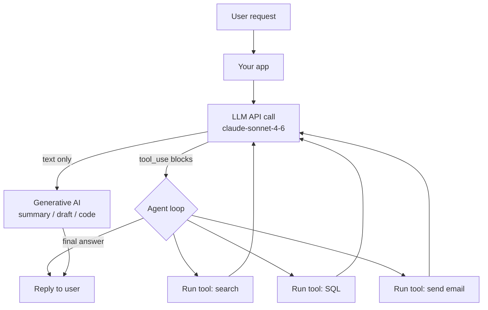

# Foundations 1 — Intro to Gen AI & Agentic AI

## Lectures covered
- Introduction to Gen AI & Agentic AI
- Application of Gen AI & Agentic AI
- Gen AI Application Development Steps

---

## In one sentence
**Generative AI** writes things for you (text, code, images), **Agentic AI** does things for you (plans, calls tools, takes actions) — and modern apps stitch both together on top of an LLM.

## Real-world analogy
Generative AI is the **ghostwriter** who drafts the email when you describe it. Agentic AI is the **executive assistant** who reads the email, books the flight, files the expense report, and only checks back in when something needs your decision.

## The intuition (plain English)
- A **Large Language Model (LLM)** is the engine — give it text, get text back.
- **Generative AI** wraps that engine in a "produce content" interface — chatbot, code completion, image caption, summary.
- **Agentic AI** wraps the same engine in a "decide and act" loop — the model picks a tool, you run it, the model sees the result and decides what to do next.
- Building either is the same recipe: pick a model, write a prompt, wire in retrieval (RAG) and tools as needed, then evaluate, ship, and watch the bill.
- Almost every "AI app" you see in 2026 is a thin orchestration layer sitting on top of one or two API calls.

## Mini worked example — the two flavors, side by side

**Generative AI call** — one prompt, one response, no actions:

```python
import anthropic

client = anthropic.Anthropic()
resp = client.messages.create(
    model="claude-sonnet-4-6",
    max_tokens=300,
    messages=[{"role": "user", "content": "Write a 3-line apology email for a late shipment."}],
)
print(resp.content[0].text)
```

**Agentic AI call** — same model, but it can request tools:

```python
tools = [{
    "name": "lookup_order",
    "description": "Look up an order by ID",
    "input_schema": {"type": "object", "properties": {"order_id": {"type": "string"}}, "required": ["order_id"]},
}]

resp = client.messages.create(
    model="claude-sonnet-4-6",
    max_tokens=512,
    tools=tools,
    messages=[{"role": "user", "content": "Where is my order #A-123 and when will it arrive?"}],
)
# resp may contain a tool_use block: lookup_order(order_id="A-123")
# you run the real lookup, return tool_result, model writes the customer-facing reply
```

The model is identical. The wrapper around it decides whether you have a writer or a worker.

## At-a-glance



## Why this matters
- Knowing the Gen AI vs Agentic AI split tells you which **architecture** to reach for on day one.
- The "AI engineer stack" in section 6 is the map for the rest of this module — every later folder zooms into one box.
- Costs, failures, and latency live at the API layer, not in your Python — design with that in mind.
- Most production wins come from picking the right *cheap* model and adding retrieval, not from a fancier model.

---

## 1. Generative AI vs Agentic AI

### Generative AI
Models that **produce** content: text, code, images, audio, video.
- ChatGPT generating an email
- DALL-E generating an image
- GitHub Copilot suggesting code
- Suno generating music

### Agentic AI
Systems that **take actions** in the world via LLMs:
- Research → search the web → summarize
- Read your email, draft replies, send them
- Analyze a database, write SQL, execute, report
- Onboard an employee end-to-end (HR project — Module 9 project 3)

The distinction: **Gen AI passively responds; Agentic AI plans and acts.**

A modern application usually combines both: an agent that talks (Gen AI) and acts (tools).

---

## 2. The Gen AI / Agentic AI application landscape (use cases)

### Customer-facing
- Chatbots / customer support
- Virtual assistants
- Personalized recommendations
- Search ("ask the docs")

### Internal productivity
- Code assistants
- Email triage / drafting
- Meeting summarization
- Knowledge management

### Vertical applications
- **Real estate** — property assistants (project 1 in this module)
- **E-commerce** — shopping bots (project 2)
- **HR** — onboarding agents (project 3)
- **Healthcare** — clinical decision support, medical Q&A (Virtual Internship 2)
- **Finance** — research assistants, compliance checkers
- **Legal** — contract review, clause extraction

### Developer / AI-eng building blocks
- RAG over private docs
- Code generation / SQL generation
- Function-calling APIs
- Multi-agent orchestration

---

## 3. The Gen AI app development steps (high-level)

1. **Frame the problem** — what does the user ask, what does the system answer, what's the success metric?
2. **Choose the LLM** — closed (Claude / OpenAI / Gemini) vs open (Llama / Mistral); per cost / latency / privacy
3. **Design the prompt** — system prompt, user template, output format
4. **Add retrieval if needed** — RAG over your private docs / DB
5. **Add tools if needed** — let the LLM call APIs / DB / web search
6. **Plan for failure** — hallucinations, prompt injection, rate limits, cost spikes
7. **Build a UI** — Streamlit demo or full frontend
8. **Evaluate** — golden questions, LLM-as-judge, human review
9. **Deploy** — FastAPI / serverless / managed (Bedrock AgentCore)
10. **Monitor + iterate** — log all calls, track cost, cache repeated queries

---

## 4. Closed vs Open-source LLMs

| | Closed (API) | Open (run locally) |
|---|---|---|
| Examples | Claude, GPT, Gemini | Llama, Mistral, Qwen, Phi |
| Quality | usually higher | catching up |
| Cost | per-token API fee | infrastructure + GPU |
| Privacy | data sent to vendor (with enterprise terms) | full control |
| Latency | 200ms–5s typical | depends on hardware |
| Customization | prompt + fine-tune (limited) | full fine-tune, distill, quantize |
| Default for | most production apps in 2025 | privacy/sovereignty-critical, very high volume |

For this bootcamp's projects: **API LLMs** for Gen AI projects (Claude / OpenAI), demonstrated on managed services (AgentCore).

---

## 5. Quick taste — call an LLM

### OpenAI
```python
from openai import OpenAI
client = OpenAI()
resp = client.chat.completions.create(
    model="gpt-4o-mini",
    messages=[{"role": "user", "content": "Summarize: ..."}],
)
print(resp.choices[0].message.content)
```

### Anthropic (Claude)
```python
from anthropic import Anthropic
client = Anthropic()
resp = client.messages.create(
    model="claude-sonnet-4-6",
    max_tokens=1024,
    messages=[{"role": "user", "content": "Summarize: ..."}],
)
print(resp.content[0].text)
```

### Local (Ollama)
```bash
ollama run llama3
```
```python
import requests
r = requests.post("http://localhost:11434/api/generate",
                   json={"model": "llama3", "prompt": "Hello"})
```

For 95% of bootcamp projects: API-based LLMs are simplest. Move to open models later for portfolio depth.

---

## 6. The "AI engineer" stack in 2025

```
┌──────────────────────────────────────────────────────────┐
│ APPLICATION (chatbot, assistant, agent)                  │
└────────────┬─────────────────────────────────────────────┘
             │
┌────────────▼─────────────────────────────────────────────┐
│ ORCHESTRATION (LangChain / LangGraph / CrewAI / DSPy)    │
└────────────┬─────────────────────────────────────────────┘
             │
   ┌─────────┼──────────┬─────────────────┐
   ▼         ▼          ▼                 ▼
┌──────┐ ┌──────┐  ┌──────────┐  ┌──────────────┐
│ LLM  │ │ RAG  │  │  TOOLS   │  │  MEMORY      │
│ APIs │ │ vec  │  │ APIs/DB  │  │  short/long  │
└──────┘ └──────┘  └──────────┘  └──────────────┘
   │
┌──▼─────────────┐
│ EVAL + OBSERVE │
│ ragas, langsmith│
│ langfuse, etc. │
└────────────────┘
```

The bootcamp's projects walk you through each layer.

---

## 7. Free APIs / sandboxes for bootcamp

- **OpenAI** — $5 free credit on signup; cheap for prototyping
- **Anthropic Claude** — free trial credits via console
- **Google Gemini** — free tier in AI Studio
- **Groq** — free tier; very fast hosted Llama/Mixtral
- **Together AI / Fireworks** — pay-as-you-go open models
- **Hugging Face Inference API** — free tier

For local: **Ollama** runs Llama-3.1 8B on a 16GB Mac just fine.

---

## 8. Common pitfalls

| Mistake | Effect | Fix |
|---|---|---|
| API key in repo | leaked credentials | use `.env` + `.gitignore` |
| Calling LLM in a loop without limit | runaway cost | set max trials + cap on tokens |
| Treating LLM output as truth | hallucinations | always verify or constrain |
| No retry / timeout | flaky reliability | implement exponential backoff |
| Not logging prompts/responses | can't debug | log everything (with privacy) |

## Self-check

- [ ] Difference between Gen AI and Agentic AI in one sentence?
- [ ] Name 3 verticals where Agentic AI is being deployed today.
- [ ] Walk through the 10 Gen AI dev steps.
- [ ] When pick a closed API LLM vs an open model?
- [ ] What's the AI-engineer stack — list the layers.
- [ ] Free LLM APIs you can use right now?
- [ ] What's the #1 production pitfall to avoid?
- [ ] How do you store an API key safely?

---

## Glossary

| Term | Plain meaning |
|------|---------------|
| **Gen AI** | Generative AI — systems that produce content (text, image, audio, video, code). |
| **Agentic AI** | Systems that use an LLM to plan and execute multi-step actions via tools. |
| **LLM** | Large Language Model — a transformer trained on huge text corpora to predict the next token. |
| **Token** | Subword chunk the model reads and writes; ~4 English characters on average. |
| **API LLM** | A model accessed over HTTP from a vendor (Claude, GPT, Gemini). |
| **Open model** | A model with public weights you can run locally (Llama, Mistral, Qwen, Phi). |
| **System prompt** | High-priority instructions that set the assistant's role and rules. |
| **User prompt** | The variable input from the human for a given turn. |
| **Tool / function calling** | Mechanism for the model to emit structured JSON requesting your code run a function. |
| **RAG** | Retrieval-Augmented Generation — fetch relevant docs at query time, stuff them into the prompt. |
| **Orchestration** | Library glue (LangChain, LangGraph, CrewAI, DSPy) that wires LLMs, tools, memory, and routing. |
| **Embedding** | A fixed-length vector representing a chunk of text; used for similarity search in RAG. |
| **Vector DB** | Database optimized for nearest-neighbor search over embeddings (Chroma, Pinecone, pgvector). |
| **Memory** | State carried across turns or sessions of an agent (short-term = chat history, long-term = stored facts). |
| **Eval / observability** | Logging, metrics, and tests that tell you whether the LLM app is actually working. |
| **Prompt injection** | Attack where instructions hidden in user input or retrieved content hijack the model. |
| **Hallucination** | A confident but false output from the LLM. |
| **Streamlit** | Python library that turns scripts into web UIs; common for bootcamp demos. |
| **FastAPI** | Python framework for serving HTTP APIs; common backend for Gen AI apps. |
| **Bedrock AgentCore** | AWS managed runtime for hosted agents — used in this bootcamp's projects. |
| **Anthropic SDK** | The `anthropic` Python package that calls Claude models. |
| **Claude Sonnet 4.6** | Mid-tier Claude model — the default we use in this bootcamp for quality + cost balance. |
| **Ollama** | Tool that runs open-source models locally on your laptop. |
| **Latency** | Wall-clock time from request to final token; LLM calls are typically 200ms–10s. |

## Further reading
- Next: [02-llm-fundamentals.md](./02-llm-fundamentals.md)
- Module overview: [../01-llm-fundamentals.md](../01-llm-fundamentals.md)
- Prompt design: [../02-prompt-engineering.md](../02-prompt-engineering.md)
- Production evaluation: [../07-evaluation-llm-apps.md](../07-evaluation-llm-apps.md)
- Transformer math behind every LLM: [../../07-deep-learning/04-sequence/03-transformer-architecture.md](../../07-deep-learning/04-sequence/03-transformer-architecture.md)
- Style guide for these notes: [../../../BEGINNER-STYLE-GUIDE.md](../../../BEGINNER-STYLE-GUIDE.md)
- Anthropic — [Models overview](https://docs.anthropic.com/en/docs/about-claude/models)
