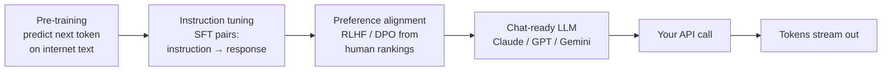

# Foundations 2 — LLM Fundamentals

## Lectures covered
- Large Language Models

---

## In one sentence
A **Large Language Model (LLM)** is a giant transformer trained to predict the next token of text — and once trained at scale, that single skill becomes a general-purpose engine for chat, code, extraction, and tool use.

## Real-world analogy
Picture an intern who has read most of the public internet and is shockingly good at the game "finish my sentence". You feed them the first half of any text — *"The customer wants a refund because"* — and they reflexively write a plausible continuation. Stack millions of those guesses together and you get a chat assistant.

## The intuition (plain English)
- An LLM is a function that turns text into more text, one token at a time.
- It learned by reading huge piles of text and being graded on how well it guessed the next token.
- The "smartness" comes from scale — billions of parameters, trillions of tokens of training data.
- Three training stages turn a raw next-token predictor into a chat assistant: pre-training, instruction tuning, and preference alignment.
- Every API knob you'll touch (system prompt, temperature, tools, context window) is a steering wheel on that next-token engine.

## Mini worked example — predict-the-next-token

Suppose the model sees:

```
"The customer is asking for a refund because the package"
```

Internally it scores every token in its vocabulary as the possible next word:

| Candidate token | Probability |
|---|---|
| ` arrived`  | 0.41 |
| ` was`      | 0.27 |
| ` never`    | 0.14 |
| ` is`       | 0.08 |
| ... (50,000+ others) | tiny |

It samples one (say ` arrived`), appends to the prompt, and reruns the whole network to pick the next token. Repeat until it emits an end-of-sequence token or hits `max_tokens`. That's the entire generation loop — even for the longest essay.

## At-a-glance



## Why this matters
- Token pricing drives every cost decision — knowing what a token is tells you why long prompts hurt.
- The three training stages explain why a base model "completes" but a chat model "answers".
- "Just" next-token prediction tells you why hallucinations happen and why grounding (RAG) helps.
- Every later module (prompts, RAG, agents, fine-tuning) is a clever wrapper around this loop.

---

## 1. What an LLM is, in one paragraph

An LLM is a **transformer decoder** trained on huge amounts of text to predict the **next token** given previous tokens. After enough scale (parameters + data + compute), the model exhibits emergent capabilities — reasoning, instruction-following, world knowledge.

> "Just" predicting the next token, but at scale, that becomes useful for almost everything textual.

---

## 2. The training pipeline (3 stages)

### 1. Pre-training
- Trillions of tokens of internet, books, code
- Self-supervised: predict next token
- Output: a "base model" that completes text
- Cost: $millions to $billions

### 2. Instruction tuning (SFT — Supervised Fine-Tuning)
- Curated (instruction, response) pairs
- Teaches the base model to **follow instructions** rather than blindly continue text
- Output: an instruction-following model

### 3. RLHF / DPO (alignment)
- Humans rank responses; model trained to prefer the preferred ones
- Output: a helpful, harmless, honest assistant
- Modern variants: **DPO** (Direct Preference Optimization), **RLAIF**

After all three: ChatGPT, Claude, Gemini.

---

## 3. Tokens — the unit of LLM accounting

LLMs don't see characters or words — they see **tokens**, ~3-4 characters each on average for English. Different languages tokenize differently.

```
"hello world" → ["hello", " world"]  → 2 tokens
"def my_func():" → ["def", " my", "_", "func", "():"] → ~5 tokens
"নমস্কার" (Bengali) → could be 5-10 tokens
```

### Why this matters for cost

API pricing is **per token** — input + output separately. Examples (rough, late 2025):

| Model | Input $/M tokens | Output $/M tokens |
|---|---|---|
| Claude Opus 4.7 | $15 | $75 |
| Claude Sonnet 4.6 | $3 | $15 |
| Claude Haiku 4.5 | $1 | $5 |
| GPT-4o | $2.50 | $10 |
| GPT-4o-mini | $0.15 | $0.60 |
| Llama 3.1 70B (Together) | $0.90 | $0.90 |

> A single 50-message chat with a 100k-token document loaded can easily cost $1+. For high-traffic apps, cost matters a lot.

### Tokenizing in code
```python
import tiktoken
enc = tiktoken.encoding_for_model("gpt-4o")
n_tokens = len(enc.encode("hello world"))
```

For Anthropic:
```python
import anthropic
client = anthropic.Anthropic()
client.messages.count_tokens(model="claude-sonnet-4-6", messages=[...])
```

---

## 4. Roles — system / user / assistant

Modern chat LLMs accept a **list of messages** with roles:

```python
messages = [
    {"role": "system", "content": "You are a helpful data assistant."},
    {"role": "user", "content": "What is mean vs median?"},
    {"role": "assistant", "content": "Mean is the arithmetic average..."},
    {"role": "user", "content": "Now give me an example."},
]
```

- **system** — instructions for the assistant; sets behavior
- **user** — what the human said
- **assistant** — what the model previously said (for multi-turn context)

The model sees the entire conversation each call → must fit in context window.

---

## 5. Streaming responses

For better UX, stream tokens as they're generated:

```python
# OpenAI
stream = client.chat.completions.create(
    model="gpt-4o-mini",
    messages=[...],
    stream=True,
)
for chunk in stream:
    delta = chunk.choices[0].delta.content
    if delta:
        print(delta, end="", flush=True)
```

```python
# Anthropic
with client.messages.stream(model="claude-sonnet-4-6", max_tokens=1024,
                              messages=[...]) as stream:
    for text in stream.text_stream:
        print(text, end="", flush=True)
```

Streamlit and the AI SDK make streaming UIs trivial.

---

## 6. Function / tool calling

Modern LLMs can call **tools** — JSON-defined functions. The model decides when to call, you execute, return result, model continues.

```python
tools = [{
    "name": "get_weather",
    "description": "Get current weather in a given city",
    "input_schema": {
        "type": "object",
        "properties": {"city": {"type": "string"}},
        "required": ["city"],
    },
}]

resp = client.messages.create(
    model="claude-sonnet-4-6",
    max_tokens=1024,
    tools=tools,
    messages=[{"role": "user", "content": "What's the weather in Lahore?"}],
)
# resp may contain a tool_use block requesting get_weather(city="Lahore")
# you call the real function, then send the result back as a tool_result
```

This is the foundation of **agents**.

---

## 7. Common LLM "modes" you'll write apps for

| Mode | What |
|---|---|
| **One-shot completion** | one prompt, one response |
| **Chat** | multi-turn conversation with history |
| **Tool use** | model decides when to call functions |
| **Structured output** | model returns JSON matching a schema |
| **Streaming** | tokens come as they're generated |
| **Embeddings** | text → vector, for similarity / RAG |
| **Prompt caching** | cache repeated context to save cost |

We'll use most of these in later subfolders.

---

## 8. Choosing a model — the practical heuristic

| Need | Pick |
|---|---|
| Highest quality, complex reasoning | Claude Opus, GPT-4o, Gemini 1.5 Pro |
| Balance quality + cost | Claude Sonnet, GPT-4o, Gemini 1.5 Flash |
| Cheapest workhorse | Claude Haiku, GPT-4o-mini, Llama 3.1 8B |
| Coding tasks | Claude Sonnet (industry leader for code), GPT-4o |
| Multimodal (image + text) | Claude, GPT-4o, Gemini |
| Long context (>200k) | Claude Sonnet, Gemini 1.5 |
| Privacy / on-prem | Llama / Mistral / Qwen via Ollama or vLLM |
| Fastest inference | Groq-hosted Llama / Mixtral |

For Codebasics' projects: usually a mid-tier model (Sonnet, GPT-4o-mini) is the sweet spot.

---

## 9. Common pitfalls

| Mistake | Effect | Fix |
|---|---|---|
| Sending huge contexts every call | high cost | use prompt caching where supported |
| Treating LLM as deterministic | non-reproducible | set temperature=0 for testing |
| Trusting LLM math | LLMs are bad at arithmetic | tool-call out to a calculator |
| Trusting LLM with private data | data goes to vendor | use enterprise terms or self-host |
| No max_tokens | runaway response | set a sensible cap |

## Self-check

- [ ] Three stages of LLM training?
- [ ] How are LLMs charged — per what unit?
- [ ] What does the system message do?
- [ ] Difference between streaming and non-streaming?
- [ ] What's tool / function calling?
- [ ] Pick a model for: code generation / cheap classification / privacy-sensitive workload.
- [ ] Why is "trust LLM math" a bad idea?
- [ ] Count tokens for a string in your favorite model.

---

## Glossary

| Term | Plain meaning |
|------|---------------|
| **LLM** | Large Language Model — a transformer trained on text to predict the next token. |
| **Token** | Subword chunk the model reads and writes, roughly 4 English characters. |
| **Tokenizer** | Code that converts text into token IDs and back (BPE, SentencePiece, tiktoken). |
| **Vocabulary** | The fixed set of tokens the model knows (typically 30K-200K). |
| **Transformer** | Neural network architecture that uses self-attention to mix tokens. |
| **Decoder-only** | Architecture variant that generates left-to-right; used by all modern chat LLMs. |
| **Pre-training** | First training stage — predict next token on huge text corpora. |
| **SFT** | Supervised Fine-Tuning — instruction-tuning on (prompt, response) pairs. |
| **RLHF** | Reinforcement Learning from Human Feedback — train on human preference rankings. |
| **DPO** | Direct Preference Optimization — simpler alternative to RLHF. |
| **Base model** | A pre-trained model that completes text but doesn't follow instructions. |
| **Instruction-tuned model** | A model that has been SFT'd to follow instructions. |
| **Foundation model** | A pre-trained model meant to be adapted to many tasks. |
| **Parameters** | Trainable weights in the network (more = more capacity). |
| **Context window** | Maximum tokens the model can read+write in one call. |
| **System / user / assistant** | Roles in a chat-format message list. |
| **System prompt** | High-priority instructions defining the assistant's role and rules. |
| **Streaming** | Sending tokens to the client as they're generated, instead of waiting. |
| **Tool use / function calling** | Mechanism for the model to emit structured JSON calls to your code. |
| **Embedding** | A fixed-length vector representing a piece of text. |
| **Prompt caching** | Discount mechanism for reusing identical prefixes across calls. |
| **Multimodal** | Models that accept image / audio inputs alongside text. |
| **Hallucination** | A confident but false output. |

## Further reading
- Previous: [01-intro-applications.md](./01-intro-applications.md)
- Next: [03-context-temperature.md](./03-context-temperature.md)
- Module overview: [../01-llm-fundamentals.md](../01-llm-fundamentals.md)
- Transformer math: [../../07-deep-learning/04-sequence/03-transformer-architecture.md](../../07-deep-learning/04-sequence/03-transformer-architecture.md)
- Attention: [../../07-deep-learning/04-sequence/04-attention.md](../../07-deep-learning/04-sequence/04-attention.md)
- Anthropic — [Models overview](https://docs.anthropic.com/en/docs/about-claude/models)
