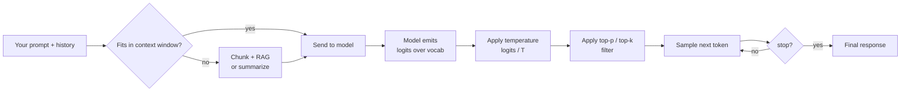

# Foundations 3 — Context Window, Temperature, Sampling

## Lectures covered
- Context Window
- Temperature

---

## In one sentence
The **context window** is how much text the model can look at in one call, and **temperature** is how adventurous it gets when picking the next token — together they're the two most important knobs on every LLM API.

## Real-world analogy
Picture a chef cooking from memory. The **context window** is how big their kitchen counter is — they can only chop ingredients laid out in front of them. **Temperature** is how willing they are to improvise: a cold-headed chef always reaches for the same go-to recipe; a hot-headed one experiments. Tiny counter + cold chef = predictable, fast, cheap. Big counter + hot chef = creative, sometimes wild.

## The intuition (plain English)
- The model can only "see" a bounded number of tokens per call. That bound is the context window.
- Bigger windows feel magical (drop in a whole book) but cost more and recall less reliably in the middle.
- After computing a probability over all possible next tokens, the model has to pick one — temperature decides how flat or peaky the distribution looks.
- Temperature 0 = always pick the highest probability token. Temperature 1+ = let lower-ranked tokens win sometimes.
- For production, default to temperature 0 and a tight `max_tokens` until you have a good reason to do otherwise.

## Mini worked example — same prompt, two temperatures

Prompt: *"Write a one-line tagline for a coffee shop."*

```python
import anthropic
client = anthropic.Anthropic()

for T in [0.0, 1.0]:
    resp = client.messages.create(
        model="claude-sonnet-4-6",
        max_tokens=40,
        temperature=T,
        messages=[{"role": "user", "content": "Write a one-line tagline for a coffee shop."}],
    )
    print(f"T={T}: {resp.content[0].text}")
```

Sample outputs (illustrative):

```
T=0.0: "Brewed fresh, served warm."                          # safe, predictable
T=0.0: "Brewed fresh, served warm."                          # same again
T=1.0: "Where mornings begin and Mondays surrender."         # creative
T=1.0: "Steam, bean, repeat — life on caffeine."             # different each run
```

Same model, same prompt — temperature changed everything.

## At-a-glance



## Why this matters
- Context drives cost: a 200K-token call costs ~50× more than a 4K one.
- Temperature drives reproducibility: at T=0 your tests are stable; at T=1 they're flaky.
- "Lost in the middle" means stuffing everything into a long context loses recall on middle content — that's why RAG often wins.
- Prompt caching turns repeated long prefixes from a budget killer into a near-free reuse.

---

## 1. Context window — the LLM's working memory

The **context window** is the maximum number of tokens (input + output combined) the model can attend to in a single call.

| Era | Typical context | Example |
|---|---|---|
| 2018 | 512 | BERT |
| 2020 | 4k | GPT-3 |
| 2022 | 32k | GPT-4 |
| 2024 | 200k | Claude 3 |
| 2025 | 1M+ | Claude with 1M, Gemini 1.5 with 1M |

### Practical implications
- **Fits in context** = model can use it directly (no RAG needed)
- **Doesn't fit** = chunk and retrieve (RAG)
- **Long contexts get expensive** — pricing is per token

### "Lost in the Middle" problem
Even when content fits, models often **attend less to the middle** of long contexts. Important info at the start or end is recalled better. This is why RAG (small relevant chunks) often outperforms stuffing the entire knowledge base into context.

### Prompt caching — long contexts that don't blow your budget
Some providers (Anthropic, OpenAI) let you **cache** the static prefix of your prompt:
- First call: pays full price
- Subsequent calls reusing the same prefix: discounted (often 90% off input cost)

Useful for chat apps with a long system prompt that's reused.

---

## 2. Temperature — the creativity dial

Temperature controls **randomness** in token sampling:

$$P(\text{token}_i) = \frac{\exp(\text{logit}_i / T)}{\sum_j \exp(\text{logit}_j / T)}$$

- **T = 0** → deterministic; always pick the highest-probability token
- **T = 0.5** → conservative; small variation
- **T = 1.0** → "natural" creativity
- **T = 1.5+** → wild; can produce nonsense

```python
client.chat.completions.create(model="gpt-4o", temperature=0, messages=...)
```

### When to use which temperature

| Task | Temperature |
|---|---|
| Code generation / SQL | 0 — 0.2 |
| Classification / extraction | 0 |
| Reproducible tests | 0 (also set `seed`) |
| Q&A over documents | 0 — 0.3 |
| Creative writing | 0.7 — 1.0 |
| Brainstorming | 0.8 — 1.2 |
| Hard puzzles needing exploration | 0.5 — 0.8 |

> **Default for production: 0**. Reproducible, predictable, easier to debug.

### Temperature vs ensemble
For hard problems, you can sample multiple times at moderate temperature, then pick the majority vote / best answer. **Self-consistency** is the academic term.

---

## 3. Top-p (nucleus sampling)

Instead of "all tokens scaled by temperature," top-p considers **only the smallest set of tokens whose cumulative probability ≥ p**.

```python
top_p=0.9        # consider only top tokens summing to 90% of prob mass
```

- `top_p = 1.0` → all tokens (effectively temperature only)
- `top_p = 0.5` → very focused; often better than high temperature
- Common combo: `temperature=0.7, top_p=0.9`

> Use **either** temperature **or** top_p — usually not both. Temperature is more common.

---

## 4. Top-k sampling

Consider only the top-k highest-probability tokens.

```python
top_k=50
```

Not exposed by all APIs (OpenAI doesn't, Anthropic does). Less commonly used than top-p.

---

## 5. Other useful generation parameters

```python
client.chat.completions.create(
    model="gpt-4o",
    messages=...,
    temperature=0,
    max_tokens=1024,                    # cap output
    presence_penalty=0.0,               # discourage repeats already mentioned
    frequency_penalty=0.0,              # discourage frequent words
    stop=["\n\n", "User:"],             # stop generation when seen
    seed=42,                             # reproducibility (best-effort)
    response_format={"type": "json_object"},     # force JSON output
)
```

### Presence vs frequency penalty
- **presence_penalty**: penalizes any token that's already appeared (encourages new topics)
- **frequency_penalty**: penalizes proportionally to how many times the token has appeared (reduces verbatim repeats)

Set 0–0.5 for slightly less repetitive output.

### Stop sequences
Useful for: agents (stop on "Action:"), structured output (stop on `}` if generating one JSON), prevention of runaway.

---

## 6. Structured output — forcing JSON

```python
# OpenAI
client.chat.completions.create(
    model="gpt-4o",
    messages=...,
    response_format={"type": "json_object"},
)
# always returns valid JSON
```

Even better: **structured outputs with a Pydantic schema** (OpenAI's `response_format` with `json_schema`, Anthropic's `tool_use` pattern).

```python
from pydantic import BaseModel

class Extraction(BaseModel):
    name: str
    age: int

# OpenAI structured outputs
resp = client.beta.chat.completions.parse(
    model="gpt-4o",
    response_format=Extraction,
    messages=[{"role": "user", "content": "John is 30."}],
)
print(resp.choices[0].message.parsed)        # Extraction(name='John', age=30)
```

For LangChain / Anthropic / others, similar patterns via `with_structured_output`.

---

## 7. Streaming + temperature interaction

Streaming responses doesn't change generation behavior — same temperature/top-p applies. The difference is purely in how the bytes arrive at your code.

For agentic loops with multiple tool calls: streaming is great UX but you may want to wait for tool calls to complete before proceeding.

---

## 8. Real example — extracting structured data

```python
import json
from openai import OpenAI

client = OpenAI()

resume_text = "Awais Shah, 27, Data Science Bootcamp learner from Lahore, Pakistan."

resp = client.chat.completions.create(
    model="gpt-4o-mini",
    messages=[
        {"role": "system",
         "content": "Extract name, age, location as JSON."},
        {"role": "user", "content": resume_text},
    ],
    temperature=0,                                    # deterministic
    response_format={"type": "json_object"},
    max_tokens=200,
)

data = json.loads(resp.choices[0].message.content)
print(data)        # {'name': 'Awais Shah', 'age': 27, 'location': 'Lahore, Pakistan'}
```

This is one of the most common production patterns for Gen AI: **deterministic structured extraction**.

---

## 9. Common pitfalls

| Mistake | Effect | Fix |
|---|---|---|
| Temperature 1.0 for code generation | unpredictable bugs | use 0 for code |
| Forgetting `max_tokens` | runaway cost | always cap |
| Stuffing all context every call | huge bill | use RAG / prompt caching |
| Trusting "seed" for full reproducibility | best-effort, not guaranteed | also pin model version |
| `response_format=json` without describing schema | weird JSON | combine with system prompt describing schema or use schema-validated output |

## Self-check

- [ ] What's the context window?
- [ ] What does temperature 0 mean?
- [ ] Difference between top-p and top-k?
- [ ] What's the "lost in the middle" problem?
- [ ] When use prompt caching?
- [ ] When set frequency_penalty above 0?
- [ ] Why is `response_format={"type": "json_object"}` safer than parsing free text?
- [ ] Set up a deterministic extraction call to OpenAI.
