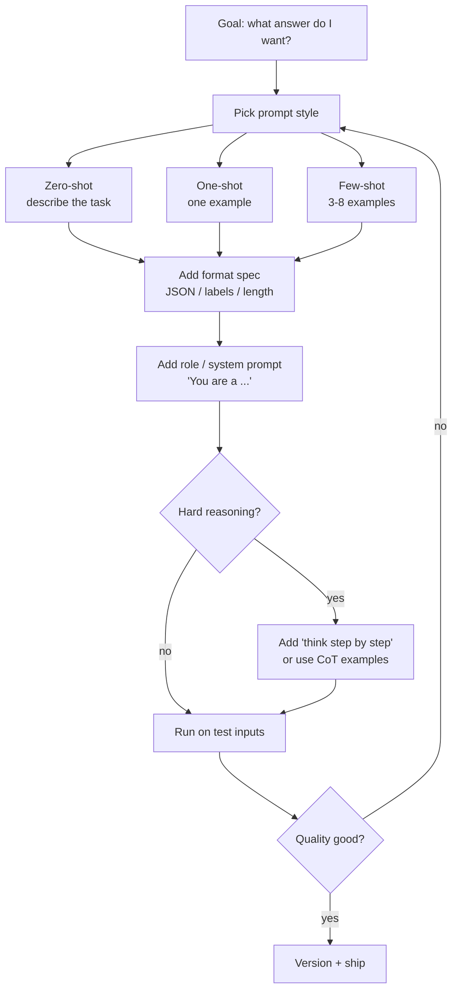

# Foundations 4 — Prompt Engineering

## Lectures covered
- Zero-Shot, One-Shot, Few-Shot Prompting

---

## In one sentence
**Prompt engineering** is the craft of writing inputs that reliably get the output you want from an LLM — by being specific, giving examples, and asking for a precise format.

## Real-world analogy
Talking to an LLM is like briefing a freelance contractor over Slack: a vague "make me a logo" gets random results, but "modernist, two-color, square, no text, in the style of these three references" gets something usable on the first try. Same worker, very different output, because the brief carried the difference.

## The intuition (plain English)
- The model is a probability machine — your prompt shifts which next-token paths are most likely.
- **Zero-shot** says "do X". **Few-shot** says "do X, like these examples did". Examples are usually the cheapest quality boost you can buy.
- A good prompt has four parts: a role (who the model is), a task (what to do), context (what it needs to know), and a format (how to answer).
- For chat models, the **system prompt** sets the stable behavior; the **user prompt** carries the variable input.
- Prompt engineering is iterative — change one thing, run on a test set of inputs, compare. Treat prompts like code, not like spells.

## Mini worked example — same task, three prompt qualities

Task: classify a customer review as `positive`, `neutral`, or `negative`.

**Bad (vague, no format)**

```
Is this review good or bad? "The food was cold and the waiter was rude."
```

Output is unpredictable: sometimes "It seems negative because...", sometimes "Bad.", sometimes a paragraph.

**Better (zero-shot with format)**

```
Classify the sentiment of this review as exactly one of: positive, neutral, negative.
Return only the label.

Review: "The food was cold and the waiter was rude."
Sentiment:
```

Output: `negative`. Reliable enough for a quick demo.

**Best (few-shot with role + format)**

```
You are a precise sentiment classifier for restaurant reviews.

Examples:
Review: "Loved every bite, the dessert was amazing!"     Sentiment: positive
Review: "Average. Nothing special."                       Sentiment: neutral
Review: "Cold food, rude waiter."                         Sentiment: negative

Now classify:
Review: "Service was slow but the food saved it."
Sentiment:
```

Output: `neutral` — and the model will follow the same shape across thousands of inputs.

**In code** (Claude API, deterministic):

```python
import anthropic

client = anthropic.Anthropic()
resp = client.messages.create(
    model="claude-sonnet-4-6",
    max_tokens=10,
    temperature=0,
    system="You are a precise sentiment classifier. Return exactly one of: positive, neutral, negative.",
    messages=[{"role": "user", "content": 'Review: "Service was slow but the food saved it."'}],
)
print(resp.content[0].text.strip())   # neutral
```

## At-a-glance



## Why this matters
- A 5-minute prompt rewrite often beats a $1000/month upgrade to a bigger model.
- Most "the LLM is bad at this" complaints are actually "the prompt is bad at this".
- Structured output prompts are the bridge to **agents** — tools need parseable JSON, not prose.
- Treating prompts as versioned code (not throwaway strings) is what separates a demo from a product.

---

## 1. What "prompt engineering" really is

A prompt is a contract with the LLM: **you describe what you want; it tries to give it.** Better prompts → better outputs. The same model can produce vastly different quality with poor vs good prompting.

Prompt engineering is *not* magic incantations. It's:
1. Be clear about what you want
2. Give context the model needs
3. Show, don't just tell (examples)
4. Ask for a specific format
5. Iterate

---

## 2. Zero-shot, one-shot, few-shot

### Zero-shot — just describe the task
```
Classify this review as positive or negative:
"The food was cold and the waiter was rude."
```

Works for simple, common tasks where the model has seen many similar.

### One-shot — give one example
```
Example:
Review: "Loved every bite, the dessert was amazing!"
Sentiment: positive

Now classify:
Review: "The food was cold and the waiter was rude."
Sentiment:
```

Better than zero-shot for ambiguous tasks.

### Few-shot — give a handful of examples
```
Review: "Loved every bite, the dessert was amazing!"
Sentiment: positive

Review: "Average. Nothing special."
Sentiment: neutral

Review: "Cold food, rude waiter."
Sentiment: negative

Review: "Service was slow but the food saved it."
Sentiment:
```

Often best when:
- The task is custom (your taxonomy)
- You want consistency in format
- You don't want to fine-tune

3–8 examples is usually enough.

---

## 3. Prompt anatomy — a full template

```
[ROLE / SYSTEM] You are a senior data analyst at a hotel chain.

[TASK]   Given the following hotel booking record, classify the booking type.

[CONTEXT]   Categories:
            - leisure: vacation, weekend
            - business: corporate, conference
            - other: groups, events, unclear

[FEW-SHOT EXAMPLES]
Booking: "Single night, Friday-Saturday, paid with personal card."
Category: leisure

Booking: "5-night stay, weekday, corporate rate, expense report attached."
Category: business

[INPUT]
Booking: {input_record}
Category:
```

Each section pulls its weight. Drop any one and quality drops.

---

## 4. Chain-of-Thought (CoT)

Ask the model to **reason step by step** before answering. Improves accuracy on complex problems dramatically.

### Naive
```
Q: A train leaves at 3pm at 60mph. Another at 4pm at 80mph. When does the second catch up?
A:
```

### CoT
```
Q: A train leaves at 3pm at 60mph. Another at 4pm at 80mph. When does the second catch up?
Let's think step by step.
A:
```

The model now writes out: "first train has 1 hour head start, so 60 miles ahead at 4pm. Second train closes 20mph (80-60). 60 / 20 = 3 hours. So 7pm."

### Modern variants
- **Zero-shot CoT**: just append "Let's think step by step."
- **Few-shot CoT**: examples *with* reasoning shown
- **Self-consistency**: sample N CoT paths at temp > 0, take majority vote
- **Tree of Thoughts**: explore multiple branches, prune

For Claude / GPT-4 / Gemini in 2025, CoT is mostly automatic — they reason without prompting. For smaller models, explicit CoT still helps.

---

## 5. Output format prescriptions

### "Return as JSON"
```
Return your answer as JSON with keys "category" and "confidence".
```

### "Use this exact format"
```
Format your answer EXACTLY like this:
SUMMARY: <one sentence>
TAGS: <comma-separated>
SOURCE: <quote from the text>
```

### Use real schemas (best)
```python
from pydantic import BaseModel

class Result(BaseModel):
    category: str
    confidence: float

# OpenAI
resp = client.beta.chat.completions.parse(
    model="gpt-4o", response_format=Result, messages=[...]
)
```

OpenAI's "structured outputs" guarantees parseable results. Anthropic's tool-use pattern does similar.

---

## 6. Role-play prompts

Setting a persona changes behavior:

```
You are a kind, patient elementary school math teacher.
Explain why a / 0 is undefined to a 10-year-old.
```

vs

```
You are a senior software engineer reviewing code for production readiness.
Critique the following Python class.
```

Same model, very different responses.

> Don't fabricate fake credentials ("You are a doctor" doesn't make medical advice safe). Use roles to set *style and depth*, not to bypass safety.

---

## 7. The 12-rule prompt-engineering cheat sheet

1. Be specific about what you want
2. Include the input format the model will see
3. Specify the output format you need
4. Give examples for non-trivial tasks
5. State constraints ("don't include disclaimers", "max 3 sentences")
6. Ask for reasoning when the task is hard
7. Use a system prompt for stable behavior, user prompt for the variable input
8. Test with varied inputs, not just the easy case
9. Use temperature 0 for tasks with one right answer
10. When ambiguous, **show, don't tell** (few-shot)
11. Use stop sequences when you want surgical outputs
12. Iterate: change one thing, test, repeat

---

## 8. The prompt-as-code mindset

Treat prompts as production code:
- Store in versioned files (not in `.py` strings if reused)
- Test before shipping
- A/B test new prompt versions
- Track which version of the prompt was used for each generation
- Use templating (Jinja, f-strings) — don't string-concat with user input naively

Tools that help: **DSPy**, **LangChain PromptTemplates**, **PromptLayer**, **langfuse**.

---

## 9. Examples — three levels of quality

### Bad
> "Summarize this article."

### Better
> "Summarize this article in 3 bullet points, focusing on financial figures. Keep total under 80 words."

### Best
> "You are an analyst writing a 30-second briefing for a busy CEO.
>
> Article: {article}
>
> Output:
> - 3 bullet points
> - Each ≤ 20 words
> - Lead with revenue / growth numbers if mentioned
> - Cite the section the bullet came from in [brackets]
>
> Format:
> 1. [Section] bullet text
> 2. [Section] bullet text
> 3. [Section] bullet text"

The third version produces consistent, useful output every time.

---

## 10. Common pitfalls

| Mistake | Effect | Fix |
|---|---|---|
| Vague prompts | rambling output | be specific |
| Examples that don't match the task | misleads model | match style + format |
| Mixing 5 instructions in one paragraph | model ignores some | use bullet lists |
| Not testing edge cases | works on demo, breaks in prod | always test edge inputs |
| Embedding user input directly into prompt | prompt injection vulnerability | sanitize / sandbox |

## Self-check

- [ ] Difference between zero-, one-, few-shot prompting?
- [ ] What's CoT and when use it?
- [ ] How do you force structured JSON output?
- [ ] Why is "show, don't tell" (few-shot) often better than "tell"?
- [ ] Write a prompt extracting (name, email, phone) from a resume.
- [ ] Why use temperature 0 for prompts that need one right answer?
- [ ] What's prompt injection (preview)?
- [ ] How do you "promptly engineer" a prompt — what's your iteration loop?

---

## Glossary

| Term | Plain meaning |
|------|---------------|
| **Prompt** | The text input you send to the LLM (system + user + prior messages). |
| **System prompt** | High-priority instructions that set the assistant's stable behavior across turns. |
| **User prompt** | The variable per-turn input from the human. |
| **Zero-shot** | Prompting with the task description only, no examples. |
| **One-shot** | Prompting with exactly one worked example before the real input. |
| **Few-shot** | Prompting with several (typically 3-8) worked examples. |
| **In-context learning** | The model "learning" the pattern from examples inside the prompt, without weight updates. |
| **CoT (Chain-of-Thought)** | Prompting style that asks the model to reason step by step before answering. |
| **Zero-shot CoT** | The trick of appending "Let's think step by step" to elicit reasoning. |
| **Self-consistency** | Sampling several CoT paths at temperature > 0 and voting on the answer. |
| **Tree of Thoughts** | Search-style prompting that explores multiple reasoning branches and prunes. |
| **Role / persona prompt** | Instruction like "You are a senior X" used to set tone and depth. |
| **Structured output** | LLM output constrained to a schema (JSON / Pydantic / tool input). |
| **Stop sequence** | A string that, when emitted, halts generation — useful for surgical outputs. |
| **Temperature** | Sampling knob: 0 = deterministic, higher = more creative/random. |
| **max_tokens** | Hard cap on response length. |
| **Prompt template** | A reusable string with placeholders (Jinja, f-string) filled in per call. |
| **Token** | Subword chunk the model reads/writes; ~4 English chars on average. |
| **DSPy** | Python framework that compiles and optimizes prompts as code. |
| **PromptLayer / Langfuse** | Tools that version, log, and evaluate prompts in production. |
| **Prompt injection** | Attack where untrusted input contains instructions the model then follows. |
| **Iteration loop** | Change one prompt element, run on a fixed test set, compare metrics, repeat. |

## Further reading
- Previous: [03-context-temperature.md](./03-context-temperature.md)
- Next: [05-hallucinations-security-cost.md](./05-hallucinations-security-cost.md)
- Module overview: [../01-llm-fundamentals.md](../01-llm-fundamentals.md)
- Module-level prompt-engineering notes: [../02-prompt-engineering.md](../02-prompt-engineering.md)
- Evaluation harness for prompts: [../07-evaluation-llm-apps.md](../07-evaluation-llm-apps.md)
- Transformer math behind every LLM: [../../07-deep-learning/04-sequence/03-transformer-architecture.md](../../07-deep-learning/04-sequence/03-transformer-architecture.md)
- Style guide for these notes: [../../../BEGINNER-STYLE-GUIDE.md](../../../BEGINNER-STYLE-GUIDE.md)
- Anthropic — [Prompt engineering overview](https://docs.anthropic.com/en/docs/build-with-claude/prompt-engineering/overview)
