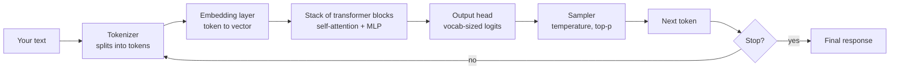

# 01 — LLM Fundamentals

## Lectures covered
- Introduction to Gen AI & Agentic AI
- Application of Gen AI & Agentic AI
- Large Language Models
- Context Window · Temperature
- Tokenization and sampling (added for completeness)

---

## In one sentence
A **Large Language Model (LLM)** is a giant transformer that, given some text, predicts the next chunk of text — and that single ability turns out to be enough to write essays, answer questions, and call tools.

## Real-world analogy
Imagine someone who has read most of the public internet and is freakishly good at the game "finish my sentence". You give them the first half — *"The capital of France is"* — and they reflexively say *"Paris"*. Stack millions of those guesses together and you get an essay, a translation, or a chatbot reply.

## The intuition (plain English)
- An LLM is **a function that maps text in to text out**, one token at a time.
- It learned by reading huge piles of text and being graded on how well it predicted the next token.
- It does **not** look up facts in a database. Everything it "knows" is baked into billions of weights.
- That's why it sometimes **hallucinates**: it's pattern-matching, not retrieving truth.
- Every knob you'll touch (temperature, system prompt, context window, fine-tuning) is a way to steer that next-token guess.

## Mini worked example — predict-the-next-token

Suppose the model has seen the prompt:

```
"The cat sat on the"
```

Internally it computes a probability for every token in its vocabulary as the next word:

| Candidate token | Probability |
|---|---|
| ` mat`     | 0.62 |
| ` floor`   | 0.18 |
| ` couch`   | 0.07 |
| ` roof`    | 0.04 |
| ... (50,000+ others) | tiny |

It samples one (let's say ` mat`), appends it to the prompt, and runs the whole thing again to get the next token. Repeat until it emits an end-of-sequence token or hits a length limit.

That's the entire generation loop — really.

## At-a-glance



## Why this matters
- Everything in this module is just clever wrappers around that loop. Knowing the loop demystifies the rest.
- **Context window** and **token count** drive cost and latency.
- **Temperature** and **top-p** decide how creative or deterministic answers are.
- Knowing it's "next-token prediction" tells you why LLMs hallucinate and why grounding (RAG) helps.

---

## Deep dive

### 1. What does "Large" mean

| Era | Example | Parameters | Training tokens |
|---|---|---|---|
| 2018 BERT-base | Encoder | 110M | ~3B |
| 2020 GPT-3 | Decoder | 175B | 300B |
| 2023 Llama-2 70B | Decoder | 70B | 2T |
| 2024 Llama-3 70B | Decoder | 70B | 15T |
| 2025 Claude / GPT-4 / Gemini class | Decoder | undisclosed (often 100B-1T+) | 10-30T+ |

Two scaling axes matter: **parameters** (capacity) and **training tokens** (experience). Both went up ~10,000× in five years.

### 2. The architecture in one paragraph

Every modern LLM is a **decoder-only transformer**. Input tokens are embedded as vectors, passed through 30-100+ identical blocks (each = self-attention + feed-forward + residuals + layer-norm), and a final linear layer maps the last hidden state to a probability over the vocabulary. See [transformer architecture](../07-deep-learning/04-sequence/03-transformer-architecture.md) for the math.

### 3. Tokenization

Models don't see characters or words — they see **tokens**, which are subword pieces.

```python
# Approximate token counts (English):
"Hello, world!"          # ~4 tokens
"antidisestablishment"   # ~5 tokens (broken into pieces)
"こんにちは"               # ~3 tokens (Japanese ~1 token per char)
"Rule of thumb: 1 token ~= 4 characters of English ~= 0.75 words."
```

You can count tokens before sending:

```python
import anthropic

client = anthropic.Anthropic()
result = client.messages.count_tokens(
    model="claude-sonnet-4-6",
    messages=[{"role": "user", "content": "How many tokens is this?"}],
)
print(result.input_tokens)
```

**Why care?**
- Pricing is per-million-tokens, separately for input and output.
- Context windows are measured in tokens.
- Prompts in non-English languages use more tokens per word.

### 4. Context window

The context window is the maximum tokens the model can process in one call (input + output).

| Model | Context window |
|---|---|
| GPT-3.5 (legacy) | 16K |
| Llama-3-70B | 8K |
| GPT-4o | 128K |
| Claude Sonnet | 200K |
| Claude with 1M context | 1,000,000 |
| Gemini 1.5 Pro | 1-2M |

A 200K window is roughly 500 pages of text. But:
- Long contexts cost more per call.
- Models often have **lost-in-the-middle** behavior — info in the middle of a long doc is recalled worse than info at the start or end.
- Beyond a few hundred K, RAG usually beats stuffing everything into context.

### 5. Sampling — temperature and top-p

Once the model emits a probability distribution over the next token, you choose how to pick one:

| Setting | Effect |
|---|---|
| `temperature=0` | Always pick the highest-probability token. Deterministic. Best for code, extraction, routing. |
| `temperature=0.7` | A common default. Some variety, mostly coherent. Best for chat. |
| `temperature=1.0+` | Adventurous. Best for creative writing, brainstorming. |
| `top_p=0.9` | Only consider tokens whose probabilities sum to 90%, then sample within those. Controls diversity. |

Math: at temperature `T`, logits are divided by `T` before softmax. Smaller `T` → sharper distribution → less random.

```python
response = client.messages.create(
    model="claude-sonnet-4-6",
    max_tokens=512,
    temperature=0.0,                 # deterministic
    messages=[{"role": "user", "content": "Extract names from: ..."}]
)
```

### 6. Hello, Claude — your first call

```python
import anthropic

client = anthropic.Anthropic()  # uses ANTHROPIC_API_KEY env var

response = client.messages.create(
    model="claude-sonnet-4-6",
    max_tokens=1024,
    system="You are a concise senior data scientist.",
    messages=[
        {"role": "user", "content": "Explain bias-variance tradeoff in 2 sentences."}
    ],
)

print(response.content[0].text)
print("input tokens :", response.usage.input_tokens)
print("output tokens:", response.usage.output_tokens)
```

**Cost arithmetic** (illustrative — check current pricing):

```
input:  120 tokens  *  $3 / 1M tokens   = $0.00036
output: 80 tokens   *  $15 / 1M tokens  = $0.00120
total per call: ~$0.0016
1000 calls/day:  ~$1.60/day
```

### 7. OpenAI / Gemini equivalents

Same shape, different SDK:

```python
# OpenAI
from openai import OpenAI
client = OpenAI()
resp = client.chat.completions.create(
    model="gpt-4o",
    messages=[{"role": "user", "content": "Hi"}],
)

# Gemini
import google.generativeai as genai
model = genai.GenerativeModel("gemini-1.5-pro")
resp = model.generate_content("Hi")
```

Lead with Claude for this bootcamp because the user is on Claude Code and we want native support for tool use, prompt caching, and the 1M-context tier.

### 8. What LLMs are good and bad at

| Strong | Weak |
|---|---|
| Summarising, rewriting, translating | Math beyond grade school (without tools) |
| Classifying / extracting from text | Counting characters / digits |
| Writing code from descriptions | Real-time facts, post-cutoff news |
| Tool dispatch (function calling) | Long-horizon planning without scaffolding |
| Following structured-output schemas | Knowing what they don't know |

The whole point of RAG, agents, and evaluation is to plug those weaknesses.

---

## Common pitfalls
- Confusing **parameters** with **context window** — they're independent.
- Setting `temperature=0` and being surprised the output still varies — at T=0 it's near-deterministic but providers don't always guarantee bit-exact output.
- Pasting huge text and assuming the model "read it all" — recall degrades in the middle.
- Treating LLMs as databases. They are pattern matchers; ground them with RAG when facts matter.
- Forgetting to set `max_tokens` — runaway responses cost money.
- Mixing system prompt content with user content — you lose the priority signal.
- Ignoring tokenization quirks: numbers, code, and non-English burn more tokens than you'd guess.

---

## Glossary

| Term | Plain meaning |
|---|---|
| LLM | Large Language Model — a transformer trained on text to predict the next token. |
| Transformer | Neural architecture using self-attention. The backbone of every modern LLM. |
| Decoder-only | Architecture variant that only generates left-to-right (vs encoder-decoder like T5). |
| Token | Subword chunk the model reads/writes. ~4 chars of English. |
| Tokenizer | Code that maps strings to token IDs and back (BPE, SentencePiece, tiktoken). |
| Vocabulary | The set of tokens the model knows (typically 30K-200K). |
| Embedding | A vector representation of a token or text. |
| Context window | Max tokens (input + output) per call. |
| Parameters | The trainable weights of the model. Bigger usually = smarter but slower. |
| Pre-training | Initial training on huge text corpora to predict next token. |
| Foundation model | A pre-trained model meant to be adapted. |
| Logits | Raw, pre-softmax scores for each vocabulary token. |
| Softmax | Function turning logits into a probability distribution. |
| Temperature | Sampling knob. 0 = greedy, higher = more random. |
| Top-p (nucleus) | Restrict sampling to the smallest set of tokens whose probabilities sum to p. |
| Top-k | Restrict sampling to the k highest-probability tokens. |
| Greedy decoding | Always pick the top token (T=0). |
| Hallucination | A confident but false output. |
| System prompt | High-priority instructions defining the assistant's role. |
| Completion | The model's generated response. |
| Max tokens | Hard cap on response length. |
| Stop sequence | A string that, when emitted, halts generation. |
| Pricing | Usually per-million tokens, billed separately for input and output. |
| Lost-in-the-middle | Tendency for LLMs to forget content in the middle of long contexts. |
| Streaming | Receiving tokens as they're generated rather than waiting for the full reply. |

## Further reading
- [Transformer architecture](../07-deep-learning/04-sequence/03-transformer-architecture.md)
- [Attention](../07-deep-learning/04-sequence/04-attention.md)
- [Word embeddings](../08-nlp/05-word-embeddings.md)
- [BERT fine-tuning](../08-nlp/07-bert-finetuning-huggingface.md)
- Next: [02-prompt-engineering.md](./02-prompt-engineering.md)
- Anthropic — [Models overview](https://docs.anthropic.com/en/docs/about-claude/models)
- Jay Alammar — [The Illustrated Transformer](https://jalammar.github.io/illustrated-transformer/)
