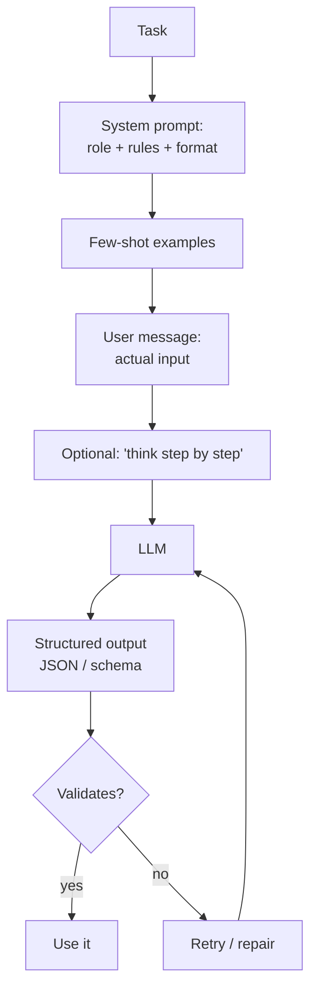

# 02 — Prompt Engineering

## Lectures covered
- Zero-Shot, One-Shot, Few-Shot Prompting
- Prompt Templates & Chains
- System vs user prompts
- Chain-of-thought reasoning
- Structured output (JSON, schemas)

---

## In one sentence
**Prompt engineering** is the practice of writing the input text so that an LLM produces the answer you actually want — and most production "model improvements" turn out to be prompt improvements.

## Real-world analogy
Hiring the world's best translator and giving them a cryptic note in your handwriting is not their fault when the result is garbage. A well-written prompt is a clean brief: who you are, who they are, what's the task, what's the output format, and an example or two.

## The intuition (plain English)
- An LLM follows whatever pattern is most plausible given the prompt — so vague prompts get vague answers.
- Move from **"please answer X"** to **"You are X. Given Y, return Z in this exact format. Here are 2 examples."**
- The biggest ROI moves are: (1) write a clear system prompt, (2) show 2-5 examples, (3) ask for a specific output shape, (4) ask the model to think step by step before answering.
- Treat your prompts like code: version them, test them on a fixed set of inputs, only ship a change when the eval score goes up.

## Mini worked example — the same task, three prompts

**Task**: extract company name and amount from an invoice line.

### Bad prompt
```
What's in this invoice: "Acme Corp - $4,250.00 due 2025-06-15"
```
Output: a chatty paragraph. Hard to parse.

### Better — structured + role
```
You are an invoice-parsing assistant. Return ONLY valid JSON with keys:
  - company (string)
  - amount_usd (number)

Invoice: "Acme Corp - $4,250.00 due 2025-06-15"
```
Output: `{"company": "Acme Corp", "amount_usd": 4250.00}`

### Best — few-shot + structured + system role
```
[system] You convert invoice strings to JSON. Output ONLY JSON.

[user] Invoice: "Globex - $99 due 2025-04-01"
[assistant] {"company": "Globex", "amount_usd": 99.00}

[user] Invoice: "Initech - $1,200.50 due 2025-05-10"
[assistant] {"company": "Initech", "amount_usd": 1200.50}

[user] Invoice: "Acme Corp - $4,250.00 due 2025-06-15"
```
Output: rock-solid `{"company": "Acme Corp", "amount_usd": 4250.00}`

## At-a-glance



## Why this matters
- A prompt change is the cheapest, fastest improvement available — no GPUs, no fine-tuning.
- Most "the model is stupid" complaints disappear with a few-shot example.
- Structured output is the bridge between LLMs and the rest of your codebase.
- Chain-of-thought lifts accuracy on reasoning tasks by 10-30 points.

---

## Deep dive

### 1. The three roles in a chat call

| Role | Purpose | Trust level |
|---|---|---|
| `system` | Defines the assistant's identity and ground rules. Set once. | Highest priority. |
| `user` | The actual request. Comes from the end-user. | Untrusted in production. |
| `assistant` | Previous model replies. Used for multi-turn. | Echo of model. |

```python
import anthropic

client = anthropic.Anthropic()

response = client.messages.create(
    model="claude-sonnet-4-6",
    max_tokens=1024,
    system="You are an SQL expert. Always return runnable SQL only, no prose.",
    messages=[
        {"role": "user", "content": "Top 5 customers by revenue last quarter."},
    ],
)
print(response.content[0].text)
```

### 2. Zero / one / few-shot

| Style | Examples in prompt | When to use |
|---|---|---|
| Zero-shot | 0 | Simple, well-known tasks ("translate to French"). |
| One-shot | 1 | The format is unusual. |
| Few-shot | 2-5 | The format is strict, the task is custom, or accuracy matters. |
| Many-shot (50+) | requires long context | Hard classification, niche styles, replaces light fine-tuning. |

Few-shot example for sentiment classification:

```python
prompt = """Classify each review as POSITIVE, NEGATIVE, or NEUTRAL.

Review: "Loved the food, hated the wait."
Label: NEUTRAL

Review: "Best pizza in town, will return."
Label: POSITIVE

Review: "Cold, late, rude server."
Label: NEGATIVE

Review: "{user_review}"
Label:"""
```

### 3. Chain-of-thought (CoT)

Asking the model to **show its reasoning** before answering massively boosts accuracy on math, logic, and multi-step problems.

```
Question: A train leaves at 9:00 going 60 mph. Another leaves at 9:30 going 80 mph
on the same track. When do they meet?

Think step by step, then give the final answer on the last line as: ANSWER: <time>.
```

Variants:
- **Zero-shot CoT**: just append *"Let's think step by step."*
- **Few-shot CoT**: include 1-2 examples that already show reasoning.
- **Self-consistency**: sample N reasoning chains, take the majority answer.

For Claude specifically, you can use **extended thinking** for hard problems — the model produces a hidden reasoning block before its visible answer.

### 4. Structured output

Ask for JSON and validate it.

```python
import json
from pydantic import BaseModel, ValidationError

class Invoice(BaseModel):
    company: str
    amount_usd: float

response = client.messages.create(
    model="claude-sonnet-4-6",
    max_tokens=256,
    system='Return ONLY a JSON object matching: {"company": str, "amount_usd": number}',
    messages=[{"role": "user", "content": "Acme Corp - $4,250.00"}],
)

raw = response.content[0].text
data = Invoice.model_validate_json(raw)   # raises if malformed
```

For high-reliability JSON, the cleanest pattern is **tool use** (covered in [04-agents-tool-use.md](./04-agents-tool-use.md)) where you define a tool whose `input_schema` IS the schema you want — the model is forced to fill it.

### 5. Prompt templates

Real apps don't hardcode prompts — they use templates.

```python
from string import Template

PROMPT = Template("""You are a $persona.
Answer the user's question in $tone tone.
Limit to $max_words words.

Q: $question
A:""")

filled = PROMPT.substitute(
    persona="biology tutor",
    tone="encouraging",
    max_words=80,
    question="Why do leaves change color in fall?"
)
```

LangChain offers `PromptTemplate` and `ChatPromptTemplate` (see [06-langchain-claude-api.md](./06-langchain-claude-api.md)).

### 6. The Anthropic prompting cheat sheet

1. **Use XML tags** to delimit sections — Claude is trained to respect them.
   ```
   <task>Summarise the email.</task>
   <email>{email_body}</email>
   <constraints>3 bullets, each under 15 words.</constraints>
   ```
2. **Put long static content first** — enables prompt caching for big savings.
3. **Be explicit about format** — "Return ONLY JSON, no markdown fences".
4. **Tell it what NOT to do** — "Do not invent companies. If unknown, return null."
5. **Pre-fill the assistant turn** — start the assistant's reply with `{` to force JSON.

```python
response = client.messages.create(
    model="claude-sonnet-4-6",
    max_tokens=512,
    messages=[
        {"role": "user", "content": "Extract company from: Acme Corp - $4,250"},
        {"role": "assistant", "content": "{"},   # pre-fill
    ],
)
# Output starts with the rest of the JSON
```

### 7. Prompt caching (Anthropic-specific)

If your prompt has a long static prefix (system prompt + reference docs), mark it as cacheable:

```python
response = client.messages.create(
    model="claude-sonnet-4-6",
    max_tokens=1024,
    system=[
        {
            "type": "text",
            "text": LONG_RULEBOOK,             # 50K tokens of policy docs
            "cache_control": {"type": "ephemeral"},
        }
    ],
    messages=[{"role": "user", "content": user_question}],
)
```

The cached portion is ~10% of the normal input cost on cache hit. For a chatbot with a long system prompt, this is the single biggest cost win.

### 8. Versioning prompts like code

```
prompts/
├── invoice_parser/
│   ├── v1.txt
│   ├── v2.txt           # current production
│   ├── v3_experimental.txt
│   └── eval_set.jsonl   # 50 labelled invoices
```

Run every change through the eval set. Promote `v3` only if it beats `v2` on the metric.

---

## Common pitfalls
- Stuffing rules into the user message instead of the system prompt — they get diluted.
- Asking for JSON inside markdown — the model wraps it in ```` ```json ```` blocks. Either strip those or use tool use.
- Forgetting to escape `{` and `}` when using f-strings around JSON examples.
- Writing 2,000 words of instructions when 5 examples would be clearer.
- "Don't hallucinate" — it doesn't work as an instruction; ground with RAG instead.
- Treating the model as if it remembers anything between calls. Each call is stateless unless you replay the messages.
- Not running an eval set after every prompt change. Prompts regress silently.
- Putting the user question before reference material — Claude often weights later content more, but breaking the rule "long static stuff first" also breaks caching.

---

## Glossary

| Term | Plain meaning |
|---|---|
| Prompt | The full text sent to the LLM. |
| System prompt | High-priority instructions defining role and rules. |
| User message | The actual request from the user. |
| Assistant message | A previous model reply (used in multi-turn). |
| Zero-shot | No examples, just the task. |
| One-shot | One example. |
| Few-shot | A handful of examples (2-5). |
| In-context learning | The model "learning" the task from examples in the prompt — no weight updates. |
| Chain-of-thought (CoT) | Asking the model to reason step by step before answering. |
| Self-consistency | Sample N CoT chains and majority-vote the answer. |
| Extended thinking | Anthropic feature giving the model a hidden reasoning scratchpad. |
| Structured output | Forcing JSON or another schema instead of free text. |
| Tool use / function calling | Defining functions the model can invoke; output is structured by design. |
| Prompt template | A reusable prompt with placeholders. |
| Prompt caching | Anthropic feature to re-use a long prefix at ~10% cost. |
| Pre-filling | Starting the assistant turn with a token to bias the response shape. |
| Prompt injection | A hostile user input that overrides your instructions. |
| Guardrails | Pre/post checks that filter bad inputs/outputs. |
| Refusal | The model declining to answer. |
| Token budget | The number of tokens you allocate input vs output. |
| XML tags | Tags like `<task>...</task>` Claude treats as section delimiters. |
| System message | Same as system prompt. |
| Eval set | Labelled examples used to grade prompt versions. |
| Many-shot | Tens of examples, used as a substitute for fine-tuning. |

## Further reading
- Previous: [01-llm-fundamentals.md](./01-llm-fundamentals.md)
- Next: [03-rag-vector-databases.md](./03-rag-vector-databases.md)
- For tool-use prompting: [04-agents-tool-use.md](./04-agents-tool-use.md)
- Anthropic — [Prompt engineering overview](https://docs.anthropic.com/en/docs/build-with-claude/prompt-engineering/overview)
- Anthropic — [Use XML tags](https://docs.anthropic.com/en/docs/build-with-claude/prompt-engineering/use-xml-tags)
- Anthropic — [Prompt caching](https://docs.anthropic.com/en/docs/build-with-claude/prompt-caching)
- Wei et al. — [Chain-of-Thought Prompting](https://arxiv.org/abs/2201.11903)
