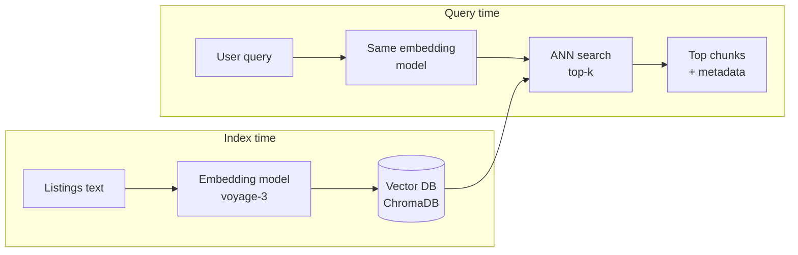

# RAG 1 — Vector Databases & Embeddings

## Lectures covered
- Vector Database

---

## In one sentence
A **vector database** stores chunks of text as lists of numbers (embeddings) so you can find documents that *mean* the same thing as a query, not just share keywords.

## Real-world analogy
Think of a real-estate site. A keyword search for "cozy two-bed near downtown" misses a listing that says "compact 2-bedroom condo close to city centre" — same meaning, no shared words. A vector DB places both phrases in nearly the same spot on a giant invisible map of meaning, so a query lands on its true neighbours regardless of wording.

## The intuition (plain English)
- An **embedding model** turns any sentence into a fixed-length list of numbers (e.g. 1024 floats). Sentences with similar meaning get similar lists.
- A **vector database** is a specialised store for billions of those lists with a fast index that finds the nearest neighbours of a new query in milliseconds.
- "Nearest" is measured by **cosine similarity** — the angle between two vectors. Smaller angle = more alike.
- This is the lookup engine behind every "chat with your docs" product. Once you have it, retrieval-augmented generation (RAG), recommendations, and dedup all become one-liners.
- The bootcamp default is **ChromaDB** (local, file-based) with **Voyage** embeddings and the **Anthropic SDK** for the language model that reads what you retrieve.

## Mini worked example — three real-estate listings

You manage three listings:

```
[L1] "3-bed condo, downtown Lahore, $500k, balcony, parking."
[L2] "5-bed villa, suburbs of Lahore, $1.2M, garden, pool."
[L3] "Studio near university, Karachi, $800/month, furnished."
```

Embed each (toy 4-D vectors for illustration):

```
[L1] -> [0.85, 0.10, 0.20, 0.40]
[L2] -> [0.70, 0.15, 0.55, 0.55]
[L3] -> [0.20, 0.75, 0.10, 0.30]
```

Buyer query: *"affordable city flat in Lahore"* embeds to:

```
q -> [0.83, 0.18, 0.22, 0.42]
```

Cosine similarity to each:

```
sim(q, L1) ≈ 0.99   <- nearest neighbour, return this
sim(q, L2) ≈ 0.94
sim(q, L3) ≈ 0.55
```

The vector DB returns `L1` first. No keyword overlap was needed — only meaning.

## At-a-glance



## Why this matters
- Keyword search fails on synonyms, typos, and paraphrases. Vector search is robust to all three.
- It is the storage layer beneath every modern RAG, semantic search, dedup, and recommendation feature.
- A laptop can hold millions of vectors with ChromaDB — you do not need a cluster to ship a useful product.
- Once you understand it, swapping ChromaDB for Pinecone or pgvector is a 10-line change.

---

## 1. Why we need vector databases

Traditional databases search by **exact match** or **keyword**. For modern AI applications, you need **semantic search** — find documents *similar in meaning* to a query, even if no words overlap.

> Query: "How do I cancel my subscription?"
> Doc: "Steps to terminate your membership..."
>
> Keyword search misses this. Vector search finds it.

This is enabled by **embeddings** + **vector databases**.

---

## 2. Embeddings — text into vectors

An embedding is a fixed-length vector (e.g., 768 or 1536 floats) representing the meaning of a piece of text. Similar texts → similar vectors.

```python
from openai import OpenAI
client = OpenAI()

resp = client.embeddings.create(
    model="text-embedding-3-small",
    input="How do I cancel my subscription?",
)
vector = resp.data[0].embedding         # list of 1536 floats
```

Or open-source / local:
```python
from sentence_transformers import SentenceTransformer
model = SentenceTransformer("all-MiniLM-L6-v2")        # 384-dim, fast
vector = model.encode("How do I cancel my subscription?")
```

### Embedding model picks (late 2025)

| Model | Dim | Speed | Quality | When |
|---|---|---|---|---|
| `text-embedding-3-small` (OpenAI) | 1536 | fast API | strong | API budget OK |
| `text-embedding-3-large` (OpenAI) | 3072 | slower | strongest API | quality-critical |
| `voyage-3` (Voyage) | 1024 | fast | top of leaderboard | best quality available |
| `cohere-embed-v3` | 1024 | fast | strong | multilingual |
| `BAAI/bge-large-en-v1.5` | 1024 | local | strong | self-host |
| `all-MiniLM-L6-v2` | 384 | very fast local | decent | tiny / mobile |
| `BAAI/bge-m3` | 1024 | local | multilingual + multi-vector | RAG over many languages |

For Codebasics' bootcamp: `text-embedding-3-small` (API) or `all-MiniLM-L6-v2` (local) both work.

---

## 3. Cosine similarity — the comparison metric

Two unit vectors → cosine similarity ∈ [-1, 1] (most embedding models produce non-negative similarities since vectors live in a similar region of space).

$$\cos(\theta) = \frac{a \cdot b}{\|a\| \|b\|}$$

Higher = more similar. 1 = identical direction. 0 = unrelated. Negative = opposite (rare for sentence embeddings).

```python
import numpy as np
def cosine(a, b):
    return np.dot(a, b) / (np.linalg.norm(a) * np.linalg.norm(b))
```

Many embedding models output **already-normalized** vectors → cosine simplifies to dot product.

### Other distance metrics (less common)
- **Dot product** — same as cosine when vectors are unit-normalized
- **Euclidean / L2** — sometimes used, especially for non-text embeddings

---

## 4. The vector database

A specialized data store for:
- Storing millions to billions of vectors
- **Approximate Nearest Neighbor** (ANN) search — top-k similar vectors in milliseconds
- Filtering by metadata
- Updates / deletes

Without ANN, you'd compute similarity against every vector in your DB — O(N) — too slow for production.

### How ANN works (high level)
- Build an index (HNSW, IVF, ScaNN, Annoy) — a graph or tree-like structure
- Trades exact match for ~99% accuracy at 100–1000× speedup

You don't implement this — you use a vector DB that does.

---

## 5. Vector DB landscape (2025)

### Managed (cloud)
- **Pinecone** — original, popular, easy. Per-vector pricing.
- **Weaviate Cloud** — feature-rich.
- **Qdrant Cloud** — fast, OSS-aligned.
- **Astra DB Vector** (DataStax) — Cassandra-based.
- **MongoDB Atlas Vector** — if you already use MongoDB.

### Open-source / self-host
- **ChromaDB** — easy to start; Codebasics uses it
- **Qdrant** — Rust, fast, full-featured
- **Weaviate** — module-rich
- **Milvus** — distributed, high-scale
- **FAISS** (Meta) — library, not a DB
- **LanceDB** — embedded, file-based

### "Vector-as-a-feature" in existing DBs
- **Postgres + pgvector** — if you already have Postgres
- **Redis Stack** — Redis with vector support
- **Elasticsearch** — full-text + vector
- **OpenSearch** — same

### Quick decision

| | Pick |
|---|---|
| Prototype / bootcamp project | **ChromaDB** (local, free, simple) |
| Already on Postgres | **pgvector** |
| Need scale + simplicity | **Pinecone** or **Qdrant Cloud** |
| Want hybrid (text + vector) | **Weaviate** or **Elasticsearch** |
| Embedded / no server | **LanceDB** or **Chroma in-memory** |

---

## 6. ChromaDB — bootcamp default

```bash
pip install chromadb
```

```python
import chromadb
client = chromadb.PersistentClient(path="./chroma_db")    # data persisted to disk

# create / get a "collection" (like a table)
col = client.get_or_create_collection(name="docs")

# add documents
col.add(
    documents=["The cat sat on the mat.", "Dogs are loyal companions."],
    metadatas=[{"source": "doc1"}, {"source": "doc2"}],
    ids=["1", "2"],
)

# query
results = col.query(query_texts=["pet animal"], n_results=2)
print(results["documents"])
```

ChromaDB **embeds for you** by default (using a local model). You can pass your own embeddings if you want OpenAI ones.

Full ChromaDB hands-on in `03-chromadb-metadata.md`.

---

## 7. Hybrid search — vector + keyword

Pure vector search misses cases where exact keywords matter (product SKUs, names, codes). Hybrid combines both:

1. Run keyword search (BM25)
2. Run vector search
3. Merge / re-rank scores

```python
# pseudocode
keyword_hits = bm25.search(query)              # top 50
vector_hits  = vector_db.query(query)          # top 50
hybrid = merge_with_weights(keyword_hits, vector_hits, alpha=0.5)
```

Modern frameworks like Weaviate, Elasticsearch, Pinecone (Sparse-Dense) support hybrid natively.

---

## 8. Reranking — the second pass

After top-k retrieval, use a **cross-encoder** to rescore the top-k for accuracy. Cross-encoders are slow (can't do 1M comparisons), but accurate on small candidate sets.

```python
from sentence_transformers import CrossEncoder
reranker = CrossEncoder("cross-encoder/ms-marco-MiniLM-L-6-v2")

scores = reranker.predict([(query, doc) for doc in top_50_docs])
top_5 = sorted(zip(top_50_docs, scores), key=lambda x: -x[1])[:5]
```

Or use **Cohere Rerank** API.

Reranking + retrieval is the production gold standard.

---

## 9. Embedding storage at scale — practical numbers

Per vector at 1536 dims, float32: ~6 KB.
- 1k vectors: 6 MB → file
- 1M vectors: 6 GB → most vector DBs handle on a laptop
- 10M vectors: 60 GB → real-server territory
- 1B vectors: 6 TB → distributed clusters (Milvus, Pinecone enterprise)

For bootcamp projects (real-estate listings, e-commerce products, support docs): you're in the **thousands** range. Anything works.

---

## 10. Common pitfalls

| Mistake | Effect | Fix |
|---|---|---|
| Mixing embedding models | non-comparable vectors | always use the same model for index + query |
| Forgetting to normalize | cosine distance miscomputed | most models normalize; verify |
| No metadata filtering | irrelevant results | always store + filter on metadata |
| Indexing one giant doc as one vector | precision tanks | chunk first |
| Stale index | new docs invisible | scheduled re-index |
| No reranking | sometimes obvious mismatches in top-1 | always rerank top-50 to top-5 |

## Self-check

- [ ] What's an embedding?
- [ ] What's cosine similarity and what does its value tell you?
- [ ] Why use a vector DB over linear scan?
- [ ] What's ANN and what trade-off does it make?
- [ ] When use Pinecone vs ChromaDB vs pgvector?
- [ ] What's hybrid search and why is it often better than pure vector?
- [ ] What's reranking and when add it?
- [ ] How much disk for 100k 1536-dim vectors?

---

## Glossary

| Term | Plain meaning |
|------|---------------|
| Embedding | A fixed-length list of numbers that represents the meaning of a piece of text. |
| Embedding model | The neural network that produces embeddings (e.g. `voyage-3`, `text-embedding-3-small`). |
| Vector | A list of numbers; here, the embedding of a chunk. |
| Dimension | The length of the vector (e.g. 1024 floats). |
| Vector database | A store optimised for nearest-neighbour search over vectors. |
| Collection | A named bucket inside a vector DB; like a table. |
| ChromaDB | The open-source, file-based vector DB used as the bootcamp default. |
| Pinecone | A managed (cloud) vector database. |
| pgvector | A Postgres extension that adds vector search to a normal SQL DB. |
| FAISS | A vector-search library from Meta; runs in-process, not a server. |
| ANN | Approximate Nearest Neighbour — sub-linear similarity search; ~99% accurate. |
| HNSW | A graph-based ANN index used by Chroma and others. |
| IVF / IVF-PQ | Cluster-based ANN indexes used by FAISS and Milvus. |
| Cosine similarity | Score in [-1, 1] based on the angle between two vectors; 1 is identical direction. |
| Dot product | Element-wise multiply then sum; equals cosine when vectors are unit-length. |
| L2 distance | Straight-line (Euclidean) distance between two vectors. |
| Top-k | The number of nearest chunks returned for a query. |
| Chunk | A short passage of text that gets embedded and stored as one row. |
| Chunking | Splitting long documents into chunks before embedding. |
| Metadata | Extra columns stored alongside each chunk (city, price, date, source URL). |
| Metadata filter | A `where` clause that narrows search to chunks matching the filter. |
| BM25 | Classical keyword-based scoring algorithm used in full-text search. |
| Hybrid search | Combining BM25 keyword search with vector search and merging the rankings. |
| Reranker | A slower, more accurate model that rescores a small set of top candidates. |
| Cross-encoder | A model that takes (query, doc) together and outputs one score; used for reranking. |
| Bi-encoder | A model that embeds query and doc separately; fast, used for retrieval. |
| Voyage | The embedding provider Anthropic recommends; produces `voyage-3` and rerankers. |
| Anthropic SDK | The Python client for calling Claude (`anthropic.Anthropic()`). |
| Index | The data structure inside the vector DB that makes nearest-neighbour search fast. |

## Further reading
- Next in this RAG mini-module: [02-rag-fundamentals.md](./02-rag-fundamentals.md)
- Hands-on next: [03-chromadb-metadata.md](./03-chromadb-metadata.md)
- Module overview: [../03-rag-vector-databases.md](../03-rag-vector-databases.md)
- When to fine-tune instead: [../05-fine-tuning-llms.md](../05-fine-tuning-llms.md)
- The bootcamp project that uses this: [../05-projects/01-real-estate-rag.md](../05-projects/01-real-estate-rag.md)
- Conceptual prequel: [Word embeddings](../../08-nlp/05-word-embeddings.md) — sentence embeddings are the contextual generalisation
- ChromaDB — [Docs](https://docs.trychroma.com/)
- Voyage AI — [Embeddings docs](https://docs.voyageai.com/)
- Anthropic — [Contextual retrieval](https://www.anthropic.com/news/contextual-retrieval)
