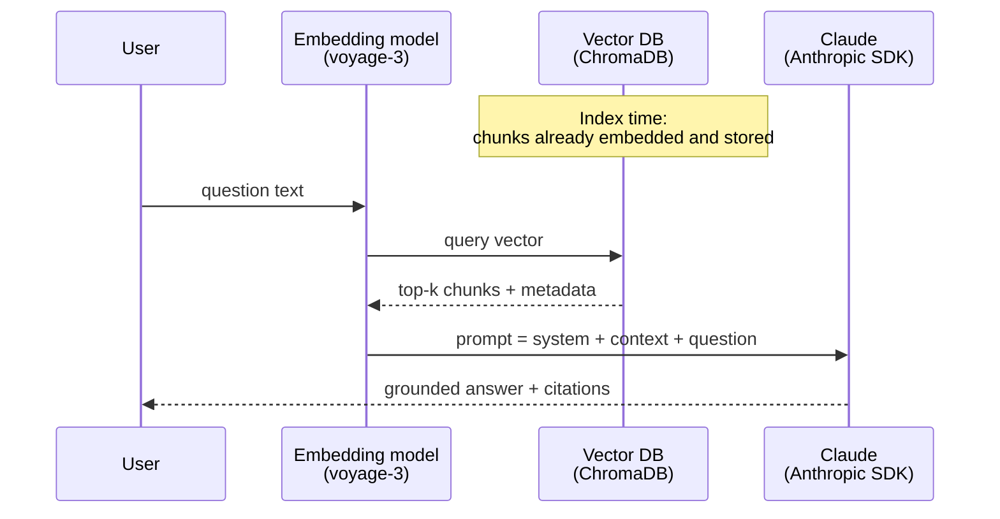

# RAG 2 — RAG Fundamentals

## Lectures covered
- RAG (Retrieval Augmented Generation)

---

## In one sentence
**RAG (Retrieval-Augmented Generation)** means: before the language model answers, fetch a few relevant chunks from your own data and paste them into the prompt — so the answer is grounded in your documents instead of the model's memory.

## Real-world analogy
Closed-book exam vs open-book exam. A plain LLM is taking the test from memory and will guess when it forgets. RAG hands the model the three most relevant pages from the textbook *just before* it answers. Same student, suddenly accurate, citable, and you can update the textbook without retraining the student.

## The intuition (plain English)
- LLMs do not know your private data, your latest product catalogue, or anything that happened after their training cut-off.
- Instead of retraining the model every time a fact changes, you keep your documents in a **vector database** and look them up at query time.
- "Look up" means: embed the user's question, find the top-k closest chunks, and stitch them into the prompt.
- The model is then instructed to answer **only from the supplied context** and to say "I don't know" if the answer is not there.
- This single pattern powers customer-support bots, legal/medical assistants, code-search tools, and the bootcamp's real-estate assistant.

## Mini worked example — end-to-end RAG over real-estate listings

You have three indexed listings:

```
[L1] "3-bed condo in downtown Lahore, $500k, balcony, parking."
[L2] "5-bed villa in suburbs of Lahore, $1.2M, garden, pool."
[L3] "Studio near university, Karachi, $800/month, furnished."
```

User asks: *"Show me an affordable family home in Lahore."*

**Step 1 — retrieve.** Embed the question with `voyage-3`, search the ChromaDB collection, get top 2:

```
top hits: [L1] (sim 0.93), [L2] (sim 0.89)
```

**Step 2 — build the prompt.**

```
You are a helpful real-estate assistant. Use ONLY the context.
If the answer is not there, say "I don't know."

<context>
[1] 3-bed condo in downtown Lahore, $500k, balcony, parking.
[2] 5-bed villa in suburbs of Lahore, $1.2M, garden, pool.
</context>

Question: Show me an affordable family home in Lahore.
```

**Step 3 — generate.** Send to Claude via the Anthropic SDK:

```python
import anthropic
claude = anthropic.Anthropic()
resp = claude.messages.create(
    model="claude-sonnet-4-6",
    max_tokens=400,
    messages=[{"role": "user", "content": prompt}],
)
print(resp.content[0].text)
```

**Step 4 — answer (grounded + cited):**

> *"For an affordable family home in Lahore, listing [1] is a 3-bed condo downtown at $500k with a balcony and parking. Listing [2] is a larger 5-bed villa in the suburbs at $1.2M."*

Notice three things: the model used only the supplied chunks, it cited which one each fact came from, and you can swap in fresh listings tomorrow without touching the model.

## At-a-glance



## Why this matters
- Three of the LLM's biggest weaknesses — private data, fresh data, large data — are all fixed by RAG without any retraining.
- Indexing is a script that runs in minutes; fine-tuning is a GPU bill and a release process.
- Citations make the answer auditable, which is what unlocks legal, medical, and finance use cases.
- It is the dominant pattern in 2025 production AI; mastering RAG is mastering 80% of the job.

---

## 1. The RAG pattern in one diagram

```
┌──────────────────────────────────────────────────────────┐
│ INDEX-TIME (one-time / periodic)                          │
│                                                           │
│  raw docs ──► chunk ──► embed ──► store in vector DB      │
│                                                           │
└──────────────────────────────────────────────────────────┘

┌──────────────────────────────────────────────────────────┐
│ QUERY-TIME (every user query)                              │
│                                                           │
│  user query ──► embed ──► retrieve top-k from vector DB    │
│                                              │             │
│                                              ▼             │
│  prompt: [system + retrieved chunks + user query] ──► LLM  │
│                                              │             │
│                                              ▼             │
│                                         answer            │
└──────────────────────────────────────────────────────────┘
```

That's the entire pattern. 95% of "AI app" projects in 2025 are RAG.

---

## 2. Why RAG (vs alternatives)

| Approach | When |
|---|---|
| **Just prompt the LLM** | model already knows the answer (general knowledge) |
| **RAG** | answers depend on private / fresh / specific data |
| **Fine-tune** | you want the model to *behave differently*, not just have new info |
| **Long context (stuff everything)** | small corpus + cheap model + low concurrency |

RAG wins when:
- Knowledge is private (your docs, your DB)
- Knowledge changes frequently (product catalog, prices, policies)
- You want to **cite sources** (regulatory / trust)
- You want to update one fact without retraining

---

## 3. The 5 stages of a RAG pipeline

### Stage 1 — Load & parse documents
- PDFs (`pypdf`, `pdfplumber`, `unstructured`)
- HTML (`BeautifulSoup`)
- Office docs (`python-docx`, `openpyxl`)
- Markdown / code (read directly)
- Notion / Confluence / Slack via APIs

### Stage 2 — Chunk
Break each document into smaller pieces (chunks).

#### Why chunk
- LLMs have context limits
- Smaller chunks → tighter semantic match → better retrieval
- Smaller chunks fit more in the LLM context

#### Chunking strategies

##### Fixed-size by characters / tokens
```python
def chunk_by_chars(text, size=1000, overlap=200):
    chunks = []
    for i in range(0, len(text), size - overlap):
        chunks.append(text[i:i + size])
    return chunks
```

##### Sentence / paragraph splits
Split on `.\n` or `\n\n`. Better for natural reading boundaries.

##### Recursive (LangChain's default)
Try splitting on `\n\n`. Too long? Try `\n`. Still too long? Sentences. Etc.
```python
from langchain.text_splitter import RecursiveCharacterTextSplitter
splitter = RecursiveCharacterTextSplitter(chunk_size=1000, chunk_overlap=200)
```

##### Semantic chunking (advanced)
Embed every sentence; group consecutive sentences while embeddings stay close; cut when they diverge.

### Sweet-spot chunk size
- **Generic text**: 500–1000 tokens with 100–200 token overlap
- **Code**: split per function / class
- **Tables**: keep each table as one chunk
- **Q&A docs**: each Q&A pair = one chunk

> **Always include some overlap** so context isn't cut mid-thought.

### Stage 3 — Embed
Pass each chunk through your embedding model. Store vectors + chunk text + metadata.

```python
embeddings = model.encode(chunks)
```

### Stage 4 — Retrieve
At query time:
1. Embed the user query
2. Search the vector DB for top-k similar chunks
3. (Optional) Rerank with cross-encoder

```python
results = vector_db.query(query_embedding, top_k=5)
```

Top-k typically 3–10. More = more context but more noise.

### Stage 5 — Generate
Build the prompt:

```
You are an assistant that answers questions based on the provided context.
If the answer isn't in the context, say "I don't know."

Context:
{retrieved_chunk_1}
---
{retrieved_chunk_2}
---
{retrieved_chunk_3}

Question: {user_query}

Answer (cite which chunk in [brackets]):
```

Send to LLM. Get answer.

---

## 4. End-to-end RAG (with ChromaDB + OpenAI)

```python
import chromadb
from openai import OpenAI

client = OpenAI()
chroma = chromadb.PersistentClient(path="./db")
col = chroma.get_or_create_collection(name="docs")

# --- Index time ---
documents = [...]  # list of strings, your docs
ids       = [f"doc_{i}" for i in range(len(documents))]

# (chroma will embed using its default unless you provide `embeddings=`)
col.add(documents=documents, ids=ids)

# --- Query time ---
def rag_answer(user_query):
    res = col.query(query_texts=[user_query], n_results=4)
    chunks = res["documents"][0]
    context = "\n\n---\n\n".join(chunks)

    resp = client.chat.completions.create(
        model="gpt-4o-mini",
        temperature=0,
        messages=[
            {"role": "system", "content":
                "Answer based on the provided context only. If unsure, say 'I don't know.'"},
            {"role": "user", "content":
                f"Context:\n{context}\n\nQuestion: {user_query}"},
        ],
    )
    return resp.choices[0].message.content

print(rag_answer("How do I cancel my subscription?"))
```

That's a complete RAG system in 30 lines.

---

## 5. Iterating on RAG quality

### When the answer is wrong, the bug is usually in retrieval, not generation
The first thing to debug: **are the right chunks being retrieved?**

```python
res = col.query(query_texts=[user_query], n_results=10)
for i, (doc, dist) in enumerate(zip(res["documents"][0], res["distances"][0])):
    print(f"\n--- result {i} (distance {dist:.3f}) ---")
    print(doc[:400])
```

### Improvement levers
1. **Better embeddings** — try `text-embedding-3-large`, voyage-3, BGE
2. **Better chunking** — smaller / semantic chunks
3. **Hybrid search** — add BM25
4. **Reranking** — cross-encoder on top-50 → top-5
5. **Query rewriting** — ask LLM to rephrase the user question for retrieval
6. **HyDE** (Hypothetical Document Embeddings) — generate a fake answer; embed *that*; retrieve with that vector
7. **Multi-query** — generate 3 paraphrases of the query, retrieve for each, merge results
8. **Metadata filtering** — only search certain document types / dates / authors

---

## 6. Evaluation — knowing if your RAG works

You need a **golden dataset**: ~50 (question, expected_answer, expected_source) triples. Then automated evals.

### Metrics (RAGAS framework)

| Metric | Question |
|---|---|
| **Context recall** | Did retrieval get the relevant docs? |
| **Context precision** | Are most retrieved docs relevant? |
| **Answer faithfulness** | Does the answer rely only on the retrieved context? |
| **Answer relevance** | Does the answer actually address the question? |

```bash
pip install ragas
```

Use an LLM-as-judge for these (e.g., GPT-4o evaluates the outputs).

### Manual evaluation
For first prototypes: run 30 queries by hand, score answer quality 1-5.

> "An eval suite is what separates a toy demo from a shippable product."

---

## 7. Common RAG failure modes

| Symptom | Likely cause |
|---|---|
| Answer cites the wrong section | retrieval is finding similar-sounding wrong chunks |
| Answer is generic / not document-grounded | LLM is falling back to its training; prompt should constrain |
| Misses obvious answers | chunks are too big or wrong granularity |
| Cites no sources | system prompt didn't ask for it |
| Hallucinates beyond the context | temperature too high; system prompt too soft |
| Wrong language | embedding model not multilingual |
| Updates not reflected | cache issue or index not refreshed |

---

## 8. Production patterns

### Index pipeline
- Cron job re-indexes every N hours
- Or event-driven: when a doc changes, re-embed + upsert
- Maintain document version → don't double-index

### Query pipeline
- Cache user query → answer (semantic cache)
- Stream tokens for UX
- Log: query, retrieved chunks, latency, cost, downstream feedback

### Observability
- LangSmith / Langfuse / Helicone — trace each query through retrieve + generate
- Sample 5% of traces for human review
- Per-feature cost tracking

---

## 9. Common pitfalls

| Mistake | Effect | Fix |
|---|---|---|
| Ingesting whole docs as chunks | retrieval matches wrong sections | chunk into 500-1000 tokens |
| Different embedding model at index vs query | total miss | always pair them |
| RAG with high temperature | hallucinations bleed in | use temperature 0 |
| No system prompt grounding | answers ignore context | "Answer ONLY from the context" |
| No cite-the-source instruction | uninspectable answers | force inline citations |
| Top-k too small | misses relevant info | start k=4-6, tune |
| No eval | can't tell when changes help | golden set + RAGAS |

## Self-check

- [ ] Walk through the 5 stages of a RAG pipeline.
- [ ] Why chunk? What's a good chunk size?
- [ ] What's the difference between retrieval and generation in RAG?
- [ ] If RAG gives wrong answers, where do you debug first?
- [ ] What's HyDE and when use it?
- [ ] State 4 RAGAS metrics.
- [ ] Build a minimal RAG with ChromaDB + OpenAI in 30 lines.
- [ ] When use RAG vs fine-tuning vs long-context stuffing?

---

## Glossary

| Term | Plain meaning |
|------|---------------|
| RAG | Retrieval-Augmented Generation: retrieve relevant chunks, then generate an answer from them. |
| Retrieval | The lookup step that fetches the top-k most relevant chunks for a query. |
| Generation | The LLM step that turns retrieved chunks plus the question into an answer. |
| Chunk | A short passage of text — the unit you embed, store, and retrieve. |
| Chunking | Splitting source documents into chunks. |
| Overlap | Repeating a few tokens at chunk boundaries so a fact never gets cut in half. |
| Embedding | A list of numbers representing the meaning of a chunk or query. |
| Embedding model | The encoder that produces embeddings (e.g. `voyage-3`). |
| Vector database | A specialised store for embeddings; bootcamp default is ChromaDB. |
| ChromaDB | The local, file-based vector DB used throughout this module. |
| Voyage | The embedding provider Anthropic recommends. |
| Anthropic SDK | The `anthropic` Python client used to call Claude. |
| Top-k | Number of chunks returned per query (typical 3-10). |
| Cosine similarity | Angle-based score that ranks how close two embeddings are. |
| Context window | The max number of tokens Claude can read in one prompt. |
| System prompt | Instruction text given to the model before the user message. |
| Grounding | Constraining the model to answer from the supplied context only. |
| Citation | Returning which retrieved chunk each claim came from. |
| Hallucination | The model inventing facts that are not in the context (or anywhere). |
| Faithfulness | A RAGAS metric: does the answer match the retrieved context? |
| Context recall | A RAGAS metric: did retrieval pull in the chunks that contain the answer? |
| Context precision | A RAGAS metric: are the retrieved chunks mostly relevant, not noise? |
| RAGAS | An evaluation framework for RAG pipelines. |
| Query rewriting | Asking the LLM to rephrase the user's question so retrieval works better. |
| HyDE | Hypothetical Document Embeddings: generate a fake answer, embed it, retrieve with it. |
| Multi-query | Generating several paraphrases of the question and merging their results. |
| BM25 | Keyword-based retrieval algorithm; complements vector search. |
| Hybrid search | Running both BM25 and vector search and merging rankings. |
| Reranker | A slow but accurate model that rescores the top candidates. |
| Golden set | A small, curated test set of (question, expected answer) pairs used for evaluation. |

## Further reading
- Previous: [01-vector-databases.md](./01-vector-databases.md)
- Next (hands-on): [03-chromadb-metadata.md](./03-chromadb-metadata.md)
- Then (alternatives): [04-fine-tuning.md](./04-fine-tuning.md)
- Module overview: [../03-rag-vector-databases.md](../03-rag-vector-databases.md)
- When fine-tuning makes sense instead: [../05-fine-tuning-llms.md](../05-fine-tuning-llms.md)
- Build the bootcamp project: [../05-projects/01-real-estate-rag.md](../05-projects/01-real-estate-rag.md)
- Conceptual prequel: [Word embeddings](../../08-nlp/05-word-embeddings.md)
- ChromaDB — [Docs](https://docs.trychroma.com/)
- Voyage AI — [Embeddings docs](https://docs.voyageai.com/)
- Anthropic — [Contextual retrieval](https://www.anthropic.com/news/contextual-retrieval)
- RAGAS — [Evaluation docs](https://docs.ragas.io/)
