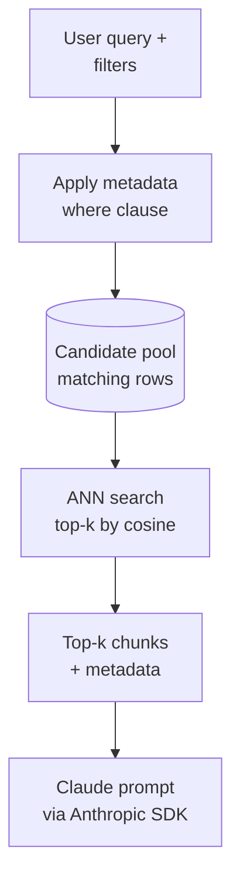

# RAG 3 — ChromaDB & Metadata Filtering

## Lectures covered
- Chromadb
- Metadata Filtering

---

## In one sentence
**ChromaDB** is a small, local vector database that stores chunks plus side-info (`city`, `price`, `date`), and **metadata filtering** lets you say *"only search inside the rows that match these conditions"* before semantic search runs.

## Real-world analogy
A real-estate site search. Pure semantic search is like asking the agent "find me something cosy" — they will return any cosy listing on the planet. Metadata filtering is the side panel: *city = Lahore*, *price ≤ ₨600k*, *bedrooms ≥ 3*. The agent now searches only inside that bucket. Metadata is the side panel; embeddings are the meaning.

## The intuition (plain English)
- Every chunk you store in ChromaDB can carry a small dictionary of attributes — that is the **metadata**.
- At query time, you supply a `where` clause that narrows the candidate set first; semantic search runs only on what is left.
- This combination — **filter then rank by meaning** — beats pure vector search in almost every real product.
- ChromaDB exposes Mongo-style operators (`$lt`, `$gte`, `$in`, `$and`, `$or`) so the filter can be as rich as a SQL `WHERE`.
- It is the single highest-leverage upgrade you can apply to a RAG prototype.

## Mini worked example — metadata filter on listings

You stored three real-estate listings with metadata:

```python
col.add(
    documents=[
        "3-bed condo, downtown Lahore, balcony, parking.",
        "5-bed villa, suburbs of Lahore, garden, pool.",
        "Studio near university, Karachi, furnished.",
    ],
    metadatas=[
        {"city": "Lahore",  "type": "condo",  "bedrooms": 3, "price": 500000},
        {"city": "Lahore",  "type": "villa",  "bedrooms": 5, "price": 1200000},
        {"city": "Karachi", "type": "studio", "bedrooms": 0, "price": 800},
    ],
    ids=["L1", "L2", "L3"],
)
```

Naive semantic search for *"affordable family home"* might rank `L2` high because the embedding finds "5-bed villa, garden" semantically familial, even though the price is way over budget.

Add a metadata filter:

```python
col.query(
    query_texts=["affordable family home"],
    n_results=2,
    where={"$and": [
        {"city": "Lahore"},
        {"bedrooms": {"$gte": 3}},
        {"price": {"$lte": 600000}},
    ]},
)
```

Now ChromaDB first restricts to rows where `city == "Lahore" AND bedrooms >= 3 AND price <= 600000` — only `L1` survives. Semantic ranking happens inside that one-row pool. Result: a single, on-budget recommendation.

That is the production pattern: filter cuts the haystack; embeddings find the needle inside it.

## At-a-glance



## Why this matters
- Without filtering, a model recommending a $1.2M villa to a $600k buyer is a normal RAG failure mode.
- Metadata is free. You almost always have it (city, date, author, source URL); store it the day you ingest.
- Filtering scales sub-linearly — the smaller the candidate pool, the faster the ANN search.
- It is the cheapest way to add domain rules (regulatory, tenant isolation, freshness) without changing your model.

---

## 1. Why ChromaDB for the bootcamp

- Pure-Python install
- File-based persistence (no server to run)
- Embeds documents for you (or accepts custom embeddings)
- Metadata filtering built in
- Same API works for prototype and (small) production

```bash
pip install chromadb
```

---

## 2. Two client modes

### In-memory (lost on process exit)
```python
import chromadb
client = chromadb.Client()
```
For unit tests / quick experiments.

### Persistent (saved to disk)
```python
client = chromadb.PersistentClient(path="./chroma_db")
```
For most use. Stores SQLite + parquet under the path.

### Server mode (network access)
```python
client = chromadb.HttpClient(host="localhost", port=8000)
```
For multi-process / multi-machine.

---

## 3. Collections — like tables

```python
col = client.get_or_create_collection(
    name="real_estate",
    metadata={"hnsw:space": "cosine"},      # distance metric
)
```

Distance options: `cosine` (default for text), `l2` (Euclidean), `ip` (inner product).

### List / delete collections
```python
client.list_collections()
client.delete_collection(name="real_estate")
```

---

## 4. Adding documents (embedding done for you)

```python
col.add(
    documents=[
        "3-bedroom condo in downtown, $500k.",
        "5-bedroom villa in suburbs, $1.2M.",
        "Studio apartment near university, $800/mo.",
    ],
    metadatas=[
        {"type": "condo", "city": "Lahore", "price": 500000},
        {"type": "villa", "city": "Lahore", "price": 1200000},
        {"type": "studio", "city": "Karachi", "price": 800},
    ],
    ids=["1", "2", "3"],
)
```

ChromaDB ships with a default embedder (`all-MiniLM-L6-v2`) that runs locally. No API key needed for prototypes.

### Custom embedder — OpenAI
```python
from chromadb.utils.embedding_functions import OpenAIEmbeddingFunction

emb = OpenAIEmbeddingFunction(api_key="sk-...", model_name="text-embedding-3-small")
col = client.get_or_create_collection(name="real_estate", embedding_function=emb)
```

Or pass your own pre-computed embeddings via `embeddings=...`.

---

## 5. Querying

```python
res = col.query(
    query_texts=["affordable apartment for student"],
    n_results=3,
)
print(res["documents"][0])      # list of top-3 chunks (for the 1 query)
print(res["distances"][0])      # corresponding distances
print(res["metadatas"][0])
```

### Multiple queries at once (batched)
```python
res = col.query(query_texts=["query A", "query B"], n_results=3)
# res["documents"] is a 2-element list
```

---

## 6. Metadata filtering — the big productivity win

Plain RAG retrieves the most semantically similar chunks. **Metadata filtering** lets you constrain the search:

```python
res = col.query(
    query_texts=["affordable apartment"],
    n_results=3,
    where={"city": "Lahore"},
)
```

### Operators
```python
where={"price": {"$lt": 500000}}              # less than
where={"price": {"$lte": 500000}}              # ≤
where={"price": {"$gt": 100000}}               # >
where={"price": {"$gte": 100000}}              # ≥
where={"city": {"$ne": "Karachi"}}             # not equal
where={"city": {"$in": ["Lahore", "Islamabad"]}}
where={"city": {"$nin": ["Karachi"]}}
where={"$and": [
    {"city": "Lahore"},
    {"price": {"$lt": 600000}},
]}
where={"$or": [
    {"type": "studio"},
    {"price": {"$lt": 100000}},
]}
```

### Where-document filtering (text contains)
```python
where_document={"$contains": "downtown"}
```

### Real-world example
A user query: "affordable 3-bedroom in Lahore for ≤ ₹600k."

Pure semantic search may return a 10-bedroom mansion that *mentions* "affordable in description." Add metadata constraint → only chunks where `city=Lahore`, `price ≤ 600000`, `bedrooms ≥ 3`.

This is **how production RAG systems actually work**. Naked semantic search is a toy.

---

## 7. Updating + deleting

```python
col.update(
    ids=["1"],
    documents=["3-bedroom condo, REDUCED PRICE $450k."],
    metadatas=[{"price": 450000}],
)
col.upsert(
    ids=["4"],
    documents=["new listing"],
    metadatas=[{"city": "Lahore"}],
)
col.delete(ids=["2"])
col.delete(where={"price": {"$lt": 1000}})
```

---

## 8. Practical pattern — RAG with metadata for the real-estate project

```python
import chromadb
from openai import OpenAI

oai = OpenAI()
chroma = chromadb.PersistentClient(path="./re_db")
col = chroma.get_or_create_collection(name="listings")

# Index real estate listings (one chunk per listing or per paragraph)
col.add(
    documents=[listing_descriptions],
    metadatas=[{
        "city": l.city, "type": l.type, "bedrooms": l.bedrooms,
        "bathrooms": l.bathrooms, "price": l.price, "url": l.url,
    } for l in listings],
    ids=[l.id for l in listings],
)

def query_listings(user_query, filters=None):
    res = col.query(
        query_texts=[user_query],
        n_results=5,
        where=filters or {},
    )
    chunks = res["documents"][0]
    metas  = res["metadatas"][0]

    context = "\n\n".join(f"[{m['url']}] {c}" for c, m in zip(chunks, metas))
    resp = oai.chat.completions.create(
        model="gpt-4o-mini",
        temperature=0,
        messages=[
            {"role": "system", "content":
                "Recommend properties from the context, citing URLs."},
            {"role": "user", "content":
                f"Context:\n{context}\n\nUser request: {user_query}"},
        ],
    )
    return resp.choices[0].message.content

# Usage
print(query_listings(
    "Family-friendly home with garden",
    filters={"$and": [{"city": "Lahore"}, {"bedrooms": {"$gte": 3}}, {"price": {"$lte": 800000}}]},
))
```

This is the skeleton for the real-estate assistant project (Module 9 project 1).

---

## 9. Performance and scale

ChromaDB on a laptop:
- 100k vectors: easy
- 1M vectors: slow but works
- 10M+: switch to a real vector DB

For bootcamp projects (a few thousand listings / chunks), you'll never feel a limit.

---

## 10. Common pitfalls

| Mistake | Effect | Fix |
|---|---|---|
| Mixing default embedder + custom embedder in same collection | shape mismatch | choose one and stick |
| Metadata filtering on un-indexed numeric | slow | metadata is indexed by Chroma; ensure types are correct |
| Storing long lists in metadata | metadata limits | embed list as separate docs or use proper type |
| Embedding only at index, not at query | wrong results | Chroma re-embeds query for you |
| Forgetting `PersistentClient` | data lost on restart | always use persistent in prototypes |

## Self-check

- [ ] Difference between in-memory and persistent ChromaDB?
- [ ] What does ChromaDB do with documents you `add`?
- [ ] How do I query with a metadata filter "price < 500000 AND city = Lahore"?
- [ ] Use a custom OpenAI embedder.
- [ ] Walk through indexing 1000 real-estate listings + querying with filters.
- [ ] When outgrow Chroma — what next?
- [ ] How do I update a listing's price after it changes?
- [ ] Delete all vectors with `city=Karachi`.

---

## Glossary

| Term | Plain meaning |
|------|---------------|
| ChromaDB | The local, file-based vector database used as the bootcamp default. |
| Client | The Python object that talks to a ChromaDB instance (`Client`, `PersistentClient`, `HttpClient`). |
| In-memory client | A ChromaDB session that lives only in RAM and disappears on exit. |
| PersistentClient | A ChromaDB session that saves data to disk under a path. |
| HttpClient | Connects to a ChromaDB server over the network. |
| Collection | A named bucket inside ChromaDB; the rough equivalent of a SQL table. |
| Document | The text of one chunk stored in a collection. |
| ID | The unique key for a row (`"L1"`, `"L2"`...). |
| Metadata | A small dictionary of attributes attached to a chunk (city, price, date). |
| Metadata filter | A `where` clause that narrows search to chunks matching given conditions. |
| Where-document filter | A `where_document` clause that filters by substrings inside the text. |
| `$eq` / `$ne` | Equality / inequality operators in metadata filters. |
| `$gt` / `$gte` / `$lt` / `$lte` | Numeric comparison operators in metadata filters. |
| `$in` / `$nin` | "Is in this list" / "is not in this list" operators. |
| `$and` / `$or` | Logical combiners that join multiple filter conditions. |
| `$contains` | Substring match used inside `where_document`. |
| Embedding function | The callable ChromaDB uses to turn text into vectors at add/query time. |
| `OpenAIEmbeddingFunction` | Built-in adapter that calls OpenAI for embeddings. |
| `voyage-3` | The embedding model recommended for use with Anthropic's Claude. |
| `all-MiniLM-L6-v2` | The 384-d default local embedder ChromaDB ships with. |
| `hnsw:space` | Collection setting that picks the distance metric (`cosine`, `l2`, `ip`). |
| HNSW | The graph-based ANN index ChromaDB uses internally. |
| `add` | Insert documents (and embed them, if no embeddings supplied). |
| `query` | Retrieve top-k chunks for one or more query texts. |
| `update` | Change an existing row by ID. |
| `upsert` | Insert if missing, update if present. |
| `delete` | Remove rows by IDs or by a `where` filter. |
| Anthropic SDK | The `anthropic` Python client used to call Claude on the retrieved chunks. |

## Further reading
- Previous: [02-rag-fundamentals.md](./02-rag-fundamentals.md)
- Next: [04-fine-tuning.md](./04-fine-tuning.md)
- Module overview: [../03-rag-vector-databases.md](../03-rag-vector-databases.md)
- When to fine-tune instead: [../05-fine-tuning-llms.md](../05-fine-tuning-llms.md)
- Apply this in the bootcamp project: [../05-projects/01-real-estate-rag.md](../05-projects/01-real-estate-rag.md)
- Conceptual prequel: [Word embeddings](../../08-nlp/05-word-embeddings.md)
- ChromaDB — [Documentation](https://docs.trychroma.com/)
- ChromaDB — [Where filters reference](https://docs.trychroma.com/docs/querying-collections/metadata-filtering)
- Voyage AI — [Embeddings docs](https://docs.voyageai.com/)
- Anthropic — [Python SDK](https://github.com/anthropics/anthropic-sdk-python)
