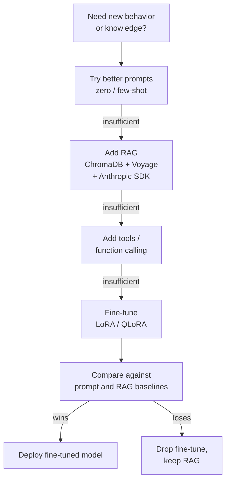

# RAG 4 — Fine-Tuning an LLM (and when not to)

## Lectures covered
- Fine Tuning an LLM

---

## In one sentence
**Fine-tuning** updates a model's own weights on your examples so it permanently learns a new style or skill — used only when prompting and RAG cannot get the job done.

## Real-world analogy
You hire a new analyst. **Prompting** is writing them a detailed brief for one task. **RAG** is giving them a binder of company documents to consult. **Fine-tuning** is sending them through a six-week training programme so the company tone, format, and judgment become muscle memory. The training is expensive, slow, and you have to redo it whenever the policy changes — so most managers reach for the brief or the binder first.

## The intuition (plain English)
- Prompting and RAG **change what the model sees** at runtime; fine-tuning **changes the model itself**.
- Use fine-tuning when you want a *consistent style or format*, or when you want a smaller, cheaper model to imitate a bigger one (distillation).
- Do not use fine-tuning to add facts that change frequently — RAG is faster, cheaper, and easier to update.
- **LoRA** is the standard cheap variant: freeze the original weights, train tiny "adapter" matrices (~1% of params), get ~95% of full fine-tune quality.
- For the bootcamp's projects (real-estate assistant, chatbots, agents), the right tool is almost always RAG with Claude via the Anthropic SDK plus ChromaDB and Voyage embeddings — fine-tuning is a last resort.

## Mini worked example — prompt vs RAG vs fine-tune on the real-estate assistant

Same question for all three: *"Recommend a family home in Lahore under ₨600k."*

**Approach A — prompt only (no fine-tune, no RAG).**

```python
import anthropic
claude = anthropic.Anthropic()
resp = claude.messages.create(
    model="claude-sonnet-4-6",
    max_tokens=300,
    messages=[{"role": "user",
               "content": "Recommend a family home in Lahore under 600k."}],
)
```

Result: a generic, possibly invented listing. The model has no idea what is in your inventory.

**Approach B — RAG (the bootcamp default).**

```python
import chromadb, anthropic
chroma = chromadb.PersistentClient(path="./re_db")
col = chroma.get_or_create_collection("listings")     # voyage-3 embeddings inside

hits = col.query(
    query_texts=["family home Lahore"],
    n_results=3,
    where={"$and": [{"city": "Lahore"}, {"price": {"$lte": 600000}}]},
)
context = "\n".join(hits["documents"][0])

claude = anthropic.Anthropic()
claude.messages.create(
    model="claude-sonnet-4-6",
    max_tokens=300,
    system="Answer only from the context. Cite listing IDs.",
    messages=[{"role": "user",
               "content": f"<context>\n{context}\n</context>\nRecommend a family home in Lahore under 600k."}],
)
```

Result: a real listing from your DB, cited, refreshable any time you re-index. New listings appear in seconds.

**Approach C — fine-tune (only if you also want a specific *style*).**

You have 2,000 past advisor responses in this house style:

```jsonl
{"messages": [
  {"role": "user", "content": "Recommend a family home in Lahore under 600k."},
  {"role": "assistant", "content": "Greetings. Listing L1 is well-suited: a 3-bed condo in downtown Lahore at PKR 500,000. Per your budget, I recommend a viewing this week."}
]}
```

You fine-tune a small open-source model (`unsloth` + LoRA on Llama 3 8B) on those 2,000 examples. The model now writes in that tone *every time*. You still pair it with RAG to get fresh listing facts; fine-tuning gave you the voice, RAG gave you the data.

The decision is rarely "fine-tune *or* RAG" — it is "RAG first, fine-tune only if a consistent style or format is also required."

## At-a-glance



## Why this matters
- Most teams burn weeks fine-tuning when a one-day RAG prototype would have shipped.
- Knowing the order — prompt → RAG → tools → fine-tune — is half the battle in interviews and on the job.
- LoRA / QLoRA make fine-tuning affordable on a free Colab GPU; the technique is no longer a research-only tool.
- Combining a small fine-tuned model with RAG is how you get cheap, fast, on-brand assistants in production.

---

## 1. The decision framework

Most learners reach for fine-tuning when they should reach for prompting or RAG. Here's the right order:

```
Need new behavior or knowledge?
   │
   ▼
Try better prompts (zero/one/few-shot)
   │   not enough?
   ▼
Add RAG (retrieve relevant info)
   │   still not enough?
   ▼
Add tools / function calling
   │   still not enough?
   ▼
Fine-tune (small model, specific task)
```

### Fine-tune when
- You need a **specific style or format** consistently (your tone, your output schema)
- You want a **smaller model** (cheap + fast) to match a bigger model on a narrow task
- Your task is **highly domain-specific** with patterns the base model doesn't know
- You have **training data** (1k–100k examples)

### Don't fine-tune when
- You just need new facts → use RAG
- The data changes often → keep RAG
- You have <500 examples → few-shot is probably better
- You haven't tried prompt engineering yet → start there

---

## 2. Types of fine-tuning

### Full fine-tune
Update all parameters. Expensive, requires lots of GPU memory.

### LoRA (Low-Rank Adaptation)
Freeze the base model. Train tiny "adapter" matrices. ~1% of params, 95% of quality.

### QLoRA
LoRA on a 4-bit quantized base model. Lets you fine-tune 70B models on a single 24GB GPU.

### Instruction tuning
Take a base model + a dataset of (instruction, response) pairs → produce an instruction-following model.

### RLHF / DPO
Train from human preference data. Last alignment step. Not bootcamp territory.

For your projects: **LoRA on a smaller open-source model** (Llama 3 8B, Mistral 7B, Qwen 2.5 7B) is the sweet spot.

---

## 3. Fine-tuning small classifiers (BERT-class) — recap

For text classification, fine-tuning DistilBERT (already covered in `core/08-nlp/07-bert-finetuning-huggingface.md`) is super practical:
- ~5,000 examples → 92% sentiment accuracy
- 10 minutes on a free Colab GPU
- Tiny model → cheap to deploy

This **is** fine-tuning. Don't dismiss it as "old school."

---

## 4. Fine-tuning generative LLMs — when and how

### When (for the bootcamp's projects)
Mostly skip. Codebasics' Gen AI projects (real-estate, chatbot, agentic) are RAG + tools, not fine-tune.

### Where it's worth it
- Match a stronger model's outputs on a narrow domain (distillation)
- Force a precise output format
- Embed company tone / persona
- Custom code-completion model on your codebase

### Tooling — `unsloth` (modern fast fine-tune)
```bash
pip install unsloth
```
```python
from unsloth import FastLanguageModel

model, tokenizer = FastLanguageModel.from_pretrained(
    model_name="unsloth/llama-3-8b-bnb-4bit",
    max_seq_length=2048,
    load_in_4bit=True,
)

model = FastLanguageModel.get_peft_model(
    model,
    r=16, lora_alpha=16, lora_dropout=0.0,
    target_modules=["q_proj", "k_proj", "v_proj", "o_proj"],
)
```

Fine-tune in ~30 min on a free Colab GPU.

### Tooling — HuggingFace `trl` SFTTrainer
```python
from trl import SFTTrainer

trainer = SFTTrainer(
    model=model,
    tokenizer=tokenizer,
    train_dataset=dataset,
    dataset_text_field="text",
    max_seq_length=2048,
    args=TrainingArguments(
        output_dir="out",
        per_device_train_batch_size=2,
        gradient_accumulation_steps=4,
        warmup_steps=10,
        max_steps=200,
        learning_rate=2e-4,
        bf16=True,
    ),
)
trainer.train()
```

### Format
Most fine-tuning datasets follow the chat-template format:
```jsonl
{"messages": [
  {"role": "system", "content": "..."},
  {"role": "user", "content": "..."},
  {"role": "assistant", "content": "..."}
]}
```

Hundreds-to-thousands of these. Train. Done.

---

## 5. Fine-tuning closed APIs (OpenAI, Anthropic-via-Bedrock, Gemini)

If you can't host a model, providers let you fine-tune theirs:

### OpenAI
```python
client.files.create(file=open("data.jsonl", "rb"), purpose="fine-tune")
client.fine_tuning.jobs.create(training_file="...", model="gpt-4o-mini-2024-07-18")
```

### Anthropic
Available on AWS Bedrock for Claude in some regions.

### Cost trade-off
Fine-tuned API models cost **3-5× more per token** than base. So fine-tune only if it lets you use a much smaller / cheaper model.

---

## 6. Evaluating fine-tunes

Same evaluation suite you'd use for RAG:
- Held-out test set with golden outputs
- LLM-as-judge for open-ended quality
- Specific metrics for your task (accuracy, BLEU, F1)
- Human spot-checks

**Always compare to**:
1. Base model with no fine-tune
2. Base model with prompt engineering
3. Base model with RAG

If your fine-tune doesn't beat all three, don't ship it.

---

## 7. Fine-tune vs RAG vs prompt — the comparison table

| | Prompt | RAG | Fine-tune |
|---|---|---|---|
| Adds new knowledge | weakly (in context) | yes (retrieval) | yes (in weights) |
| Reflects fresh data | yes | yes | no — need retraining |
| Changes behavior / style | partly | minimally | yes |
| Cost (one-time) | $0 | low (vector DB) | $$ training |
| Cost (per-query) | $$ context tokens | $ small + LLM | $$ per-token + base infra |
| Maintenance | low | low | high (retrain pipeline) |
| Best for | quick prototypes | private / fresh knowledge | style, format, narrow domain |

**RAG covers 80% of "new knowledge" needs. Fine-tuning covers 80% of "consistent behavior" needs.**

For Codebasics' Gen AI projects: prefer RAG + good prompts. Fine-tuning is a brief nod in the curriculum.

---

## 8. Combined patterns

### RAG + fine-tune
- Fine-tune for tone / format
- RAG for facts
Common in customer-support bots.

### Distillation
1. Run a big model on lots of inputs
2. Save (input, output) pairs
3. Fine-tune a small model on those
- Result: small model that mimics the big one, far cheaper to serve

### Self-improvement
1. Fine-tuned model V0
2. Run V0 in production, collect user feedback
3. Curate good outputs as new training data
4. Fine-tune V1
5. Repeat

---

## 9. Common pitfalls

| Mistake | Effect | Fix |
|---|---|---|
| Fine-tuning before trying RAG / prompts | wasted effort | always go in order |
| <500 examples | overfitting / no improvement | use few-shot prompting instead |
| No held-out test set | overfit to train | always split |
| Wrong format (not chat-template) | model fits noise | use the model's official template |
| Fine-tune on noisy / wrong-format data | catastrophic | clean before training |
| Forgetting to save adapter only (LoRA) | huge files | save adapter, load with `peft` |

## Self-check

- [ ] When fine-tune vs RAG vs prompt?
- [ ] Difference between full fine-tune and LoRA?
- [ ] What's QLoRA?
- [ ] How many examples do I need for fine-tuning to beat few-shot?
- [ ] Walk through fine-tuning Llama 3 8B with `unsloth`.
- [ ] What's distillation and when use it?
- [ ] Why does fine-tuning a closed API model cost more per token than the base?
- [ ] If RAG + good prompts work, why bother fine-tuning?

---

## Glossary

| Term | Plain meaning |
|------|---------------|
| Fine-tuning | Updating a model's weights by training it further on your examples. |
| Pre-training | The original, expensive training that produced the base model. |
| Base model | The model before any task-specific fine-tuning (e.g. Llama 3 8B base). |
| Instruction tuning | Fine-tuning a base model on (instruction, response) pairs to follow commands. |
| Full fine-tune | Updating every parameter; expensive in memory and compute. |
| LoRA | Low-Rank Adaptation: train tiny adapter matrices instead of all weights. |
| Adapter | The small set of extra weights trained by LoRA; loaded on top of the base. |
| QLoRA | LoRA on a 4-bit quantized base model; lets 70B fit on one 24 GB GPU. |
| Quantization | Storing weights in fewer bits (4 / 8 instead of 16 / 32) to save memory. |
| `unsloth` | A Python library that runs LoRA fine-tuning ~2× faster than vanilla. |
| `trl` | HuggingFace's Transformer Reinforcement Learning library; ships `SFTTrainer`. |
| `SFTTrainer` | Supervised fine-tuning trainer in `trl`; the simplest entry point. |
| RLHF | Reinforcement Learning from Human Feedback; alignment beyond fine-tuning. |
| DPO | Direct Preference Optimization; lighter alternative to RLHF. |
| Distillation | Train a small model to imitate a big one's outputs on lots of inputs. |
| Few-shot prompting | Putting 1-5 examples in the prompt instead of fine-tuning. |
| RAG | Retrieval-Augmented Generation; retrieve chunks first, then answer. |
| Chat template | The role-tagged format the model expects (`system` / `user` / `assistant`). |
| JSONL | One JSON object per line; the standard fine-tuning dataset format. |
| Held-out test set | Examples kept aside from training, used only to score the final model. |
| Overfitting | Model memorises the training set and fails on new examples. |
| Catastrophic forgetting | Fine-tuning erases skills the base model used to have. |
| Anthropic SDK | The `anthropic` Python client; what the bootcamp uses to call Claude. |
| Bedrock | AWS's managed inference platform; one place Claude can be fine-tuned. |
| ChromaDB | The vector DB used for the bootcamp's RAG examples. |
| Voyage | The embedding provider Anthropic recommends; pairs with Claude in RAG. |
| LLM-as-judge | Using a strong model (Claude, GPT-4) to score another model's outputs. |
| BLEU / F1 / accuracy | Common automatic metrics for narrow generation or classification tasks. |
| Self-improvement loop | Deploy V0, collect good outputs, fine-tune V1, repeat. |

## Further reading
- Previous: [03-chromadb-metadata.md](./03-chromadb-metadata.md)
- Module overview: [../03-rag-vector-databases.md](../03-rag-vector-databases.md)
- Deeper fine-tuning notes: [../05-fine-tuning-llms.md](../05-fine-tuning-llms.md)
- Pre-LLM fine-tuning (BERT-class): [../../08-nlp/07-bert-finetuning-huggingface.md](../../08-nlp/07-bert-finetuning-huggingface.md)
- Conceptual prequel: [Word embeddings](../../08-nlp/05-word-embeddings.md)
- Apply this in the bootcamp project: [../05-projects/01-real-estate-rag.md](../05-projects/01-real-estate-rag.md)
- `unsloth` — [Docs and notebooks](https://github.com/unslothai/unsloth)
- HuggingFace `trl` — [SFTTrainer guide](https://huggingface.co/docs/trl/sft_trainer)
- HuggingFace `peft` — [LoRA / QLoRA library](https://huggingface.co/docs/peft)
- Anthropic — [Python SDK](https://github.com/anthropics/anthropic-sdk-python)
- Anthropic — [When to fine-tune vs RAG](https://www.anthropic.com/news/contextual-retrieval)
