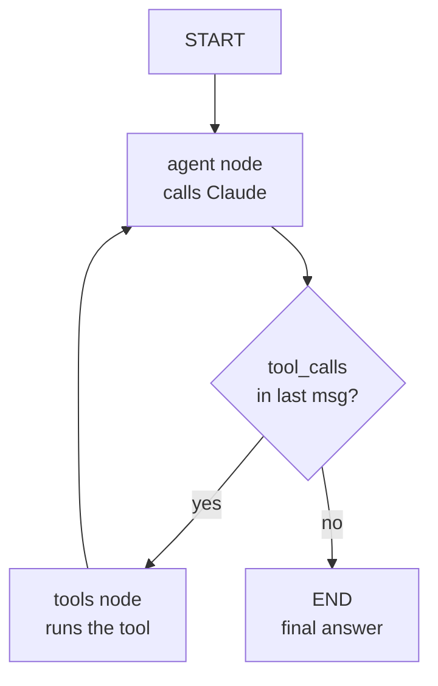

# Orchestration 2 — LangGraph

## Lectures covered
- LangGraph Crash course

---

## In one sentence
LangGraph is a state-machine framework: you define **nodes** (functions) and **edges** (transitions, possibly conditional) over a shared **state** dict, then compile it into a graph that loops, branches, pauses for humans, and persists itself across calls — everything plain LangChain chains can't do.

## Real-world analogy
LangGraph is **the flowchart on the back of a board game**. LangChain chains are a single straight track — you can't "go back 3 spaces" or "if you land here, draw a card." LangGraph is the full board: nodes are squares, edges are arrows, a conditional edge is a "fork in the road," and the state dict is the game piece carrying your score and inventory as you move.

## The intuition (plain English)
- Real agents need **loops** (call a tool, check the result, decide whether to call another) and **branches** (route by intent: support? sales? complaint?). LangChain's `|` pipe can't express either cleanly.
- LangGraph models the whole flow as a graph. Each turn the runtime picks a node, runs it, merges the returned dict into state, then follows the outgoing edge.
- **Conditional edges** read the state and pick a destination — that's how you implement "did the model emit a tool call? if yes, go to ToolNode; if no, end."
- **Checkpointing** writes state to a store after every step, so a multi-day workflow can pause for human approval and resume right where it stopped.
- It's the natural backbone for production agents — Anthropic's tool-use loop ([../04-agents-tool-use.md](../04-agents-tool-use.md)), pretty much expressed as a graph.

## Mini worked example — a 3-node ReAct agent

```python
from typing import Annotated, TypedDict
from langgraph.graph import StateGraph, START, END
from langgraph.graph.message import add_messages
from langgraph.prebuilt import ToolNode
from langchain_anthropic import ChatAnthropic
from langchain_core.tools import tool

@tool
def get_weather(city: str) -> str:
    """Get current weather for a city."""
    return f"54F, 78% rain in {city}"

llm = ChatAnthropic(model="claude-sonnet-4-6").bind_tools([get_weather])

class State(TypedDict):
    messages: Annotated[list, add_messages]   # reducer = append, not overwrite

def call_model(state): return {"messages": [llm.invoke(state["messages"])]}
def route(state):      return "tools" if state["messages"][-1].tool_calls else END

graph = StateGraph(State)
graph.add_node("agent", call_model)
graph.add_node("tools", ToolNode([get_weather]))
graph.set_entry_point("agent")
graph.add_conditional_edges("agent", route)
graph.add_edge("tools", "agent")            # loop back

app = graph.compile()
out = app.invoke({"messages": [("user", "Umbrella in Seattle?")]})
print(out["messages"][-1].content)
```

Three nodes, one conditional edge, one loop. That's a complete tool-using agent.

## At-a-glance



## Why this matters
- Once your app needs even one branch or one retry, LangGraph is the right home — bolting that onto LCEL gets ugly fast.
- **Pick LangGraph when**: branching, loops, multi-agent supervisors, human-in-the-loop approval, or resumable long-running workflows.
- **Pick LangChain ([01-langchain.md](./01-langchain.md))** for straight-line pipelines.
- **Pick CrewAI ([03-crewai.md](./03-crewai.md))** when "team of role-played experts" maps better to your problem than "state machine."
- This is the framework most teams move to **after** their LangChain prototype outgrows a single chain.

---

## 1. Why LangGraph

Plain LangChain chains are **straight-line**: input → step 1 → step 2 → output.

Real agents need:
- Loops (re-tool until satisfied)
- Branches (different paths based on conditions)
- State (memory across steps)
- Human-in-the-loop pauses
- Persistence + resumption
- Streaming intermediate state

**LangGraph** is a state-machine framework for LLM apps. Inspired by graph neural network frameworks (PyTorch's autograd graph) but for prompts + tools.

---

## 2. Install
```bash
pip install langgraph
```

---

## 3. The mental model

You define:
- **State** — a typed dict that flows through the graph
- **Nodes** — functions that read/write state
- **Edges** — control flow between nodes
- **Conditional edges** — branch based on state

Then you compile to a graph that you can `invoke`, `stream`, or `astream`.

---

## 4. A minimal LangGraph

```python
from typing import TypedDict
from langgraph.graph import StateGraph, START, END

class State(TypedDict):
    input: str
    output: str

def step1(state: State) -> State:
    return {"output": f"Hello, {state['input']}!"}

graph = StateGraph(State)
graph.add_node("greet", step1)
graph.add_edge(START, "greet")
graph.add_edge("greet", END)

app = graph.compile()

result = app.invoke({"input": "world"})
print(result)        # {'input': 'world', 'output': 'Hello, world!'}
```

State updates are **merged** into the existing state — partial returns are fine.

---

## 5. Conditional edges (branching)

```python
def classify(state: State) -> State:
    # decide if we need a tool or can answer directly
    return {"path": "tool" if "weather" in state["input"] else "direct"}

def use_tool(state):  return {"output": "[called weather tool] sunny"}
def answer_direct(state): return {"output": "I can answer that."}

graph = StateGraph(State)
graph.add_node("classify", classify)
graph.add_node("use_tool", use_tool)
graph.add_node("direct",   answer_direct)

graph.add_edge(START, "classify")

graph.add_conditional_edges(
    "classify",
    lambda s: s["path"],            # routing key
    {"tool": "use_tool", "direct": "direct"},
)

graph.add_edge("use_tool", END)
graph.add_edge("direct", END)

app = graph.compile()
```

---

## 6. The pre-built ReAct agent

LangGraph ships a **prebuilt ReAct agent** — the most common agent pattern.

```python
from langgraph.prebuilt import create_react_agent
from langchain_openai import ChatOpenAI
from langchain_core.tools import tool

@tool
def get_weather(city: str) -> str:
    """Get current weather for a city."""
    return f"Sunny, 22°C in {city}"

@tool
def search_web(query: str) -> str:
    """Search the web for information."""
    return f"top result for '{query}'..."

llm = ChatOpenAI(model="gpt-4o-mini")
agent = create_react_agent(llm, tools=[get_weather, search_web])

result = agent.invoke({"messages": [("user", "What's the weather in Lahore right now?")]})
for m in result["messages"]:
    print(m.type, ":", m.content)
```

Under the hood: ReAct loop. Model decides when to call tools, calls them, and uses results to answer.

---

## 7. State accumulation — appending to lists

For chat history:
```python
from typing import Annotated
from langgraph.graph.message import add_messages
from typing_extensions import TypedDict

class ChatState(TypedDict):
    messages: Annotated[list, add_messages]

def chat(state):
    response = llm.invoke(state["messages"])
    return {"messages": [response]}
```

`add_messages` is a reducer — instead of overwriting, it appends new messages to the list.

---

## 8. Memory + persistence (checkpointing)

For multi-turn chats / resumable workflows:
```python
from langgraph.checkpoint.memory import MemorySaver
# or for prod: from langgraph.checkpoint.postgres import PostgresSaver

memory = MemorySaver()
app = graph.compile(checkpointer=memory)

config = {"configurable": {"thread_id": "user-42"}}

app.invoke({"messages": [("user", "Hi")]}, config)
app.invoke({"messages": [("user", "What did I just say?")]}, config)
# state persisted across calls per thread_id
```

Critical for production agents.

---

## 9. Human-in-the-loop

You can **pause** execution and resume later (after human approval):

```python
from langgraph.graph import START, END
graph.add_node("draft", draft_email)
graph.add_node("send", send_email)

# pause before "send" so a human approves
app = graph.compile(checkpointer=memory, interrupt_before=["send"])

state = app.invoke({"...": "..."}, config)
# inspect the draft
# ...if human approves:
app.invoke(None, config)         # resume from where it stopped
```

---

## 10. Streaming intermediate state

```python
async for event in app.astream({"input": "..."}, config, stream_mode="updates"):
    print(event)            # see each node's output as it happens
```

Use `stream_mode`:
- `"values"` — full state after each step
- `"updates"` — only the changes
- `"messages"` — token-level streaming

---

## 11. Multi-agent setups (preview — full in `04-agents/02-multi-agent-systems.md`)

LangGraph naturally expresses multi-agent collaboration:
- Each agent is a subgraph
- A "supervisor" agent routes between them
- Shared state coordinates

This is the **modern recommended** way to build complex agentic apps.

---

## 12. When LangGraph beats LangChain

| | LangChain (LCEL) | LangGraph |
|---|---|---|
| Linear chains | great | overkill |
| Branching / loops | clunky | natural |
| Stateful conversations | works (memory) | first-class |
| Multi-agent | possible | designed for it |
| Human-in-the-loop | manual | built-in |
| Resumable workflows | hard | first-class |

**Rule**: chain → LangChain. Anything more complex → LangGraph.

---

## 13. Common pitfalls

| Mistake | Effect | Fix |
|---|---|---|
| Forgetting reducer (`Annotated[list, add_messages]`) | state overwritten | use the reducer |
| Cycles without termination condition | infinite loop | always have a "stop" branch |
| Not using checkpointer | state lost between calls | enable for multi-turn |
| Mixing LangGraph state with global vars | hard to debug | keep all flow in state |
| Ignoring `stream_mode` for UX | feels frozen during long runs | stream updates |

## Self-check

- [ ] What's a node, an edge, a state in LangGraph?
- [ ] When is LangGraph better than LangChain?
- [ ] How do you implement branching (conditional edges)?
- [ ] What does `add_messages` reducer do?
- [ ] How do you pause a graph for human approval?
- [ ] How does checkpointing work?
- [ ] Build a 2-node graph: classify → answer.
- [ ] Use `create_react_agent` to build a tool-using agent in 10 lines.

---

## Glossary

| Term | Plain meaning |
|------|---------------|
| LangGraph | LangChain's library for building LLM apps as state-machine graphs. |
| State | A typed dict passed between nodes; every node reads and updates it. |
| `TypedDict` | Python type that declares the keys and value types of a dict. |
| Node | A function that takes state and returns a partial state dict. |
| Edge | A transition from one node to another (unconditional). |
| Conditional edge | An edge whose destination is chosen by a routing function over state. |
| Reducer | A function that merges a node's return value into existing state (e.g., append vs overwrite). |
| `add_messages` | Pre-built reducer that appends new messages to the conversation list. |
| `Annotated[T, reducer]` | Python typing pattern that attaches a reducer to a state field. |
| `StateGraph` | The graph builder class — you add nodes and edges, then compile. |
| `START` / `END` | Special sentinel nodes for entry and exit points. |
| `set_entry_point` | Shortcut that adds an edge from `START` to a named node. |
| `compile()` | Turns the graph definition into an executable `Runnable`. |
| `invoke` / `stream` / `astream` | Run the compiled graph synchronously / streaming / async-streaming. |
| `stream_mode` | Selects what `stream` yields: `values`, `updates`, or `messages` (token-level). |
| `ToolNode` | Pre-built node that executes any tool calls in the last message. |
| `create_react_agent` | One-line helper that builds the standard ReAct loop graph. |
| ReAct | Reason + Act — the alternating think-then-tool-call agent loop. |
| Checkpointer | Object that saves state after each step, enabling resume and memory. |
| `MemorySaver` | In-process checkpointer for development. |
| `PostgresSaver` | Production checkpointer that persists to Postgres. |
| `thread_id` | Identifier that ties a series of invocations to one persistent conversation. |
| Human-in-the-loop | Pausing the graph and waiting for a person to approve before continuing. |
| `interrupt_before` / `interrupt_after` | Compile flags that pause execution at named nodes. |
| Subgraph | A compiled graph used as a node inside a bigger graph (multi-agent pattern). |
| Supervisor | A coordinator agent that routes between specialist sub-agents. |
| Tool calling | The mechanism by which Claude emits a structured request for a function. |
| `bind_tools` | Attach a tool list to a model so it can emit `tool_calls`. |
| Cycle | A path that returns to an earlier node — fine if there's a termination condition. |

## Further reading
- Previous: [01-langchain.md](./01-langchain.md) — chains and LCEL
- Next: [03-crewai.md](./03-crewai.md) — role-based multi-agent alternative
- Sibling: [04-mcp.md](./04-mcp.md), [05-amazon-bedrock-agentcore.md](./05-amazon-bedrock-agentcore.md)
- Foundation: [../04-agents-tool-use.md](../04-agents-tool-use.md) — the agent loop in raw form
- Companion: [../06-langchain-claude-api.md](../06-langchain-claude-api.md) — LangGraph + Claude SDK example
- Project: [../05-projects/04-customer-care-agentcore.md](../05-projects/04-customer-care-agentcore.md) — LangGraph deployed via AgentCore
- LangGraph — [Tutorials](https://langchain-ai.github.io/langgraph/)
- LangGraph — [Concepts](https://langchain-ai.github.io/langgraph/concepts/)
- LangGraph — [Persistence and checkpointing](https://langchain-ai.github.io/langgraph/concepts/persistence/)
