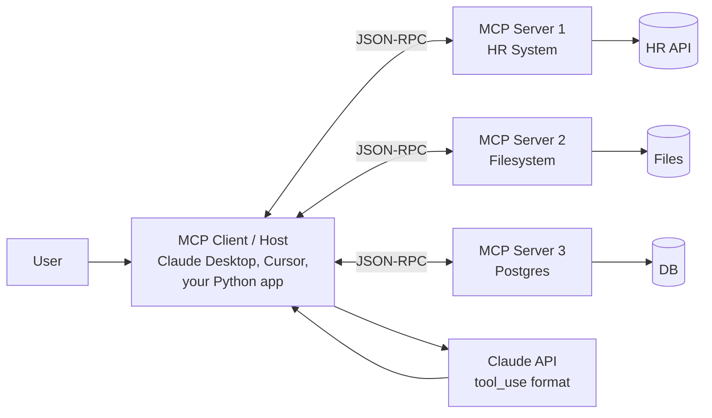

# Orchestration 4 — Model Context Protocol (MCP)

## Lectures covered
- Model Context Protocol (MCP)

---

## In one sentence
MCP (Model Context Protocol) is an open standard from Anthropic that lets any LLM client (Claude Desktop, Cursor, your custom agent) discover and call tools, read data, and use prompt templates from any compliant **MCP server** — write the integration once, every AI tool can use it.

## Real-world analogy
MCP is **USB-C for LLMs**. Before USB, every device had a unique connector — printers, mice, hard drives all needed their own port. After USB, one socket works for everything. Before MCP, every LLM client (Claude Desktop, ChatGPT, custom agents) needed its own integration with each tool source. After MCP, one server exposes a tool over a standard protocol and every MCP-aware client can plug in.

## The intuition (plain English)
- Tool-use ([../04-agents-tool-use.md](../04-agents-tool-use.md)) on its own is great, but every framework has its own format. Re-implementing the same Slack tool for Claude Desktop, Cursor, and your bot is wasted work.
- MCP fixes that. You write an **MCP server** (a small process exposing tools, resources, and prompts), an **MCP client** inside the LLM app discovers what's available, and the LLM picks what to call.
- Communication is **JSON-RPC** over stdio or HTTP/SSE. The LLM never speaks MCP directly — the host app translates between MCP and the model's tool-use format.
- The four primitives — **tools** (callable functions), **resources** (read-only data URIs), **prompts** (named templates), **sampling** (server asks the client's LLM to generate) — cover almost any integration shape.
- This is the protocol behind the bootcamp's HR onboarding project ([../05-projects/03-agentic-onboarding-mcp.md](../05-projects/03-agentic-onboarding-mcp.md)).

## Mini worked example — expose a tool via an MCP server

```python
# server.py
from mcp.server.fastmcp import FastMCP

mcp = FastMCP("HR System")

@mcp.tool()
def create_user(email: str, role: str) -> dict:
    """Create a new user in the HR system."""
    return {"user_id": "u123", "email": email, "role": role, "status": "created"}

@mcp.resource("config://policies")
def get_policies() -> str:
    """Read the company onboarding policy doc."""
    return open("policies.md").read()

if __name__ == "__main__":
    mcp.run()                 # stdio transport by default
```

Point Claude Desktop at this file via `claude_desktop_config.json` and Claude can now call `create_user` and read the policies resource on demand — no extra glue code.

## At-a-glance



## Why this matters
- MCP eliminates the "N clients × M tools" integration explosion. Build one server, plug into many clients.
- **Pick MCP when** you want tools to be reusable across Claude Desktop, IDEs, and your own agents — or when consuming community-built servers (GitHub, Slack, Postgres) saves you weeks.
- **Skip MCP** for a one-off script or a single closed agent — direct tool use ([../04-agents-tool-use.md](../04-agents-tool-use.md)) is fewer lines.
- It composes with everything else in this folder: a LangChain ([01-langchain.md](./01-langchain.md)) chain, a LangGraph ([02-langgraph.md](./02-langgraph.md)) agent, or a CrewAI ([03-crewai.md](./03-crewai.md)) crew can all call MCP tools, and AgentCore Gateway ([05-amazon-bedrock-agentcore.md](./05-amazon-bedrock-agentcore.md)) hosts them at scale.

---

## 1. What MCP is — in one sentence

**MCP is a standardized way for LLMs to talk to tools and data sources** — like USB-C for AI integrations.

Without MCP: every LLM client implements its own tool / data integrations differently. Every server has to expose itself separately for each client.

With MCP: write the integration *once* as an "MCP server"; any MCP-compatible client (Claude Desktop, Cursor, VS Code, custom apps) can use it.

Originally introduced by Anthropic in late 2024; now broadly adopted across the ecosystem.

---

## 2. The architecture

```
┌──────────────────┐                     ┌──────────────────────┐
│  MCP CLIENT      │                     │    MCP SERVER         │
│  (Claude Desktop)│ ◄────── JSON-RPC ──►│  (your integration)   │
│  (Cursor, VS,    │                     │  (e.g., HR API,       │
│   custom app)    │                     │   filesystem,         │
│                  │                     │   database)           │
└──────────────────┘                     └──────────────────────┘
```

Clients **discover** the capabilities a server offers — tools, resources, prompts — and invoke them on the LLM's behalf.

---

## 3. The four primitives

### Tools
Functions the LLM can call (like function calling, but discovered dynamically).
- Get the current weather
- Run a SQL query
- Send an email

### Resources
Read-only data the LLM can fetch (URIs).
- Files in a directory
- Wiki articles
- Database rows

### Prompts
Reusable, named prompt templates the user can invoke.
- "Summarize this code"
- "Explain this error"

### Sampling
The server can ask the *client's* LLM to generate something. Useful for nested workflows.

---

## 4. Why MCP matters for the bootcamp's HR onboarding project

Module 9 project 3 (Agentic AI for HR onboarding) explicitly uses MCP. The pattern:

1. Existing HR APIs (account creation, system access, paperwork generation) → wrap as MCP servers
2. An MCP-aware LLM client (Claude Desktop, your custom agent) discovers all servers' tools
3. The LLM autonomously orchestrates: "create email account", "send welcome doc", "schedule onboarding sessions"
4. Each tool call goes through MCP — auditable, standardized, reusable

The win: every new HR system you add → just wrap as one MCP server → every existing AI tool gets it automatically.

---

## 5. Building an MCP server (Python SDK)

```bash
pip install mcp
```

```python
# server.py
from mcp.server.fastmcp import FastMCP

mcp = FastMCP("HR System")

@mcp.tool()
def create_user(email: str, role: str) -> dict:
    """Create a new user in the HR system."""
    # call your real HR API here
    return {"user_id": "u123", "email": email, "role": role, "status": "created"}

@mcp.tool()
def list_pending_onboardings() -> list[dict]:
    """List employees pending onboarding."""
    return [
        {"id": 1, "name": "Awais Shah", "start_date": "2025-05-01"},
        {"id": 2, "name": "Sara Khan", "start_date": "2025-05-03"},
    ]

@mcp.resource("config://policies")
def get_policies() -> str:
    """Read company onboarding policies."""
    return open("policies.md").read()

if __name__ == "__main__":
    mcp.run()
```

Run:
```bash
python server.py        # transports: stdio (default), HTTP (--transport sse)
```

---

## 6. Connecting to Claude Desktop

Edit `~/.config/claude_desktop/claude_desktop_config.json`:
```json
{
  "mcpServers": {
    "hr-system": {
      "command": "python",
      "args": ["/path/to/server.py"]
    }
  }
}
```

Restart Claude Desktop. Now Claude can call `create_user(...)` or read the `config://policies` resource on demand.

---

## 7. Programmatic MCP client (in your own app)

```python
from anthropic import Anthropic
from mcp import ClientSession, StdioServerParameters
from mcp.client.stdio import stdio_client

client = Anthropic()

server_params = StdioServerParameters(command="python", args=["server.py"])

async with stdio_client(server_params) as (read, write):
    async with ClientSession(read, write) as session:
        await session.initialize()

        tools = await session.list_tools()
        # tools is a list of {name, description, inputSchema}

        # Convert to Anthropic tool definitions
        anthropic_tools = [{
            "name": t.name,
            "description": t.description,
            "input_schema": t.inputSchema,
        } for t in tools.tools]

        # Have Claude orchestrate them
        resp = client.messages.create(
            model="claude-sonnet-4-6",
            max_tokens=2048,
            tools=anthropic_tools,
            messages=[{"role": "user", "content": "Onboard the next pending employee."}],
        )

        # If Claude wants to use a tool:
        for block in resp.content:
            if block.type == "tool_use":
                result = await session.call_tool(block.name, block.input)
                # feed back to Claude...
```

(Production code would loop over multiple tool calls until Claude returns a final answer.)

---

## 8. The MCP ecosystem (rapidly growing)

Off-the-shelf MCP servers for:
- Filesystem access
- GitHub / Linear / Jira
- Slack / Discord
- Postgres / SQLite / Supabase
- Brave Search / Web search
- Google Drive
- Memory / sticky notes
- Calendar
- AWS / GCP services

Browse: https://github.com/modelcontextprotocol — and https://www.mcp.so directory.

For the bootcamp: pull existing MCP servers (filesystem, database) for prototyping; build one custom MCP server for the HR onboarding project.

---

## 9. Why MCP > custom function calling

| | Custom function calling | MCP |
|---|---|---|
| Each LLM client needs its own integration | yes | no |
| Tools auto-discoverable | no | yes |
| Standardized authentication | no | yes |
| Streaming results | varies | yes |
| Local file access guarantees | varies | yes |
| Vendor-lock-in | high | low |

If your tool is built once as MCP, **it works in Claude Desktop, Cursor, VS Code, and your custom Python apps without changes**.

---

## 10. Security considerations

MCP gives an LLM real-world capabilities. Treat it like an OS-level permission system:

- **Sandbox tools** that touch the filesystem
- **Whitelist** which tools each client can use
- **Audit log** every tool call
- **Per-tool limits** (rate, scope)
- **Beware prompt injection** — content the LLM reads can contain malicious tool-use instructions

For HR / customer data: extra care. Production MCP servers should require proper auth headers and scoped permissions.

---

## 11. Common pitfalls

| Mistake | Effect | Fix |
|---|---|---|
| MCP server with no input validation | exploitable | Pydantic-validate every input |
| Returning huge resources | context bloat | paginate / summarize |
| Tool name conflicts across servers | LLM picks wrong one | namespace tools (`hr_create_user`) |
| Synchronous tool blocking the server | freezes other calls | async or thread pool |
| No error handling | client confusion | always return structured error responses |

## Self-check

- [ ] What is MCP in one sentence?
- [ ] Four MCP primitives?
- [ ] How does MCP differ from regular function calling?
- [ ] Build a minimal MCP server with one tool.
- [ ] Connect a server to Claude Desktop.
- [ ] How do you call MCP from Python code with Anthropic SDK?
- [ ] Three security considerations for MCP servers.
- [ ] How is MCP used in the HR onboarding project?

---

## Glossary

| Term | Plain meaning |
|------|---------------|
| MCP | Model Context Protocol — open standard for LLM-to-tool/data integrations. |
| MCP server | A process that exposes tools, resources, and prompts via MCP. |
| MCP client | The LLM-side library inside a host app that talks to servers. |
| MCP host | The app embedding the client (Claude Desktop, Cursor, your code). |
| JSON-RPC | The wire format MCP uses — JSON messages with method names. |
| stdio transport | Process talks over standard input/output (default for local servers). |
| SSE / HTTP transport | Server-Sent Events transport for remote MCP servers. |
| Tool | A callable function exposed by a server, with name + JSON-Schema input. |
| Resource | A read-only data source identified by a URI (e.g., `config://policies`). |
| Prompt | A named, reusable prompt template the user can invoke. |
| Sampling | A server primitive that asks the client's LLM to generate text. |
| Capability | One of the four primitive types a server can expose (tool/resource/prompt/sampling). |
| Discovery | The handshake where a client lists a server's capabilities at connect time. |
| FastMCP | High-level Python helper for writing MCP servers with decorators. |
| `@mcp.tool()` | Decorator that registers a Python function as an MCP tool. |
| `@mcp.resource(uri)` | Decorator that registers a function as an MCP resource. |
| `ClientSession` | The Python client object for talking to a server. |
| `StdioServerParameters` | Config object for launching a local MCP server over stdio. |
| `list_tools` / `call_tool` | Client methods to enumerate and invoke server tools. |
| `claude_desktop_config.json` | Config file where Claude Desktop registers MCP servers. |
| Tool namespace | Prefix on tool names to avoid collisions across servers (`hr_create_user`). |
| Prompt injection | Hostile instructions hidden in tool output or resource content. |
| Allowlist | Per-client list of which tools may be called. |
| Sandbox | Isolated execution environment for risky tools (filesystem, code). |
| Audit log | Persistent record of every tool call, who made it, and the result. |
| Pydantic validation | Schema checking on tool inputs to reject malformed calls. |
| AgentCore Gateway | AWS-managed MCP-compliant tool host (covered in [05-amazon-bedrock-agentcore.md](./05-amazon-bedrock-agentcore.md)). |
| Anthropic | The company that introduced MCP and maintains the spec with the community. |

## Further reading
- Previous: [03-crewai.md](./03-crewai.md) — multi-agent crews that consume MCP tools
- Next: [05-amazon-bedrock-agentcore.md](./05-amazon-bedrock-agentcore.md) — managed MCP hosting via AgentCore Gateway
- Sibling: [01-langchain.md](./01-langchain.md), [02-langgraph.md](./02-langgraph.md)
- Foundation: [../04-agents-tool-use.md](../04-agents-tool-use.md) — tool-use mechanics underneath MCP
- Companion: [../06-langchain-claude-api.md](../06-langchain-claude-api.md) — calling Claude with tool_use blocks
- Project: [../05-projects/03-agentic-onboarding-mcp.md](../05-projects/03-agentic-onboarding-mcp.md) — capstone using MCP
- Anthropic — [Model Context Protocol home](https://modelcontextprotocol.io/)
- MCP — [Specification](https://spec.modelcontextprotocol.io/)
- MCP — [Server registry / awesome list](https://github.com/modelcontextprotocol/servers)
- Directory: [https://www.mcp.so](https://www.mcp.so)
