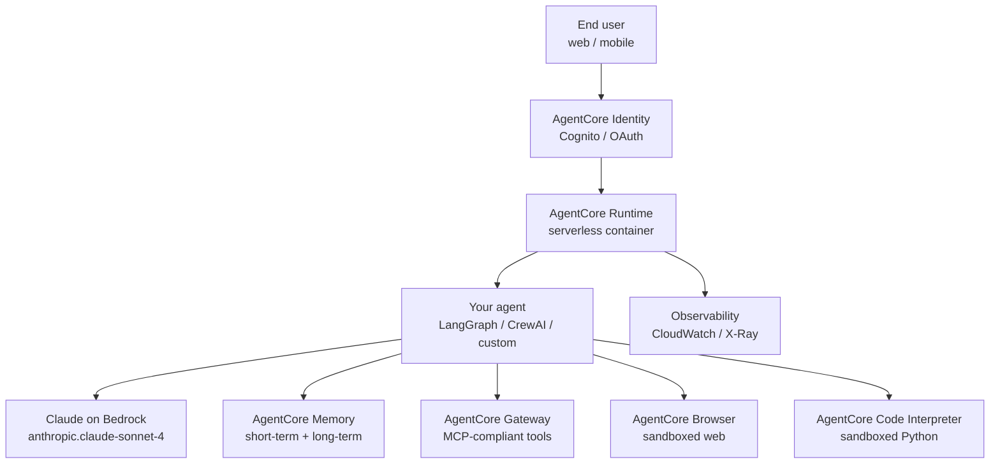

# Orchestration 5 — Amazon Bedrock AgentCore

## Lectures covered
- Amazon Bedrock AgentCore

---

## In one sentence
Amazon Bedrock AgentCore is AWS's managed runtime for production agents — you bring an agent built in any framework (LangGraph, CrewAI, Strands, custom) and AgentCore handles secure execution, per-user identity, short- and long-term memory, sandboxed browser/code tools, MCP-compliant tool hosting, and full observability.

## Real-world analogy
AgentCore is **the airport for your agent**. LangGraph and CrewAI build the airplane; AgentCore is the runway, control tower, baggage handling, customs, and security checkpoints. You wouldn't fly a passenger jet out of your backyard — for production agents, AgentCore provides the regulated, audited infrastructure that auditors, ops teams, and end users need.

## The intuition (plain English)
- A working agent prototype is maybe 30% of a production system. The other 70% is auth, memory, scaling, audit logs, sandboxed tool execution — boring infra that takes weeks to get right.
- AgentCore packages that 70% as managed AWS services: **Runtime** (serverless agent execution), **Memory** (short- and long-term, per-user), **Identity** (OAuth/Cognito-backed), **Browser** (sandboxed web automation), **Code Interpreter** (sandboxed Python), **Gateway** (MCP-compliant tool hosting), and **Observability** (CloudWatch / X-Ray traces).
- It's **framework-agnostic** — you keep building with LangGraph ([02-langgraph.md](./02-langgraph.md)) or CrewAI ([03-crewai.md](./03-crewai.md)) or your own loop; AgentCore is the deployment target.
- Models come from **Bedrock** — including `anthropic.claude-sonnet-4`, the same Claude family used everywhere else in the bootcamp ([../06-langchain-claude-api.md](../06-langchain-claude-api.md)).
- This is the production target for the customer-care project ([../05-projects/04-customer-care-agentcore.md](../05-projects/04-customer-care-agentcore.md)).

## Mini worked example — full Bedrock agent with memory and identity

```python
from bedrock_agentcore import AgentCoreApp, MemoryStrategy
from langgraph.prebuilt import create_react_agent
from langchain_aws import ChatBedrock
from langchain_core.tools import tool

@tool
def customer_lookup(customer_id: str) -> dict:
    """Fetch customer profile from CRM."""
    return {"id": customer_id, "tier": "gold", "open_tickets": 1}

@tool
def refund_status(order_id: str) -> dict:
    """Check refund status for an order."""
    return {"order": order_id, "refund": "approved", "eta_days": 3}

llm = ChatBedrock(model_id="anthropic.claude-sonnet-4")
agent = create_react_agent(llm, tools=[customer_lookup, refund_status])

app = AgentCoreApp(
    name="customer-care-agent",
    handler=agent,
    memory=MemoryStrategy(short_term=True, long_term=["user_preferences"]),
    identity={"oauth_provider": "cognito"},
    observability=True,
)

# Local: app.run()
# Deploy: $ agentcore deploy
```

A LangGraph ReAct agent + Claude on Bedrock + persistent per-user memory + Cognito auth + traces — wired up in one config object.

## At-a-glance



## Why this matters
- **Pick AgentCore when** your agent needs to run in production on AWS with real users, audit requirements, and per-user data isolation — and you don't want to build memory/identity/sandboxes yourself.
- **Pick self-hosted (LangGraph + your infra)** when you need multi-cloud or want full control of the stack.
- **Pick OpenAI Assistants API** when your org is OpenAI-centric and you don't need AWS-grade controls.
- For the bootcamp's customer-care project ([../05-projects/04-customer-care-agentcore.md](../05-projects/04-customer-care-agentcore.md)), AgentCore turns a local LangGraph demo into a deployable, audited, multi-user system — the kind of artifact a recruiter at an enterprise can actually evaluate.
- The Gateway service is also where MCP ([04-mcp.md](./04-mcp.md)) meets production: publish your APIs as MCP tools once, every internal agent inherits them.

---

## 1. What AgentCore is

**Amazon Bedrock AgentCore** is AWS's managed runtime for production AI agents. It's not a framework like LangGraph or CrewAI — it's the **infrastructure layer** beneath them.

You can build your agent with **any framework** (LangGraph, CrewAI, Strands, custom code) and deploy it to AgentCore for:
- Secure execution
- Persistent memory (short-term and long-term)
- Identity management
- Observability and audit logs
- Scaling without managing servers

This is what Codebasics' **Project 4 (Customer Care AI Agent)** uses.

---

## 2. The capability stack

```
┌─────────────────────────────────────────────────────────┐
│  Your Agent (built in any framework)                     │
└────────┬────────────────────────────────────────────────┘
         │
┌────────▼────────────────────────────────────────────────┐
│  AgentCore Runtime — secure, serverless agent execution  │
└────────┬────────────────────────────────────────────────┘
         │
┌────────▼────────────────────────────────────────────────┐
│  AgentCore Services                                       │
│   - Memory (short-term + long-term)                       │
│   - Identity (per-user auth, OAuth)                       │
│   - Browser tool (sandboxed automation)                   │
│   - Code Interpreter (safe code execution)                │
│   - Gateway (MCP-compliant tool exposure)                 │
│   - Observability (traces, metrics, audit log)            │
└────────────────────────────────────────────────────────┘
```

---

## 3. Why AgentCore for production

Compare a homemade agent vs an AgentCore-deployed one:

| | Homemade | AgentCore |
|---|---|---|
| Server management | you | AWS |
| Auth + per-user identity | DIY | built-in |
| Memory storage | DIY (Redis / Postgres) | managed |
| Audit log | DIY | built-in |
| Observability | DIY (LangSmith etc.) | built-in |
| Scaling | DIY (k8s) | automatic |
| Cost | infra + dev time | per-invocation |

For the bootcamp's customer-care project: AgentCore gives you a real production-grade demo without spinning up infrastructure.

---

## 4. Quick concept — AgentCore Memory

AgentCore Memory tracks both:

### Short-term (event memory)
- Recent conversation turns
- Task / session state
- Per-user context within an interaction

### Long-term (persistent memory)
- Facts the agent has learned about the user
- Preferences, history
- Survives across sessions

```python
# pseudocode
agent = build_my_agent()
deployed = agentcore.deploy(agent, memory=AgentCoreMemory(strategies=["summarization", "user_preferences"]))

deployed.invoke(user_id="awais", message="I prefer email contact and live in Lahore")
deployed.invoke(user_id="awais", message="What's my city?")    # remembers
```

---

## 5. AgentCore Identity

Per-user auth — the agent acts on a specific user's behalf, scoped to their permissions:
- Token store
- OAuth flows
- Passes auth context to tools

For customer support: each user gets their own context; the agent can't accidentally see another user's data.

---

## 6. AgentCore Browser & Code Interpreter

Two pre-built **sandboxed tools** every production agent eventually needs:

### Browser
The agent can navigate and interact with web pages. Sandboxed (no escape to the host).
Useful for: automation, web scraping, form-filling, research.

### Code Interpreter
The agent can write and execute Python code in a sandboxed VM.
Useful for: data analysis, custom calculations, plotting.

These are notoriously dangerous to build yourself (sandbox escapes, etc.). AgentCore handles the security.

---

## 7. AgentCore Gateway — MCP-compliant tool host

AgentCore Gateway lets you expose internal APIs as MCP tools that any AgentCore agent can use. Think: "publish your HR APIs once, every internal agent can use them."

This pairs perfectly with the **HR onboarding project (Module 9 project 3)** in spirit — same problem, AWS managed solution.

---

## 8. AgentCore Observability

- Traces of every agent execution (tool calls, LLM calls, latencies)
- Metrics (cost, success rate, error rate)
- Audit log (which user did what, when)
- Integration with CloudWatch + X-Ray

For regulated workloads: this is what auditors want to see.

---

## 9. Building an agent for AgentCore

### High-level workflow

1. Write your agent locally in any framework (LangGraph, CrewAI, Strands SDK)
2. Wrap with the AgentCore runtime SDK
3. Deploy via the AWS CLI / SDK
4. Test via console / API
5. Roll out to users

### Sample code (conceptual — actual SDK names may vary)

```python
from bedrock_agentcore import AgentCoreApp, MemoryStrategy
from langgraph.prebuilt import create_react_agent
from langchain_aws import ChatBedrock

llm = ChatBedrock(model_id="anthropic.claude-sonnet-4")
my_agent = create_react_agent(llm, tools=[customer_lookup, refund_status])

app = AgentCoreApp(
    name="customer-care-agent",
    handler=my_agent,
    memory=MemoryStrategy(short_term=True, long_term=["user_preferences"]),
    identity={"oauth_provider": "cognito"},
    observability=True,
)

# Locally:
app.run()

# Deploy:
# $ agentcore deploy
```

After deploy, you get an HTTPS endpoint scoped per user, with auth, memory, and observability all wired up.

---

## 10. Customer-care AgentCore project (Module 9 project 4)

The full lifecycle Codebasics walks through:

1. **Local development** — build the agent (LangGraph / Strands SDK) calling tools (lookup customer, refund status)
2. **Memory integration** — short-term per-conversation, long-term per-customer (preferences, past complaints)
3. **Secure deployment** — AgentCore deploy command; immutable artifact
4. **Identity** — Cognito-backed auth; tools see the authenticated user
5. **Runtime execution** — invoke from a Streamlit UI hitting the AgentCore endpoint
6. **Observability** — trace each user interaction; alert on anomalies

The lecture stresses **moving beyond demos** to **deployable systems**. That's the takeaway.

---

## 11. AgentCore vs alternatives

| | AgentCore | Self-hosted (LangGraph + your infra) | OpenAI Assistants API |
|---|---|---|---|
| Cloud lock-in | AWS | none | OpenAI |
| Memory & identity | managed | DIY | built-in (limited) |
| Tool sandboxing | built-in | DIY | partial |
| Framework agnostic | yes | yes | OpenAI's runtime |
| Observability | full | DIY (LangSmith etc.) | basic |
| When | production on AWS | full control / multi-cloud | OpenAI-centric apps |

For a portfolio project that demonstrates production skills, AgentCore is gold — recruiters at AWS / cloud-heavy enterprises know it.

---

## 12. Cost & access

AgentCore is part of AWS Bedrock — pay-per-invocation pricing:
- Per LLM token (Bedrock model)
- Per minute of agent runtime
- Per memory storage

You'll need an AWS account + Bedrock access (request via console). Free tier covers small experiments.

---

## 13. Common pitfalls

| Mistake | Effect | Fix |
|---|---|---|
| Mixing local memory with AgentCore memory | inconsistent | pick one |
| Forgetting identity scoping | security leak | always pass user context |
| Hardcoded creds in deployed agent | exposed | use IAM roles |
| No observability | can't debug | always enable |
| Trying to run un-managed sandboxes | security holes | use AgentCore Browser / Code Interpreter |

## Self-check

- [ ] What's AgentCore in one sentence?
- [ ] Five capabilities AgentCore provides?
- [ ] Difference between short-term and long-term memory?
- [ ] What's AgentCore Identity for?
- [ ] When use AgentCore vs self-hosted vs OpenAI Assistants?
- [ ] What's the connection between AgentCore Gateway and MCP?
- [ ] Walk through deploying a LangGraph agent to AgentCore.
- [ ] Why does the bootcamp pick AgentCore for the Customer Care project?

---

## Glossary

| Term | Plain meaning |
|------|---------------|
| Amazon Bedrock | AWS's managed multi-model LLM service (hosts Claude, Llama, Titan, others). |
| AgentCore | The agent-runtime layer on top of Bedrock; framework-agnostic. |
| AgentCore Runtime | Serverless execution environment for your agent's code. |
| Handler | The entry point function or compiled graph the runtime invokes per request. |
| AgentCore Memory | Managed storage for short- and long-term agent memory. |
| Short-term memory | Conversation turns and session-local state within one interaction. |
| Long-term memory | Per-user facts and preferences that persist across sessions. |
| MemoryStrategy | Config object selecting which memory features the agent uses. |
| Summarization strategy | Condenses old turns to keep context within token limits. |
| User preferences strategy | Extracts and stores stable user facts long-term. |
| AgentCore Identity | Per-user auth layer (OAuth / Cognito) that passes user context to tools. |
| Cognito | AWS's managed identity provider — common Identity backend. |
| Token store | Encrypted store where Identity holds user OAuth tokens. |
| AgentCore Browser | Sandboxed headless browser tool — safe web automation. |
| AgentCore Code Interpreter | Sandboxed Python sandbox for the agent to run code. |
| Sandbox | Isolated VM-level environment that contains untrusted execution. |
| AgentCore Gateway | MCP-compliant host for exposing internal APIs as tools at scale. |
| MCP | Model Context Protocol — the tool standard Gateway speaks ([04-mcp.md](./04-mcp.md)). |
| Observability | Built-in traces, metrics, and audit logs for every agent invocation. |
| CloudWatch | AWS monitoring/logging service Observability ships traces to. |
| X-Ray | AWS distributed-tracing service for request-level spans. |
| `ChatBedrock` | LangChain wrapper that calls Claude (and other models) via Bedrock. |
| `anthropic.claude-sonnet-4` | The Bedrock model ID for Claude Sonnet 4 family. |
| Strands SDK | An alternative framework AWS promotes for AgentCore agents. |
| `AgentCoreApp` | The Python wrapper that turns your agent into a deployable AgentCore artifact. |
| `agentcore deploy` | CLI command that ships the agent to AWS as an immutable artifact. |
| Per-invocation pricing | You pay per LLM token + per minute of runtime + per memory unit stored. |
| IAM role | AWS identity an agent runs as — replaces hardcoded credentials. |
| Audit trail | Persistent record of who did what, when — required for regulated workloads. |
| Customer Care project | Module 9 capstone that uses AgentCore for a deployable support agent. |

## Further reading
- Previous: [04-mcp.md](./04-mcp.md) — the protocol AgentCore Gateway speaks
- Sibling: [01-langchain.md](./01-langchain.md), [02-langgraph.md](./02-langgraph.md), [03-crewai.md](./03-crewai.md)
- Foundation: [../04-agents-tool-use.md](../04-agents-tool-use.md) — agent loop fundamentals
- Companion: [../06-langchain-claude-api.md](../06-langchain-claude-api.md) — Claude SDK basics that Bedrock mirrors
- Project: [../05-projects/04-customer-care-agentcore.md](../05-projects/04-customer-care-agentcore.md) — the AgentCore capstone
- Related project: [../05-projects/03-agentic-onboarding-mcp.md](../05-projects/03-agentic-onboarding-mcp.md) — MCP-flavored onboarding (same shape as Gateway)
- AWS — [Bedrock AgentCore overview](https://docs.aws.amazon.com/bedrock/latest/userguide/agents.html)
- AWS — [Bedrock model catalog](https://docs.aws.amazon.com/bedrock/latest/userguide/models-supported.html)
- LangChain — [`langchain-aws` package](https://python.langchain.com/docs/integrations/platforms/aws/)
- AWS — [Anthropic Claude on Bedrock](https://docs.aws.amazon.com/bedrock/latest/userguide/model-parameters-anthropic-claude-messages.html)
