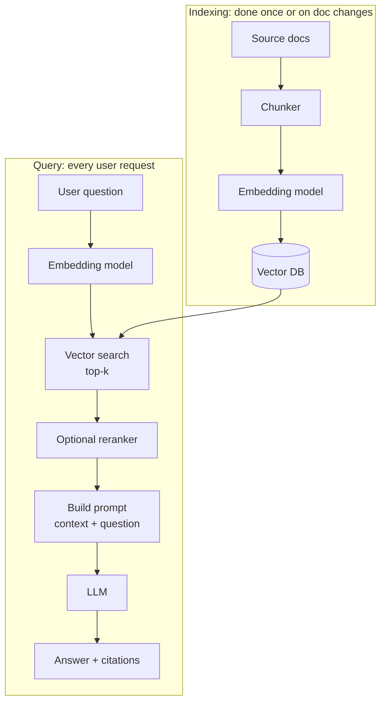

# 03 — RAG and Vector Databases

## Lectures covered
- Vector Database
- RAG (Retrieval Augmented Generation)
- Chromadb · Metadata Filtering
- Embeddings, semantic search, chunking
- Hybrid retrieval and reranking

---

## In one sentence
**RAG (Retrieval-Augmented Generation)** is the pattern of fetching a few relevant chunks from your own documents and pasting them into the prompt, so the LLM answers from your data instead of hallucinating.

## Real-world analogy
Open-book exam vs closed-book exam. A closed-book LLM has to rely on memory and will make things up. A RAG-equipped LLM gets handed three relevant pages right before it answers — and suddenly it's accurate, citable, and cheap to update (just edit the textbook, no retraining).

## The intuition (plain English)
- LLMs forget your private docs the moment training ends.
- Instead of fine-tuning every week, you keep your docs in a **vector database** and look up the most relevant ones at query time.
- "Most relevant" is measured by **embeddings** — turning each text chunk into a vector and finding the closest vectors to the query vector.
- Then you stuff those chunks into the prompt: *"Answer the question using ONLY the context below."*
- This is the dominant pattern for chatbots over private data, search engines on top of LLMs, and customer-support assistants.

## Mini worked example — RAG over a tiny knowledge base

Suppose you have three policy snippets:

```
[1] "Employees get 20 days of paid leave per year."
[2] "Reimbursements are processed every Friday."
[3] "The office is closed on July 4."
```

User asks: *"How much vacation do we get?"*

**Step 1** — embed everything. Imagine 4-D toy vectors:

```
[1] vacation policy   -> [0.92, 0.10, 0.05, 0.30]
[2] reimbursements    -> [0.04, 0.88, 0.20, 0.10]
[3] holidays          -> [0.30, 0.05, 0.92, 0.40]
query: "vacation"     -> [0.90, 0.12, 0.10, 0.28]
```

**Step 2** — cosine similarity to the query:

```
[1]: 0.99   [2]: 0.18   [3]: 0.42
```

**Step 3** — top-1 chunk is `[1]`. Build the final prompt:

```
Context:
- Employees get 20 days of paid leave per year.

Question: How much vacation do we get?
Answer:
```

**Step 4** — LLM responds: *"You get 20 days of paid leave per year."*

That's RAG. Everything else is engineering details.

## At-a-glance



## Why this matters
- Private data, fresh data, and large data are the three things plain LLMs are bad at — RAG fixes all three.
- Way cheaper than fine-tuning. Updating the index is a script run, not a GPU bill.
- Lets you cite sources, which kills hallucinations and makes legal/medical/finance use cases viable.
- It's the foundation of "chat with your PDF / Notion / Drive / codebase" products.

---

## Deep dive

### 1. Embeddings — the heart of retrieval

An **embedding** is a fixed-length vector (e.g. 1024 floats) that represents the meaning of a text chunk.

```python
import voyageai

vo = voyageai.Client()                   # Anthropic-recommended embedding provider
result = vo.embed(
    ["I love pizza", "Pizza is my favorite food", "I like programming"],
    model="voyage-3",
)
embeddings = result.embeddings           # list of 1024-float vectors
```

Properties of good embeddings:
- Texts with similar meaning land near each other.
- Distance is measured by **cosine similarity** (or dot product, L2).
- They're produced by separately trained encoder models (Voyage, OpenAI `text-embedding-3-large`, BGE, Cohere).

See [word embeddings](../08-nlp/05-word-embeddings.md) for the conceptual foundation — sentence embeddings are the modern, contextual generalisation.

### 2. Cosine similarity formula

```
cos(a, b) = (a · b) / (||a|| · ||b||)

  a · b      — dot product
  ||a||      — Euclidean length of vector a
  result is in [-1, 1]; closer to 1 means more similar
```

```python
import numpy as np

def cosine(a, b):
    return np.dot(a, b) / (np.linalg.norm(a) * np.linalg.norm(b))
```

### 3. Vector databases

A **vector DB** is just a database with a fast **approximate nearest neighbour (ANN)** index — usually HNSW or IVF-PQ — so "find the 5 closest vectors out of 10 million" runs in milliseconds.

| Tool | Sweet spot |
|---|---|
| **ChromaDB** | Local, Python-native, the bootcamp default. |
| **FAISS** | Library (not a server), in-memory, blazing fast. |
| **pgvector** | PostgreSQL extension. Good if you already run Postgres. |
| **Pinecone** | Managed cloud, easy to scale. |
| **Weaviate / Qdrant / Milvus** | Open-source servers, hybrid search built in. |

ChromaDB end-to-end:

```python
import chromadb

client = chromadb.PersistentClient(path="./chroma_db")
col = client.get_or_create_collection(
    name="hr_policies",
    metadata={"hnsw:space": "cosine"},
)

# Index
col.add(
    ids=["p1", "p2", "p3"],
    documents=[
        "Employees get 20 days of paid leave per year.",
        "Reimbursements are processed every Friday.",
        "The office is closed on July 4.",
    ],
    metadatas=[
        {"topic": "leave"},
        {"topic": "finance"},
        {"topic": "holidays"},
    ],
)

# Query
res = col.query(
    query_texts=["how much vacation do I get?"],
    n_results=2,
    where={"topic": "leave"},          # metadata filter
)
print(res["documents"][0])
```

### 4. Chunking — the silent killer

You can't embed a 200-page PDF as one vector — you'd lose all locality. You **chunk** it first.

| Strategy | Description | When |
|---|---|---|
| Fixed-size | 500 tokens with 50-token overlap. | Default. |
| Recursive | Split on `\n\n`, then `\n`, then space, until under size. | Markdown / docs. |
| Semantic | Split on topic shifts using embeddings. | High-quality knowledge bases. |
| Document-aware | One chunk = one section / function / row. | Code, structured docs. |

```python
from langchain.text_splitter import RecursiveCharacterTextSplitter

splitter = RecursiveCharacterTextSplitter(
    chunk_size=500,        # ~ tokens (rough proxy)
    chunk_overlap=50,
)
chunks = splitter.split_text(long_doc)
```

Tradeoffs:
- Smaller chunks → more precise retrieval but lose context.
- Bigger chunks → more context but noisier and pricier per call.
- Overlap prevents losing facts that straddle a chunk boundary.

### 5. The full RAG pipeline with Claude

```python
import chromadb
import voyageai
import anthropic

vo = voyageai.Client()
chroma = chromadb.PersistentClient(path="./chroma_db")
col = chroma.get_or_create_collection("hr")
claude = anthropic.Anthropic()

def answer(question: str, k: int = 4) -> str:
    # 1. Retrieve
    results = col.query(query_texts=[question], n_results=k)
    chunks = results["documents"][0]
    sources = results["ids"][0]

    # 2. Build the prompt
    context = "\n\n".join(f"[{i+1}] {c}" for i, c in enumerate(chunks))
    user_msg = (
        f"Use ONLY the context to answer. Cite sources by number. "
        f"If the answer is not in the context, say you don't know.\n\n"
        f"<context>\n{context}\n</context>\n\n"
        f"Question: {question}"
    )

    # 3. Generate
    resp = claude.messages.create(
        model="claude-sonnet-4-6",
        max_tokens=512,
        system="You are a precise HR policy assistant.",
        messages=[{"role": "user", "content": user_msg}],
    )
    return resp.content[0].text, sources

print(answer("How much vacation do I get?"))
```

### 6. Hybrid search and reranking

Embedding search alone misses keyword-heavy queries (product codes, names, exact phrases).

- **Hybrid retrieval** = combine BM25 (keyword) + vector search, then merge with **Reciprocal Rank Fusion (RRF)**.
- **Reranking** = take the top-N candidates and re-score with a cross-encoder (e.g. Cohere Rerank, Voyage Rerank). Slower per pair, but only run on N candidates so total stays cheap.

```
user query
   ├─► BM25      ── top 50
   └─► vectors   ── top 50
                 │
                 ▼
              RRF merge
                 │
                 ▼
            cross-encoder rerank
                 │
                 ▼
              top 5 → LLM
```

### 7. Metadata filtering

Always store **metadata** alongside chunks: `source`, `created_at`, `author`, `tag`. Then narrow the search:

```python
col.query(
    query_texts=["security policy"],
    n_results=5,
    where={"$and": [
        {"department": "engineering"},
        {"created_at": {"$gte": "2024-01-01"}},
    ]},
)
```

This is the cheapest and most effective relevance booster.

### 8. RAG vs fine-tuning vs long context

| You want… | Use |
|---|---|
| Up-to-date private data | **RAG** |
| The model to learn a *style* / format | **Fine-tuning** |
| Q&A on a single 500-page doc that fits | **Long context + caching** |
| Both behaviour and knowledge | RAG + light fine-tuning |

RAG wins ~80% of the time. See [05-fine-tuning-llms.md](./05-fine-tuning-llms.md) for when fine-tuning makes sense.

---

## Common pitfalls
- Embedding the **question and the docs with different models** — the spaces don't match.
- Indexing the raw HTML / boilerplate. Strip headers, footers, navigation first.
- Chunks too big — the LLM gets lost; too small — context is shredded.
- Using L2 distance when the embedding model expects cosine. Read the model docs.
- Skipping metadata. You'll regret it the day someone asks "only docs from 2024".
- Returning top-k = 20 and stuffing everything in. Quality drops; cost rises. Start with k=4-6.
- Forgetting to **re-embed when the embedding model changes**. Vectors aren't portable.
- No eval. You can't ship RAG without a "golden questions" set — see [07-evaluation-llm-apps.md](./07-evaluation-llm-apps.md).
- Trusting the model not to hallucinate. Always instruct: "say you don't know if not in context".
- Treating PDFs as text. Use a real parser (Unstructured, PyMuPDF) and keep tables intact.

---

## Glossary

| Term | Plain meaning |
|---|---|
| RAG | Retrieval-Augmented Generation — fetch then generate. |
| Embedding | A vector representing a piece of text. |
| Embedding model | The encoder that produces embeddings (Voyage, OpenAI, BGE). |
| Vector | A list of numbers (e.g. 1024 floats). |
| Vector database | DB optimised for nearest-neighbour search. |
| Cosine similarity | Angle-based similarity score in [-1, 1]. |
| Dot product | Sum of element-wise products of two vectors. |
| L2 distance | Euclidean distance between vectors. |
| ANN | Approximate Nearest Neighbour — sub-linear similarity search. |
| HNSW | A graph-based ANN index used by Chroma, Pinecone, Weaviate. |
| Chunk | A small passage of text that gets embedded individually. |
| Chunking | Splitting documents into chunks. |
| Overlap | Repeating a few tokens at chunk boundaries to preserve context. |
| Top-k | Number of chunks to retrieve per query. |
| Metadata filter | Restricting search by `source`, `date`, etc. |
| BM25 | Classical keyword-based retrieval algorithm. |
| Hybrid search | Combining keyword (BM25) and vector retrieval. |
| RRF | Reciprocal Rank Fusion — merging two ranked lists. |
| Reranker | Cross-encoder that re-scores a small candidate set. |
| Cross-encoder | Model that takes (query, doc) together — slow but accurate. |
| Bi-encoder | Model that encodes query and doc separately — fast (used for retrieval). |
| Index | The data structure inside the vector DB that makes search fast. |
| Faithfulness | Does the answer match the retrieved context? Key RAG metric. |
| Citation | Returning which chunk(s) the answer was based on. |
| Grounding | Constraining the model's answer to evidence in the prompt. |
| Knowledge base | The corpus of documents your RAG system reads from. |

## Further reading
- Previous: [02-prompt-engineering.md](./02-prompt-engineering.md)
- Next: [04-agents-tool-use.md](./04-agents-tool-use.md)
- [Word embeddings](../08-nlp/05-word-embeddings.md) — the predecessor to sentence embeddings
- [BERT fine-tuning](../08-nlp/07-bert-finetuning-huggingface.md) — encoder-only models that often power embeddings
- [07-evaluation-llm-apps.md](./07-evaluation-llm-apps.md) — how to measure your RAG system
- ChromaDB — [Documentation](https://docs.trychroma.com/)
- Voyage AI — [Embeddings docs](https://docs.voyageai.com/)
- Pinecone — [Vector database guide](https://www.pinecone.io/learn/vector-database/)
- Anthropic — [Contextual retrieval](https://www.anthropic.com/news/contextual-retrieval)
