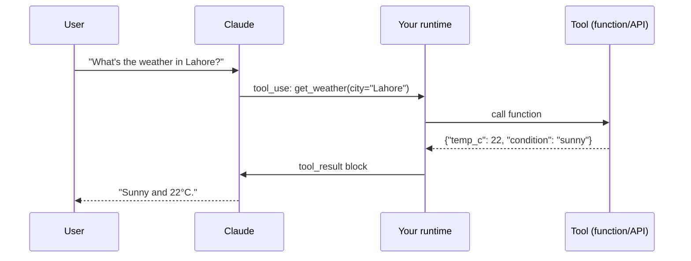

# Agents 1 — Agent Fundamentals & Custom Tools

## Lectures covered
- AI Agent with Custom tools

---

## In one sentence
An agent is a Claude (or other LLM) call wrapped in a `while` loop that lets the model call your functions, see what they return, and decide the next move until it has a final answer.

## Real-world analogy
Think of a hotel concierge who doesn't actually drive the taxi or cook the food — but knows every phone number, picks up the right one, listens to the answer, and tells you what to do. The model is the concierge; tools are the phone numbers; the loop is the concierge re-deciding after every call.

## The intuition (plain English)
- A plain Claude API call gives you text. An agent gives you actions.
- The trick is small: instead of just generating words, the model emits a JSON blob that says "please run `get_weather(city='Lahore')`". Your code runs the function, then hands the result back as another message.
- The model now has new information and decides: call another tool? Or write the final answer for the user?
- This loop — model thinks, model acts, your code observes, model thinks again — is called **ReAct**.
- Without the loop, the model is a parrot. With it, the model is an assistant that can read databases, hit APIs, and finish multi-step jobs.

## Mini worked example — one ReAct loop

User asks: *"What's the weather in Lahore?"*

```
turn 1
  user      : What's the weather in Lahore?
  assistant : (tool_use block) get_weather(city="Lahore")
              stop_reason = "tool_use"
  your code : runs get_weather → {"temp_c": 22, "condition": "sunny"}
  you append: tool_result back into messages

turn 2
  assistant : "It's sunny and 22°C in Lahore right now."
              stop_reason = "end_turn"
```

Two Claude calls, one real function call, one finished answer. That's the entire pattern; everything else is decoration.

## At-a-glance



## Why this matters
- Every "AI assistant that does things" — copilots, support bots, SQL bots — is this loop with a different toolset.
- It is the bridge from *generating text* to *taking action*, the single mental model behind LangChain, LangGraph, CrewAI, AgentCore, and MCP.
- Tool descriptions are the model's only manual; learning to write them well is the highest-leverage skill in agent building.
- Once you grasp this loop, every framework on the market is just a different wrapper around it.

---

## 1. What an agent is

An **agent** is an LLM that takes actions in a loop:

```
1. Observe — what's the current state / user input?
2. Think  — what should I do next?
3. Act    — call a tool / write text / ask a question
4. Observe the result; go back to 1.
```

It stops when it has a satisfying answer (or hits a limit).

The simplest agent loop is **ReAct** (Reason + Act).

---

## 2. The ReAct pattern

```
User: What's the weather in Lahore?

Agent thinks:
  Thought: I need to get the weather. I'll use the weather tool.
  Action: get_weather(city="Lahore")
  Observation: Sunny, 22°C
  Thought: I now have the answer.
  Final Answer: It's sunny and 22°C in Lahore.
```

The "thinking" is just the model writing tokens. The "action" is the model emitting a structured tool-call request. Your runtime executes the tool and feeds back the result. Loop until the model produces a final answer.

---

## 3. Building a ReAct agent — the bare-metal version

```python
from openai import OpenAI
import json

client = OpenAI()

def get_weather(city: str) -> str:
    return f"Sunny, 22°C in {city}"

tools = [{
    "type": "function",
    "function": {
        "name": "get_weather",
        "description": "Get current weather for a city.",
        "parameters": {
            "type": "object",
            "properties": {"city": {"type": "string"}},
            "required": ["city"],
        },
    },
}]

messages = [{"role": "user", "content": "What's the weather in Lahore?"}]

while True:
    resp = client.chat.completions.create(
        model="gpt-4o-mini", messages=messages, tools=tools, temperature=0,
    )
    msg = resp.choices[0].message
    messages.append(msg)

    if not msg.tool_calls:
        print(msg.content)            # final answer
        break

    for tc in msg.tool_calls:
        if tc.function.name == "get_weather":
            args = json.loads(tc.function.arguments)
            result = get_weather(**args)
        # ... handle other tools
        messages.append({
            "role": "tool", "tool_call_id": tc.id, "content": result,
        })
```

That's a functioning ReAct agent in ~30 lines. Frameworks (LangGraph's `create_react_agent`) wrap exactly this pattern.

---

## 4. Tool design — how to write tools the LLM uses well

### Names matter
- **Specific**: `query_customer_orders` > `query`
- **Verb-first**: tool names are actions
- **Snake_case** is the most reliable

### Descriptions matter even more
The LLM picks tools based on the description. Be explicit:

```python
{
    "name": "search_documentation",
    "description": (
        "Search the company's internal documentation by natural-language query. "
        "Returns up to 5 relevant snippets. "
        "USE WHEN: user asks about company processes, policies, or technical setup. "
        "DO NOT USE for: general web knowledge, public APIs, or news."
    ),
}
```

The "USE WHEN / DO NOT USE" pattern is gold for agent reliability.

### Schemas should be tight
- Type every parameter
- Mark required vs optional
- Add enums for fixed sets
- Include example values in description

### Errors should be informative
```python
def call_db(query):
    try:
        return db.execute(query)
    except SQLSyntaxError as e:
        return f"SQL syntax error: {e}. Reformulate the query."
```

Bad error messages confuse the agent. Helpful errors let it self-correct.

### Idempotency where possible
Agents may retry. Tools that have side-effects (send_email, charge_card) should reject duplicates by token.

---

## 5. Plan-and-Execute — beyond ReAct

ReAct decides one step at a time. **Plan-and-Execute** has the LLM write a plan first, then execute. Better for complex multi-step tasks.

```
User: "Plan a 5-day Tokyo trip with hotels, restaurants, and activities."

Plan:
1. Search for top hotels in central Tokyo
2. Find restaurants near each
3. List activities by neighborhood
4. Build day-by-day itinerary
5. Format as markdown summary

Execute step 1: ... → results
Execute step 2: ... → results
...
```

Useful when:
- Tasks are long-running
- Steps are independent (can parallelize)
- Cost matters — stop early if plan reveals impossibility

LangGraph supports both patterns. CrewAI's hierarchical mode is similar.

---

## 6. Common agent patterns

| Pattern | What |
|---|---|
| **ReAct** | One step at a time, reason + act |
| **Plan-and-Execute** | Plan upfront, then run |
| **Reflection** | Generate, critique own output, refine |
| **Tool-of-tools** | Tools that route to other tools |
| **Agentic RAG** | Agent decides what to retrieve, can re-retrieve |
| **Self-consistency** | Run agent N times, vote on result |

Most production agents combine 2-3 of these.

---

## 7. Memory in agents

### Short-term (conversation buffer)
- Recent messages
- Currently active task
- Tools used in this session

### Long-term (across sessions)
- User preferences
- Past decisions
- Learned facts

Implementations:
- Append entire history → grows; eventually doesn't fit context
- Summarize on overflow → compresses old context
- Vector store of past interactions → retrieve relevant past
- Knowledge graph for entity relationships

For bootcamp projects: simple buffer for short-term; a vector store keyed by user_id for long-term works fine.

---

## 8. Limits — putting brakes on agents

```python
max_iterations = 8                # avoid infinite ReAct loops
max_tokens_per_call = 1024
max_total_cost_per_run = "$0.10"
timeout = 60                       # seconds per run
```

Without these, an agent can:
- Loop forever calling tools
- Spend $1000 in an hour
- Block your service

LangGraph + LangSmith + tools like Helicone help enforce these.

---

## 9. Testing agents

### Golden tasks
A held-out set of (input, expected outcome). Run the agent; score outcomes.

### Trace-based assertions
"Agent must call get_weather before answering weather questions."

### Cost & latency budgets
Per-task max cost; warning if exceeded.

### Replay logs
Capture tool calls + LLM messages; replay for regression testing.

---

## 10. Common pitfalls

| Mistake | Effect | Fix |
|---|---|---|
| Agent loops calling same tool | wasting tokens / cost | check loop counter; "stop after 3 same calls" |
| Vague tool descriptions | agent uses wrong tool | rewrite with USE WHEN / DO NOT USE |
| No iteration limit | runaway cost | always set max_iterations |
| Tools that return huge blobs | context bloat | summarize or paginate |
| Mixing async + sync tool calls | runtime errors | be consistent |
| Running unsandboxed code | security risk | use AgentCore Code Interpreter or similar |

## Self-check

- [ ] What's the ReAct loop?
- [ ] How does Plan-and-Execute differ?
- [ ] Three principles for naming and describing tools well?
- [ ] What's idempotency and why does it matter for agent tools?
- [ ] When use Reflection vs Self-consistency?
- [ ] Two memory implementations for long-term context?
- [ ] Three limits to set on every agent.
- [ ] Build a 30-line ReAct agent with one custom tool.

---

## Glossary

| Term | Plain meaning |
|------|---------------|
| Agent | An LLM in a loop that can call tools and decide next steps. |
| Tool | A function the agent can invoke (a Python function, an API call, a SQL query). |
| Tool use | The model emitting a structured request to call a tool, instead of plain text. |
| Function calling | Other vendors' name for tool use; the same idea. |
| ReAct | "Reason + Act" — alternate thinking and tool calls until the answer is ready. |
| Plan-and-Execute | Make a full plan first, then run each step; better for long, decomposable tasks. |
| Reflection | Generate, critique your own draft, revise. Cheap quality boost on writing. |
| Self-consistency | Run the same task N times and vote on the answer; reduces variance. |
| Tool schema | JSON Schema that describes a tool's name, description, and arguments. |
| Tool description | Plain-English text that tells the model when to use the tool. The single biggest reliability lever. |
| Idempotent tool | A tool you can call twice with the same input safely (won't double-charge, double-email). |
| `stop_reason` | The Claude API field telling you why the model stopped: `end_turn`, `tool_use`, `max_tokens`. |
| `tool_use` block | The structured request the model emits asking your runtime to run a tool. |
| `tool_result` block | The message you append back to the conversation containing the function's output. |
| Max iterations | A hard cap on how many loop turns are allowed before you abort. |
| Context window | The total token budget Claude has for the whole message history per call. |
| Memory (short-term) | The current conversation buffer kept in `messages`. |
| Memory (long-term) | State persisted across sessions (vector store, SQL, KV store). |
| Sandbox | An isolated environment for running risky tool code (e.g. an LLM-generated script). |
| Observability | Logging every tool call and LLM message so you can debug a misbehaving agent. |
| Prompt injection | Hostile text inside a tool result that tries to hijack the agent's instructions. |

## Further reading
- Module overview: [../04-agents-tool-use.md](../04-agents-tool-use.md)
- Next in folder: [02-multi-agent-systems.md](./02-multi-agent-systems.md)
- Then: [03-agentic-evaluation.md](./03-agentic-evaluation.md)
- Orchestration tools: [../03-orchestration/01-langchain.md](../03-orchestration/01-langchain.md), [../03-orchestration/02-langgraph.md](../03-orchestration/02-langgraph.md)
- MCP standard for tools: [../03-orchestration/04-mcp.md](../03-orchestration/04-mcp.md)
- Building with Claude SDK: [../06-langchain-claude-api.md](../06-langchain-claude-api.md)
- Evaluating agents: [../07-evaluation-llm-apps.md](../07-evaluation-llm-apps.md)
- Anthropic — [Tool use with Claude](https://docs.anthropic.com/en/docs/build-with-claude/tool-use)
- Anthropic — [Building effective agents](https://www.anthropic.com/research/building-effective-agents)
