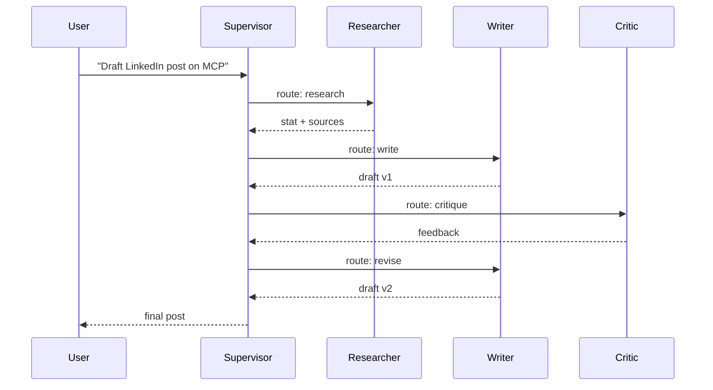

# Agents 2 — Multi-Agent Systems

## Lectures covered
- Multi Agent Systems

---

## In one sentence
A multi-agent system is several specialised Claude (or other LLM) loops working together — each with its own role, tools, and prompt — to solve a task too tangled for a single agent.

## Real-world analogy
Think of a film crew: one director, one cinematographer, one editor, one sound mixer. Each is an expert with their own gear; the director routes work between them. You could ask one person to do all four jobs, but the result is worse and the day is longer. Multi-agent is the same trade-off in software.

## The intuition (plain English)
- A single agent with 30 tools and one giant prompt gets confused. Splitting the work into focused agents (researcher, writer, critic) sharpens each prompt and its toolset.
- The most common shape is a **supervisor**: one agent decides who acts next; specialists do the work; control returns to the supervisor; repeat until done.
- A close second is the **critic / reflection** pattern: a generator drafts, a critic scores, the generator revises. Two agents, double the quality on writing tasks.
- Multi-agent costs more (extra LLM calls) and adds latency. Treat it as an upgrade you earn, not a default.
- Frameworks (LangGraph, CrewAI, AutoGen) give you the wiring; the design choices are yours.

## Mini worked example — one ReAct loop inside a supervisor team

User asks: *"Draft a 200-word LinkedIn post about MCP, with one stat from a recent source."*

```
turn 1  supervisor  : route → researcher
turn 2  researcher  : (tool_use) web_search("MCP adoption 2026")
        runtime     : returns 5 articles
turn 3  researcher  : "Anthropic reported 15k MCP servers by Apr 2026 (TechCrunch)."
        supervisor  : route → writer
turn 4  writer      : drafts a 200-word post citing the stat
        supervisor  : route → critic
turn 5  critic      : "Hook is weak; tighten the first line."
        supervisor  : route → writer
turn 6  writer      : final draft
        supervisor  : FINISH
```

Five LLM calls, one finished post. A single agent would have tried to research and write in one turn and likely lost the citation halfway.

## At-a-glance



## Why this matters
- Almost every "agent crew" startup demo is a supervisor + 2–4 specialists. Knowing the pattern is table stakes.
- Reflection is one of the cheapest quality wins in LLM apps; teams that skip it ship worse outputs.
- Real production agentic systems for code, customer care, and content all converge on these shapes.
- Picking the wrong shape (e.g. peer-to-peer when supervisor would do) is one of the top reasons agent demos fail in practice.

---

## 1. Why multiple agents

A single LLM call has limits:
- Context window
- Reasoning depth
- Confused by mixed objectives

**Multi-agent** = decompose the work. Each agent has a focused role. They collaborate (sometimes by message passing, sometimes via shared state).

Common patterns:
- Researcher + writer + editor for content
- Planner + workers for project management
- Critic that reviews another agent's output
- Specialists per domain (legal, technical, marketing)

---

## 2. Three classic multi-agent patterns

### Pattern A — Pipeline (linear)

```
Researcher ──► Writer ──► Editor ──► output
```

Each agent's output is the next's input. Simple, predictable.

CrewAI sequential mode is this.

### Pattern B — Supervisor (hub-and-spoke)

```
              ┌──► Specialist A
Supervisor ──┼──► Specialist B
              └──► Specialist C
```

The supervisor routes user requests to the right specialist and aggregates results.

LangGraph's recommended pattern for most multi-agent setups.

### Pattern C — Swarm / Peer-to-peer

```
   Agent A ◄──► Agent B
       ▲           ▲
       │           │
       └─►Agent C◄─┘
```

Agents talk to each other, no single coordinator. Powerful but harder to control.

---

## 3. Supervisor pattern (LangGraph)

```python
from langgraph.graph import StateGraph, START, END
from langgraph.prebuilt import create_react_agent
from langchain_openai import ChatOpenAI
from typing import Annotated, Literal
from langgraph.graph.message import add_messages
from typing_extensions import TypedDict

llm = ChatOpenAI(model="gpt-4o-mini")

# Specialist agents
researcher = create_react_agent(llm, tools=[search_tool])
analyst    = create_react_agent(llm, tools=[code_tool])
writer     = create_react_agent(llm, tools=[])

class TeamState(TypedDict):
    messages: Annotated[list, add_messages]
    next: str

def supervisor(state: TeamState):
    # ask LLM who should act next
    members = ["researcher", "analyst", "writer", "FINISH"]
    decision = route_via_llm(state["messages"], members)
    return {"next": decision}

graph = StateGraph(TeamState)
graph.add_node("supervisor", supervisor)
graph.add_node("researcher", researcher)
graph.add_node("analyst", analyst)
graph.add_node("writer", writer)

graph.add_edge(START, "supervisor")
graph.add_conditional_edges(
    "supervisor",
    lambda s: s["next"],
    {"researcher": "researcher", "analyst": "analyst", "writer": "writer", "FINISH": END},
)
for m in ["researcher", "analyst", "writer"]:
    graph.add_edge(m, "supervisor")     # always loop back

team = graph.compile()
```

Pattern: supervisor decides → specialist runs → back to supervisor → ... → FINISH.

---

## 4. CrewAI hierarchical multi-agent

```python
from crewai import Crew, Process

crew = Crew(
    agents=[researcher, analyst, writer],
    tasks=[research_task, analysis_task, writing_task],
    process=Process.hierarchical,
    manager_llm=ChatOpenAI(model="gpt-4o"),
)
```

The manager LLM dynamically assigns tasks to agents — similar to LangGraph supervisor.

---

## 5. When multi-agent helps

- **Different expertise required** (technical + legal + creative)
- **Long horizon planning** that benefits from explicit decomposition
- **Parallel exploration** (multiple specialists run independently)
- **Self-correction** loops (writer + critic)

---

## 6. When it hurts

- **Simple tasks** that one agent solves better
- **Cost-sensitive** workloads (more LLM calls)
- **Tight latency** (more sequential steps)
- **You haven't tried single-agent first**

> **Default**: build single-agent first. Add agents only when one isn't sufficient.

---

## 7. The reflection / critic pattern

A common 2-agent setup that improves quality dramatically:

```
Generator → produces draft
   │
   ▼
Critic → reviews, gives feedback
   │
   ▼
Generator → revises with feedback
   │
   ▼
(repeat N times or until critic approves)
```

```python
def reflection_loop(prompt, max_iters=3):
    draft = generator.invoke(prompt)
    for _ in range(max_iters):
        critique = critic.invoke(f"Review this draft:\n{draft}")
        if "looks good" in critique.lower():
            return draft
        draft = generator.invoke(f"Original: {prompt}\nDraft: {draft}\nFeedback: {critique}\nRevise:")
    return draft
```

Cheap, effective, doubles quality on writing tasks.

---

## 8. Communication protocols

### Shared state
All agents read/write the same dict. Simple, requires care to avoid conflicts.

### Message passing
Agents send each other typed messages. Clearer audit trail. More overhead.

### Blackboard
A central "blackboard" where agents post observations / claims / updates. Other agents read.

### Tools-as-API
Agents call each other as tools. Useful when one is much heavier.

---

## 9. Example architectures from real systems

### MetaGPT (research → engineer → tester)
- Product manager: requirements
- Architect: system design
- Engineer: code
- Tester: tests

### AutoGen
- "Group chat" of agents that take turns
- A "manager" decides who speaks next

### Devin / Magnetic / Operator (coding agents)
- Planner + executor + reflector
- Sandboxed code execution

These are state-of-the-art examples — peek at their architectures for ideas.

---

## 10. Real example — content factory crew

```python
from crewai import Agent, Task, Crew

researcher = Agent(role="Research Analyst",
                    goal="Find recent advancements in {topic}",
                    tools=[search_tool])

outliner   = Agent(role="Content Strategist",
                    goal="Outline a 1500-word article based on research")

writer     = Agent(role="Senior Writer",
                    goal="Write engaging long-form content from outline")

editor     = Agent(role="Editor",
                    goal="Polish content; fact-check claims; ensure flow",
                    tools=[search_tool])

seo        = Agent(role="SEO Specialist",
                    goal="Add meta tags, optimize headings, suggest keywords")

tasks = [
    Task(description="Research {topic}", agent=researcher, ...),
    Task(description="Outline based on research", agent=outliner, ...),
    Task(description="Draft article", agent=writer, ...),
    Task(description="Edit + fact-check", agent=editor, ...),
    Task(description="SEO finalize", agent=seo, ...),
]

crew = Crew(agents=[researcher, outliner, writer, editor, seo], tasks=tasks)
result = crew.kickoff(inputs={"topic": "Gen AI agents"})
```

Output: ready-to-publish article. Used by content teams to scale 10× with one human reviewer.

---

## 11. Common pitfalls

| Mistake | Effect | Fix |
|---|---|---|
| Too many agents for the task | confusion, slow, expensive | start small |
| Roles overlap | redundant work | sharpen role / goal |
| No supervisor | agents wander | add a router |
| Critic too lenient | loops without improvement | strengthen critic prompt with criteria |
| Critic too strict | infinite loops | cap iterations |
| No shared state | agents can't coordinate | use proper state channel |

## Self-check

- [ ] When is multi-agent better than single-agent?
- [ ] Three multi-agent patterns?
- [ ] What's the supervisor pattern?
- [ ] When use CrewAI hierarchical mode?
- [ ] Walk through a reflection loop.
- [ ] What's the cost trade-off of multi-agent?
- [ ] Build a 3-agent supervisor team in LangGraph.
- [ ] Why default to single-agent first?

---

## Glossary

| Term | Plain meaning |
|------|---------------|
| Multi-agent system | Several specialised LLM loops collaborating on one task. |
| Specialist agent | An agent narrowed to one role (researcher, writer, coder) with a focused toolset. |
| Supervisor / Router | The agent that decides which specialist acts next. |
| Pipeline (sequential) | Output of agent A becomes input of agent B; no branching. |
| Hub-and-spoke | A central supervisor delegates to specialists and aggregates. |
| Peer-to-peer / Swarm | Agents talk to each other with no single coordinator. |
| Reflection / Critic | A generator drafts, a critic scores, the generator revises. |
| Generator agent | The drafter half of a reflection pair. |
| Critic agent | The reviewer half of a reflection pair; needs a strong rubric. |
| CrewAI | Role-based multi-agent framework with sequential and hierarchical modes. |
| LangGraph | LangChain's state-machine framework for explicit agent graphs. |
| AutoGen | Microsoft's conversational multi-agent framework (group chat style). |
| MetaGPT | Research project: PM + architect + engineer + tester agents. |
| Shared state | A dict every agent can read and write (simple, but races possible). |
| Message passing | Agents exchange typed messages; cleaner audit trail. |
| Blackboard | A central scratchpad agents post observations onto. |
| Agent-as-tool | Calling another agent the same way you'd call a function. |
| Hand-off | Passing control (and context) from one agent to another. |
| Termination condition | The rule that decides when the team is done (`FINISH`, max turns, critic approves). |
| Iteration cap | Hard limit on how many supervisor → specialist hops are allowed. |
| Cost amplification | Each agent in a chain multiplies tokens and dollars; budget for it. |
| Latency amplification | Sequential agents add round-trips; parallelise where possible. |

## Further reading
- Previous in folder: [01-agent-fundamentals.md](./01-agent-fundamentals.md)
- Next in folder: [03-agentic-evaluation.md](./03-agentic-evaluation.md)
- Module overview: [../04-agents-tool-use.md](../04-agents-tool-use.md)
- LangGraph deep dive: [../03-orchestration/02-langgraph.md](../03-orchestration/02-langgraph.md)
- CrewAI deep dive: [../03-orchestration/03-crewai.md](../03-orchestration/03-crewai.md)
- LangChain primer: [../03-orchestration/01-langchain.md](../03-orchestration/01-langchain.md)
- Building with Claude SDK: [../06-langchain-claude-api.md](../06-langchain-claude-api.md)
- Evaluating multi-agent runs: [../07-evaluation-llm-apps.md](../07-evaluation-llm-apps.md)
- Anthropic — [Building effective agents](https://www.anthropic.com/research/building-effective-agents)
- LangGraph — [Multi-agent tutorials](https://langchain-ai.github.io/langgraph/tutorials/multi_agent/)
- CrewAI — [Documentation](https://docs.crewai.com/)
